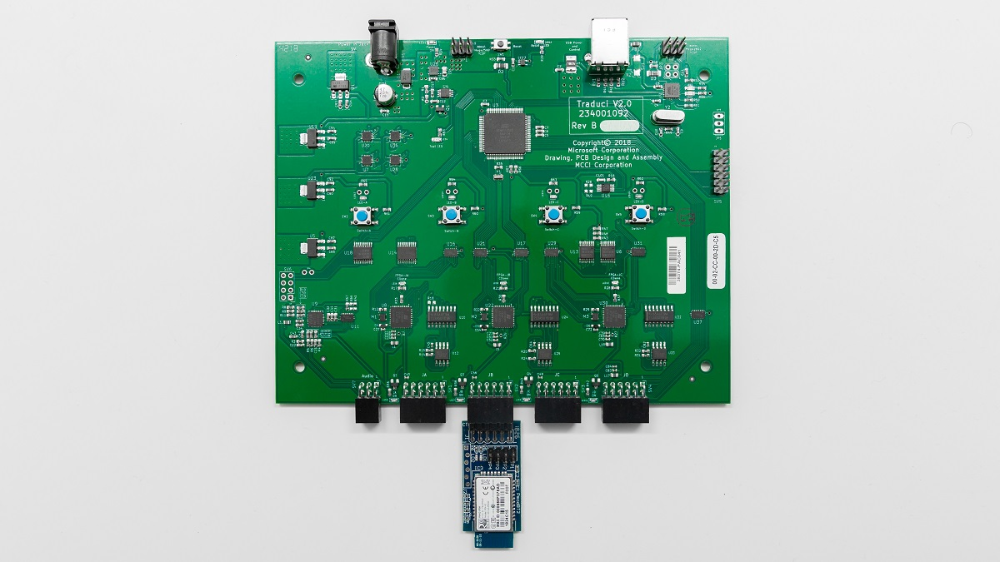
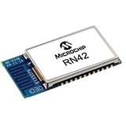

# BTP Suported Hardware

The Bluetooth Test Platform (BTP) requires external Bluetooth radios to simulate peripheral  

is the software component of Microsoft's latest automated Bluetooth testing. The Traduci is the hardware platform that the BTP runs on and supports peripheral radios to be plugged into it. The package consists of software tests, a firmware package, a provisioning tool  the Traduci board and a set of peripheral radios used for testing basic functionality.

As this time the only supported radio is the RN42. Purchasing information for the Traduci, RN42 and future radios can be found below.

# Devices #

## Traduci board ##
[**MCCI**](https://mcci.com/usb/dev-tools/model-2411/)

- 4 12-pin ports to support 4 radios simultaneously
- 3 FPGAs connected to ports 1, 2, and 3 respectively
- Supports audio testing via the integrated audio codec
- Supports HID and pairing tests

## HID Radio Sled ##
[**Digilent**](https://store.digilentinc.com/pmod-bt2-bluetooth-interface/)

The Traduci requires a 12-pin connector to communicate with any radio module. The HID Sled takes the RN42 module and breaks out the necessary pins to a 12 pin layout. These sleds are purchasable via Digilent. Click the link above for more purchasng information. The schematic is available below.

### HID Radio Sled Schematic ###

## RN42 Module ##
[**MicroChip**](https://www.microchip.com/wwwproducts/en/RN42)

- UART data connection
- Supports HID profiles and Bluetooth data links
- Fully certified Class 2 Bluetooth 2.1+
- Small form factor, low power, surface mount module

