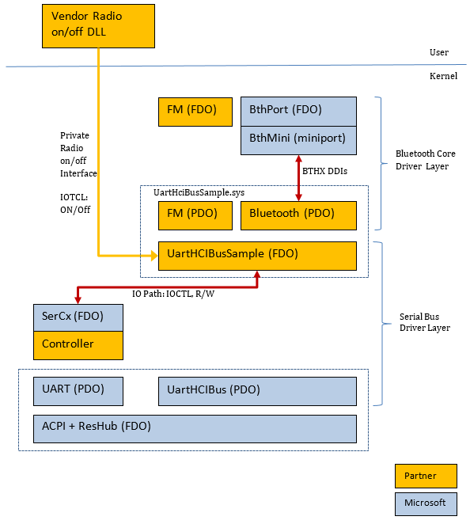

# Transport Bus Driver for Bluetooth

The following diagram of a sample system, depicts the driver stacks used to support a multifunction controller, using UART as its transport.

The device stack to support the Bluetooth function consists of two layers:

1.  The **Serial Bus Driver Layer** that is used to support a multifunction peripheral device (or so-called “combo” chip in the diagram to support Bluetooth and FM).
2.  The **Bluetooth Core Driver Layer** which is loaded based on a child PDO created by the Serial Bus driver to support the Bluetooth function.

The roles of these two layers in power management are discussed in the following topics:

-   [Bluetooth Core Driver Layer and Supported Power Transitions](bluetooth-core-driver-layer-and-supported-power-transitions.md)
-   [Serial Bus Driver Layer](serial-bus-driver-layer.md)

 

 

