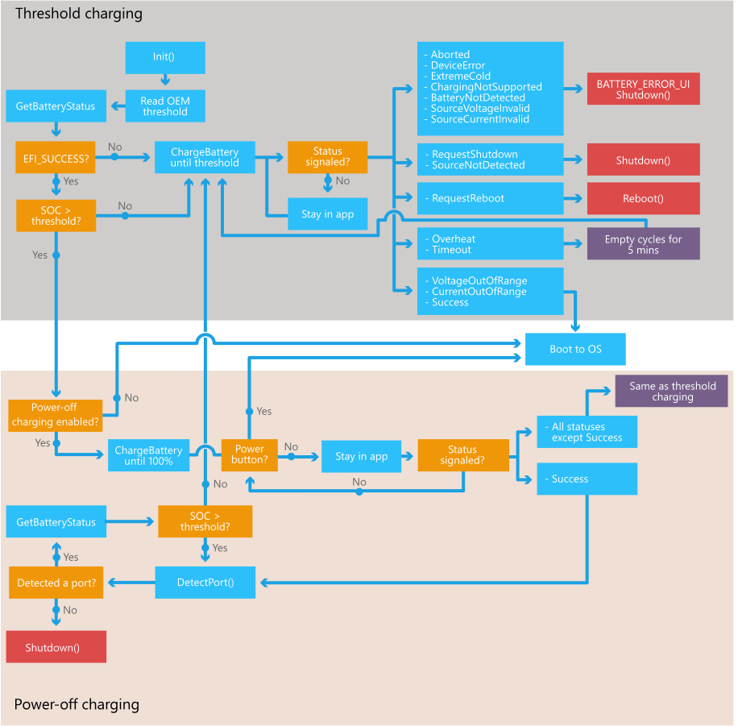
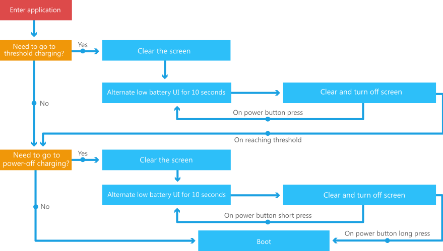

# Architecture of the UEFI battery charging application provided by Microsoft

This topic provides information about the design of the UEFI battery charging application provided by Microsoft for devices that run Windows 10 Mobile. OEMs can use the battery charging application from Microsoft, or they can implement their own charging application. OEMs that implement their own UEFI battery charging application may use the information in this topic as a guideline for their design.

The UEFI battery charging application is one of the first Microsoft-owned applications that runs during the boot process. The UEFI battery charging application has the following main responsibilities:

-   Make sure the device has enough power to boot.

-   Provide *power-off charging* support if enabled by the OEM. For more information about power-off charging, see [Battery charging in the boot environment](battery-charging-in-the-boot-environment.md).

The UEFI battery charging application uses key UEFI protocols and reacts to various states returned by the related drivers.

**Note**   The term *UEFI battery charging application* in this topic refers to the UEFI battery charging library loaded by mobilestartup.efi. For more information about mobilestartup.efi, see [Boot and UEFI](boot-and-uefi.md).

 

## UEFI protocols used by the UEFI battery charging application

The UEFI battery charging application (owned by Microsoft) uses the protocols (implemented by OEMs) discussed in the following sections.

### UEFI battery charging protocol (EFI\_BATTERY\_CHARGING\_PROTOCOL)

The following steps describe key aspects of how the UEFI battery charging application uses the UEFI battery charging protocol:

1.  The UEFI battery charging application polls the real-time status of the battery hardware by using [EFI\_BATTERY\_CHARGING\_PROTOCOL.GetBatteryInformation](efi-battery-charging-protocolgetbatteryinformation.md) (in devices that support version 0x00010002 of the [EFI\_BATTERY\_CHARGING\_PROTOCOL](efi-battery-charging-protocol.md)) or [EFI\_BATTERY\_CHARGING\_PROTOCOL.GetBatteryStatus](efi-battery-charging-protocolgetbatterystatus.md) (in devices that support version 0x00010001 of the EFI\_BATTERY\_CHARGING\_PROTOCOL). It is important that these functions return an accurate state of charge (SOC) value whenever possible. SOC is an OEM-defined mapping from the amount of charge in the battery based on its state (including capacity, voltage, and temperature) to a value from 0 through 100.

2.  OEMs define the *Boot to Main OS threshold* (a value from 0 through 100) . This value can be different for different device models. For more information about the *Boot to Main OS threshold* and other threshold values, see [Battery charging in the boot environment](battery-charging-in-the-boot-environment.md).

3.  The battery charging application uses the SOC from the driver and compares it to the *Boot to Main OS threshold* value to determine if it needs to block the boot process in order to charge in UEFI or to continue with boot. It receives no other information about the state of charge.

4.  The UEFI battery charging application calls [EFI\_BATTERY\_CHARGING\_PROTOCOL.ChargeBattery](efi-battery-charging-protocolchargebattery.md) to charge the device, and it waits for a **CompletionEvent** with a corresponding [EFI\_BATTERY\_CHARGING\_STATUS](efi-battery-charging-status.md) to be returned.

For more information about this protocol, see [UEFI battery charging protocol](uefi-battery-charging-protocol.md).

### UEFI display power state protocol (EFI\_DISPLAY\_POWER\_PROTOCOL)

During the UEFI battery charging process, the UEFI battery charging application displays an alternating low power UI. After 10 seconds without the power button being pressed, the application calls [EFI\_DISPLAY\_POWER\_PROTOCOL.SetDisplayPowerState](efi-display-power-protocolsetdisplaypowerstate.md) to turn off the display and backlight. This helps the device consume less power during UEFI battery charging, which helps the device charge and proceed to the main OS more quickly. If the user presses the power button while the display is turned off, the application calls EFI\_DISPLAY\_POWER\_PROTOCOL.SetDisplayPowerState again to turn the display back on. For more details, see [User experience](#ux) later in this topic.

For more information about this protocol, see [UEFI display power state protocol](uefi-display-power-state-protocol.md).

### UEFI USB function protocol (EFI\_USBFN\_IO\_PROTOCOL)

The UEFI battery charging application relies exclusively on [EFI\_USBFN\_IO\_PROTOCOL.DetectPort](efi-usbfn-io-protocoldetectport.md) to determine the type of port that is connected. Based on the port type, the application calls [EFI\_BATTERY\_CHARGING\_PROTOCOL.ChargeBattery](efi-battery-charging-protocolchargebattery.md) with either 1500 mA or 500 mA.

For more information about this protocol, see [UEFI USB function protocol](uefi-usb-function-protocol.md).

## Application logic

The following diagram describes the logical procedure of the UEFI battery charging application.

The following notes expand on some key sections of the logic:

-   Before calling [EFI\_BATTERY\_CHARGING\_PROTOCOL.ChargeBattery](efi-battery-charging-protocolchargebattery.md), the application calls [EFI\_USBFN\_IO\_PROTOCOL.DetectPort](efi-usbfn-io-protocoldetectport.md) to determine the maximum current that the USB charger can provide:

    -   If there is a port present, the application uses 1500 mA for dedicated wall charger or 500 mA for other ports.

    -   If there is no port present, the application uses 500 mA. A wireless charger is expected to ignore this value.

    -   If there is no charger present, the application uses 500 mA. However, the application expects [EFI\_BATTERY\_CHARGING\_PROTOCOL.ChargeBattery](efi-battery-charging-protocolchargebattery.md) to return an [EFI\_BATTERY\_CHARGING\_COMPLETION\_TOKEN](efi-battery-charging-completion-token.md) with a status of **EfiBatteryChargingSourceNotDetected**.

-   In all cases, the OEM must ensure that the device and the charger stay within safe operating regions.

-   If there is no battery in the device but there is a connected power source, when the application calls [EFI\_BATTERY\_CHARGING\_PROTOCOL.ChargeBattery](efi-battery-charging-protocolchargebattery.md) to charge the battery, the UEFI battery charging driver should return **EfiBatteryChargingStatusBatteryNotDetected**. The application handles this error by displaying an error UI and shutting down the device.

-   The [EFI\_BATTERY\_CHARGING\_STATUS](efi-battery-charging-status.md) values are interpreted in the same way in both *threshold charging* and *power-off charging* modes except for **EfiBatteryChargingStatusSuccess**. For more information about these charging modes, see [Battery charging in the boot environment](battery-charging-in-the-boot-environment.md).

-   When the device is in a charging mode, disconnecting the power source is expected to result in the firmware signaling the application with **EfiBatteryChargingSourceNotDetected**, which will result in the application shutting down the device.

-   If the firmware signals the application with a status of **EfiBatteryChargingStatusOverheat** or **EfiBatteryChargingStatusTimeout**, the device pauses charging for 5 minutes (but the application still calls [EFI\_BATTERY\_CHARGING\_PROTOCOL.GetBatteryInformation](efi-battery-charging-protocolgetbatteryinformation.md) or [EFI\_BATTERY\_CHARGING\_PROTOCOL.GetBatteryStatus](efi-battery-charging-protocolgetbatterystatus.md) at approximately 1-second intervals). After 5 minutes, the device resumes charging by calling [EFI\_BATTERY\_CHARGING\_PROTOCOL.ChargeBattery](efi-battery-charging-protocolchargebattery.md). During these 5 minutes, the firmware is still expected to signal the event provided by the application with the appropriate [EFI\_BATTERY\_CHARGING\_STATUS](efi-battery-charging-status.md) value (for example, a source disconnect should signal **EfiBatteryChargingSourceNotDetected**).

-   In both charging modes, a relevant animated UI will be shown during the box labeled **Stay in app** in the previous diagram.

-   In *power-off charging* mode, if the firmware has signaled an event and provides a status of **EfiBatteryChargingStatusSuccess**, the UEFI battery charging application does not boot to the main OS until the user holds the power button for 3 seconds. However, if the application detects that the USB cable has been disconnected at this time, it will power the device off. The UEFI battery charging application expects that the driver maintains the battery at full in *power-off charging mode*.

-   In *power-off charging mode*, as long as the firmware has not signaled an error or a success event, the UEFI battery charging application does not power the device off.

### Error handling

Every time [EFI\_BATTERY\_CHARGING\_PROTOCOL.ChargeBattery](efi-battery-charging-protocolchargebattery.md) is called, an [EFI\_BATTERY\_CHARGING\_COMPLETION\_TOKEN](efi-battery-charging-completion-token.md) is specified. If the driver experiences an error, the event in the token is signaled with an [EFI\_BATTERY\_CHARGING\_STATUS](efi-battery-charging-status.md). The following table illustrates how the UEFI battery charging application reacts to the different status values in different situations.

<table>
<colgroup>
<col width="33%" />
<col width="33%" />
<col width="33%" />
</colgroup>
<thead>
<tr class="header">
<th>Status</th>
<th>Threshold charging mode</th>
<th>Power-off charging mode (before and after the state of charge reaches the threshold)</th>
</tr>
</thead>
<tbody>
<tr class="odd">
<td>
EfiBatteryChargingStatusNoneNone
</td>
<td>
Not expected/invalid
</td>
<td>
Not expected/invalid
</td>
</tr>
<tr class="even">
<td>
EfiBatteryChargingStatusSuccess
</td>
<td>
Boot to OS
</td>
<td>
<strong>Before the state of charge reaches the threshold:</strong> Continue in power-off charging mode

<strong>After the state of charge reaches the threshold:</strong> Stay in power-off charging mode until USB is disconnected
</td>
</tr>
<tr class="odd">
<td>
EfiBatteryChargingStatusOverheat
</td>
<td>
Pause charging for 5 minutes and then resume charging
</td>
<td>
Pause charging for 5 minutes and then resume charging
</td>
</tr>
<tr class="even">
<td>
EfiBatteryChargingStatusVoltageOutOfRange
</td>
<td>
Boot to OS
</td>
<td>
Boot to OS
</td>
</tr>
<tr class="odd">
<td>
EfiBatteryChargingStatusCurrentOutOfRange
</td>
<td>
Boot to OS
</td>
<td>
Boot to OS
</td>
</tr>
<tr class="even">
<td>
EfiBatteryChargingStatusTimeout
</td>
<td>
Pause charging for 5 minutes and then resume charging
</td>
<td>
Pause charging for 5 minutes and then resume charging
</td>
</tr>
<tr class="odd">
<td>
EfiBatteryChargingStatusAborted
</td>
<td>
Display error UI for 10 seconds and then shut down
</td>
<td>
Display error UI for 10 seconds and then shut down
</td>
</tr>
<tr class="even">
<td>
EfiBatteryChargingStatusDeviceError
</td>
<td>
Display error UI for 10 seconds and then shut down
</td>
<td>
Display error UI for 10 seconds and then shut down
</td>
</tr>
<tr class="odd">
<td>
EfiBatteryChargingStatusExtremeCold
</td>
<td>
Display error UI for 10 seconds and then shut down
</td>
<td>
Display error UI for 10 seconds and then shut down
</td>
</tr>
<tr class="even">
<td>
EfiBatteryChargingStatusBatteryChargingNotSupported
</td>
<td>
Display error UI for 10 seconds and then shut down
</td>
<td>
Display error UI for 10 seconds and then shut down
</td>
</tr>
<tr class="odd">
<td>
EfiBatteryChargingStatusBatteryNotDetected
</td>
<td>
Display error UI for 10 seconds and then shut down
</td>
<td>
Display error UI for 10 seconds and then shut down
</td>
</tr>
<tr class="even">
<td>
EfiBatteryChargingSourceNotDetected
</td>
<td>
Shut down
</td>
<td>
Shut down
</td>
</tr>
<tr class="odd">
<td>
EfiBatteryChargingSourceVoltageInvalid
</td>
<td>
Display error UI for 10 seconds and then shut down
</td>
<td>
Display error UI for 10 seconds and then shut down
</td>
</tr>
<tr class="even">
<td>
EfiBatteryChargingSourceCurrentInvalid
</td>
<td>
Display error UI for 10 seconds and then shut down
</td>
<td>
Display error UI for 10 seconds and then shut down
</td>
</tr>
<tr class="odd">
<td>
EfiBatteryChargingErrorRequestShutdown
</td>
<td>
Shut down
</td>
<td>
Shut down
</td>
</tr>
<tr class="even">
<td>
EfiBatteryChargingErrorRequestReboot
</td>
<td>
Reboot
</td>
<td>
Reboot
</td>
</tr>
</tbody>
</table>

 

The following table illustrates how the UEFI battery charging application reacts to the status values received from [EFI\_BATTERY\_CHARGING\_PROTOCOL.GetBatteryInformation](efi-battery-charging-protocolgetbatteryinformation.md) or [EFI\_BATTERY\_CHARGING\_PROTOCOL.GetBatteryStatus](efi-battery-charging-protocolgetbatterystatus.md).

<table>
<colgroup>
<col width="33%" />
<col width="33%" />
<col width="33%" />
</colgroup>
<thead>
<tr class="header">
<th>Status</th>
<th>Threshold charging mode</th>
<th>Power-off charging mode (before and after the state of charge reaches the threshold)</th>
</tr>
</thead>
<tbody>
<tr class="odd">
<td>
EFI_SUCCESS

This value is returned when no errors were detected.
</td>
<td>
Not applicable
</td>
<td>
Not applicable
</td>
</tr>
<tr class="even">
<td>
EFI_INVALID_PARAMETER

This value is returned when an input parameter is incorrect. This should theoretically not be possible in the production environment.
</td>
<td>
Display error UI for 10 seconds and then shut down
</td>
<td>
Display error UI for 10 seconds and then shut down
</td>
</tr>
<tr class="odd">
<td>
EFI_DEVICE_ERROR or EFI_NOT_READY

These error conditions are handled in the same way. These values should be returned by <a href="efi-battery-charging-protocolgetbatteryinformation.md" data-raw-source="[EFI_BATTERY_CHARGING_PROTOCOL.GetBatteryInformation](efi-battery-charging-protocolgetbatteryinformation.md)">EFI_BATTERY_CHARGING_PROTOCOL.GetBatteryInformation</a> or <a href="efi-battery-charging-protocolgetbatterystatus.md" data-raw-source="[EFI_BATTERY_CHARGING_PROTOCOL.GetBatteryStatus](efi-battery-charging-protocolgetbatterystatus.md)">EFI_BATTERY_CHARGING_PROTOCOL.GetBatteryStatus</a> in cases where the device may not be able to boot to the main OS due to some device error. In particular:

<ul>
<li>
EfiBatteryChargingStatusAborted
</li>
<li>
EfiBatteryChargingStatusDeviceError
</li>
<li>
EfiBatteryChargingStatusExtremeCold
</li>
<li>
EfiBatteryChargingStatusBatteryChargingNotSupported
</li>
<li>
EfiBatteryChargingStatusBatteryNotDetected
</li>
<li>
EfiBatteryChargingSourceVoltageInvalid
</li>
<li>
EfiBatteryChargingSourceCurrentInvalid
</li>
<li>
EfiBatteryChargingErrorRequestShutdown
</li>
<li>
EfiBatteryChargingErrorRequestReboot
</li>
</ul>

Throwing EFI_DEVICE_ERROR or EFI_NOT_READY followed by a completion token of one of the errors listed above will cause the device to eventually shut down.
</td>
<td>
Resume and call <a href="efi-battery-charging-protocolchargebattery.md" data-raw-source="[EFI_BATTERY_CHARGING_PROTOCOL.ChargeBattery](efi-battery-charging-protocolchargebattery.md)">EFI_BATTERY_CHARGING_PROTOCOL.ChargeBattery</a>
</td>
<td>
Resume and call <a href="efi-battery-charging-protocolchargebattery.md" data-raw-source="[EFI_BATTERY_CHARGING_PROTOCOL.ChargeBattery](efi-battery-charging-protocolchargebattery.md)">EFI_BATTERY_CHARGING_PROTOCOL.ChargeBattery</a>
</td>
</tr>
</tbody>
</table>

 

## User experience

The following diagram shows how the UEFI battery charging application draws the UI to the screen if there is not enough charge in the battery, or if the device is in *power-off charging mode*.

The following steps describe how the application draws the UI to the screen:

-   The application clears the screen by writing the background fill color to every pixel in the frame.

-   The application draws the alternating low battery UI bitmaps by copying pixels from the bitmap buffers directly to the display. If 10 seconds pass without the power button being pressed, the application calls [EFI\_DISPLAY\_POWER\_PROTOCOL.SetDisplayPowerState](efi-display-power-protocolsetdisplaypowerstate.md) to turn off the display and backlight. If the user presses the power button, EFI\_DISPLAY\_POWER\_PROTOCOL.SetDisplayPowerState is called to turn the display back on.

-   When the application receives errors from the driver, the application clears the screen by writing the background fill color to every pixel in the frame buffer, and then the application draws the battery error screen by copying pixels from the appropriate bitmap buffer directly to the display.

 

 

