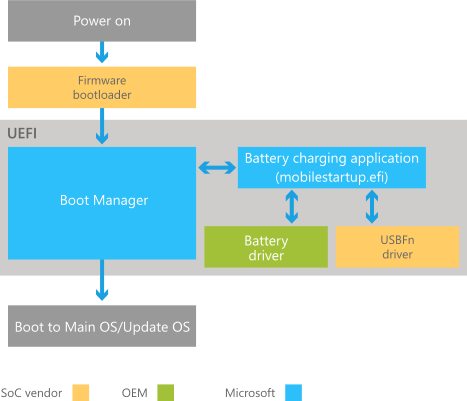
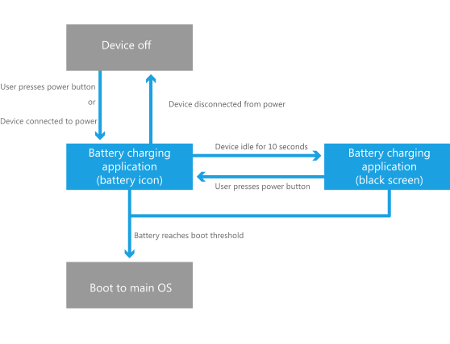
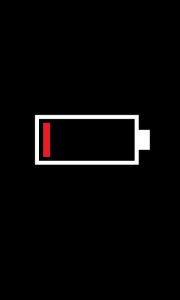
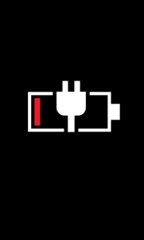
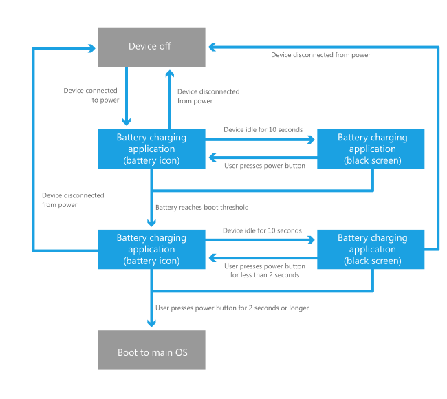
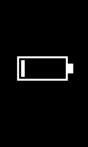
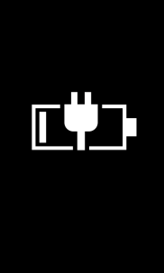
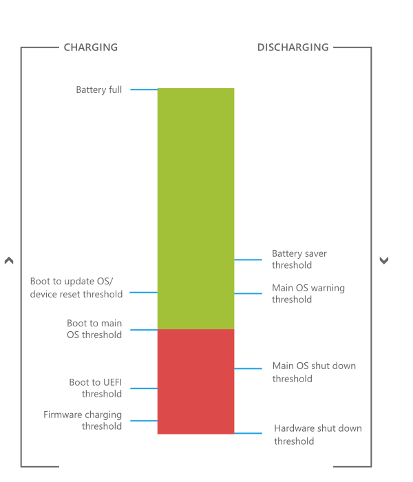

# Battery charging in the boot environment for Windows 10 Mobile

For devices that run Windows 10 Mobile, the BSP that OEMs receive from the SoC vendor includes a UEFI battery charging driver that is designed specifically for the SoC vendor's hardware. OEMs typically modify this driver to customize it for their hardware.

If this driver is designed to work with the UEFI battery charging driver provided by Microsoft, the driver implements the [UEFI battery charging protocol](uefi-battery-charging-protocol.md), and the Microsoft UEFI battery charging application communicates with the driver by using this protocol.

Alternatively, OEMs may optionally implement their own UEFI battery charging application that is used instead of the Microsoft application. In this scenario, the UEFI battery charging driver must not implement the [UEFI battery charging protocol](uefi-battery-charging-protocol.md). The Windows Boot Manager will load the Microsoft UEFI battery charging application if the driver implements this protocol.

**Note**  Most of the information in this topic applies to devices that use the UEFI battery charging application provided by Microsoft. The term *UEFI battery charging application* in this topic refers to the UEFI battery charging library loaded by mobilestartup.efi. For more information about mobilestartup.efi, see [Boot and UEFI](boot-and-uefi.md).

 

## Understanding the boot battery charging process provided by Microsoft

The following steps describe the charging process during the boot flow for devices that use the UEFI battery charging application provided by Microsoft:

1.  The device is powered on by being connected to a power source or by a user pressing the power button.

2.  The SoC-specific firmware boot loader runs and performs one of the following actions:

    -   If the boot loader detects a connected power source and a battery is in the device, the device begins trickle-charging the battery and continues booting into the UEFI environment to the Boot Manager.

    -   If the boot loader does not detect a power source and the battery is too low to boot into the UEFI environment, the device shuts down.

    -   If the boot loader detects a connected power source but there is no battery in the device, the device continues booting into the UEFI environment to the UEFI battery charging application. When the application attempts to charge the battery, the UEFI battery charging driver returns an error to the application to indicate that the battery is not detected. The application handles this error by displaying an error UI and shutting down the device. For more information, see [Architecture of the UEFI battery charging application provided by Microsoft](architecture-of-the-uefi-battery-charging-application.md).

3.  The Boot Manager runs the battery charging application.

    -   If the device detects a connected power source, the device enters battery charging mode. The battery charging application interfaces with the UEFI battery charging driver and the UEFI USBFn driver to charge the battery. For more information, see [UEFI battery charging protocol](uefi-battery-charging-protocol.md).

    -   If the device does not detect a connected power source and the battery is too low to boot into the main OS, the device shuts down.

4.  Depending on the value of an OEM-customizable registry value, the battery charging application either continues the boot process after the device reaches a threshold, or waits for the user to hold the power button before doing so. For more information, see [Battery charging application flow](#batterychargingapp).

The following diagram illustrates this components involved with the boot battery charging process. This diagram intentionally omits many UEFI components to focus on the battery charging process; for a more comprehensive view of the UEFI boot process, see [Boot and UEFI](boot-and-uefi.md).

## Charging states supported by the Microsoft-provided battery charging application

When the boot battery charging process reaches the UEFI battery charging application, the device can enter several different states depending on how it is configured. These states are called *threshold charging* and *power-off charging*.

### Threshold charging

The following diagram shows the default boot battery charging process. In this process, the device boots to the main OS as soon as the battery reaches a certain threshold, called the *Boot to Main OS threshold*. For more information about this and other thresholds that are defined as part of the battery charging process, see [Battery charging thresholds](#thresholds).

The following steps illustrate the corresponding UI flow for this charging process:

1.  If the battery does not have sufficient charge to meet the *Boot to Main OS* threshold, the device alternates between the following low battery UI screens for 10 seconds. If the user presses the Power button within this 10 second interval, the device continues to alternate between the following low battery UI screens for an additional 10 seconds.
       
         
    

2.  If the device is idle for 10 seconds, the device turns off the display.

    

3.  After the device reaches the *Boot to Main OS* threshold, the device displays the OEM boot logo and boots to the main OS. The following screenshot demonstrates an example OEM boot logo.    

    

### Power-off charging

Windows 10 supports the ability to charge the battery while the device appears to be turned off from the user’s perspective. This feature is called *power-off charging*. Information about how to enable this feature will be provided in a future release of this documentation.

**Important**  Power-off charging can only be configured when the device image is generated. The Windows 10 OS does not provide a way for users to enable or disable power-off charging.

 

If power-off charging is enabled, the device remains under the control of the battery charging application even after the *Boot to Main OS* threshold is reached. The device remains in this state until the user holds the power button for 2 seconds or longer to boot the device to the main OS.

Even when power-off charging is enabled, users will not always go through the power-off charging path. If the device reboots (for example, because of an update, or because the system language settings changed) while it is on and connected to a power source, the device will skip power-off charging mode and boot directly to the main OS after the pre-boot charging threshold is reached. Power-off charging mode will also be skipped if the user holds down the power button to reboot the device while it is on and connected to a power source.

The following diagram shows the boot battery charging process when power-off charging is enabled.

The following steps illustrate the corresponding UI flow while power-off charging is enabled:

1.  If the battery does not have sufficient charge to meet the *Boot to Main OS* threshold, the device alternates between the following red low battery UI screens for 10 seconds. If the user presses the Power button within this 10 second interval, the device continues to alternate between the following low battery UI screens for an additional 10 seconds.

         
    

2.  If the device is idle for 10 seconds, the device turns off the display.

    

3.  After the device reaches the *Boot to Main OS* threshold, the device alternates between the following white low battery UI screens for 10 seconds rather than booting directly to the main OS. If the user presses the Power button for a short duraction (less than 2 seconds) within this 10 second interval, the device continues to alternate between the following low battery UI screens for an additional 10 seconds.

         
    

4.  If the device is idle for 10 seconds, the device turns off the display.

    

5.  If the user presses the Power button for 2 seconds or longer, the device displays the OEM boot logo and boots to the main OS. The following screenshot demonstrates an example OEM boot logo.

    

## Battery charging thresholds

Microsoft has defined several battery charging thresholds to ensure correct battery charging user experience. Some of these thresholds must be implemented by the OEM to ensure correct battery charging behavior. The following diagram illustrates how each of the charging thresholds fit together (this diagram is not drawn to scale).

The left side of the diagram shows all thresholds that affect the user experience when the device is charging, and the right side of the diagram shows all thresholds that affect the user experience when the device is discharging. The following table describes each of the thresholds.

<table>
<colgroup>
<col width="33%" />
<col width="33%" />
<col width="33%" />
</colgroup>
<thead>
<tr class="header">
<th>Threshold</th>
<th>Description</th>
<th>Configuration guidance</th>
</tr>
</thead>
<tbody>
<tr class="odd">
<td>
Firmware charging threshold
</td>
<td>
This is the threshold at which the device boots from hardware-based charging to firmware-based charging. It is necessary to hold the device in the hardware charging phase to charge and protect the battery when it is too low to boot into the firmware.
</td>
<td>
OEMs must set this threshold to be lower than the <em>Boot to UEFI threshold</em>. Contact the SoC vendor for details on how to modify this threshold.
</td>
</tr>
<tr class="even">
<td>
Boot to UEFI threshold
</td>
<td>
This is the threshold at which the device boots from firmware-based charging to UEFI-based charging (which is supplied by Microsoft). It is necessary to hold the device in the firmware charging phase to charge the battery when it is too low to boot into the firmware.
</td>
<td>
OEMs must set this threshold to be higher than the <em>Firmware charging threshold</em>, but lower than the <em>Boot to Main OS</em> threshold. Contact the SoC vendor for details on how to modify this threshold.
</td>
</tr>
<tr class="odd">
<td>
Boot to Main OS threshold
</td>
<td>
This is the threshold at which the device boots from UEFI-based charging to the Main OS in <em>Threshold charging mode</em>. It is necessary to hold the device in the UEFI charging phase to charge the battery when it is too low to boot into the Main OS. For more information about threshold charging mode, see <a href="#thresholdmode" data-raw-source="[Threshold charging](#thresholdmode)">Threshold charging</a>.
</td>
<td>
OEMs must set this threshold to be higher than the <em>Boot to UEFI threshold</em> and the <em>Main OS shut down threshold</em>. This threshold is defined in percentage of the battery’s full capacity. By default, this value is set to 7%. Information about how to set this threshold will be provided in a future release of this documentation.
</td>
</tr>
<tr class="even">
<td>
Boot to Update OS/device reset threshold
</td>
<td>
This is the threshold at which the device boots from UEFI-based charging to the Update OS or to the device reset mode. It is necessary to hold the device in UEFI charging phase to charge the battery when it is too low to sustain the process of an update or device reset.
</td>
<td>
This threshold is set to the <em>Boot to Main OS threshold</em> + 8%.
</td>
</tr>
<tr class="odd">
<td>
Battery full
</td>
<td>
This is the threshold at which the battery is at 100% of its full capacity. At this threshold, the battery icon in the system tray shows a full battery icon.
</td>
<td>
OEMs should calibrate their battery profile such that the device can always hit the battery full capacity.
</td>
</tr>
<tr class="even">
<td>
Battery saver threshold
</td>
<td>
This is the threshold at which battery saver is automatically enabled if the user has set up battery saver.
</td>
<td>
This threshold is set to 20% of the battery’s full capacity, and this cannot be changed by the OEM.
</td>
</tr>
<tr class="odd">
<td>
Main OS warning threshold
</td>
<td>
This is the threshold at which the device displays a notification to the user that the battery is low.
</td>
<td>
This threshold is set to 10% of the battery’s full capacity, and this cannot be changed by the OEM.
</td>
</tr>
<tr class="even">
<td>
Main OS shut down threshold
</td>
<td>
This is the threshold at which the software safely shuts the device off. It is required to prevent system memory corruption.
</td>
<td>
The OEM must set this threshold to be lower than the <em>Boot to Main OS threshold</em> and lower than the <em>Main OS warning threshold</em>. In addition, this threshold must be greater than or equal to 2%. This threshold is defined by the <strong>DefaultAlert1</strong> member of the <a href="https://msdn.microsoft.com/library/windows/desktop/aa372661.aspx" data-raw-source="[BATTERY_INFORMATION](https://msdn.microsoft.com/library/windows/desktop/aa372661.aspx)">BATTERY_INFORMATION</a> struct. Contact the SoC vendor for details on how to modify this threshold.
</td>
</tr>
<tr class="odd">
<td>
Hardware shut down threshold
</td>
<td>
This is the threshold at which the hardware forces the device to power off. It is required to protect the battery from being discharged too low.
</td>
<td>
This threshold is set by the SoC vendor and should not be changed by the OEM.
</td>
</tr>
</tbody>
</table>

 

## Related topics
[Architecture of the UEFI battery charging application provided by Microsoft](architecture-of-the-uefi-battery-charging-application.md)  
[Boot and UEFI](boot-and-uefi.md)  

