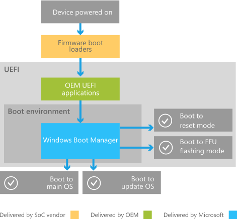
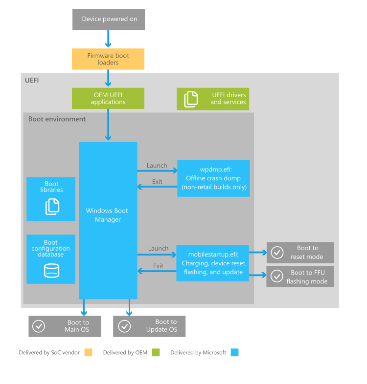

# Boot and UEFI

**Note**  Some information in this section may apply only to Windows 10 Mobile and certain processor architectures.

 

A device running Windows 10 has several requirements for booting into the OS. After the device's firmware initializes all the hardware, the device needs to ensure that there is enough power to boot. Afterwards, the device needs to ensure that the device is booting into the appropriate OS depending on if the user wants to perform an update or a restore on the device, or if the user wants to boot the device into the main OS.

To accommodate each of these scenarios, the Windows 10 boot process uses the following components:

-   Firmware boot loaders provided by the SoC vendor.

-   UEFI (Unified Extensible Firmware Interface) environment provided by the SoC vendor.

-   Windows Boot Manager provided by Microsoft.

This topic provides an overview of the boot process, and it describes the SoC firmware boot loaders, UEFI, and Windows Boot Manager in more detail.

## Overview of the boot process

When a Windows 10 device is turned on, it goes through the following high-level process:

1.  The device is powered on and runs the SoC-specific firmware boot loaders, which initialize the hardware on the device and provide emergency flashing functionality.

2.  The firmware boot loaders boot the UEFI environment and hands over control to UEFI applications written by the SoC vendor, Microsoft, and OEMs. These applications can utilize UEFI drivers and services.

3.  The UEFI environment launches the Windows Boot Manager, which determines whether to boot to FFU flashing or device reset mode, to the update OS, or to the main OS.

The following diagram illustrates this process at a high level.

Following are additional details about some of the components in this diagram:

-   The update OS is a minimal OS environment provided by Microsoft. This OS is used specifically for installing updates.

-   FFU flashing mode refers to a UEFI application that flashes an OS image to device storage. Microsoft provides a UEFI flashing application which can be used in non-manufacturing scenarios. OEMs can also implement their own UEFI flashing application.

## SoC firmware boot loaders

The SoC firmware boot loaders initialize the minimal set of hardware required for the device to run. The SoC firmware boot loaders are designed to finish as fast as possible, and nothing is drawn to the screen while they are running. After the SoC firmware boot loaders finish, the device is booted into the UEFI environment.

The SoC firmware boot loaders also contain an emergency flashing capability that allows devices to be flashed when the boot environment is not stable and FFU-based flashing using the Microsoft-provided flashing tool is not possible. Emergency flashing requires tools specific to the SoC. For more information, contact the SoC vendor.

## UEFI

Windows 10 utilizes the Unified Extensible Firmware Interface (UEFI) to support the handoff of system control from the SoC firmware boot loader to the OS. The UEFI environment is a minimal boot OS upon which devices are booted and the Windows 10 OS runs. For more information, see [UEFI in Windows](uefi-in-windows.md).

## Understanding the Windows Boot Manager

The Windows Boot Manager is a Microsoft-provided UEFI application that sets up the *boot environment*. Inside the boot environment, individual *boot applications* started by the Boot Manager provide functionality for all customer-facing scenarios before the device boots.

**Important**  All components inside the boot environment are provided by Microsoft and cannot be modified, replaced, or omitted by OEMs.

 

Boot applications implement functionality for the following scenarios:

-   Charging the device battery before boot.

-   Capturing and saving offline crash dumps (developer builds only).

-   Flashing the device with a new image.

-   Resetting the device.

-   Updating the device.

-   Booting the device to the main OS.

The following diagram illustrates some of the key portions of the process that the Boot Manager follows after it is launched by the UEFI environment.

The following steps describe this process in more detail:

1.  After the UEFI environment launches the Boot Manager, the Boot Manager initializes *boot libraries*, reads the boot configuration database to determine which boot applications to run and in which order to run them. The Boot Manager launches boot applications sequentially, and each application exits back to the Boot Manager after finishing.

    Boot libraries are libraries of functions that extend upon existing UEFI functionality, and are designed to be used within the boot environment. Only boot applications, which are launched by the Boot Manager, have access to the boot libraries.

2.  The Boot Manager first captures any reserved hardware button combinations that are pressed by the user.

3.  In non-retail OS images, the Boot Manager next runs an offline crash dump boot application which allows the device to capture a snapshot of physical memory from the previous OS session. When the device resets abnormally, the previous OS session’s memory is preserved across the reset. When this happens, the offline crash dump application will save that memory and turn it into an offline crash dump file, which can be transferred off the device and analyzed. If the device did not reset abnormally in the previous OS session, the offline crash dump application exits immediately.

4.  In all OS images, the Boot Manager next runs mobilestartup.efi. This application runs several boot libraries, some of which are only run on first boot (for example, to provision the secure boot policy) or only in non-retail images (for example, to enter USB mass storage mode). The following libraries are always run:

    1.  First, mobilestartup.efi runs the library that implements UEFI battery charging. This library allows the user to charge their device while the device is in the boot environment (or is perceived as being turned off). This library is run first to ensure that the device has enough power to fully boot. For more information about scenarios involving the battery charging application, see [Battery charging in the boot environment](battery-charging-in-the-boot-environment.md).

    2.  Next, mobilestartup.efi runs the libraries that implement flashing, device reset, and updates. These libraries determine whether the device should boot to flashing or device reset mode, or if the device should continue to the Update OS or Main OS.

5.  If mobilestartup.efi does not boot to flashing or device reset mode, the Boot Manager boots into the Main OS or the Update OS.

## Related topics
[Battery charging in the boot environment](battery-charging-in-the-boot-environment.md)  
[Architecture of the UEFI battery charging application](architecture-of-the-uefi-battery-charging-application.md)  
[UEFI in Windows](uefi-in-windows.md)  

