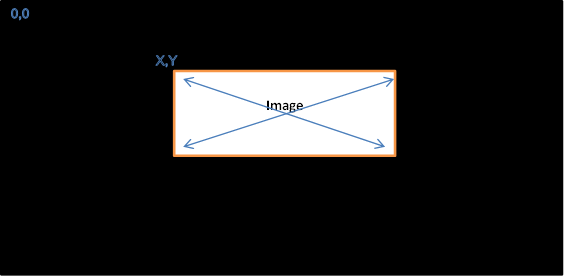

# Boot screen components

There are two components to the firmware update boot screen: the OEM logo and the update text. This topic provides guidance about how to configure each of these components, and information about how these components are passed to the firmware in a firmware update capsules.

## OEM logo

The OEM logo in the firmware update boot screen must be the same logo which is displayed during the normal boot process. For firmware update boot screens the logo must be the same size, position and quality expected as is displayed during the normal boot process.

### OEM logo file

Before customers see any actionable screens, your OEM logo displays on the boot screen. 

The OEM logo does not appear on any screens in OOBE, and after OOBE it displays in the **Control Panel** under **Performance Information and Tools**. It does not display in the **Settings** app.

POST (Power-On Self-Test) and operating system startup times are faster than they used to be. To ensure you have a proper branding moment, the OEM logo is visible across both POST and the operating system startup. In this approach, the OEM logo is readily recognizable, suitably sustained, and associated with a fast and reliable experience.

In addition, the OEM logo is displayed as a branding element in the **Control Panel** app, under **Performance Information and Tools**. It does not display in the **Settings** app.

#### Create the logo

The logo you add presents customers with their first visual encounter with their new PCs running Windows, so it should be clean, crisp, and sharp on its edges as well as inside.

The background of the boot screen is always black, so use a logo that looks great on a black background. The logo must also have a true black background so there's no noticeable difference where the logo's black background ends and the screen's black background begins. Transparency is not supported. The black background optimizes system performance for both the initial rendering of the logo and the fade-out at the end of boot for the transition from UEFI Graphics Output Protocol (GOP) to the operating system native video driver. Other areas of Windows also use your logo: Setup, Push-Button Reset (PBR), Secure Boot remediation, and the Startup Repair Tool, all of which use a black background. These experiences use the same logo from the Boot Graphics Resource Table (BGRT).

#### Position the logo during POST

Firmware draws the OEM logo at POST and places the logo in a predetermined position. When Windows startup begins, the logo is kept in the video buffer. Desktops can detect the panel's native resolution by reading its EDID (Extended Display Identification Data).

To make the logo appear correctly across the entire sequence, POST needs to occur in the device's native resolution. This ensures that the logo is the size, shape, and location that you want, and that Windows requires.

The logo should appear on the screen at a specific location to showcase the PC's brand. We recommend that the logo is placed with its center at 38.2% from the screen's top edge. This positioning is based on the golden ratio's visual aesthetics and matches the Windows 10 design proportions. This consistent positioning across all PCs running Windows 10 lets Windows place the progress ring in the correct location and ensures that the logo and ring are visually balanced.

To further support this visual balance, we recommend that you limit the logo size to 40% of the screen's height and width. This ensures that the screen appears correctly, and that Windows can properly fade out the logo at the end of boot. We recommend that the logo's maximum area start at no more than 18.2% from the top of the screen.

These design principles apply to both landscape and portrait devices.

#### Add the logo to the BGRT

In addition to correctly positioning the logo during POST, you also store the logo inside the Boot Graphics Resource Table (BGRT). The BGRT dynamically defines new objects for Windows to use to describe the resources and on-screen location. Store the logo in EfiBootServicesData and expose it via the BGRT. The BGRT interface supports this logo as either a 24-bit bitmap with a pixel format of 0xRRGGBB, or a 32-bit bitmap with a pixel format of 0xrrRRGGBB, where ‘rr’ is reserved. This is the standard interface that Windows uses to access the logo.

Two important fields in the BGRT are "Image Offset X" and "Image Offset Y". These are the (x,y) values of the upper-left corner of the logo's on-screen placement. When you set these values, make sure that you don’t use the logo's position or the upper-left corner of the bounding box, or Windows won't correctly position the logo in Setup, Startup Repair, Push-Button Reset, or other experiences.

You should minimize padding in the logo resource and use only what's necessary for proper centering. Using minimal padding saves space in the firmware and lets Windows scale the BGRT-based logo properly. 

> [!NOTE]
> The OEM logo does not appear on any screens in OOBE.

For additional details on the BGRT, please see section 5.2.22 of the [Advanced Configuration and Power Interface (ACPI) Specification](https://www.uefi.org/specifications).

## Update text

The update text in the firmware update boot screen is a simple string that is designed to be quick to read and easy to understand. The text is rendered by the Windows bootloader. Once it determines that firmware updates are pending then the bootloader determines the locale of Windows and displays the localized text on the screen.

During the call into UpdateCapsule the bootloader will pass all firmware update capsules. In addition it will also pass in a Microsoft-defined *firmware update display* capsule that contains a bitmap of the text which is displayed and the location of the bitmap on the screen. The system firmware’s UpdateCapsule method must persist the capsule so that any time the screen is cleared or modified it can re-display the bitmap on the screen.

## Windows firmware update display capsule

When the Windows bootloader calls into the system firmware’s UpdateCapsule method, it passes in all firmware update capsules. Additionally it will pass in a Windows UX capsule. This capsule contains the bitmap of rendered, localized text which must be displayed on the screen. The following GUID is used to identify this capsule: {3b8c8162-188c-46a4-aec9-be43f1d65697}.

There is no guarantee of order the UX capsule will appear in the array of capsules. Do not rely on a specific index position to find the UX capsule. A best practice includes scanning the array looking for the UX capsule and processing it before processing remaining firmware capsules in the array.

It is important to note that there may be some scenarios where there will be no UX capsule. For example, there will be no UX capsule in the case of a headless server that has no display adapter. In such cases the firmware UpdateCapsule call can ignore the UX capsule requirement. However if the UX Capsule is present, then UpdateCapsule must process it according to the process described in this section.

The following table describes the firmware update display header for the UX capsule.

| Field | Byte length | Byte offset | Description 
|---|---|---|---|
| CapsuleGuid      | 16 | 0 | FIRMWARE\_UPDATE\_DISPLAY\_CAPSULE |
| HeaderSize       | 4  | 16 | sizeof(EFI\_CAPSULE\_HEADER) |
| Flags            | 4           | 20          | CAPSULE\_FLAGS\_PERSIST\_ACROSS\_RESET |
| CapsuleImageSize | 4           | 24          | 4-byte unsigned integer describing the length of the firmware update display capsule. The size includes the header and capsule, which includes the display image. |

The following table describes the firmware update display capsule payload.

<table>
<colgroup>
<col width="25%" />
<col width="25%" />
<col width="25%" />
<col width="25%" />
</colgroup>
<thead>
<tr class="header">
<th>Field</th>
<th>Byte length</th>
<th>Byte offset</th>
<th>Description</th>
</tr>
</thead>
<tbody>
<tr class="odd">
<td>Version</td>
<td>1</td>
<td>28</td>
<td>Identifies which revision of the display capsule is implemented. This field will be set to 1.</td>
</tr>
<tr class="even">
<td>Checksum</td>
<td>1</td>
<td>29</td>
<td>Contains a checksum to enable simple validation. The sum of the entire capsule (header and payload), including the display image, must equal zero. If the sum does not equal zero, the capsule should be ignored.</td>
</tr>
<tr class="odd">
<td>ImageType</td>
<td>1</td>
<td>30</td>
<td>Specifies the format of the embedded image:
<ul>
<li>0: Bitmap</li>
<li>1-255: Reserved for future use.</li>
</ul></td>
</tr>
<tr class="even">
<td>Reserved</td>
<td>1</td>
<td>31</td>
<td>Reserved for future use. Must be zero.</td>
</tr>
<tr class="odd">
<td>Mode</td>
<td>4</td>
<td>32</td>
<td>Specifies the graphics output protocol video mode that is capable of displaying the embedded image. The video mode is queried prior to calling UpdateCapsule and describes the current video mode and the video mode of the local display when the embedded image is displayed by the boot loader. The value equals the Mode field of the EFI_GRAPHICS_OUTPUT_PROTOCOL_MODE structure when the image is rendered.</td>
</tr>
<tr class="even">
<td>Image Offset X</td>
<td>4</td>
<td>36</td>
<td>A 4-byte (32-bit) unsigned long describing the X-offset of the bitmap image. (X, Y) display offset of the top left corner of the image. The top left corner of the display is at offset (0, 0).</td>
</tr>
<tr class="odd">
<td>Image Offset Y</td>
<td>4</td>
<td>40</td>
<td>
A 4-byte (32-bit) unsigned long describing the Y-offset of the bitmap image. (X, Y) display offset of the top left corner of the image. The top left corner of the display is at offset (0, 0).

</td>
</tr>
<tr class="even">
<td>Image</td>
<td>N/A</td>
<td>44</td>
<td>A byte-array that contains the embedded bitmap to display during the firmware udpate process. The bitmap can be either a 24-bit bitmap with the pixel format 0xRRGGBB or a 32-bit bitmap with the pixel format 0xrrRRGGBB, where ‘rr’ is reserved.</td>
</tr>
</tbody>
</table>

Note that unlike a capsule generated for the firmware update payload, the display capsule payload is not padded to be page-aligned. The display payload immediately follows the capsule header.

The firmware update display capsule describes a graphic that must be rendered during the duration of a firmware update. The graphic is initially rendered and display by Windows and handed off to the firmware as part of the same UpdateCapsule call containing the update payload(s) to the firmware. If the firmware resets the system or the video device, the firmware must redisplay the bitmap provided in the display capsule. If physical memory is not persisted across the reset, the firmware may have to save the bitmap to persistent storage to redisplay the bitmap after the reset. The details on how to save and restore the bitmap across a reset are implementation specific and are not discussed in this paper.

The firmware update display capsule is modeled off of the Boot Graphics Resource Table (BGRT) defined in ACPI 5.0. The BGRT defines a mechanism for system firmware to provide a graphic to an OS boot loader. While the two tables are similar, there are a couple of notable differences.

| BGRT | Firmware update display capsule | Reason |
|---|---|---|
| Pointer to Bitmap | Embedding the bitmap allows the capsule to be saved and restored in a single operation. | 0 |
| Does not contain video mode | Contains video mode | Done to avoid requiring the firmware to query video mode during UpdateCapsule call. |
| Contain a Status field | Does not contain a Status field | The Status field of the BGRT describes whether the image is currently displayed on the screen. This is not applicable to the firmware update display capsule. |

## Related topics

[User experience for UEFI firmware updates](user-experience-for-uefi-firmware-updates.md)  
