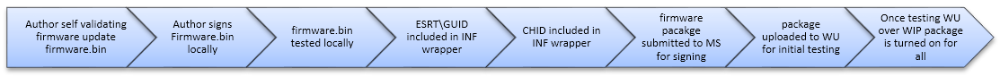

# Build and submit a firmware package to Windows Update (WU)


Because a firmware update is delivered as a driver package, it follows the same verification and signing process as a device driver package.

1.  When the contents of the driver package are installed on the System Under Test (SUT), the device must pass the required Windows Hardware Lab Kit (HLK) tests. If there is not a test specifically for the firmware being tested, locate the most reasonable alternative and submit results with the HLK package as needed.

2.  The driver package can then be submitted to the [Windows Dev Center Hardware Dashboard](https://developer.microsoft.com/windows/hardware/dashboard-sign-in) for signing.

3.  Once signed, the driver package is provided to the submitter where the submitter has the option to publish on Windows Update (WU) via the Hardware Dashboard (using the Driver Distribution feature).

Publishing to Windows Update is done via the [Hardware Dashboard](https://developer.microsoft.com/windows/hardware/dashboard-sign-in) using the Driver Distribution feature.

Signing of the driver package is different from signing the UEFI firmware, though both need to be signed. Signing is via Hardware Dashboard using the file signing services feature. The signature on the driver package, delivered via security catalog, is used by Windows to verify the integrity of firmware.bin before handing it to UEFI. Windows does not provide the security catalog to the firmware. The signature on the UEFI firmware or device firmware update is validated by the platform firmware and is not checked by Windows. The IHV or OEM is responsible for ensuring the integrity and security of the firmware through signature verification, encryption, or other means. Review the [Microsoft UEFI CA Signing policy updates](https://blogs.msdn.microsoft.com/windows_hardware_certification/2013/12/03/microsoft-uefi-ca-signing-policy-updates/) link below for additional details.

Next, sign the contents of the capsule. The capsule content itself is determined by the OEM. The capsule may just contain a catalog of firmware images to update in whatever format the OEM chooses, or it may be delivered in the form of an EFI Application image (PE/COFF file format). If the capsule is a PE/COFF file, then it must be signed by the OEM before submitting to Microsoft for Windows Firmware Update Package signing.

On ARM-based systems, with no keys other than the Microsoft Production CA 2011 allowed in the UEFI Allowed Database and Microsoft does not use a signer under this CA to sign third-party UEFI code, load of such a capsule cannot leverage the regular UEFI **LoadImage()** service. The capsule application may, however, be loaded using a platform-specific verification against the boot ROM public key or the UEFI PK. This load must still be measured into TPM PCR\[7\] as for any other image. More generally, when capsule signing is deemed necessary (for example, to ensure integrity and authenticity of the complete update package), and the capsule may comprise firmware updates for firmware outside of UEFI, the capsule should be signed in such a way that it can be verified using platform-held, non-UEFI keys (for example, signed using a key chaining back to a public key bound to boot ROM or the UEFI PK).



On non-ARM systems,

-   The capsule can be an EFI application as long as it is signed with a key chaining back to an entry in the UEFI Allowed Database.

-   UEFI Secure Boot can then automatically be leveraged to verify the integrity of the capsule.

**Note**  Windows does not allow OEM Verisign-signed firmware update packages, even in test environments. They must be test signed by Microsoft through the portal.

Update the firmware on your SUT device by installing the firmware update package.

Install the Windows Hardware Lab Kit (HLK) on the test system with the PTP and run all the tests applicable to the firmware device.Submit the *HLK logs and the driver package* to the Windows Dev Center Hardware Dashboard for signature.

**Note** While submitting the firmware update driver package, make sure to select Windows 8 or later as the applicable OS. If any down-level OS is chosen, then the Windows Dev Center Hardware Dashboard will sign the catalog in the driver package with SHA1 algorithm. Starting in Windows 8, all firmware update driver packages must be SHA256 signed.

Though not recommended, it is possible to submit a package to Microsoft without first generating HLK test logs (or including HLK test logs when submitting). Use **Create driver signing submission** for driver signing without the HLK pass test log or for validation testing.

The requirement for driver signing without HLK test logs is that the driver is submitted in CAB format.

The in-box Makecab.exe allows the user to create a CAB file. Though there are other tools (such as Cabarch.exe) available, they are sometimes more difficult to locate and not included in-box.

The key is to make sure that the folder that contains the driver is included in the CAB file as well. For example, the driver package may have a structure similar to the following:

```syntax
C:\Desktop
        \DriverFolderOne
                Driver.inf
                Driver.sys
```

If you follow this format, the submission should pass. To confirm the parent folder made it into the CAB, open the CAB in Windows Explorer and switch **View** to **Details**. There will be a **Path** column which should not be empty.

## Related resources

[Authoring a firmware update package](https://docs.microsoft.com/windows-hardware/drivers/bringup/authoring-a-firmware-update-package)

[Certifying and signing the update package](https://docs.microsoft.com/windows-hardware/drivers/bringup/certifying-and-signing-the-update-package)

[Device.Fundamentals Reliability Testing Prerequisites](https://docs.microsoft.com/windows-hardware/test/hlk/testref/devicefundamentals-reliability-testing-prerequisites)

[Driver Signing](https://docs.microsoft.com/windows-hardware/drivers/dashboard)

[Microsoft UEFI CA Signing Policy updates](https://blogs.msdn.microsoft.com/windows_hardware_certification/2013/12/03/microsoft-uefi-ca-signing-policy-updates/)

[View test results and log files](https://docs.microsoft.com/windows-hardware/test/hlk/getstarted/step-7-view-test-results-and-log-files)

[Create a submission package](https://docs.microsoft.com/windows-hardware/test/hlk/getstarted/step-8-create-a-submission-package)

[System and device firmware updates via a firmware driver package](https://docs.microsoft.com/windows-hardware/drivers/bringup/system-and-device-firmware-updates-via-a-firmware-driver-package)

[Troubleshooting Device Fundamentals Reliability Testing by using the Windows HLK](https://docs.microsoft.com/windows-hardware/test/hlk/testref/troubleshooting-device-fundamentals-reliability-testing-by-using-the-windows-hck)

[Windows Hardware Certification blog](https://blogs.msdn.microsoft.com/windows_hardware_certification)

[Windows UEFI firmware update platform](https://docs.microsoft.com/windows-hardware/drivers/bringup/windows-uefi-firmware-update-platform)

[Windows Hardware Dev Center dashboard](https://developer.microsoft.com/windows/hardware/dashboard-sign-in)

[ESRT table definition ](https://docs.microsoft.com/windows-hardware/drivers/bringup/esrt-table-definition)


