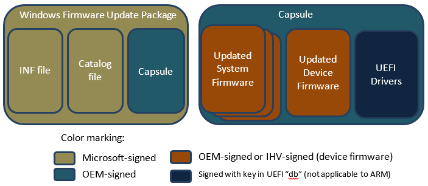

# Certifying and signing the update package

Because the firmware update is delivered as a driver package, it will need to go through all of the same verification and signing processes as a regular driver package. The driver package will need to pass Windows Hardware Lab Kit (Windows HLK) tests, and will need to be submitted to the Windows Dev Center Hardware Dashboard for signing. Once signed, the driver package will be distributed back to the submitter.

**Note**  Signing of the driver package is different from signing the UEFI firmware or device firmware itself. The signature on the driver package, delivered via security catalog, is used by Windows to verify the integrity of firmware.bin before handing it to the UEFI. Windows does not provide the security catalog to the firmware. The signature on the UEFI firmware or device firmware update is validated by the platform firmware, and is not checked by Windows. The IHV/OEM is responsible for ensuring the integrity and security of the firmware through signature verification, encryption or other means.

 

## Firmware update signing process and requirements for UEFI secure boot

When signing UEFI firmware updates intended for consumption by Windows devices with UEFI secure boot active, the signing process entails some combination of the following tasks:

1.  Signing the updated firmware image(s).
2.  Signing the capsule carrying the updated firmware.
3.  Signing the firmware update package provided to the operating system; this package will contain the capsule.

Of these tasks, only \#3 is always required. On a secure boot-enabled system, all UEFI firmware must be signed, which implies that \#1 is required when the update concerns UEFI drivers or applications. For connected standby systems, \#1 is also required for all system firmware. If the firmware update is not protected by other means, the capsule must be signed in order to protect the firmware update itself and to ensure authenticity of the update package before being installation.

The following diagram indicates the signer for the various components discussed in the rest of this topic.

## Signing the updated firmware

When signed, the signature of the updated firmware must be possible to validate by the systems’ firmware loader during boot. At a minimum, this will occur automatically on reboot, but pre-validation is strongly recommended for reliability and user experience reasons.

On ARM systems, no UEFI drivers or applications separate from the firmware image itself can be installed since the only allowed UEFI PE/COFF image is the Microsoft Windows OS loader (BootMgfw.efi), and it will be verified using the sole UEFI Allowed Database entry containing the Microsoft Windows Production CA 2011. Therefore, only system and device firmware can be added. On non-ARM systems, UEFI drivers and applications can be signed with any key chaining back to a key in the UEFI Allowed Database.

System or device firmware can either be signed with a key chaining back to a key bound to system boot ROM or be protected by other means (e.g. a signed capsule and then protected installation).

## Signing the capsule

The capsule contents are determined by the OEM. The capsule may just contain a catalog of firmware images to update in whatever format the OEM chooses, or it may be delivered in the form of an EFI Application image (PE/COFF file format). If the capsule is a PE/COFF file then it must be signed by the OEM before submitting to Microsoft for Windows Firmware Update Package signing.

On ARM-based systems, since no keys other than the Microsoft Production CA 2011 are allowed in the UEFI Allowed Database (“db”) and Microsoft won’t use a signer under this CA to sign 3rd-party UEFI code, load of such a capsule cannot leverage the regular UEFI LoadImage() service. The capsule application may, however, be loaded using a platform-specific verification against the boot ROM public key or the UEFI PK. Note that this load must still be measured into TPM PCR\[7\] as for any other image. More generally, when capsule signing is deemed necessary (e.g. to ensure integrity and authenticity of the complete update package), and the capsule may comprise firmware updates for firmware outside of UEFI, the capsule should be signed in such a way that it can be verified using platform-held, non-UEFI keys (e.g. signed using a key chaining back to a public key bound to boot ROM or the UEFI PK).

On non-ARM systems, the capsule can be an EFI application as long as it is signed with a key chaining back to an entry in the UEFI Allowed Database. UEFI Secure Boot can then automatically be leveraged to verify the integrity of the capsule.

## Signing the firmware update package

The firmware update package needs to be submitted to the Windows Dev Center Hardware Dashboard to be signed. This step will create a catalog-signature of the package contents. The catalog-signature is used by the Microsoft OS loader to verify that the package is authentic and has not been tampered with before the actual update is provided to the firmware through UpdateCapsule.

Submitting the firmware update package to the Microsoft Windows Dev Center Hardware Dashboard for signing:

1.  Sign the contents of the capsule as per the instructions in the previous section.
2.  Create a firmware update package that includes the capsule, and test sign the firmware update package. For more information, see [Authoring an update driver package](authoring-an-update-driver-package.md).
    **Note**  Starting in Windows 8, Windows does not allow OEM Verisign-signed firmware update packages, even in test environments.

     

3.  Update the firmware by installing the firmware update package.
4.  Install the Windows Hardware Lab Kit (HLK) on the test system and run all the tests applicable to the firmware device.
5.  Submit the HLK logs and the driver to the Windows Dev Center Hardware Dashboard for signature.

**Note**  While submitting the firmware update driver package, make sure to select Windows 8 or later as the applicable OS. If you choose any down-level OS, then the Windows Dev Center Hardware Dashboard will sign the catalog in the driver package with SHA1 algorithm. Starting in Windows 8, all firmware update driver packages must be SHA256 signed.

 

## Related topics
[System and device firmware updates via a firmware driver package](system-and-device-firmware-updates-via-a-firmware-driver-package.md)  
[Populating the ESRT table](populating-the-esrt-table.md)  
[Customizing firmware for different geographic regions](customizing-firmware-for-different-geographic-regions.md)  
[Authoring a firmware update package](authoring-a-firmware-update-package.md)  
[Installing the update](installing-the-update.md)  

--------------------
[Send comments about this topic to Microsoft](mailto:wsddocfb@microsoft.com?subject=Documentation%20feedback%20%5Bp_OEMBringUp\p_oembringup%5D:%20Certifying%20and%20signing%20the%20update%20package%20%20RELEASE:%20%284/22/2016%29&body=%0A%0APRIVACY%20STATEMENT%0A%0AWe%20use%20your%20feedback%20to%20improve%20the%20documentation.%20We%20don't%20use%20your%20email%20address%20for%20any%20other%20purpose,%20and%20we'll%20remove%20your%20email%20address%20from%20our%20system%20after%20the%20issue%20that%20you're%20reporting%20is%20fixed.%20While%20we're%20working%20to%20fix%20this%20issue,%20we%20might%20send%20you%20an%20email%20message%20to%20ask%20for%20more%20info.%20Later,%20we%20might%20also%20send%20you%20an%20email%20message%20to%20let%20you%20know%20that%20we've%20addressed%20your%20feedback.%0A%0AFor%20more%20info%20about%20Microsoft's%20privacy%20policy,%20see%20http://privacy.microsoft.com/default.aspx. "Send comments about this topic to Microsoft")

