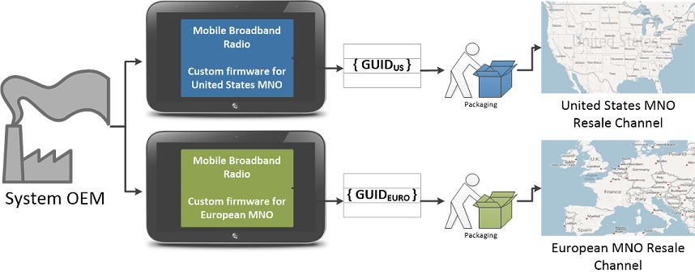

# Customizing firmware for different geographic regions

Systems will be sold in a variety of markets and geographies worldwide. To enable this, OEMs must define unique GUID values for those devices/system firmware which may require region-specific firmware.

For example, region-specific firmware is frequently required for the Mobile Broadband (MBB) device. MBB device firmware is often customized for a specific Mobile Network Operator (MNO) in a particular region, to comply with local MNO and government regulations. To allow targeting of firmware to such devices, the OEM must assign a unique GUID to that device in the ESRT at the time of manufacture.

In the previous diagram, note that the system is identical in all respects, with the exception that the systems are destined for resale in different geographies. Therefore, the MBB device firmware in each system must be independently targetable and assigned a different GUID in the ESRT. This enables the MNO to target firmware updates to the system that is sold by them in their operating area. Similar consideration must be given to any device which may require custom firmware by geography or resale channel.

## Related topics
[System and device firmware updates via a firmware driver package](system-and-device-firmware-updates-via-a-firmware-driver-package.md)  
[Populating the ESRT table](populating-the-esrt-table.md)  
[Authoring a firmware update package](authoring-a-firmware-update-package.md)  
[Certifying and signing the update package](certifying-and-signing-the-update-package.md)  
[Installing the update](installing-the-update.md)  

