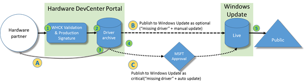
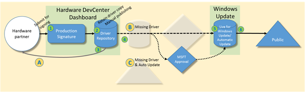

# Driver publishing workflow for Windows 10 

To align with the new Windows as a Service philosophy, users will routinely receive OS updates. These updates will fix bugs and issues but also light up new features and enable new scenarios. Because of this, Windows 10 will be an ever-evolving OS.

For Windows 10, the end-to-end Windows driver publishing and distribution workflow has been modified to accommodate these changes. This document outlines the goals, scenarios, and requirements that enable the end-to-end driver publishing workflows which will enable Upgrade/Update Customer Satisfaction.

# Windows Update Distribution

Microsoft offers hardware partners a distribution channel for their updated drivers called Windows Update. Windows has built-in support to retrieve drivers from Windows Update from a variety of scenarios, such as when new hardware is connected to Windows to updating existing drivers with newer versions.

## Pre-Windows 10 Driver Update Scenarios

Distributing a driver through Windows Update falls into three different scenarios. List *1* shows the three different driver scenarios that Windows Update facilitates.

Windows Update Driver Scenarios

-   **Missing Driver**
    
    This scenario occurs when Windows discovers new hardware. This could be due to a user plugging in a new peripheral, pairing with a networked or wireless device (such as Bluetooth or Wi-Fi Direct), docking with a new docking station, and so on.

    When Windows recognizes the new hardware, it checks Windows Update for a driver for the newly discovered hardware. Even if a driver was already installed, the new hardware will trigger a search on Windows Update to check for a newer version of the driver. If one exists then it is downloaded and installed.

    A good example of this scenario is if a user formats their hard drive and installs Windows fresh, from a DVD or USB drive. Once Windows is up and running it discovers all of the hardware components (display, USB hub, internal components, and so on) and fetches drivers from Windows Update.

-   **Update Driver**

    This scenario occurs when a user requests that Windows Update download and update an existing driver that is already installed on a device running Windows.

    This typically occurs because the user is advanced and wants to use a newer driver, or because an IT administrator or customer support technician has instructed the user to do so.

-   **Auto Update Driver**
    
    Similar to the Update Driver scenario, the Auto Update Driver scenario involves updating an existing driver on a device running Windows. The difference between the two scenarios is that Auto Update Driver happens automatically, without any user interaction.

    This requires that the device running Windows is [configured to automatically update itself from Windows Update](http://windows.microsoft.com/en-us/windows/turn-automatic-updating-on-off#turn-automatic-updating-on-off=windows-8).

These scenarios have been supported for several releases. Windows 10 will support the **Missing Driver** and **Auto Update Driver** scenarios.

## Reselling (Redistributing) Drivers and the Driver Update Acceptable Process

In addition to hardware partners publishing their drivers, they can also grant a copy of the driver for other hardware partners to download and/or distribute. This is known as the *resell* process.

If Partner A submits a driver for signing, Partner A can then resell the driver to Partner B and Partner C, who can independently distribute the driver through Windows Update as if they were Partner A. Resell submission is only available through Compatibility signing. Please refer Section2.5.1.

This provides partners the right to publish the driver to Windows Update. This offloads the work of Partner A to manage driver distribution for Partner B and Partner C.

*Note that a resold submission cannot be resold (again).*

In addition to the resell process a hardware partner may modify an initial or resold driver through the Driver Update Acceptable process, and then distribute the drivers. There are limitations to what can be modified, such as only particular parts of an INF file (such as HWIDs, installation targeting information, branding,and so on).

The resell and Driver Update Acceptable process is defined in the Manage Hardware Submissions article on MSDN:
<https://msdn.microsoft.com/en-us/library/windows/hardware/br230784.aspx>

## Pre-Windows 10 Driver Publishing Workflow 

### Driver Submission Options

Previous Windows releases provide hardware partners the ability to sign and publish drivers through the DevCenter Dashboard. A hardware partner had one of three options to choose from when submitting a driver (as illustrated in the diagram below).

Legacy Driver Publishing Workflow (Win7, Win8.0, Win8.1)



#### Legacy Driver Publishing Options

1.  **Submit the driver for signing only**
    This option was commonly used when the hardware partner wanted to have a driver signed so that it installed correctly on a device running Windows; however, the hardware partner planed on distributing the driver itself (not using Windows Update). This was also used for hardware partners to enable testing on a production system prior to widely distributing the final release version of the driver or firmware (refer to *A* in diagram above).

2.  **Submit the driver for publishing to Windows Update as *optional***
    In this option, the driver was signed and then published to Windows Update. In this case the hardware partner intended for the driver to be available for driver provisioning and was available to users to update if they opt into it. To accommodate this the driver is marked as *optional* (refer to the Missing Driver and Update Driver Scenarios above). The user only received it if they opend Windows Update, scanned for updates, and then explicitly selected the driver to install. Since this workflow is non-intuitive, it was considered as available only to advanced users or users directed by customer support (refer to *B* in diagram above).

3.  **Submit the driver for publishing to Windows Update as *critical****
    In this option, the driver was signed, and then published to Windows Update. In this case the hardware partner intended for the driver to be available for driver provisioning, manual updating, and to be available for automatic installation when AutoUpdate occurs (refer to the Missing Driver, Update Driver, and AutoUpdate Driver scenarios above). To accommodate this the driver would be marked as *critical.* This required Microsoft’s explicit approval. Marking a driver as critical is a rare event (refer to *C* in diagram above).

All driver submissions were stored in the DevCenter Dashboard driver repository regardless of which option above the hardware partner requested. Both a pre-signed and signed copy of the driver was stored for archiving purposes.

#### Legacy Workflow Steps

1.  The hardware partner submitted a driver and Windows Hardware Certification Kit (WHCK) logs to the DevCenter Dashboard. The DevCenter Dashboard validated the logs to ensure the driver was compatible with the device class it targeted.
    If the WHCK logs did not pass validation, the submission was rejected and the hardware partner was informed. The workflow then ended.
    If the hardware logs were successfully validated, then the driver was signed and the workflow continued.

2.  The signed (and pre-signed) driver package was archived in the DevCenter Dashboard database.

3.  The hardware partner could then download the signed driver (option *A* in diagram above).

4.  At any time after the driver had been signed, the hardware partner could optionally choose to publish the driver as optional (*B* in diagram above) or as critical (*C* in diagram above).

5.  The published driver was available to the public for Missing Driver, Update Driver, and (if requested and approved) AutoUpdate Driver scenarios.

##### Removing a Driver from Windows Update

The hardware partner had the ability to remove the published driver from Windows Update. This would revoke all three of the Windows Update publishing scenarios for the driver (refer to the Missing Driver, Update Driver, and Auto Update Driver scenarios in List *1*). Microsoft would still retain a copy of the driver in its internal repository. The hardware partner would still have access to download the signed driver even though it was no longer published on Windows Update.

## Windows 10 Initial Driver Publishing Workflow (29 April 2015)

### Driver Submission Options

The initial release of the Windows 10 driver publishing workflow will be available to hardware partners on 29 April 2015. It will consist of the features in List *5*:

#### Windows 10 Initial Driver Publishing Features (29 April 2015)

-   HLK Signing

-   Driver Signing (New)

-   Submission for Missing Drivers and Update Driver scenarios

-   AutoUpdate scenario support using DDCHelp@microsoft.com



#### Windows 10 Initial Driver Publishing Workflow Steps (29 April 2015)

1.  The hardware partner submits a high-quality, production-release-quality driver to the DevCenter Dashboard. It may or may not be accompanied by WHLK logs. If the partner omits the optional WHLK logs then they must *assert* to the compatibility of the driver.
    The DevCenter Dashboard validates the logs (if provided). If the WHLK logs do not pass validation or the partner does not asert then the submission is rejected and the hardware partner is informed. The workflow then ends.
    If the hardware logs are successfully validated or the partner asserted then the workflow continues.
    *Note that the submitted driver is expected to be production-release quality before submission. The hardware partner must have already performed necessary testing to ensure the submitted driver is of high quality.*

2.  The driver package is archived in the DevCenter Dashboard database.

3.  The hardware partner can now download the signed driver (option *A* in diagram above).

4.  The hardware partner may publish the driver to Windows Update (option *B* in diagram above).

    Publishing the driver will result in making the driver available for the Missing Driver scenario.

    Once published, the partner may contact DDCHelp (<ddchelp@microsoft.com>) to include the driver for Auto Update scenarios (option *C* in diagram above). Doing so requires Microsoft approval.

    All published drivers will go to Windows Update Live and will be available broadly.

    *Note that there is no Windows Update Preview.*

5.  The driver is moved into Windows Update Live.

6.  The public now has access to the driver.

#### Windows 10 Release Driver Publishing Workflow

##### New Features

The Windows 10 driver publishing workflow which will be available to hardware partners at Windows 10 release will consist of the features made available at 29 April 2015 and the additional features below:

**Windows 10 release Driver Publishing Features**

-   Distribution Targeting

-   Installation Targeting

-   Initial Distribution Ramp Up


##### Windows 10 release Driver Publishing Workflow Steps

1.  The hardware partner submits a -uality, production-release-quality driver to the DevCenter Dashboard. 

    It may or may not be accompanied by WHLK logs. If the partner omits the optional WHLK logs then they must *assert* to the compatibility of the driver.
    
    The DevCenter Dashboard validates the logs (if provided). If the WHLK logs do not pass validation or the partner does not assert then the submission is rejected and the hardware partner is informed. The workflow then ends.
    If the hardware logs are successfully validated or the partner asserted then the workflow continues.
    *Note that the submitted driver is expected to be production release quality before submission. The hardware partner must have already performed necessary testing to ensure the submitted driver is of high quality.*

2.  The signed (and pre-signed) driver package is archived in the DevCenter Dashboard database.

3.  The hardware partner can now download the signed driver (option *A* in diagram above).

4.  The hardware partner may publish the driver to Windows Update (option *B* in diagram above).

    The hardware partner may now specify specific OEM systems that the driver is to be distributed to. This *distribution targeting* is discussed later in the section on *Distribution Targeting* .

    Publishing the driver will result in making the driver available for the Missing Driver scenario.

    Once published, the IHV may contact Microsoft to include the driver for Auto Update scenarios (option *C* in diagram above). Doing so requires Microsoft approval.

    All published drivers will go to Windows Update Live and will be available broadly.

    *Note that there is no Windows Update Preview.*

5.  The driver is moved into Windows Update Live.

6.  The public has access to the driver. The driver may go through the Windows Update Live availability ramp up period as described in *Table 1*.


# Driver Targeting

## Background

Driver targeting ensures the correct driver is installed on the correct hardware. Traditionally, this is done by a four-part HWID differentiation when needed on buses that support such targeting. Partners submit these drivers to the Windows Hardware DevCenter Dashboard for distribution.

However, sometimes the four-part HWIDs are not specific enough. For example:

- The technical limitations of a specific device bus may not allow for four-part HWIDs.

- A four-part HWID may only identify an OEM, but not a specific OEM system.

Generic HWIDs are used for a variety of reasons. Constraining the systems to which a driver is distributed mitigates the issues highlighted above.

With Windows 10 *computer hardware IDs (CHIDs)* can be used to better target drivers to specific systems.

## Computer Hardware IDs

Computer Hardware IDs (CHIDs) are defined in the Specifying Hardware IDs for a Computer article on MSDN:
[*http://msdn.microsoft.com/en-us/library/windows/hardware/ff552325(v=vs.85).aspx*](http://msdn.microsoft.com/en-us/library/windows/hardware/ff552325(v=vs.85).aspx)

For Windows 10, several new CHIDs have been added that incorporate Baseboard Manufacturer and Baseboard Product information. They have been included into the CHID hierarchy as illustrated in Table 3. The table shows the hierarchy in descending order of specificity. The CHIDs that are new to Windows 10 are highlighted in bold.

CHID Definitions

| ID            | Contents                                                                                                                 |
|---------------|--------------------------------------------------------------------------------------------------------------------------|
| HardwareID-0  | Manufacturer + Family + Product Name + SKU Number + BIOS Vendor + BIOS Version + BIOS Major Release + BIOS Minor Release |
| HardwareID-1  | Manufacturer + Family + Product Name + BIOS Vendor + BIOS Version + BIOS Major Release + BIOS Minor Release              |
| HardwareID-2  | Manufacturer + Product Name + BIOS Vendor + BIOS Version + BIOS Major Release + BIOS Minor Release                       |
| HardwareID-3  | **Manufacturer + Family + ProductName + SKU Number + Baseboard\_Manufacturer + Baseboard\_Product**                      |
| HardwareID-4  | Manufacturer + Family + ProductName + SKU Number                                                                         |
| HardwareID-5  | Manufacturer + Family + ProductName                                                                                      |
| HardwareID-6  | **Manufacturer + SKU Number + Baseboard\_Manufacturer + Baseboard\_Product**                                             |
| HardwareID-7  | Manufacturer + SKU Number                                                                                                |
| HardwareID-8  | **Manufacturer + ProductName + Baseboard\_Manufacturer + Baseboard\_Product**                                            |
| HardwareID-9  | Manufacturer + ProductName                                                                                               |
| HardwareID-10 | **Manufacturer + Family + Baseboard\_Manufacturer + Baseboard\_Product**                                                 |
| HardwareID-11 | Manufacturer + Family                                                                                                    |
| HardwareID-12 | Manufacturer + Enclosure Type                                                                                            |
| HardwareID-13 | **Manufacturer + Baseboard\_Manufacturer + Baseboard\_Product**                                                          |
| HardwareID-14 | Manufacturer                                                                                                             |

OEMs will need to provide the correct CHID information to the driver publisher. The ComputerHardwareIds.exe tool (<http://msdn.microsoft.com/en-us/library/windows/hardware/ff543505(v=vs.85).aspx>), included in the Windows Desktop Tools SDK, can help facilitate reporting CHIDs from a known set of System Management BIOS (SMBIOS) values.

Note that the ComputerHardwareIds.exe tool performs two different tasks:

1.  **Default Behavior:** The tool reports the current system settings.

    By default the tool will display the system’s current SMBIOS values, which will be used to generate the various CHIDs. It also displays the CHIDs that are generated. You can use this default behavior of the tool to determine the CHIDs for any given system by running the tool on it.

2.  **Simulation Behavior:** The tool models CHIDs from user inputted SMBIOS data.

    You can simulate which CHIDs will be generated by Windows by running the tool with passing in various SMBIOS values, such as manufacturer, family, SKU, and so on. The tool will use those inputted values to generate CHIDs representing the inputted data.
    This is useful if you want to determine which CHIDs would be generated on a system with specific SMBIOS data values.

### Tips for consistent CHIDs

Note that CHIDs are generated based on case sensitive SMBIOS values. Therefore care must be taken to ensure that systems do not mix cases in SMBIOS text values. Similarly UNICODE characters are not specially treated. Therefore upper and lower case versions of special characters, such as the Turkish dotted and un-dotted letter I, are treated uniquely: I, ı, İ and i are not the same.

Note that the tool will only compute CHIDs for which there is data available. If an SMBIOS data field is missing (or it is null), then any related CHIDs are not generated. For example if the SMBIOS SKU field is null then CHIDs 0, 3, 4 6 and 7 (from Table 3) will not be available for that particular system.

## Types of Targeting

To achieve targeting drivers to specific systems, Microsoft recognizes two driver targeting scenarios (as described in List *9*).

#### Types of Driver Targeting

- **Installation Targeting**

    - On a device running Windows, the Plug and Play (PnP) system ranks all drivers on a device such that the most appropriate driver is installed on a particular piece of hardware. This ranking considers device hardware IDs (HWID), driver version, and date, among other things. Once the ranking occurs, PnP will choose the most appropriate driver for a device and install it.

    - This targeting only considers the drivers that are already on the device (regardless of how it was distributed: using Windows Update, an OEM/IHV updater application, manually installed by a user, and so on).

- **Distribution Targeting**

    - In order for installation targeting to be successful, the right driver must be distributed from Windows Update to the right system. Distributing a driver for hardware not present on a system does not help light up the hardware.

    - To ensure that the right drivers are distributed to the right systems, the Windows Update server implements the same ranking algorithm described in Installation Targeting. Additionally, Windows Update adds logic to determine whether there are specific drivers that need to be distributed to specific systems. In some cases a hardware partner produces different OEM flavors of the same driver. The Windows Update server identifies the client system and determines if there is a specific one-off version of a driver that must be distributed.

##### Installation Targeting

As mentioned above, PnP ranks drivers such that the most appropriate driver is installed on a particular piece of hardware. This ranking takes into account following information:

-   The Feature Score specified in the INF

-   The ordered list of HWIDs from the device and from the driver INF

-   The driver version and date defined in the DriverVerDate field in the INF

The PnP driver ranking algorithm is defined in the How Windows Ranks Drivers article on MSDN:
<https://msdn.microsoft.com/en-us/library/windows/hardware/ff546225(v=vs.85).aspx>

Sometimes the HWID in not unique enough to specify the driver that must be used on a specific system. Furthermore, some drivers may cause catastrophic issues when loaded on a system with a differing hardware configuration, despite having the same HWID. These catastrophic issues could include rendering black screens, causing hardware failures, or similar (sometimes unrecoverable) issues.

To ensure that a driver will not install on a system which it does not support, Windows has added the ability to declare installation constraints to a particular set of systems in driver packages in Windows 10. Similar to other installation declarations, this feature is enabled by an INF section.

#### How to add Installation Targeting in INF

Hardware partners will be able to include compatible CHIDs in their INF for which the driver package can be installed. Since this declaration is an INF section, there is at most one constraint section per INF and the constraint applies to the entire INF.

INF syntax for \[TargetComputers\] section:

```
[TargetComputers]

{<CHID GUID 1>}

{<CHID GUID 2>}

…
```

*Note, each CHID must be a proper GUID, wrapped by curly braces (‘{‘ and ‘}’), on a new line.*

For an example of when it is appropriate to use this constraint: An OEM may have a problem with a sensor due to the physical design of a notebook’s case. To remedy this, the sensor’s IHV may produce a one-off modified driver to accommodate the unique case design. In this scenario that driver may only work properly on the OEM system in question. Therefore the driver may identify the specific OEM model by listing an appropriate CHID in the INF’s \[TargetComputers\] section. This will ensure that the driver only installs on the machine for which the driver was intended.

Note that the use of the INF \[TargetComputers\] section should be used sparingly. Since it requires marking up the INF file, there is a burden of managing the resigning of the driver after such changes. It is much easier to leverage *distribution targeting* to ensure drivers are properly distributed to the right systems. \[TargetComputers\] should only be used when installation of a driver on a given system for which it is not intended would yield catastrophic results (such as system firmware update driver packages).

#### PnP installation

If a driver’s INF file includes a \[TargetComputers\] section which contains one or more CHIDs, then the driver will be allowed to install only on a system which has a CHID listed in the section. Of course, the standard PnP applicability logic still applies (matching HWID, CompatID, and so on).

For any system that does not have a matching CHID, the driver will not install.

# CHIDs: Installation Targeting vs. Distribution Targeting 

With the introduction of CHIDs in Installation Targeting and Distribution Targeting, it can be challenging but critical to understand when to use which method of targeting.

The purpose of Installation Targeting with CHIDs is to ensure a driver does not cause issues when paired with incorrect hardware. Therefore, it should only be used when a driver will cause issues on the wrong system or hardware layout.

The purpose of CHIDs in a Distribution Targeting list is to constrain distribution of a driver to a specific set of systems through Windows Update. This allows partners to fulfill business requirements, like slow roll out due to testing timelines and targeted system-specific driver fixes. This also allows partners the flexibility to control the drivers available for their systems through Windows Update.

The following table serves as a good guide for deciding when to use Installation Targeting with CHIDs or CHIDs in the Distribution Targeting list.

| Scenario                                                                                                                                                          | Installation Targeting in INF | Distribution Targeting list |
|-------------------------------------------------------------------------------------------------------------------------------------------------------------------|-------------------------------|-----------------------------|
| Driver will bug check, be non-performant, cause device failures, or otherwise cause catastrophic issues, if run on other systems.                                 | ****                         | ****                       |
| Driver is meant for use on all systems which contain the device, though it is being slowly tested per system.                                                     | ****                         | ****                       |
| Driver fix needs to roll out to a select group of systems for the time being. This group may grow as other systems experience the same issue.                     | ****                         | ****                       |
| System manufacturer wants to select which drivers go to their system. System manufacturer does not want generic drivers to go to their system despite HWID match. | ****                         | ****                       |

1.  Scenarios
    ---------

    1.  ### Publishing Drivers with Distribution Targeting

If the Distribution Targeting list is used with Installation Targeting INF changes, Windows Update will distribute the driver to an intersection of the set of CHIDs from the Distribution Targeting list and the set of CHIDs from the Installation Targeting information in the INF.

The scenario outlined in List 10 assumes only Distribution Targeting is used (no Installation Targeting information is included in the driver INF).

List : Workflow Steps for Publishing with Distribution Targeting

1.  Fabrikam creates a driver fix for a device within the Contoso Model B matching on HWID2. This same device, matching on HWID2, is present in other Contoso systems and other OEM systems.

2.  Fabrikam submits their driver to the Windows Hardware Dashboard.

3.  This driver fix would ideally apply to other systems, but Fabrikam does not want to release it to other systems until OEM testing is completed. Thus, Fabrikam uses the Distribution Targeting list on the Windows Hardware Dashboard to constrain distribution to only Contoso Model B’s Computer HardwareID-5 (refer to ).

    -   Computer HardwareID-5 = Manufacturer + Family + ProductName = Contoso + Contoso Line + Model B

    -   Fabrikam provides the Distribution Targeting information during publishing by entering it into the publishing web page. Alternatively they can modify (add/remove) this information for their driver even after it has been published to Windows Update.

4.  The Windows Hardware Dashboard uses the Distribution Targeting list to ensure Windows Update only distributes the driver to Contoso Model B systems based on Contoso Model B’s Computer HardwareID-5.

5.  Fabrikam can return to the Windows Hardware Dashboard to manage their driver’s Distribution Targeting List at any time. This includes adding new CHIDs and removing existing CHIDs. The Windows Hardware Dashboard will ensure Windows Update uses the new distribution targeting.

6.  PnP on end user systems installs the driver as long as the driver is the best ranked driver for the device present on the system.

    -   PnP will not prevent this driver from being side-installed, because the Distribution Targeting list info is only used for distribution settings in Windows Update.

        1.  ### Publishing Drivers with Installation Targeting 

If a driver’s INF contains Installation Targeting information then Windows Update will distribute the driver to only those systems which have a CHID identified in the Installation Targeting information in the INF.

The scenario outlined in List 11 assumes only Installation Targeting information from the driver’s INF is used (no Distribution Targeting).

List : Workflow Steps for Publishing Drivers with Installation Targeting

1.  Fabrikam creates a driver for a device within the Contoso Model A matching on HWID1.

2.  Fabrikam does not want this driver to install on any system that is not Contoso Model A, even if there is a HWID match. Thus, Fabrikam adds Installation Targeting to the driver’s INF with only Contoso Model A’s Computer HardwareID-5 (refer to ).

    Computer HardwareID-5 = Manufacturer + Family + ProductName = Contoso + Contoso Line + Model A

3.  Fabrikam submits their driver to the Windows Hardware Dashboard, and selects to publish it to Windows Update.

4.  The Windows Hardware Dashboard consumes the Installation Targeting info from the INF and ensures Windows Update only distributes the driver to Contoso Model A systems based on Contoso Model A’s Computer HardwareID-5

5.  PnP on end user systems ensures that there is a Computer Hardware ID match before installing Fabrikam’s driver. If there is no match, PnP will not install the driver.

    Therefore, in a side-install scenario, PnP would not install this driver.

    1.  ### Reselling a submission and using Distribution Targeting

The Distribution Targeting list can be used with a resold driver submission. In this case, a partner can resell a driver submission to another partner. The partner can then use Distribution Targeting to constrain distribution for the resold driver.

The scenario in List 12 uses only Distribution Targeting thus no Installation Targeting information is included in the driver INF.

List : Workflow Steps for Publishing Resold Drivers with Distribution Targeting

1.  Fabrikam creates a driver fix for a device within the Contoso Model B matching on HWID2. This same device, matching on HWID2, is present in other Contoso systems and other OEM systems.

2.  Fabrikam submits their driver to the Windows Hardware Dashboard.

3.  Fabrikam resells the driver to Contoso so that Contoso can retrieve signed drivers binaries and catalogs, and can distribute the driver through Windows Update.

    Fabrikam can still distribute the initial submission to Windows Update if they choose.

4.  Contoso accepts the resold submission.

5.  This driver fix would ideally apply to other systems, but Contoso does not want to release it to other systems until OEM testing is completed. Thus, Contoso uses the Distribution Targeting list on the Windows Hardware Dashboard to constrain distribution to only Contoso Model B’s Computer HardwareID-5 (refer to ).

    1.  Computer HardwareID-5 = Manufacturer + Family + ProductName = Contoso + Contoso Line + Model B

    2.  Contoso can add this information during driver publishing, or after their driver has been published to Windows Update.

6.  The Windows Hardware Dashboard consumes the Distribution Targeting list and ensures Windows Update only distributes the driver to Contoso Model B systems based on Contoso Model B’s Computer HardwareID-5.

7.  Contoso can return to the Windows Hardware Dashboard and add or remove CHIDs from the Distribution Targeting list at any time. The Windows Hardware Dashboard will ensure Windows Update uses the new distribution targeting.

8.  PnP on end user systems installs the driver as long as the driver is the best ranked driver for the device present on the system.

    PnP will not prevent this driver from being side-installed, because the Distribution Targeting list info is only used for distribution settings in Windows Update.

    1.  ### Reselling a submission and using Installation Targeting with driver submissions

The Distribution Targeting list can be used with a resold driver submission. In this case, a partner can resell a driver submission to another partner. The partner can then use Distribution Targeting to constrain distribution for the resold driver.

The scenario outlined List 13 assumes only Installation Targeting information from the driver’s INF is used (no Distribution Targeting).

List : Workflow Steps for Publishing Resold Drivers with Installation Targeting

1.  Fabrikam creates a driver for a device within the Contoso Model A matching on HWID1.

2.  Fabrikam submits their driver to the Windows Hardware Dashboard.

3.  Fabrikam resells the driver to Contoso so that Contoso can retrieve signed drivers binaries and catalogs, and can distribute the driver through Windows Update.

    1.  Fabrikam can still distribute the initial submission to Windows Update if they choose.

4.  Contoso accepts the resold submission.

5.  Contoso does not want this driver to install on any system that is not Contoso Model A, even if there is a HWID match. Thus, Contoso adds Installation Targeting to the driver’s INF with only Contoso Model A’s Computer HardwareID-5 (refer to ) via the Driver Update Acceptable (DUA) process.

    1.  Computer HardwareID-5 = Manufacturer + Family + ProductName = Contoso + Contoso Line + Model A

6.  The Windows Hardware Dashboard consumes the Installation Targeting info from the INF and ensures Windows Update only distributes the driver to Contoso Model A systems based on Contoso Model A’s Computer HardwareID-5.

7.  PnP on end user systems ensures that there is a Computer Hardware ID match before installing Contoso’s driver. If there is no match, PnP will not install the driver.

    1.  Therefore, in a side-install scenario, PnP would not install this driver.

*Note: It is not possible to resell a driver submission after going through the Driver Update Acceptable process. It is also not possible to resell a resold driver.*

Examples
--------

The following driver examples explain distribution in more detail.

Assume there are three drivers for a device with a Hardware ID of HWID\_1 (HWID\_1 is based on following SMBIOS information: Manufacturer + Family + Product Name + BIOS Vendor + BIOS Version + BIOS Major Release + BIOS Minor Release).

The different drivers have different VerDate fields. Two drivers have Distribution Targeting lists, as specified in Table1.

|                         | Driver A         | Driver B          | Driver C         |
|-------------------------|------------------|-------------------|------------------|
| HWIDs:                  | HWID\_1          | HWID\_1           | HWID\_1          |
| DriverVerDate:          | 3/1/2015,1.0.0.0 | 4/15/2015,2.0.1.0 | 4/1/2015,2.0.0.0 |
| Installation Targeting: | CHID\_1          | None              | CHID\_1          |
| Distribution Targeting: | CHID\_1          | None              | CHID\_1          |

Table1

Consider each of these scenarios independently, assuming HWID\_1 is present on all systems:

***No drivers installed scenarios:***

-   Drivers A and B are published to Windows Update; Driver C is not published to Windows Update (Table 2).
    No drivers are installed on System\_A or System\_B.
    System\_A has CHID\_1. System\_B has CHID\_2.

    -   **Windows Update will offer Driver A to System\_A. **

        -   Driver A is the Distribution Choice Driver since System\_A has a CHID match, even though Driver A’s VerDate is worse than Driver B’s VerDate.

    -   -   **Windows Update will offer Driver B to System\_B. **

        -   Driver B is the only Distribution Choice Driver since System\_B’s CHID does not match any drivers published for HWID\_1.

        -   Driver A is not an option since there is no CHID match to System\_B.

| System A: CHID\_1       
                          
 System B: CHID\_2        | Driver A              | Driver B              | Driver C         |
|-------------------------|-----------------------|-----------------------|------------------|
| HWIDs:                  | HWID\_1 (System A)    | HWID\_1               | HWID\_1          |
| DriverVerDate:          | 3/1/2015,1.0.0.0      | 4/15/2015,2.0.1.0     | 4/1/2015,2.0.0.0 |
| Installation Targeting: | CHID\_1               | None                  | CHID\_1          |
| Distribution Targeting: | CHID\_1               | None                  | CHID\_1          |
| Windows Update          | Published             | Published             | Not Published    |
| Result                  | Installed on System A | Installed on System B | N/A              |

Table 2

-   Drivers B and C are published to Windows Update; Driver A is not published to Windows Update (Table3).
    No drivers are installed on System\_A or System\_B.
    System\_A has CHID\_1. System\_B has CHID\_2.

    -   **Windows Update will offer Driver C to System\_A.**

        -   Driver C is the Distribution Choice Driver since System\_A has a CHID match, even though Driver C’s VerDate is worse than Driver B’s VerDate.

    -   **Windows Update will offer Driver B to System\_B. **

        -   Driver B is the only Distribution Choice Driver since System\_B’s CHID does not match any drivers published for HWID\_1.

        -   Driver C is not an option since there is no CHID match to System\_B, even though Driver B’s VerDate is worse.

| System A: CHID\_1       
                          
 System B: CHID\_2        | Driver A           | Driver B                  | Driver C                  |
|-------------------------|--------------------|---------------------------|---------------------------|
| HWIDs:                  | HWID\_1 (System A) | HWID\_1                   | HWID\_1                   |
| DriverVerDate:          | 3/1/2015,1.0.0.0   | 4/15/2015,2.0.1.0         | 4/1/2015,2.0.0.0          |
| Installation Targeting: | CHID\_1            | None                      | CHID\_1                   |
| Distribution Targeting: | CHID\_1            | None                      | CHID\_1                   |
| Windows Update          | Not Published      | Published                 | Published                 |
| Result                  | N/A                | **Installed on System B** | **Installed on System A** |

Table 3

-   Drivers A, B and C are published to Windows Update (Table 4).
    No drivers are installed on System\_A or System\_B.
    System\_A has CHID\_1. System\_B has CHID\_2.

    -   **Windows Update will offer Driver C to System\_A.**

        -   Driver C is the Distribution Choice Driver since System\_A has a CHID match and Driver C has a better VerDate than Driver A.

    -   **Windows Update will offer Driver B to System\_B. **

        -   Driver B is the only Distribution Choice Driver since System\_B’s CHID does not match any published drivers for HWID\_1.

        -   Drivers A and C are not an option since there is no CHID match to System\_B.

| System A: CHID\_1       
                          
 System B: CHID\_2        | Driver A         | Driver B                  | Driver C                  |
|-------------------------|------------------|---------------------------|---------------------------|
| HWIDs:                  | HWID\_1          | HWID\_1                   | HWID\_1                   |
| DriverVerDate:          | 3/1/2015,1.0.0.0 | 4/15/2015,2.0.1.0         | 4/1/2015,2.0.0.0          |
| Installation Targeting: | CHID\_1          | None                      | CHID\_1                   |
| Distribution Targeting: | CHID\_1          | None                      | CHID\_1                   |
| Windows Update          | Published        | Published                 | Published                 |
| Result                  | Not installed    | **Installed on System B** | **Installed on System A** |

Table 4

***Driver A installed scenarios:***

-   Driver B is published to Windows Update; Drivers A and C are not published to Windows Update (Table 5).
    Driver A is installed on System\_A.
    System\_A has CHID\_1.

    -   **Windows Update will offer Driver B to System\_A.**

        -   Driver B has a better VerDate than the currently installed Driver A.

        -   Windows Update is not aware of any drivers with Distribution Targeting because Drivers A and C are not published on Windows Update.

        -   PnP is not aware of Distribution Targeting, and does not consider Installation Targeting beyond applicability to the system.

-   Drivers A and B are published to Windows Update; Driver C is not published to Windows Update (Table 5).
    Driver A is installed on System\_A.
    System\_A has CHID\_1.

    -   **Windows Update will not offer any drivers to System\_A. **

        -   The Distribution Choice Driver is Driver A, and is the same as what is installed on the system.

        -   Since Driver A has a CHID match, Windows Update selects it as the Distribution Choice Driver over Driver B.

| -   System A :CHID\_1   
                          
 -   System B :           | Driver A (Installed on System A) | Driver B                  | Driver C         |
|-------------------------|----------------------------------|---------------------------|------------------|
| HWIDs:                  | HWID\_1 (System A)               | HWID\_1                   | HWID\_1          |
| DriverVerDate:          | 3/1/2015,1.0.0.0                 | 4/15/2015,2.0.1.0         | 4/1/2015,2.0.0.0 |
| Installation Targeting: | CHID\_1                          | None                      | CHID\_1          |
| Distribution Targeting: | CHID\_1                          | None                      | CHID\_1          |
| Windows Update          | Not Published                    | Published                 | Not Published    |
| Result                  | N/A                              | **Installed on System A** | N/A              |

Table 5

-   Drivers B and C are published to Windows Update; Driver A is not published to Windows Update (Table 6).
    Driver A is installed on System\_A.
    System\_A has CHID\_1.

    -   **Windows Update will offer Driver C to System\_A.**

        -   Driver C has a better VerDate than the currently installed Driver A, and System\_A has a CHID match.

| System A :CHID\_1       
 >                        
 > System B :             | Driver A (Installed on System A) | Driver B          | Driver C                   |
|-------------------------|----------------------------------|-------------------|----------------------------|
| HWIDs:                  | HWID\_1 (System A)               | HWID\_1           | HWID\_1                    |
| DriverVerDate:          | 3/1/2015,1.0.0.0                 | 4/15/2015,2.0.1.0 | 4/1/2015,2.0.0.0           |
| Installation Targeting: | CHID\_1                          | None              | CHID\_1                    |
| Distribution Targeting: | CHID\_1                          | None              | CHID\_1                    |
| Windows Update          | Not Published                    | Published         | Published                  |
| Result                  | Not installed                    | Not installed     | **Installed on System A ** |

Table 6

-   Drivers A, B and C are published to Windows Update; Driver A is not published to Windows Update(Table 7).
    Driver A is installed on System\_A.
    System\_A has CHID\_1.

    -   **Windows Update will offer Driver C to System\_A. **

        -   Driver C has a better VerDate than the currently installed Driver A, and System\_A has a CHID match.

| System A :CHID\_1       
 >                        
 > System B :             | Driver A (Installed on System A) | Driver B          | Driver C                   |
|-------------------------|----------------------------------|-------------------|----------------------------|
| HWIDs:                  | HWID\_1 (System A)               | HWID\_1           | HWID\_1                    |
| DriverVerDate:          | 3/1/2015,1.0.0.0                 | 4/15/2015,2.0.1.0 | 4/1/2015,2.0.0.0           |
| Installation Targeting: | CHID\_1                          | None              | CHID\_1                    |
| Distribution Targeting: | CHID\_1                          | None              | CHID\_1                    |
| Windows Update          | Published                        | Published         | Published                  |
| Result                  | Not installed                    | Not installed     | **Installed on System A ** |

Table 7

*Driver B installed scenarios:*

-   Driver A is published to Windows Update; Drivers B and C are not published to Windows Update(Table 8).
    Driver B is installed on System\_A and System\_B.
    System\_A has CHID\_1. System\_B has CHID\_2.

    -   **Windows Update will not offer any drivers to System\_A. **

        -   Though the Distribution Choice Driver is Driver A, it has a lower VerDate than what is installed on the system (Driver B). Since Driver A has a CHID match, Windows Update selects it as the Distribution Choice Driver.

        -   PnP only considers Installation Targeting for driver applicability. PnP would not install Driver A over Driver B due to Driver B’s better VerDate.

    -   **Windows Update will not offer any drivers to System\_B.**

        -   Driver A is not an option since there is no CHID match to System\_B.

| System A : CHID\_1      
 >                        
 > System B : CHID\_2     | Driver A           | Driver B (Installed on System A and B) | Driver C         |
|-------------------------|--------------------|----------------------------------------|------------------|
| HWIDs:                  | HWID\_1 (System A) | HWID\_1                                | HWID\_1          |
| DriverVerDate:          | 3/1/2015,1.0.0.0   | 4/15/2015,2.0.1.0                      | 4/1/2015,2.0.0.0 |
| Installation Targeting: | CHID\_1            | None                                   | CHID\_1          |
| Distribution Targeting: | CHID\_1            | None                                   | CHID\_1          |
| Windows Update          | Published          | Not Published                          | Not Published    |
| Result                  | Not installed      | Not installed                          | Not installed    |

Table 8

-   Drivers A and B are published to Windows Update; Driver C is not published to Windows Update (Table 9).
    Driver B is installed on System\_A and System\_B.
    System\_A has CHID\_1. System\_B has CHID\_2.

    -   **Windows Update will not offer any drivers to System\_A. **

        -   Though the Distribution Choice Driver is Driver A, it has a lower VerDate than what is installed on the system (Driver B). Since Driver A has a CHID match, Windows Update selects it as the Distribution Choice Driver.

        -   PnP only considers Installation Targeting for driver applicability. PnP would not install Driver A over Driver B due to Driver B’s better VerDate.

    -   **Windows Update will not offer any drivers to System\_B. **

        -   The best driver to distribute in Windows Update is Driver B, which is already installed on the system.

| System A :CHID\_1       
 >                        
 > System B : CHID\_2     | Driver A           | Driver B (Installed on System A and B) | Driver C         |
|-------------------------|--------------------|----------------------------------------|------------------|
| HWIDs:                  | HWID\_1 (System A) | HWID\_1                                | HWID\_1          |
| DriverVerDate:          | 3/1/2015,1.0.0.0   | 4/15/2015,2.0.1.0                      | 4/1/2015,2.0.0.0 |
| Installation Targeting: | CHID\_1            | None                                   | CHID\_1          |
| Distribution Targeting: | CHID\_1            | None                                   | CHID\_1          |
| Windows Update          | Published          | Not Published                          | Not Published    |
| Result                  | Not installed      | Not installed                          | Not installed    |

Table 9

-   Drivers B and C are published to Windows Update; Driver A is not published to Windows Update (Table 10).
    Driver B is installed on System\_A and System\_B.
    System\_A has CHID\_1. System\_B has CHID\_2.

    -   **Windows Update will not offer any drivers to System\_A. **

        -   Though the Distribution Choice Driver is Driver C, it has a lower VerDate than what is installed on the system (Driver B). Since Driver C has a CHID match, Windows Update selects it as the Distribution Choice Driver.

        -   PnP only considers Installation Targeting for driver applicability. PnP would not install Driver A over Driver B due to Driver B’s better VerDate.

    -   **Windows Update will not offer any drivers to System\_B. **

        -   The best driver to distribute in Windows Update is Driver B, which is already installed on the system.

| System A : CHID\_1      
 >                        
 > System B : CHID\_2     | Driver A           | Driver B (Installed on System A and B) | Driver C         |
|-------------------------|--------------------|----------------------------------------|------------------|
| HWIDs:                  | HWID\_1 (System A) | HWID\_1                                | HWID\_1          |
| DriverVerDate:          | 3/1/2015,1.0.0.0   | 4/15/2015,2.0.1.0                      | 4/1/2015,2.0.0.0 |
| Installation Targeting: | CHID\_1            | None                                   | CHID\_1          |
| Distribution Targeting: | CHID\_1            | None                                   | CHID\_1          |
| Windows Update          | Not Published      | Published                              | Published        |
| Result                  | Not installed      | Not installed                          | Not installed    |

Table 10

-   Drivers A, B and C are published to Windows Update (Table 11).
    Driver B is installed on System\_A and System\_B.
    System\_A has CHID\_1. System\_B has CHID\_2.

    -   **Windows Update will not offer any drivers to System\_A. **

        -   Though the Distribution Choice Driver is Driver C, it has a lower VerDate than what is installed on the system (Driver B). Since Driver C has a CHID match, Windows Update selects it as the Distribution Choice Driver.

        -   PnP only considers Installation Targeting for driver applicability. PnP would not install Driver A over Driver B due to Driver B’s better VerDate.

    -   **Windows Update will not offer any drivers to System\_B. **

        -   The best driver to distribute in Windows Update is Driver B, which is already installed on the system.

| System A :CHID\_1       
 >                        
 > System B : CHID\_2     | Driver A           | Driver B (Installed on System A and B) | Driver C         |
|-------------------------|--------------------|----------------------------------------|------------------|
| HWIDs:                  | HWID\_1 (System A) | HWID\_1                                | HWID\_1          |
| DriverVerDate:          | 3/1/2015,1.0.0.0   | 4/15/2015,2.0.1.0                      | 4/1/2015,2.0.0.0 |
| Installation Targeting: | CHID\_1            | None                                   | CHID\_1          |
| Distribution Targeting: | CHID\_1            | None                                   | CHID\_1          |
| Windows Update          | Published          | Published                              | Not Published    |
| Result                  | Not installed      | Not installed                          | Not installed    |

Table 11

Publication restrictions
========================

The Windows Hardware Dashboard enforces publication restrictions. Publication restrictions ensure that partners cannot publish drivers for Microsoft class or generic bus HWID strings, and that devices do not receive incorrect drivers due to generic third party or re-used HWIDs.

Microsoft allows exceptions to these rules at its discretion on a case-by-case basis. Partners can escalate these cases to <DDCHelp@microsoft.com>.

Examples of these blocks include, but are not limited to the list in Table 4.

<span id="_Ref416687050" class="anchor"></span>Table : Driver Publication Restrictions

| Type of block                                                     | Additional information        |
|-------------------------------------------------------------------|-------------------------------|
| Invalid driver submission category types                          | UNCLASSIFIED                  |
| Invalid Architecture                                              | ia64                          |
| HWIDs with no bus enumerator                                      | N/A                           |
| Invalid bus enumerators                                           | ActivCardBus                  
                                                                                                    
                                                                     CIRCLASS                       
                                                                                                    
                                                                     Hid\\irdevice                  
                                                                                                    
                                                                     Irbus                          
                                                                                                    
                                                                     PS2\_                          
                                                                                                    
                                                                     MIDI                           
                                                                                                    
                                                                     PNP                            
                                                                                                    
                                                                     ACP                            
                                                                                                    
                                                                     IAN                            
                                                                                                    
                                                                     AVM                            
                                                                                                    
                                                                     STREAM                         
                                                                                                    
                                                                     DISPLAY                        |
| Classcode declarations                                            | \\CLASS                       
                                                                                                    
                                                                     \\CC                           
                                                                                                    
                                                                     \\&                            |
| Two-part HWIDs                                                    | Enforced on HDAUDIO bus       |
| Bluetooth HWIDs with service UUIDs and no vendor ID or product ID | N/A                           |
| Invalid PCI Vendor Codes                                          | 0000                          
                                                                                                    
                                                                     FFFF                           |
| Missing device codes or product ID codes                          | Enforced on PCI and USB buses |
| Invalid HWID string beginnings                                    | HID\_DEVI                     
                                                                                                    
                                                                     SERIAL\_M                      
                                                                                                    
                                                                     ISAPNP\\PNP                    
                                                                                                    
                                                                     SERENUM\\PNP                   
                                                                                                    
                                                                     \*PNP                          
                                                                                                    
                                                                     BIOS\\PNP                      
                                                                                                    
                                                                     ACPI\\PNP                      |
| System reserved HWIDs                                             | BIOS\\PNP                     
                                                                                                    
                                                                     ACPI\\PNP                      |
| Invalid HWIDs                                                     | \*DONTUSE                     
                                                                                                    
                                                                     SERIAL\_MOUSE                  
                                                                                                    
                                                                     Root\\circlass                 
                                                                                                    
                                                                     Hid\\irdevice                  |

1.  Firmware Update support for systems
    ===================================

    1.  UEFI Firmware UpdateCapsule Support
        -----------------------------------

To accommodate updating system firmware on UEFI systems, Windows provides UpdateCapsule support. This support provides a method for OEMs to distribute and update their UEFI system firmware by encapsulating a firmware update blob into a Windows driver package. The end to end publishing workflow treats this driver package no different than any other driver package.

Once the firmware update driver package has been distributed and installed on a given system it is applied during the next boot cycle of the PC. Details on this UpdateCapsule functionality are outlined in the Windows UEFI Firmware Update Platform whitepaper:
[*http://www.microsoft.com/en-us/download/details.aspx?id=38405*](http://www.microsoft.com/en-us/download/details.aspx?id=38405)

This UpdateCapsule functionality is being added to the Mobile SKU as an alternative to the traditional Phone model of updating system firmware for scenarios where the Phone model is not sufficient. Microsoft recommends utilizing the standard mobile/phone firmware update model to take benefit of the offline servicing model and built-in recovery support. On the Mobile SKU UpdateCapsule should only be used if the standard mobile/phone firmware update process is not tenable.

### Publishing an UpdateCapsule:

Historically (since the release of Windows 8) UpdateCapsules were distributed solely as part of a Model Based Servicing (MBS) set. MBS provided 2 features which were needed for firmware updates:

1.  Dependency Mapping
    This was a way to map dependencies between drivers and/or firmware so that they were serviced as a set. In other words all drivers/firmware were updated at the same time avoiding torn states where different versions of the components were used resulting in unexpected behaviors.

2.  Distribution Targeting
    This was a method used to ensure that the drivers and firmware in an MBS set were distributed to the expected systems. This prevented customized drivers from being distributed to the wrong system even if the hardware IDs matched.
    This is the same distribution targeting described in List *9*.

In Windows 10 we are enabling the publishing of a ​single driver (or firmware UpdateCapsule) using distribution targeting (\#2 above) without having to be part of an MBS driver set. The workflow will rely on ComputerIDs (what some people call computer hardware IDs or CHID). These are the identifiers used to target MBS sets to a particular system. They are also used by hardware vendors to map computer metadata such as icons and other assets for display in the Devices and Printers folder (as well as Device Stage). Refer to the following MSDN article for more details:
[*http://msdn.microsoft.com/en-us/library/windows/hardware/ff552325(v=vs.85).aspx*](http://msdn.microsoft.com/en-us/library/windows/hardware/ff552325(v=vs.85).aspx)

UpdateCapsule driver packages published *outside* of an MBS driver set must specify the list of computer IDs that the firmware is applicable to in its driver INF \[TargetComputers\] section. This prevents the firmware from accidentally being installed on an incorrect system. \[TargetComputers\] is a new INF directive for Windows 10.

Such a firmware update driver package can be submitted to the DevCenter Dashboard for signing and publishing through Windows Update.

Note that the actual system firmware implementation of the UEFI UpdateCapsule() must validate that a given capsule is indeed appropriate for the machine. With this validation the use of \[TargetComputers\] is unnecessary. Therefore \[TargetComputers\] is redundant, but permitted.

### Validating Firmware Update Capsules

Exactly how a firmware update capsule functions is up to the firmware vendor. As outlined in the Windows Firmware Update Platform whitepaper the capsule could be an entire UEFI implementation, just the difference in files, an actual UEFI based setup application or something else altogether. How it is implemented is defined by the firmware vendor.

Windows provides everything else: discovery of a firmware resource on a Windows system, fetching updated firmware from Windows Update, preparing the system for updating then delivering the update capsule binary image into the firmware vendor’s UEFI UpdateCapsule() method. Once the firmware has been properly updated Windows also provides the follow up reporting and checking for update errors.

The overview on how to validate successful capsule implementation is available on the following whitepaper:
<https://msdn.microsoft.com/en-us/library/windows/hardware/dn972665%28v=vs.85%29.aspx?f=255&MSPPError=-2147217396>

1.  <span id="_MailEndCompose" class="anchor"><span id="_Toc423444303" class="anchor"></span></span>Driver publishing FAQ
    =====================================================================================================================

    1.  **Why did my Driver Signing submission fail?**

> The requirement for Driver Signing is that the driver files must be submitted in cabinet file (CAB) format, detailed here:
>
> <https://msdn.microsoft.com/en-us/library/windows/hardware/dn962252(v=vs.85).aspx>
>
> The cabarc.exe tool lets you to create the correct format. The key is to make sure that the folder path that contains the driver is included in the cabinet file as well.
>
> For example, if your driver package looks like this:
>
> C:\\Desktop
>
> \\DriverFolderOne
>
> Driver.inf
>
> Driver.sys
>
> The corresponding cabarc command would be (executing from C:\\Desktop):
>
> Cabarc –p –r N <nameOfCab>.cab DriverFolderOne\\\*
>
> …where the “-p” parameter ensures the preservation of the file path.
>
> By following this format, the CAB file for submission will be properly formatted. You can confirm the path was preserved in the CAB file by opening the cab in Windows Explorer and switching **View** to **Details**. There will be a **Path** column which should not be empty.

1.  **Are the Resell and Driver Update Acceptable scenarios supported with Driver Signing? **

    No, the Resell and Driver Update Acceptable scenarios are not supported for the Driver Signing process. These scenarios are only supported for the HLK process.

    Partners can hand their properly-formatted CAB file to another partner to use for a Driver Signing submissions, effectively completing the Resell scenario. Partners can also modify INFs, re-create the CAB file, and submit for Driver Signing again, thereby completing the Driver Update Acceptable scenario.

2.  **There is a blank web page displayed during the process. Why? **

    Please turn off compatibility view in Internet Explorer for Microsoft.com.

3.  **Is there any dependency to SKU (Enterprise, Pro, Home) to have drivers delivered from Windows Update? **

    No, there is no dependency on SKU for Windows Update to deliver drivers.

4.  **Is there any requirement for FeatureScore format?**

    FeatureScore must be defined in the INF by using one of the following formats:

    *dd*

    0x*dd*

    … where *d* is a single hexadecimal digit. The submission will fail if one of the proper formats is not followed.

5.  **For resold driver, is there any Parent-Child dependency when publishing a driver to Windows Update? **

    Parent and Child submissions are treated independently. Once the submission is approved, a partner can resell the driver to the other partner. Once the other partner accepts the resold driver, they can publish the driver independent from the parent submission status.

6.  **A CHID targeted driver is on Windows Update, but the driver is not updated after running Windows Update. Why? **

    In Windows 10, a driver published on Windows Update is treated as optional. This means that driver will only be updated on two conditions:

-   Missing driver: If there’s no driver installed, Windows Update pulls the best driver available then installs it.

-   Update driver: If the driver already installed, in order to pull the driver from Windows Update, the user must to go to Device Manager, select the driver, and then click **Update Driver**. This will trigger Windows Update to find the best available driver in their pool.

    1.  **Is there a tool to view the list of which driver has CHID targeting to what device? **

        A partner can build the tool to view the list by using Windows Update APIs. Details is here: <https://msdn.microsoft.com/en-us/library/windows/desktop/aa387287(v=vs.85).aspx>

    2.  **Distribution status says “locked.” What does this mean? **

        A HWID and OS pair will be shown as locked when it is already involved in a publication action. It will be released and available for publication when all pending actions have completed.


--------------------
[Send comments about this topic to Microsoft](mailto:wsddocfb@microsoft.com?subject=Documentation%20feedback%20%5Bprint\print%5D:%20Slicer%20settings%20%20RELEASE:%20%289/2/2016%29&body=%0A%0APRIVACY%20STATEMENT%0A%0AWe%20use%20your%20feedback%20to%20improve%20the%20documentation.%20We%20don't%20use%20your%20email%20address%20for%20any%20other%20purpose,%20and%20we'll%20remove%20your%20email%20address%20from%20our%20system%20after%20the%20issue%20that%20you're%20reporting%20is%20fixed.%20While%20we're%20working%20to%20fix%20this%20issue,%20we%20might%20send%20you%20an%20email%20message%20to%20ask%20for%20more%20info.%20Later,%20we%20might%20also%20send%20you%20an%20email%20message%20to%20let%20you%20know%20that%20we've%20addressed%20your%20feedback.%0A%0AFor%20more%20info%20about%20Microsoft's%20privacy%20policy,%20see%20http://privacy.microsoft.com/default.aspx. "Send comments about this topic to Microsoft")


