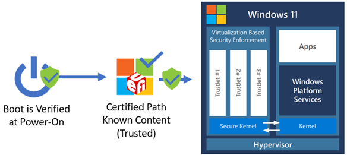
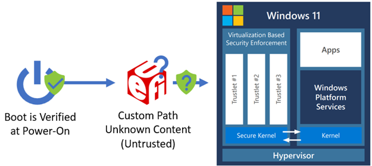
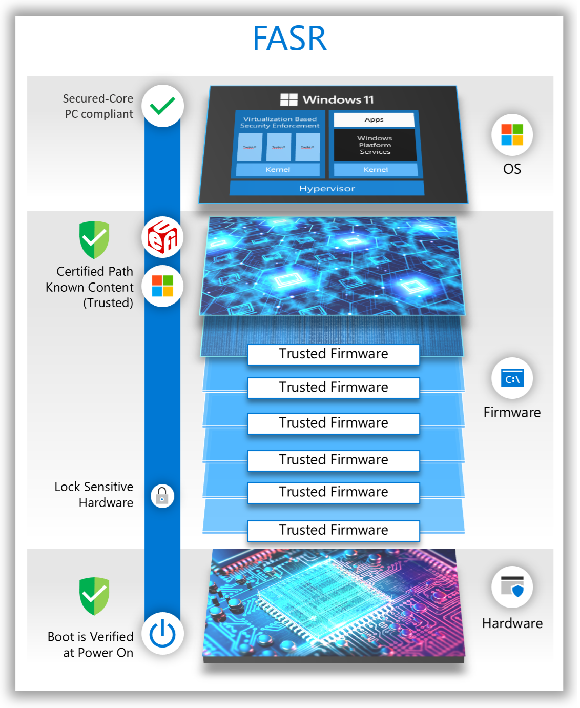
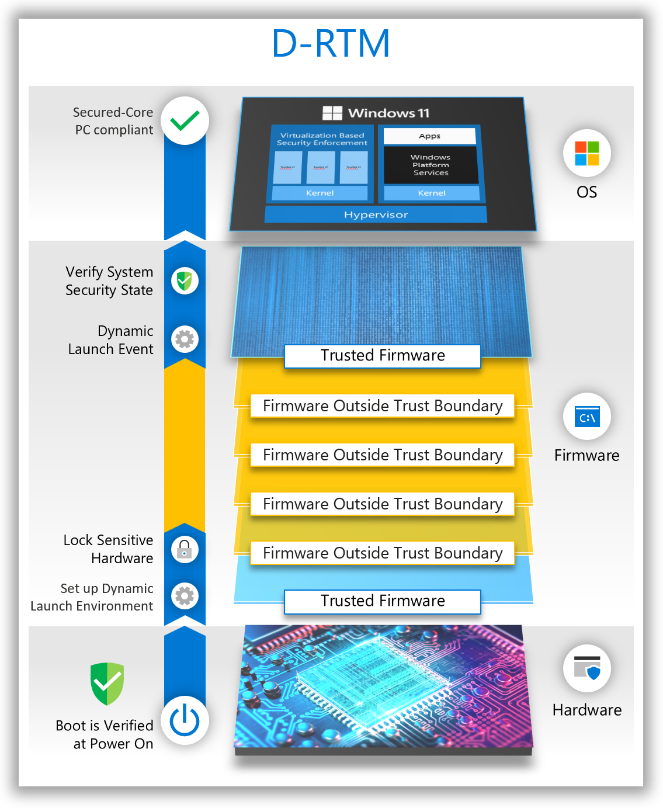
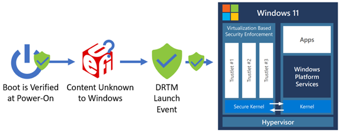
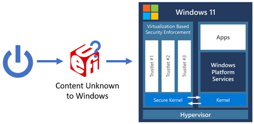
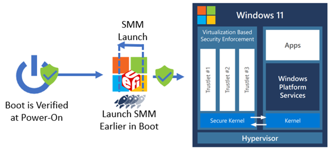

# Firmware Attack Surface Reduction (FASR)

In October 2019, Microsoft worked closely with our OEM and Silicon partners to launch Secured-core PCs. These devices feature deeply integrated hardware, firmware, and software to help ensure enhanced security for the devices, identity, and data. One of the core security pillars of Secured-core PCs is to help offer firmware protection for devices. A fundamental hardware-based feature required to satisfy this pillar is [Dynamic Root of Trust for Measurement (D-RTM).](https://www.microsoft.com/security/blog/2020/09/01/force-firmware-code-to-be-measured-and-attested-by-secure-launch-on-windows-10/) However, there are not many devices that offer D-RTM today due to the dependency on the underlying chipset to support this capability, which impedes our commitment to help raise and uphold a high security bar for all Windows devices.

More can be done to enhance the security posture of all Windows devices, including those without D-RTM. To help close this gap, Microsoft has started working with partners to overcome the compatibility issues that have prevented memory protections from being applied in UEFI firmware by developing a set of open-sourced SMM security enhancements to provide additional flexibility for OEMs to leverage.

To reflect this commitment to firmware security, we have identified a new approach to ensure that devices can meet the firmware protection requirements of Secured-core PCs.

## FASR Overview

For Secured-core PCs that lack hardware-based D-RTM capabilities, we must define a small set of firmware components that present a reduced attack surface and can be attested to in the operating system. This approach is called **Firmware Attack Surface Reduction (FASR)**. For FASR-based firmware to scale across PCs from different vendors, a new approach to the firmware boot process had to be defined.

FASR supports two boot paths:

1. **Certified boot path:**

    - Only code trusted, signed, and integrated by Microsoft is allowed to execute.

    - Tampering of the boot path is detectable by the operating system.

    The figure below shows the FASR S-RTM boot flow on the certified boot path. This boot path does helps prevent unexpected platform firmware code from executing. However, it does make use of some platform-specific data provided by the custom boot path. The following diagram shows FASR boot flow on certified boot path.

    

2. **Custom boot path:** All platform firmware code can execute. Boot-critical information specific to a particular OEM/platform is converted into data on the custom boot path and used by the certified boot path to configure the system properly on that boot path. The following diagram shows the FASR boot flow on custom boot path.

    

    A FASR device enabled for Secured-core PC compliance, defaults to the certified boot path unless an event has occurred that causes the boot to switch to the custom boot path early in the firmware boot process. Examples of such events include a firmware update, the user requested a firmware UI, or the user has chosen to disable Secured-core PC meaning they will always boot on the custom boot path until it is reenabled.

    Note that the custom boot can be used to boot any operating system or third-party software as supported by the platform firmware on a FASR capable device, but Windows will not recognize the boot on the custom boot path as Secured-core PC compliant.

To better understand the security technologies behind FASR, we would like to share a quick overview of the Windows boot process.

## Windows boot process

### Root of trust

The initial firmware execution in a modern PC follows a boot process where an initial set of code loads other code, and the level of functionality expands as the boot progresses. Each set of code verifies the next set of code forming a chain of trust. When UEFI firmware gains control, it follows the [Secure Boot](/windows/security/trusted-boot#secure-boot) standard of verifying software signatures to continue the chain of trust all the way to the operating system. Then, the Windows boot loader continues the chain of trust with [Trusted Boot](/windows/security/trusted-boot#trusted-boot), which verifies every other OS component in the startup process before it is loaded.

In general, attackers seek to gain control as early as possible in the boot process before security features and locks that help protect the system are enabled. When the system is brought out of reset, the initial set of code executed must be anchored in trust. The hardware verification technology that fulfills the role to perform this early code verification is called the **root of trust**. While the exact details vary by hardware vendor, all roots of trust are typically rooted in immutable hardware or ROMs in the SOC.

### Measured Boot

Secure Boot anchored in a root of trust helps ensures that the digital signature of all the firmware is verified; however, it is also desirable to have a record of exactly what firmware executed. The Windows Hardware Compatibility Program requires that all Windows 10 and Windows 11 PCs include a chip called the Trusted Platform Module (TPM). The TPM contains memory locations called Platform Configuration Registers (PCRs). Each PCR contains the hash for a type of code and/or data loaded during the boot such as firmware code on the non-volatile storage device (for example, SPI flash), option ROMs from PCI devices, or the OS boot loader. The size of a value that can be stored in a PCR is determined by the digest size of the hashing algorithm supported. For example, a SHA-1 PCR can store 20 bytes while a SHA-2 PCR can store 32 bytes. Multiple PCRs associated with the same hashing algorithm are called a bank. The [TCG PC Client TPM Profile Specification](https://trustedcomputinggroup.org/resource/pc-client-platform-tpm-profile-ptp-specification/) defines the inclusion of at least one PCR bank with 24 registers.

With a TPM present, each firmware component can also update or extend the appropriate PCR as new code and data is loaded in the boot process. The extend process updates the PCR value to be the output from the hash algorithm using the current PCR value concatenated with the new code or data argument as input. The result is that PCRs can be inspected after the boot process to determine what executed. This allows software in the operating system to understand if the boot process was different than previous boots. In a security sensitive environment, the operating system can be informed of the exact set of code measurements expected in certain PCRs to detect the execution of unexpected firmware code. Since the first 16 PCRs in a bank can only be reset by resetting the entire TPM, they are trusted, and the preferred location for storing important measurements in the TPM.

### Root of Trust for Measurement

Now that we have examined the role of a root of trust and how Measured Boot is used, we will look at two common approaches to establishing a root of trust for reporting a measurement chain to the TPM: static and dynamic.

A Static Root of Trust for Measurement (S-RTM) establishes trust at system reset and requires that trust be maintained throughout the entire boot process. If trust is compromised at any point in the boot process, it is irrecoverable until system reset. The following diagram illustrates how S-RTM is used on the certified boot path.

In contrast, Dynamic Root of Trust for Measurement (D-RTM) only trusts a small portion of the early chipset initialization firmware code, as well as a hardware agent that is used to re-establish trust dynamically during the boot. The system can initially boot into untrusted firmware code but—shortly after launch—reverts to a trusted state by taking control of all CPUs and forcing them down a well-known and measured path. The following diagram provides an overview of a traditional D-RTM flow.

There is a tradeoff between S-RTM and D-RTM. S-RTM does not require special hardware capabilities but does require software to better account for the code that executed during the entire boot. D-RTM requires special hardware capabilities but allows software to launch into a trusted state dynamically during the lifetime of the system.

Windows Secured-core PCs have used a D-RTM in Secure Launch to allow flexibility for the broad set of system manufacturers to implement unique features and experiences in the firmware while also helping ensure the system can reach a trusted and measured state that is acceptable to host a secure operating system environment. A D-RTM launch event is used to reestablish trust from an unknown environment before loading a secure kernel. The following diagram shows the D-RTM launch event to re-establish a known system environment.

In the past, S-RTM could be implemented in more devices due to its lack of dependency on special hardware capabilities to verify the security state of the system, but the operating system did not have a reliable method to confirm it could trust the measurements reported on any given Windows device using S-RTM.

## Firmware security enhancements

### Minimize the firmware components in the OS boot path

One way to trust S-RTM measurements is to reduce the firmware components allowed to execute to a minimal set. If all devices using S-RTM used the same set of firmware components, the operating system would only need to trust a single set of expected PCR values for those known and trusted components. With this SRTM-based approach, a device can be considered to have met the firmware protection requirement of Secured-core PCs when the set of boot firmware is verified to only contain Microsoft signed software that can be attested to by Windows. To better understand how these firmware components differ to those in a normal PC boot, let's examine the boot process before and after.

Due to the flexibility and the rich set of features offered by modern PC firmware, the code that executes prior to the operating system results in an increased attack surface. The following diagram shows an example of a traditional S-RTM boot flow.

The main responsibilities of firmware during boot can be greatly simplified to:

- Platform-specific: Functionality that only applies to the specific platform hardware design.

- Non-platform-specific: Functionality that is industry standard and common to other hardware.

A relatively small subset of modern firmware is typically platform specific. Much of the firmware infrastructure code that performs common tasks such as allocating memory, dispatching firmware drivers, handling events, and so on is the same between all (or most) UEFI-based systems. The firmware binary drivers for these tasks can be reused across PCs. In addition, industry standard hardware specifications and interfaces enable common firmware drivers to initialize hard disks, USB controllers, and other peripherals. The firmware binary drivers for this hardware can also be reused across PCs. In summary, PCs can be booted with a very minimal set of common firmware drivers.

Reducing the total set of firmware drivers loaded during boot can lead to other advantages:

- Improved boot time

- Lessened vendor coordination for updates

- Reduced bug exposure

- Reduced attack surface

### FASR boot path verification and Secured-core compliance

For a FASR system to meet the firmware protection requirements of Secured-core PCs, it must have booted on the certified boot path. FASR firmware facilitates this by providing the operating system with a Microsoft-signed manifest called the FASR manifest (measured into the TPM) that contains the expected PCR values for the module boot sequence on the certified path. This can be compared against the actual boot sequence that occurred on the certified path. If these measurements match, the system is considered to have met the firmware protection requirement of the Secured-core PC program. Any deviation from the expected certified boot path sequence will result in unexpected measurements being made into the Platform Configuration Registers (PCRs) of the TPM that the operating system will detect.

In addition, Windows will only release hypervisor-protected secrets upon successful validation of the signed FASR manifest against the measurements recorded during the current boot. If on a certified boot path or capsule update, the FASR manifest is not present, signature verification fails or a PCR mismatch occurs, and the VSM secrets will not be unsealed or migrated.

### How FASR firmware addresses memory protections and SMM

Now that a single Microsoft signed binary with a minimal set of functionalities has been defined, it can include the fundamental but missing firmware security protections Microsoft is working with partners to bring to market. The certified boot path must at a minimum meet the following requirements:

1. Code does not read/write to NULL/Page 0

1. Image code and data sections are separated

1. Image sections are aligned on a page (4KB) boundary

1. Data is only allocated into data memory types and code into code memory types

1. Code images are not loaded from code distributed as UEFI binaries (only the designated dispatchers)

1. Code stays within the boundaries of allocated memory buffers with guard pages around page allocations

1. Stack overflow can be detected

1. Code does not execute from the stack

1. The /NXCOMPAT DLL characteristic is set to enable NX protections

Third party option ROMs, UEFI applications, and UEFI drivers have often not been built or validated against this set of requirements. Therefore, they would not execute on the certified boot path. The custom boot path can optionally choose to lower the level of protections required, but that boot path is not considered Secured-core PC compliant by the operating system.

#### System Management Mode (SMM)

SMM is a special processor operating mode in x86 architecture. It presents a unique challenge to system security as the code executed in the SMM environment is opaque to the operating system and typically executes at the highest privilege level (sometimes referred to as "Ring -2") of any software on the host processor. Upon entry, SMM configures its own environment by setting up the page table, interrupt dispatch table (IDT), and other system structures. Consequently, SMM represents a significant attack surface that could be leveraged by malicious code to compromise or circumvent the OS protections enabled through Virtualization-based Security (VBS). To help mitigate the danger posed by SMM, the functionality in SMM can be conceptually split into the SMM core infrastructure and SMM drivers as follows:

- SMM core: Code that is common to all SMM implementations performing architectural and infrastructure responsibilities

- SMM drivers: Code that is written to accomplish a platform-specific task in SMM

Some key moments in the SMM lifecycle are the following:

1. When the SMM foundation (or core) is established – the SMM Initial Program Load (IPL)

1. When SMM drivers are loaded – called SMM driver dispatch

1. When entry to SMM occurs – through a System Management Interrupt (SMI)

##### The SMM Initial Program Load (IPL)

The CPU has special features that grant SMM code its high privilege and help protect it. For example, a mechanism is defined to enter SMM via software or hardware events, a CPU instruction is used to return from SMM, and several registers are defined to control access and lock configuration of SMM. Many of these control registers are configured by the SMM IPL code to restrict access to the area of memory where SMM code and data is stored (called System Management RAM or SMRAM).

Since the SMRAM area is in main memory (DRAM), it cannot be established until DRAM is enabled during boot. DRAM enabling procedures vary per silicon vendor but quite a few megabytes of code can run directly from the CPU LLC cache (including the code that initializes DRAM) before main memory is available.

FASR firmware brings the SMM IPL point earlier in boot than most other systems. This reduces the opportunity an attacker has to undermine this process and take control of the system before SMM is set up. To better understand this and other improvements made to SMM in FASR firmware we need to learn more about the firmware boot process.

##### Platform Initialization (PI) Boot in UEFI Firmware

Modern PC firmware is built around many specifications. The UEFI Specification defines the interface between a UEFI compliant operating system like Windows and the firmware on the device. Another specification called the Platform Initialization (PI) Specification defines the way firmware drivers are built and details the boot process itself. At a high-level, the UEFI Specification can be thought of as one of the standardizations that allows a single Windows image to work with so many different devices, and the PI Specification can be thought of as one of the standardizations that allows so many firmware images from different hardware vendors to work together. Both specs are maintained by the UEFI Forum.

The PI Specification defines boot phases and which drivers are written to the boot phases. During firmware boot, each phase hands off to the next and, in most cases, the drivers from the phase handing off are no longer used and only important data is passed to the next phase so it can continue the boot process. The boot phases can be summarized as follows:

1. SEC – Get control at the CPU reset vector and transition from assembly to C code to load PEI

1. PEI – Initialize the system state to load DXE and initialize DRAM

1. DXE – Perform remaining system initialization, which includes providing the support BDS needs to load an operating system

1. BDS – Discover the boot option for the current boot (e.g., OS boot loader) and attempt to boot that option

1. OS – The operating system kernel

##### Protecting the SMM Initial Program Load (IPL)

Traditional UEFI PI-specification compliant firmware loads the SMM IPL in the DXE boot phase. FASR firmware loads the SMM IPL in the PEI boot phase. The Trusted Computing Base (TCB) for a system is the total set of protection mechanisms that protect it, including hardware, firmware, and software. By moving the SMM IPL from DXE to PEI, the entire DXE phase (which is a much larger and richer environment than PEI) is removed from the TCB. The following diagram shows the SMM IPL moved earlier in UEFI boot process.

The PEI and DXE code execute at ring 0 and do not persist (with few exceptions) into the operating system. SMM code executes at a much higher privilege than ring 0 (and the hypervisor) and persists into the operating system, so not allowing a DXE vulnerability to impact the establishment of SMM reduces the overall system attack surface. In addition, because SMM is launched earlier in the boot process, the lock bits set to help protect SMM can be enabled earlier in boot, further minimizing an attacker's window to compromise SMM.

##### Protecting the SMM driver dispatch process

Within the PI Specification, two SMM modes are defined: Traditional MM, and Standalone MM. Traditional MM is equivalent to the SMM software model historically used in PI-compliant firmware, which constitutes the majority of UEFI firmware in the industry. Standalone MM is a relatively new mode that revises the historical model to improve security of the SMM environment and prevent common mistakes made in Traditional MM implementations that led to numerous portability and security challenges over the years.

FASR firmware operates exclusively in Standalone MM mode. This allows the FASR firmware to follow a disciplined approach to software execution in SMM. So many SMM-based vulnerabilities today are due to bad practices allowed in SMM code in Traditional MM that can simply be removed in Standalone MM. At a high-level, this happens because—in the Traditional MM model—an SMM driver is dispatched twice, once by the DXE dispatcher in ring 0, and again by the SMM dispatcher in SMM. This affords ample opportunity for the driver code executed in the DXE environment to cache pointers to resources outside SMRAM that they should not access after the entry point returns. Attacks that depend on SMM code to call code outside SMM are often referred to as "SMM callout attacks".

##### Protecting entry to SMM

Data is passed to a SMI handler through a structure called the "communicate buffer". The SMI handler is responsible for validating whether the data meets certain requirements in its entry point. The [Windows SMM Security Mitigation Table (WSMT)](/windows-hardware/design/device-experiences/oem-uefi-wsmt) is one mechanism used to help mitigate the threat unchecked SMI handlers pose to Virtualization-based Security in the operating system. Microsoft has contributed code to the TianoCore project to improve communicate buffer validation. In addition to leveraging these two techniques, FASR code also implements strict memory access protections, allowing SMM code to only access explicitly allowed memory ranges.

#### Management Mode Supervisor (MM Supervisor)

The SMM core code is common and shared with minimal to no change between systems. The attack surface imposed by SMM can be greatly reduced by introducing privilege separation to the SMM environment. For that reason, FASR firmware includes a SMM Supervisor that executes in Standalone MM. This results in a well-defined SMM environment with a minimal TCB that has privilege levels enforced from creation. The MM Supervisor places restrictions on IO port accesses, Model Specific Register (MSR) accesses, MMIO access, CPU save state access, and allowed instructions in the SMM environment. A SMM Supervisor Policy is used to configure the exact details of what hardware resources to restrict, and those exact details are subject to change per silicon generation.

The policy has recently transitioned to a deny-by-default approach that significantly reduces the hardware resources available to code outside the SMM Supervisor. This supervisor operates without a hardware dependency on any hardware capabilities not commonly found in modern PCs.

The MM Supervisor is used in FASR is open-source and available in the [Project Mu MM Supervisor Repository](https://github.com/microsoft/mu_feature_mm_supv).

## FASR system compliance with Secured-core PC requirements

The following table indicates the broad security pillars or goals of Secured-core PCs, and how FASR systems booting up in the certified path can achieve the requirements of Secured-core PCs:

| Security Benefits | Security features in Secured-core PCs |
|--|--|
| Create a hardware-backed root of trust | Secure Boot |
|  | Trusted Platform Module 2.0 |
|  | Direct Memory Access (DMA) Protection |
| Defend against firmware level attacks (see note below) | System Guard Secure Launch (D-RTM) or S-RTM (FASR FW) |
|  | System Management Mode (SMM) Isolation or Standalone MM with MM Supervisor (FASR FW) |
| Protect the OS from execution of unverified code | Memory Integrity (also known as HVCI) |
| Provide advanced identity verification and protection | Windows Hello |
| Protect critical data in case of lost or stolen devices | BitLocker encryption |

> [!NOTE]
> If the system does not have advanced security capabilities to support D-RTM, the firmware protection requirements can be met using a combination of S-RTM and Standalone MM with MM Supervisor, both of which are offered by the FASR firmware.

## Summary

These are some of the investments that Microsoft has made to address the growing number of firmware attacks that are prevalent across the industry today. By using open-sourced code for these changes, we are empowering our partners to leverage some of these security benefits which will, in turn, benefit the broader ecosystem and industry at large.

The primary goal of the Secured-core PC initiative is to help ensure that customers have access to some of the most advanced security capabilities available for Windows PCs. With some of these firmware changes, we're one step closer towards realizing that goal, and have updated the firmware protection requirements of Secured-core PCs to reflect this inclusion. Learn more about Secured-core PCs [here](https://www.microsoft.com/windows/business/windows-11-secured-core-computers#:~:text=Secured-core%20PCs%20are%20the%20most%20secure%20Windows%2010,with%20integrated%20hardware%2C%20firmware%2C%20software%2C%20and%20identity%20protection).
