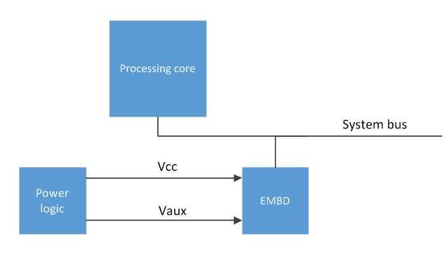
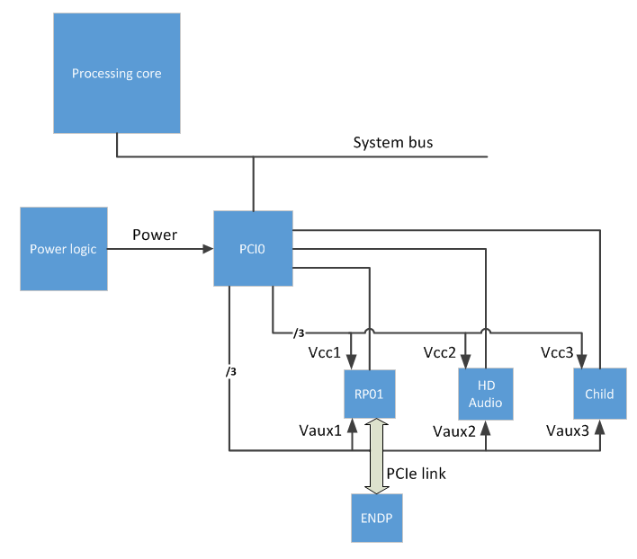

# Firmware requirements for D3cold


Starting with Windows 8, devices can enter the D3cold power sub-state even when the system stays in the S0 power state. This topic describes the firmware requirements for implementing D3cold support for an embedded device. The following discussion is intended to help firmware developers to enable their embedded devices to reliably enter and exit D3cold.

In addition, device driver requirements for supporting D3cold are briefly discussed. For more information about device driver support for D3cold, see [Supporting D3cold in a Driver](https://msdn.microsoft.com/library/windows/hardware/hh967717).

## Introduction


[Device power states](https://msdn.microsoft.com/library/windows/hardware/ff543162) are defined in the ACPI specification, and in various bus specifications. The PCI bus specification has, since it introduced PCI power management, split the D3 (off) device power state into two sub-states, D3hot and D3cold. This distinction was added to the ACPI specification in ACPI 3.0 and extended in ACPI 4.0. Windows has always supported both D3 sub-states, but Windows 7 and earlier versions of Windows support the D3cold sub-state only when the entire machine exits the S0 (working) system power state to enter a sleep or hibernation state—usually S3 or S4. Starting with Windows 8, device drivers can enable their devices to enter the D3cold state even while the system stays in S0.

D3hot, which is often just called "D3", is the device's "soft-off" state. In this state, the device can be detected by a bus scan, and commands sent to the device can cause it to power on again. In D3cold, all power sources are removed, with the possible exception of a small amount of power to drive the device's wake logic. For example, for PCI Express (PCIe) devices, the main device power source, Vcc, is frequently turned off in a transition to D3cold. Turning off Vcc can reduce power consumption and extend the time that a mobile hardware platform can run on a battery charge. When a device is in D3cold, it cannot be detected by a bus scan and cannot receive commands. Restoring Vcc power moves the device to an uninitialized state, which is usually equivalent to the D0 state. Software must then re-initialize the device to put it into the working state.

Putting a device in D3cold does not necessarily mean that all sources of power to the device have been removed—it means only that the main power source, Vcc, is removed. The auxiliary power source, Vaux, might also be removed if it is not required for the wake logic. However, a device that might be required to signal a wake event to the processor must be able to draw enough power to operate the wake logic. For example, an Ethernet network interface card (NIC) whose main power source is removed might draw sufficient power from the Ethernet cable. Or, the standby power to a Wi-Fi NIC might be supplied from a source outside the PCIe interface, in which case the PCIe interface can be completely turned off.

In the following discussion, a set of requirements is described for enabling device power state transitions to D3cold. These requirements fall into the following two categories:

-   Firmware and platform requirements
-   Device driver requirements

The first of these two categories is the main focus of this discussion. A brief overview of the second category is presented. For more information about device driver requirements, see [Supporting D3cold in a Driver](https://msdn.microsoft.com/library/windows/hardware/hh967717).

## Firmware and platform requirements


In the following discussion, the firmware and platform requirements for enabling D3cold are presented for these two cases:

-   When the device is enumerated in ACPI.
-   When the device is enumerated by its parent bus.

Most of the following discussion is specific to PCIe. However, the general principles described here largely apply to other buses as well.

Abstracting some details, the transition from D3cold to D0 is triggered by re-applying Vcc power to the embedded device. Re-applying power effectively restores the device's connection to the bus. Windows reads the device's identifiers in order to distinguish between the following two cases:

-   A device was removed and replaced by another device.
-   The same device was removed and then reinserted.

If the identifiers match, the device driver reinitializes the device. If the identifiers don't match, Windows unloads the device driver and builds a new driver stack for the new device. PCIe, for example, queries for the vendor ID, the device ID, and the subsystem IDs (which are broken into sub-device and sub-vendor IDs in some versions of the specification). These identifiers must match those of the previously attached device after power is re-applied (and the bus-specified waiting period elapses); otherwise, Windows will consider the new device to be different from the previous one.

### Case 1: An embedded device is enumerated in ACPI

If an embedded device is not discoverable through mechanisms defined by a bus specification such as PCIe or USB, but the device is permanently connected (or at least the connection is dedicated to a known device), this device can be described in the platform firmware by ACPI \_HID and/or \_CID objects. These objects enable the device to be enumerated by OSPM. ("OSPM" is a term defined in the ACPI specification. It means, loosely, "software that isn't firmware.") OSPM enumerates a device only when no bus enumerator can detect the device ID. For example, devices on an ISA bus are enumerated by OSPM. In addition, devices on a System on a Chip (SoC) are often enumerated by ACPI because they are on non-enumerable fabric. Examples of such devices include USB and SD host controllers.

**Platform firmware**

OSPM uses \\\_SB.\_OSC to convey platform-wide OSPM capabilities to the platform firmware. The platform firmware must set bit 2 in the \\\_SB.\_OSC return value to indicate to OSPM that the device supports \_PR3. For more information, see section 6.2.10.2, "Platform-Wide OSPM Capabilities", in the ACPI 5.0 specification.

**Embedded device – discovered solely through ACPI**

To support D3cold, the platform firmware should implement the following ACPI power resource objects for the embedded device:

-   \_PR0: This object evaluates to the device's power requirements in the D0 (fully on) device power state. The return value is the list of power resources that the device requires in the D0 state.
-   \_PR2: This object evaluates to the device's power requirements in the D2 device power state. The return value is the list of power resources that the device requires in the D2 state. Note that for historical reasons, Windows expects \_PR2 to be present whenever \_PR0 is present. If D2 is implemented in the hardware, \_PR2 lists the power resources needed for D2. If D2 is not implemented, \_PR2 lists the same resources as \_PR0.
-   \_PR3: This object evaluates to the device's power requirements in the D3hot device power state. The return value is the list of power resources that the device requires in the D3hot state.
-   For each power resource identified in any \_PRx object, the following control methods must be implemented:

    -   \_OFF: Set the power resource to the *off* state (power off the resource).
    -   \_ON: Set the power resource to the *on* state (power on the resource).
    -   \_STA: This object evaluates to the current *on* or *off* state of the power resource (0: off, 1: on).

A transition to D3cold happens when ACPI runs the \_OFF control method on the power resources listed in \_PR3. Note that if the device function driver indicates support for D3cold, this support does not imply that all transitions to D3 result in swift transitions to D3cold. It is possible that the device enters and stays in D3hot for an extended period and then either returns to D0 without ever entering D3cold, or enters D3cold at a later time.

**Parent device**

There is no requirement for a parent device to be capable of being power-managed. However, if a parent device is power-managed, Windows never powers down this device if any of its children (dependent devices) are not in D3.

**Example**

The following block diagram shows an embedded device (labeled **EMBD**) on a system bus. The main power (**Vcc**) and auxiliary power (**Vaux**) to the device can be independently turned on and off through the block labeled **Power logic**.



The following ASL code example describes the power resources used by the embedded device in the previous diagram. This example starts with a declaration of an \_OSC control method that describes the capabilities of the device driver. Next, the device's two power resources are declared—the resource names PVCC and PVAX are assigned to the device's main and auxiliary power sources, **Vcc** and **Vaux**. Finally, the power resource requirements are listed for each device power state that the device supports, and the device's wake capabilities are described.

```asl
Scope (\_SB)
{
     Method(_OSC, 4, NotSerialized) // Platform-wide Capabilities Check.
     {  
          ... // This must indicate support for _PR3.
     }

     PowerResource(PVCC,0,0) // Power resource representing the main power for the device.
                             // Required for the device to be fully functional (D0).
     {
          Name(_STA,VAR1)        // Return the state of the power resource.
          Method(_ON,0x0) {...}  // Turn on the power resource and set VAR1 to 1.
          Method(_OFF,0x0) {...} // Turn off the power resource and set VAR1 to 0.
     }

     PowerResource(PVAX,0,0) // Power resource representing the auxiliary power for the device.
                             // Required for low-power, less-functional states (e.g., D3hot).
     {
          Name(_STA,VAR2)
          Method(_ON,0x0) {...}
          Method(_OFF,0x0) {...}
     }

     Device(EMBD) // An ACPI-enumerated device on the processor bus that supports D3Cold
     {
               Name(_HID, ...)
               ... // Other (non-power) objects for this device

          // Indicate support for D0.
               Name(_PR0, Package() {PVCC, PVAX}) // Power resources required for D0

          // Indicate support for D1 (optional)...

          // Indicate support for D2.
               Name(_PR2, Package() {PVCC, PVAX}) // If D2 is implemented in the hardware,
                                                  //  list the power resources needed by D2.
                                                  // If D2 is not implemented, list the same
                                                  //  resources as _PR3.

          // Indicate support for D3Cold.
               Name(_PR3, Package() {PVCC, PVAX}) // Power resource for D3. These will be 
                                                  //  turned off ONLY if drivers opt-in to D3cold.
 
          // Indicate support for wake. Required for entry into D3cold, even if the device doesn't
          // need or have a wake mechanism.
               Name(_S0W, 4) // The existence of this object indicates that the platform is
                             //  capable of handling wake events from this device while in S0. 
                             // The value of this object indicates the lowest D-state this device
                             //  can be in to trigger wake events that can be handled while the
                             //  platform is in S0.

          // Enable wake events (optional) 
          //  If this device actually does generate wake events, there must be a way for OSPM to
          //  enable and disable them. The mechanism for this depends on the platform hardware:
               /*
               Name(_PRW, ...) // If the event is signaled via a GPE bit (SCI) OR
                               //  if there are power resources required only for wake.
               Name(_CRS, ...) // If the event is signaled via a wake-capable interrupt.
                
               Method(_DSW, 3) {...) // Can be used with either of the above, if wake enablement
                                     // varies depending on the target S-state and D-state.
               */
     }  // End of Device EMBD
} End Scope \_SB
```

### Case 2: An embedded device is bus-enumerated

If the embedded device conforms to a common bus specification, such as PCIe or USB, this device is discoverable through bus-defined mechanisms, and power can be supplied partially or wholly through the bus. If this device is not powered by other sideband power resources, the device's main power source is the link that connects the device to the parent bus controller. Bus-enumerated devices can be identified by the \_ADR object in the embedded device's definition. An \_ADR object is used to supply OSPM with the address of a device on the embedded device's parent bus. This address is used to tie the bus's representation of the device (as seen by the bus hardware) to the platform's representation of the device (as seen by ACPI firmware). (The \_ADR address encoding is bus-specific. For more information, see section 6.1.1, "\_ADR (Address)", in the ACPI 5.0 specification.) When this mechanism is employed, D3cold support must be coordinated with the parent bus driver.

If the main power source for an embedded device is the link that connects this device to its parent bus, the key requirement for placing the device in D3cold is to power down the link. For more information about the transition to D3cold, see the state graph in [Device Power States](https://msdn.microsoft.com/library/windows/hardware/ff543162).

**Platform firmware**

OSPM uses \\\_SB.\_OSC to convey platform-wide OSPM capabilities to the platform firmware. The platform firmware must set bit 2 in the \\\_SB.\_OSC return value to indicate to OSPM that the device supports \_PR3. For more information, see section 6.2.10.2, "Platform-Wide OSPM Capabilities", in the ACPI 5.0 specification.

**Embedded device**

No D3cold-specific ACPI changes are required. In this case, as long as the device driver and platform have indicated support for D3cold, the bus link that supplies power to the embedded device can be turned off when the parent bus exits D0 and enters a low-power state Dx. The transition of the embedded device from D3hot to D3cold occurs when power is removed from the link. The Dx state that the parent bus enters can be any state that will cause the link power source to be turned off.

**Parent device**

The ACPI descriptor for the parent bus must do the following:

-   Implement \_S0W(Dx). This object specifies Dx as the lowest-power D-state from which the child (embedded) device can wake when the system is in the S0 state.

-   Define power resources to represent the link that connects the child (embedded) device to the parent bus. In addition, \_ON, \_OFF, and \_STA objects should be defined for this power resource. The ASL code example that follows this list describes the link power as two resources, PVC1 and PVX1. For each of these resources, \_ON, \_OFF, and \_STA objects are defined.

-   If "Dx" (the lowest-power D-state; see the first list item) is D3cold, provide a \_PR3 object that includes the power resources that the child (embedded) device requires for D3hot (for example, Vcc and Vaux). If the same power sources are required for D0, D2, and D3hot, then \_PR0, \_PR2, and \_PR3 all specify the same power resources. These resources are turned off only when the child device enters D3cold.

    For historical reasons, Windows expects \_PR2 to be present whenever \_PR0 is present. If D2 is implemented in the hardware, \_PR2 lists the power resources needed for D2. If D2 is not implemented, \_PR2 lists the same resources as \_PR0.

-   Implement \_PR0. The list of resources in the \_PR0 object for the parent bus should include the resources that power the link that connects the parent bus to the child (embedded) device.

**Example**

The example hardware configuration in the following block diagram shows two different ways D3cold can be enabled for PCIe devices. First, an endpoint (labeled **ENDP**) is connected to a PCIe root port (**RP01**) and receives auxiliary power from its parent device through a **PCIe link**. Second, the **HD Audio** device in the diagram has no standard link to its parent device (the PCI controller labeled **PCI0**) and is therefore modeled similarly to the ACPI-enumerated case.



The **RP01** device in this diagram has a main power source, **Vcc1**, and an auxiliary power source, **Vaux1**. Similarly, the **HD Audio** device has a main power source, **Vcc2**, and an auxiliary power source, **Vaux2**.

The following ASL code describes the parent bus controller (**PCI0**) and the power resources required for the **ENDP** and **HD Audio** devices shown in the preceding diagram.

```asl
Scope (\_SB)
{
     Method(_OSC, 4, NotSerialized) // Platform-wide Capabilities Check.
     {  
          ... // This must indicate support for _PR3.
     }

     PowerResource(PVC1,0,0) // Power resource representing Vcc1 for the RP01 device.
                             // Required for the device(s) to be fully functional (D0).
     {
          Name(_STA,VAR0)
          Method(_ON,0x0) {...}
          Method(_OFF,0x0) {...}
     }

     PowerResource(PVX1,0,0) // Power resource representing Vaux1 for the RP01 device.
                             // Required for low-power, less-functional states (e.g., D3hot).
     {
          Name(_STA,VAR1)
          Method(_ON,0x0) {...}
          Method(_OFF,0x0) {...}
     }

     PowerResource(PVC2,0,0) // Power resource representing Vcc2 for the HD device.
                             // Required for the device(s) to be fully functional (D0).
     {
          Name(_STA,VAR2)
          Method(_ON,0x0) {...}
          Method(_OFF,0x0) {...}
     }

     PowerResource(PVX2,0,0) // Power resource representing Vaux2 for the HD device.
                             // Required for low-power, less-functional states (e.g., D3hot).
     {
          Name(_STA,VAR3)
          Method(_ON,0x0) {...}
          Method(_OFF,0x0) {...}
     }

     ... // Power resources for other child devices

     Device(PCI0) // The PCI root complex
     {
          Name(_HID, EISAID("PNP0A08"))  // ACPI enumerated
          Method(_OSC, 4, NotSerialized) // PCIe-specific Capabilities Check.
          {     
               ... // This must support hand-off of PCIe control to the OS.
          }
          ... // Other (non-power) objects for this device

          Device(RP01) // PCIe Root Port 1
          {
                    Name(_ADR, "...") // Bus enumerated
                    ... // Other (non-power) objects for this device
    
               // Indicate support for D0.
                    Name(_PR0, Package() {PVC1, PVX1}) // Power resources required for D0.
                                                       // Includes the Link Power for ENDP.

               // Indicate support for D1 (optional)...

               // Indicate support for D2.
                    Name(_PR2, Package(){PVC1, PVX1}) 

               // Indicate support for wake. Required for entry into D3cold, even if the
               // device doesn't need or have a wake mechanism.
                    Name(_S0W, 4) // The existence of this object indicates the platform
                                  //  is capable of handling wake events from this device
                                  //  while the platform is in S0. 
                                  // The value of this object indicates the lowest D-state
                                  //  this device can be in to trigger wake events that 
                                  //  can be handled while the platform is in S0.

               // Enable wake events (optional) 
               //  If this device actually does generate wake events, there must be a way
               //  for OSPM to enable and disable them. The mechanism for this depends on
               //  the platform hardware:

                    /*
                    Name(_PRW, ...) // If the event is signaled via a GPE bit (SCI) OR
                                    //  if there are power resources required only for wake.
                    Name(_CRS, ...) // If the event is signaled via a wake-capable interrupt.

                    Method(_DSW, 3) {...) // Can be used with both of the above, if wake
                                          //  enablement varies depending on the target 
                                          //  S-state and D-state.
                    */

                    Device(ENDP) // This device supports D3cold. No power-related objects
                                 // are required.
                    {
                         Name(_ADR, "...")  // Bus enumerated
                         ... // Other (non-power) objects
                    }  // End of Device ENDP
          }  // End of Device RP01

          Device(HD) // A PCIe Bus0 device (HD Audio) that supports D3cold. Note that
                     //  this case is modeled similar to the ACPI-enumerated case
                     //  because device HD has no standard link to its parent.
          {
                    Name(_ADR, "...") // Bus enumerated
                    ... // Other (non-power) objects for this device
    
               // Indicate support for D0.
                    Name(_PR0, Package() {PVC2, PVX2}) // Power resources required for D0
                            
               // Indicate support for D1 (optional)...

               // Indicate support for D2.
                    Name(_PR2, Package(){PVC2, PVX2})

               // Indicate support for D3Cold.
                    Name(_PR3, Package() {PVC2, PVX2}) // Power resource for D3; These will
                                                       //  be turned off ONLY if drivers
                                                       //  opt-in to D3cold.
 
               // Indicate support for wake. Required for entry into D3cold, even if the
               // device doesn't need or have a wake mechanism.
                    Name(_S0W, 4) // The existence of this object indicates that the platform
                                  //  is capable of handling wake events from this device 
                                  //  while the platform is in S0. 
                                  // The value of this object indicates the lowest D-state
                                  //  this device can be in to trigger wake events that can
                                  //  be handled while the platform is in S0.

               // Enable wake events (optional). 
               //  If this device actually does generate wake events, there must be a way for
               //  OSPM to enable and disable them. The mechanism for this depends on the HW:
                    /*
                    Name(_PRW, ...) // If the event is signaled via a GPE bit (SCI) OR
                                    //  if there are power resources required only for wake.
                    Name(_CRS, ...) // If the event is signaled via a wake-capable interrupt.

                    Method(_DSW, 3) {...) // Can be used with both of the above, if wake
                                          //  enablement varies depending on the target
                                          //  S-state and D-state.
                    */
          }  // End Device HD

          ... // Device objects for other child devices

     }  // End Device PCI0
}  // End Scope \_SB
```

### Other possibilities

The techniques shown in the two previous examples can be combined to support configurations that use both bus power and sideband power.

## Device driver requirements


The power policy owner for a device (typically the function driver) tells the operating system whether to enable the device's transition from D3hot to D3cold. The driver can supply this information in the INF file that installs the device. Or, the driver can call the [*SetD3ColdSupport*](https://msdn.microsoft.com/library/windows/hardware/hh967716) routine at run time to dynamically enable or disable the device's transitions to D3cold. By enabling a device to enter D3cold, a driver guarantees the following behavior:

-   The device can tolerate a transition from D3hot to D3cold when the computer is to remain in S0.
-   The device will work properly when it returns to D0 from D3cold.

A device that fails to meet either requirement might, after entering D3cold, be unavailable until the computer is restarted or enters a sleeping state. If the device must be able to signal a wake event from any low-power Dx state that it enters, entry to D3cold must not be enabled unless the driver is certain that the device's wake signal will work in D3cold.

For more information, see [Supporting D3cold in a Driver](https://msdn.microsoft.com/library/windows/hardware/hh967717).

 

 


