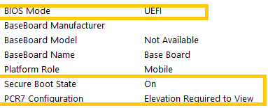

# Firmware Windows Engineering Guide (WEG)

The Firmware Windows Engineering Guide (WEG) provides a roadmap to follow through in implementing system firmware-related best practices.


## In this section

[UEFI security](uefi-security.md)
[Firmware update](firmware-update.md)
[SMBIOS](smbios.md)
[HTTPS](https-boot.md)
[Wi-Fi support in firmware](wi-fi-support-in-firmware.md)
[Switch from legacy MBR disk to GPT disk with Windows 10](switch-from-legacy-mbr-disk-to-gpt-disk-with-windows-10.md)
[Frequently asked questions](frequently-asked-questions.md)
[Configure system firmware for Windows 7 and later update for Windows 10](configure-system-firmware-for-windows-7-and-later-update-for-windows-10.md)
[Sample PowerShell script to query SMBIOS locally](sample-powershell-script-to-query-smbios-locally.md)

                                           


                                           
### Recommended Firmware User Experience (UX) best practices


A firmware update to a system can be important to the continued use of that machine. Microsoft wants to ensure that Firmware updates are safely delivered, and installation is uninterrupted. To do this, we have recommended the following guidelines that are described in greater detail in the related resources section.

1.  Progress bar / indicator that the system is installing an update.

2.  Windows Boot loader with UpdateCapsule will provide bitmap containing message for user.

3.  UEFI check for AC Power, or sufficient battery life (RSOC) or fail out with error codes recorded in ESRT

The Links directly below will be updated with the most recent information pertinent to Firmware UX guidance.

## Related resources

| [Windows UEFI firmware update platform](https://msdn.microsoft.com/en-us/windows/hardware/drivers/bringup/windows-uefi-firmware-update-platform)                                                               |
|----------------------------------------------------------------------------------------------------------------------------------------------------------------------------------------------------------------|
| [Seamless crisis prevention and recovery ](https://msdn.microsoft.com/en-us/library/windows/hardware/dn917851(v=vs.85).aspx)                                                                                   |
| [User experience for UEFI firmware updates](https://msdn.microsoft.com/en-us/windows/hardware/drivers/bringup/user-experience-for-uefi-firmware-updates)                                                       |
| [Boot screen components](https://msdn.microsoft.com/en-us/windows/hardware/drivers/bringup/boot-screen-components)                                                                                             |
| [ESRT table definition](https://msdn.microsoft.com/windows/hardware/drivers/bringup/esrt-table-definition)                                                                                                     |
| [Validating Windows UEFI Firmware Update Platform Functionality](https://msdn.microsoft.com/windows/hardware/commercialize/manufacture/desktop/validating-windows-uefi-firmware-update-platform-functionality) |

### Firmware Update Validation testing

Windows provides a mechanism to verify firmware update support going through device manager. Refer to the Related resources for more information.

## Related resources

| [Validating Windows UEFI Firmware Update Platform Functionality](https://msdn.microsoft.com/en-us/library/windows/hardware/dn972665(v=vs.85).aspx) |
|----------------------------------------------------------------------------------------------------------------------------------------------------|
| [Firmware Update test](https://msdn.microsoft.com/en-us/library/windows/hardware/jj124838(v=vs.85).aspx)                                           |
| [How to verify firmware update support](https://msdn.microsoft.com/en-us/library/windows/hardware/mt188596(v=vs.85).aspx)                          |
| [Test Distribution Drivers](https://msdn.microsoft.com/en-us/library/windows/hardware/mt149093(v=vs.85).aspx)                                      |

### SMBIOS


SMBIOS specification defines data structures and information that will go into the data structures pertinent to a system. By using the latest SMBIOS Specification, we keep up with the latest changes defined in the specification. There is a table below describing the recommended SMBIOS settings along with guidance on what type of information should be in these fields. Having these fields populated with data pertaining to each individual system allows system administrators the ability to remotely identify and manage these systems. Computer Hardware IDs (CHIDs) are generated using the values from this table, and care and thought should be given to setting these.

To add uniformity to SMBIOS to better identify device information, Microsoft recommends the following as guidance when populating SMBIOS fields. The below SMBIOS data is also collected and/or used in various capacities. The data going into these fields should be planned in detail before populating using tools provided by BIOS/Firmware vendors. The hash generated for CHID targeting is based off data populating these fields.

Though this table is similarly listed in the "Windows 10 Driver Publishing Workflow" document on MSDN, this document prescribes level of detail that should also go into some of the fields helping to increase the level of specificity.

### Table of recommended settings when moving to SMBIOS 3.0


| **Field Name**      | **Structure Named & Type**     | **Value** | **Offset** | **Length** | **Example Scenario**                                                                                                                                                                                                                                                                                                                                                                                                                                                                                                                                                                                                                                                                                                                                                                                                                                                                                                                                          | **Example**                                                                                                              |
|---------------------|--------------------------------|-----------|------------|------------|---------------------------------------------------------------------------------------------------------------------------------------------------------------------------------------------------------------------------------------------------------------------------------------------------------------------------------------------------------------------------------------------------------------------------------------------------------------------------------------------------------------------------------------------------------------------------------------------------------------------------------------------------------------------------------------------------------------------------------------------------------------------------------------------------------------------------------------------------------------------------------------------------------------------------------------------------------------|--------------------------------------------------------------------------------------------------------------------------|
| "Manufacturer"      | System Information (Type 1)    | String    | 04h        | 32         | Contoso, Inc. manufactures 2 product lines: 1) "A" series, and 2) "B" series. The "A" series of devices include the Contoso "A11" and "A13" device sub-brands, each of which have different screen sizes and both support physically detachable keyboards (though the keyboards are sold as an option). The "A11" has three models: 1) the base model (the a110001) 2) a midsize model with a premium audio package (the a110002) and 3) a high-end model with a higher resolution touch panel (the a110003). Each model has gone through several generations of baseboard revisions, which are identified internally with codes bb01 through bb04. Each of the "A11" models can be further customized with different storage and memory configurations. To separate different production runs on their manufacturing floor, Contoso uses an internal identification system that combines the Family, Product Name, market region, and production run number. | "Contoso"                                                                                                                |
| "Family"            | System Information (Type 1)    | String    | 1Ah        | 64         |                                                                                                                                                                                                                                                                                                                                                                                                                                                                                                                                                                                                                                                                                                                                                                                                                                                                                                                                                               | "A11"                                                                                                                    |
| "Product Name"      | System Information (Type 1)    | String    | 05h        | 64         |                                                                                                                                                                                                                                                                                                                                                                                                                                                                                                                                                                                                                                                                                                                                                                                                                                                                                                                                                               | "A11 a110001"                                                                                                            |
| "Baseboard Product" | Baseboard Information (Type 2) | String    | 05h        | 32         |                                                                                                                                                                                                                                                                                                                                                                                                                                                                                                                                                                                                                                                                                                                                                                                                                                                                                                                                                               | "bb03"                                                                                                                   |
| "SKU Number"        | System Information (Type 1)    | String    | 19h        | 32         |                                                                                                                                                                                                                                                                                                                                                                                                                                                                                                                                                                                                                                                                                                                                                                                                                                                                                                                                                               | "A11a11001-EU-04"                                                                                                        |
| "Serial Number"     | System Information (Type 1)    | String    | 07h        |            |                                                                                                                                                                                                                                                                                                                                                                                                                                                                                                                                                                                                                                                                                                                                                                                                                                                                                                                                                               | "A1B2C3456789ABC"                                                                                                        |
| "UUID"              | System Information (Type 1)    | Varies    | 08h        | 16 bytes   |                                                                                                                                                                                                                                                                                                                                                                                                                                                                                                                                                                                                                                                                                                                                                                                                                                                                                                                                                               | Universal unique ID number; see section 7.2.1. in [DMTF SMBIOS Spec](http://www.dmtf.org/standards/smbios) 3.1 or later. 
                                                                                                                                                                                                                                                                                                                                                                                                                                                                                                                                                                                                                                                                                                                                                                                                                                                                                                                                                                                                                                                                                                                                                                                        
                                                                                                                                                                                                                                                                                                                                                                                                                                                                                                                                                                                                                                                                                                                                                                                                                                                                                                                                                                                                                                                              "{00112233-4455-6677-8899-AABBCCDDEEFF}"                                                                                  |
| "Enclosure Type"    | System Enclosure               
                                                       
                       (Type 3)                        | Byte      | 05h        | n/a        |                                                                                                                                                                                                                                                                                                                                                                                                                                                                                                                                                                                                                                                                                                                                                                                                                                                                                                                                                               | "detachable"                                                                                                             |
| BIOS Vendor         | BIOS information               
                                                       
                       (Type 0)                        | Byte      | 04h        | String     |                                                                                                                                                                                                                                                                                                                                                                                                                                                                                                                                                                                                                                                                                                                                                                                                                                                                                                                                                               |                                                                                                                          |
| BIOS Version        | BIOS Information               
                                                       
                       (Type 0)                        | Byte      | 05h        | String     |                                                                                                                                                                                                                                                                                                                                                                                                                                                                                                                                                                                                                                                                                                                                                                                                                                                                                                                                                               |                                                                                                                          |
| BIOS Major Release  | BIOS Information               
                                                       
                       (Type 0)                        | Byte      | 14h        | Varies     |                                                                                                                                                                                                                                                                                                                                                                                                                                                                                                                                                                                                                                                                                                                                                                                                                                                                                                                                                               |                                                                                                                          |
| BIOS Minor Release  | BIOS Information               
                                                       
                       (Type 0)                        | Byte      | 15h        | Varies     |                                                                                                                                                                                                                                                                                                                                                                                                                                                                                                                                                                                                                                                                                                                                                                                                                                                                                                                                                               |                                                                                                                          |

SMBIOS fields starting with BIOS \* may be considered optional or recommended. These are used to build Computer Hardware ID (CHID) and ensure additional levels of uniqueness in resulting CHID.

| **Field Name**      | **DTMF.org Description**                                                                                                                                                                                                                                                                                                                                                                      | **MS Field Description**                                                                                                                                                                                                                                                                                                                                                                                                                  | **Field Format**                                                                                                                                                                                                                                                    | **Hierarchy**                                                                                                                                                                                                                                                                                                 |
|---------------------|-----------------------------------------------------------------------------------------------------------------------------------------------------------------------------------------------------------------------------------------------------------------------------------------------------------------------------------------------------------------------------------------------|-------------------------------------------------------------------------------------------------------------------------------------------------------------------------------------------------------------------------------------------------------------------------------------------------------------------------------------------------------------------------------------------------------------------------------------------|---------------------------------------------------------------------------------------------------------------------------------------------------------------------------------------------------------------------------------------------------------------------|---------------------------------------------------------------------------------------------------------------------------------------------------------------------------------------------------------------------------------------------------------------------------------------------------------------|
| "Manufacturer"      | Number of null-terminated string.                                                                                                                                                                                                                                                                                                                                                             | The value in the "manufacturer" field identifies Company’s brand name under which the device is marketed to the End User. (e.g. Brand name/logo imprinted on the device)                                                                                                                                                                                                                                                                  | The format of the "manufacturer" field string is to match what End Users identify as Company’s brand.                                                                                                                                                               | The "manufacturer" field is the first-level indicator to End Users, representing the grouping of all devices sold by Company. This field should rarely, if ever, change.                                                                                                                                      |
| "Family"            | Number of null-terminated string.                                                                                                                                                                                                                                                                                                                                                             
                                                                                                                                                                                                                                                                                                                                                                                                                      
                       This text string identifies the family to which a computer belongs. A family refers to a set of computers that are similar but not identical from a hardware or software point of view. Typically, a family is composed of different computer models, which have different configurations and pricing points. Computers in the same family often have similar branding and cosmetic features.  | The value in the "family" field identifies Company’s sub-brand name, specific to a grouping of similar devices know as a product line, under which the device is marketed to End Users. The "family" value excludes variance by components, device generation, manufactured year, SKU, or other factors. The "family" value is generally not specific enough to indicate an actual device, but rather product line marketed to End Users. | The format of the "family" field string is to match what End Users identify as Company’s sub-brand name, specific to a product line. The "family" field string should not contain the "manufacturer" name.                                                          | The "family" field is the second-level indicator to End Users, representing a grouping of similar devices know as a product line. This field should remain consistent for the life of the product line.                                                                                                       |
| "Product Name"      | Number of null-terminated string.                                                                                                                                                                                                                                                                                                                                                             | The value in the "product name" field identifies Company’s specific model of device, without enumerating configuration variance. (e.g. processor, memory, & storage variance) There are often several "product names" that are specific to model in a specific "family", although generally no more than a dozen or so.                                                                                                                   | The format of the "product name" field string is to match what End Users see as the device model name or identifier value. The recommendation is to include the full value of the Family field followed by a single space and then the model name/identifier value. | The "product name" field is the third-level indicator to End Users, representing the specific model of device. A "product name" may last for the lifetime of the "family", through multiple revisions or generations of the hardware where hardware revisions are not marketed as a new product to End Users. |
| "Baseboard Product" | Number of null-terminated string.                                                                                                                                                                                                                                                                                                                                                             | The value in the "baseboard product" field identifies the baseboard and should accurately reflect variances in baseboards across different devices in the same "family" and "product name". This value must change when the baseboard in the device model changes and it may be used as an asset identifier for servicing.                                                                                                                | The format of the "baseboard product" field string can be set by Company, and it does not need to align to End User marketing information.                                                                                                                          | The "baseboard product" field is the fourth-level indicator of devices to Company and is not marketed to End Users.                                                                                                                                                                                           |
| "Serial Number"     | Number of null-terminated string                                                                                                                                                                                                                                                                                                                                                              | The information in this structure defines attributes of the overall system and is intended to be associated with the Component ID group of the system’s MIF. An SMBIOS implementation is associated with a single system instance and contains one and only one System Information (Type 1) structure.                                                                                                                                    | The format of the "Serial Number" field string is to match the Serial Number on the exterior of the device.                                                                                                                                                         | The "Serial Number" field is indicator of the Serial Number assigned from Company and is accessible on exterior of device. The "Serial Number" field is the Sixth-level indicator of devices                                                                                                                  |
| "UUID"              | A UUID is an identifier that is designed to be unique across both time and space. It requires no central registration process. The UUID is 128 bits long. Its format is described in [RFC4122](https://www.ietf.org/rfc/rfc4122.txt).                                                                                                                                                         | The value in this structure is a universally unique value as defined in specification documents. This value is intended to be associated with this specific machine                                                                                                                                                                                                                                                                       | Field format follows DMTF.org latest SMBIOS Specification document to meet Universal Uniqueness.                                                                                                                                                                    | The "UUID" field is not marketed to End Users and is considered the Seventh-level indicator of this device                                                                                                                                                                                                    |
| "SKU Number"        | Number of null-terminated string.                                                                                                                                                                                                                                                                                                                                                             
                                                                                                                                                                                                                                                                                                                                                                                                                      
                       This text string identifies a particular computer configuration for sale. It is sometimes also called a product ID or purchase order number. This number is frequently found in existing fields, but there is no standard format. Typically for a given system board from a given OEM, there are tens of unique processor, memory, hard drive, and optical drive configurations.               | The value in the "SKU number" field identifies the device in a format that can be determined by Company. This field may include variations of the device determined by production run, shipment region, retailer, configuration variances. (e.g. processor, memory, & storage variance) This value can be used as an asset identifier for servicing and if it is not used by Company, it may be left blank.                               | The format of the "SKU number" field string can be set by Company, and it does not need to align to End User marketing information.                                                                                                                                 | The "SKU number" field is the fifth-level indicator of devices to Company and is not marketed to End Users.                                                                                                                                                                                                   |
| "Enclosure Type"    | n/a                                                                                                                                                                                                                                                                                                                                                                                           | Defined in "Table 2" below                                                                                                                                                                                                                                                                                                                                                                                                                | n/a                                                                                                                                                                                                                                                                 | n/a                                                                                                                                                                                                                                                                                                           |
| BIOS Vendor         | String number of the BIOS Vendor’s Name.                                                                                                                                                                                                                                                                                                                                                      | Defined in DMTF SMBIOS Spec 3.1 or later                                                                                                                                                                                                                                                                                                                                                                                                  |                                                                                                                                                                                                                                                                     |                                                                                                                                                                                                                                                                                                               |
| BIOS Version        | String number of the BIOS Version. This                                                                                                                                                                                                                                                                                                                                                       
                                                                                                                                                                                                                                                                                                                                                                                                                      
                       value is a free-form string that may contain                                                                                                                                                                                                                                                                                                                                                   
                                                                                                                                                                                                                                                                                                                                                                                                                      
                       Core and OEM version information.                                                                                                                                                                                                                                                                                                                                                              | Defined in DMTF SMBIOS Spec 3.1 or later                                                                                                                                                                                                                                                                                                                                                                                                  |                                                                                                                                                                                                                                                                     |                                                                                                                                                                                                                                                                                                               |
| BIOS Major Release  | Identifies the major release of the System                                                                                                                                                                                                                                                                                                                                                    
                                                                                                                                                                                                                                                                                                                                                                                                                      
                       BIOS; for example, the value is 0Ah for                                                                                                                                                                                                                                                                                                                                                        
                                                                                                                                                                                                                                                                                                                                                                                                                      
                       revision 10.22 and 02h for revision 2.1.                                                                                                                                                                                                                                                                                                                                                       
                                                                                                                                                                                                                                                                                                                                                                                                                      
                       This field or the System BIOS Minor                                                                                                                                                                                                                                                                                                                                                            
                                                                                                                                                                                                                                                                                                                                                                                                                      
                       Release field or both are updated each time                                                                                                                                                                                                                                                                                                                                                    
                                                                                                                                                                                                                                                                                                                                                                                                                      
                       a System BIOS update for a given system is                                                                                                                                                                                                                                                                                                                                                     
                                                                                                                                                                                                                                                                                                                                                                                                                      
                       released.                                                                                                                                                                                                                                                                                                                                                                                      
                                                                                                                                                                                                                                                                                                                                                                                                                      
                       If the system does not support the use of                                                                                                                                                                                                                                                                                                                                                      
                                                                                                                                                                                                                                                                                                                                                                                                                      
                       this field, the value is 0FFh for both this field                                                                                                                                                                                                                                                                                                                                              
                                                                                                                                                                                                                                                                                                                                                                                                                      
                       and the System BIOS Minor Release field.                                                                                                                                                                                                                                                                                                                                                       | Defined in DMTF SMBIOS Spec 3.1 or later                                                                                                                                                                                                                                                                                                                                                                                                  |                                                                                                                                                                                                                                                                     |                                                                                                                                                                                                                                                                                                               |
| BIOS Minor Release  | Identifies the minor release of the System                                                                                                                                                                                                                                                                                                                                                    
                                                                                                                                                                                                                                                                                                                                                                                                                      
                       BIOS; for example, the value is 16h for                                                                                                                                                                                                                                                                                                                                                        
                                                                                                                                                                                                                                                                                                                                                                                                                      
                       revision 10.22 and 01h for revision 2.1.                                                                                                                                                                                                                                                                                                                                                       | Defined in DMTF SMBIOS Spec 3.1 or later                                                                                                                                                                                                                                                                                                                                                                                                  |                                                                                                                                                                                                                                                                     |                                                                                                                                                                                                                                                                                                               |

| **"Enclosure Type"** | **Byte Value** | **OHR FFC/FFSC**     | **MS Description**                                                                                                                                                                                                                                                                                                                                                                                                                                                                                                             |
|----------------------|----------------|----------------------|--------------------------------------------------------------------------------------------------------------------------------------------------------------------------------------------------------------------------------------------------------------------------------------------------------------------------------------------------------------------------------------------------------------------------------------------------------------------------------------------------------------------------------|
| "Desktop"            | 03h            | Desktop/Standard     | "Desktop" means a Customer System in a tower case and is not a portable Customer System. It does not include an integrated display and inputs.                                                                                                                                                                                                                                                                                                                                                                                 |
| "Notebook"           | 0Ah            | Notebook/Standard    | "Notebook" means a Customer System with a clamshell form factor and has a non-detachable keyboard. Portable (08h) or Laptop (09h) are not to be used when identifying a "Notebook".                                                                                                                                                                                                                                                                                                                                            |
| "All-in-One"         | 0Dh            | Desktop/AiO          | "All-in-One" means a Customer System that integrates a touch screen with other hardware components in a single chassis.                                                                                                                                                                                                                                                                                                                                                                                                        |
| "Tablet"             | 1Eh            | Tablet/Standard      | "Tablet" means a Customer System that combines a display, rechargeable power source, and other components into a single chassis, and utilizes touch as its primary means of input. It does not include a physically attached keyboard. In the case where the Customer System’s form factor does not allow for a keyboard to be physically connected to the chassis, but a Bluetooth or other wireless keyboard is sold as an optional accessory to the End User, the "enclosure type" field is to be identified as a "Tablet". |
| "Convertible"        | 1Fh            | Notebook/Convertible | "Convertible" means a Customer System that combines a display, rechargeable power source, and point device into a single chassis with an adjustable (any motion: flips, swivels, turns) display to be facing forward or facing away from the attached keyboard.                                                                                                                                                                                                                                                                |
| "Detachable"         | 20h            | Tablet/Standard      | "Detachable" means a Customer System that combines a display, rechargeable power source, and pointing device into a single chassis together with a detachable keyboard. In the case where the Customer System’s form factor allows for a keyboard, not including Bluetooth or other wireless keyboards, to be physically connected to the chassis but the physical keyboard is sold as an optional accessory to the End User, the "enclosure type" field is to be identified as a "Detachable".                                |


## Related resources

| [Download Windows 10 Driver Publishing Workflow](http://download.microsoft.com/download/B/A/8/BA89DCE0-DB25-4425-9EFF-1037E0BA06F9/windows10_driver_publishing_workflow.docx) |
|-------------------------------------------------------------------------------------------------------------------------------------------------------------------------------|
| [System Management BIOS DMTF Specifications page](http://www.dmtf.org/standards/smbios)                                                                                       |

### HTTPS


HTTP boot is a potential security risk, if implemented, vendors must use HTTPS.

For reference, there is currently no support in Windows, send email to <SAUEFI@Microsoft.com> if questions/concerns or if your company has a vested interested in this feature.

See bullet\# 38 under section "System.Fundamentals.Firmware.UEFISecureBoot" in related link.

## Related resources 

| [Hardware Compatibility Specification for Systems for Windows 10, version 1607](https://msdn.microsoft.com/en-us/windows/hardware/commercialize/design/compatibility/systems) |
|-------------------------------------------------------------------------------------------------------------------------------------------------------------------------------|

### Wi-Fi support in firmware 


Wi-Fi support has been initially defined in UEFI Specification 2.5, with clarification in UEFI Spec 2.6.

Windows Operating System and Windows Pre-installation Environment (WinPE) do not currently have support to fully leverage these features of UEFI. Send email to <SAUEFI@Microsoft.com> if questions/concerns or if your company has a vested interested in this feature.

### Switch from Legacy MBR disk to GPT disk with Windows 10 


To facilitate upgrading from downlevel operating systems, such as Windows 7, or transitioning from BIOS Boot to UEFI Boot for the enhanced security features. Microsoft has provided the following information. The steps in the following sections will enable a more seamless upgrade to Windows 10 and enable the user the ability to leverage the new and improved security features of Windows 10. For purposes of the below steps, we will refer to the GUID Partition Table as GPT, and Legacy Master Boot Record as Legacy MBR boot disks.


For this segment, the below four configurations will be used.

| Config \# 1 | UEFI boot without a Compatibility Support Module (CSM) or the CSM is disabled in Firmware. Requires a GPT Hard Disk Drive (HDD). |
|-------------|----------------------------------------------------------------------------------------------------------------------------------|
| Config \# 2 | UEFI boot with CSM enabled, booting from GPT HDD                                                                                 |
| Config \# 3 | Legacy BIOS boot with CSM enabled, booting from Legacy MBR HDD                                                                   |
| Config \# 4 | UEFI boot with CSM enabled, booting from Legacy MBR HDD                                                                          |

Upgrade paths

| Existing OS+Config                                                                             | Target OS+Config                                                                          | Results                                         | Security options                                                                          | Coverage                                                                                      |
|------------------------------------------------------------------------------------------------|-------------------------------------------------------------------------------------------|-------------------------------------------------|-------------------------------------------------------------------------------------------|-----------------------------------------------------------------------------------------------|
| Windows 7 **x64** installed to system with UEFI firmware, CSM enabled on GPT HDD (Config \# 2) | Windows 10 **x64** installed to UEFI firmware CSM enabled on GPT HDD (Config \# 2)        | Will bootup and run Windows 10 OS               | OS is able to make use of MS security features supported in firmware once CSM is disabled | Not covered in this document                                                                  |
| Windows 7 **x64** installed to BIOS with active partition NTFS HDD (Config \# 3)               | Windows 10 **x64** installed to BIOS with active partition NTFS HDD (Config \# 3)         | Will bootup and run Windows 10 OS               | Only able to leverage Bitlocker                                                           | Not covered in this document                                                                  |
| Windows 7 **x86** installed to BIOS with active partition NTFS HDD (Config \# 3)               | Windows 10 **x86** installed to BIOS with active partition NTFS HDD = works (Config \# 3) | Will bootup and run Windows 10 OS               | Only able to leverage Bitlocker                                                           | Not covered in this document                                                                  |
| Windows 7 **x86** installed to BIOS with active partition NTFS (Config \# 3)                   | Windows 10 **x64** installed to BIOS with active partition NTFS HDD (Config \# 3)         | Will need installation media and clean install. | Only able to leverage Bitlocker (other security features require UEFI boot)               | Not covered in this document                                                                  |
| Windows 7 **x64** installed to BIOS with active partition NTFS (Config \# 3)                   | Widows 10 **x64** installed to UEFI firmware CSM disabled on GPT HDD (Config \# 1)        | Special instructions below                      | OS is able to make use of MS security features supported in firmware                      | See [General overview for switching Legacy BIOS boot+CSM to UEFI+GPT](#_General_overview_for) |

**Definition of terms**

*The Compatibility support module (CSM)* can typically be enabled or disabled in firmware. This module facilitates, but does not dictate booting to an active partition with legacy master boot record (MBR). Depending on BIOS/Firmware boot options, you may be able to enable the CSM and still select to boot to UEFI boot mode using GPT disk or Legacy MBR boot mode. Having the CSM enabled and loaded into memory is required for Windows 7 to boot UEFI.
*UEFI boot* does not need CSM to be enabled. With CSM disabled, bootup does not use an active partition on the Hard Disk Drive(HDD), it does make use of an EFI System Partition (ESP) where it looks for a recognized file system such as FAT-FAT32 with boot files. Boot files can be defined in either a) NVRAM (boot000n) or b) Using UEFI specification defined fallback boot method looking for \\EFI\\Boot\\Boot(arch).efi (for example: bootx64.efi) This boot method does not work on a Legacy MBR configured NTFS boot disk.

*Legacy MBR boot* is not able to recognize GUID Partition Table (GPT) disks. It requires an active partition and supporting BIOS to facilitate access to disk. OLD and limited on HDD size and number of partitions. On UEFI firmware systems, requires CSM enabled and loaded into memory to facilitate active partition booting.

## Related resources


| [Windows 10 Specification](https://www.microsoft.com/en-us/windows/Windows-10-specifications) |
|-----------------------------------------------------------------------------------------------|


### General overview for switching Legacy BIOS boot+CSM to UEFI+GPT


Switching between the firmware boot options; Legacy BIOS and UEFI (labeling may be different between firmware), is not required for upgrade. It is important to note that with making changes to firmware and files systems, it is possible to introduce complications. The recommended scenario is to upgrade the system "as is".

### New Method Post Windows 10 Creators Update


Recently Microsoft started including a new tool to convert Legacy MBR disk to GPT disk in a non-destructive conversion. . This tool is [Mbr2gpt.exe](https://technet.microsoft.com/en-us/itpro/windows/deploy/mbr-to-gpt) and is to facilitate migrating from Legacy BIOS configuration to full UEFI on qualified systems in a non-destructive fashion.

The process described in section 8.2 is considered a destructive conversion as the technician, application, or process must wipe the disk before converting the disk to a GPT disk.

### MBR2GPT Tool – Test Guidance


**MBR2GPT.EXE** converts a disk from Master Boot Record (MBR) to GUID Partition Table (GPT) partition style without modifying or deleting data on the disk. The tool is designed to be run from a Windows Preinstallation Environment (Windows PE) command prompt but can also be run from the full Windows 10 operating system (OS).

For detailed description about the tool, including usage information and troubleshooting guidance, please review the documentation at the Technet article for [MBR2GPT](https://technet.microsoft.com/en-us/itpro/windows/deploy/mbr-to-gpt).

### Sample checklist when verifying conversion from BIOS/MBR to UEFI/GPT

- Prior to running MBR2GPT                                                                                                               
    - Run msinfo32 to verify the Machine is currently booted in BIOS mode                                                                                                     
    - Run msinfo32 to verify the Windows 64-bit OS is installed                                                                                                               
    - Make that the system disk has at most 3 primary partitions in MBR and at least one of the partitions is marked as Active.                                               
    - Make sure that the device’s firmware supports UEFI boot by looking for the relevant setting(s) in the firmware menu, or by checking with the PC/firmware manufacturer   
- After running MBR2GPT, but before booting into Windows 10 in UEFI mode                                                                                                  
    - In the firmware menu, make sure that the boot mode setting is set to "UEFI Only" (or equivalent)                                                                        
    - In the firmware menu, make sure that the Compatibility Support Module (CSM) is disabled and Secure Boot is enabled                                                      
- After booting into Windows 10 in UEFI mode                                                                                                                              
    - Run msinfo32 to verify the device is booted in UEFI mode and Secure Boot is enabled                                                                                     
    - Verify that your line of business (LOB) applications are still functioning correctly                                                                                    

**Note** System firmware can vary by manufacturer and by device. Contact the device manufacturer for assistance if you have questions or concerns.

### Test scenarios

### Conversion after in-place upgrade

1.  Start with a device running Windows 7, 8, or 8.1 in BIOS mode.

2.  Upgrade the device to Windows 10, version 1507, version 1511, or version 1607 while in BIOS mode.

3.  Boot the device into Windows PE, version 1703, which can be obtained from the Windows Assessment and Deployment Kit for Windows 10, version 1703.

4.  Run MBR2GPT.EXE against the disk where Windows 10 is installed

5.  Reconfigure the firmware to boot in UEFI mode, enable Secure Boot, and disable CSM by:

    1.  Changing the relevant settings in the firmware menu, or

    2.  Running a tool provided by the PC or firmware manufacturer

6.  Boot to Windows 10 in UEFI mode

### Conversion as part of reimaging

1.  Start with a device running Windows 7, 8, or 8.1 in BIOS mode.

2.  Capture data and settings using USMT Scan State.

3.  Boot the device into Windows PE, version 1703, which can be obtained from the Windows Assessment and Deployment Kit for Windows 10, version 1703.

4.  Deploy Windows 10, version 1703 image.

5.  Run MBR2GPT.EXE against the disk where Windows 10 is installed.

6.  Reconfigure the firmware to boot in UEFI mode, enable Secure Boot, and disable CSM by:

    1.  Changing the relevant settings in the firmware menu, or

    2.  Running a tool provided by the PC or firmware manufacturer

7.  Boot to Windows 10 in UEFI mode

    Restore data and settings using USMT Load State

### Conversion as part of Hyper-V generation 1 VM

1.  Start with a device running Windows 7, 8, or 8.1 in BIOS mode.

2.  Upgrade the VM to Windows 10 version 1507, version 1511, or version 1607 while in BIOS mode.

3.  Boot the VM into Windows PE, version 1703, which can be obtained from the Windows Assessment and Deployment Kit for Windows 10, version 1703.

4.  Run MBR2GPT.exe against the disk number that you wish to perform the conversion.

5.  Detach VHD

6.  Create a generation 2 VM with UEFI support and attach the above VHD created from Step 5 above.

7.  Boot to Windows 10, version 1703 in UEFI mode using a gen 2 VM.

**Note** For any of the workflows above, you can convert an MBR disk with BitLocker-encrypted volumes as long as protection has been suspended. To resume BitLocker after conversion, you will need to delete the existing protectors and recreate them.

### Troubleshooting

Please refer to the MBR2GPT.EXE [Troubleshooting](https://docs.microsoft.com/en-us/windows/deployment/mbr-to-gpt#troubleshooting) documentation for information about log file locations and additional help. If you are automating the use of this tool via scripting or SCCM/MDT task sequences, you can script handlers for the returned codes that are discussed in the documentation.

## Related resources

[MBR2GPT.EXE](https://docs.microsoft.com/en-us/windows/deployment/mbr-to-gpt) 

### Old Method Pre-Windows 10 Creators Update


In an upgrade scenario (Windows 7 to Windows 10); a technician needs to change OS and firmware from Win7SPn Legacy boot+CSM to Win10 UEFI-CSM (minus CSM) and has Win7 SPn x64 installation media. This process may look something like this (more details below).

1.  Consult with Original Equipment Manufacturer (OEM) on security options available to this firmware / motherboard. Not all security options will be available on some firmware / motherboard.

2.  Backup ALL data from entire primary boot disk (that you plan on saving)

    1.  Creating an image or having OEM recovery media is recommended

3.  Create USB bootable x64 WinPE thumb stick or CD/DVD

4.  Reboot to Firmware User Interface(UI) and switch settings to boot to UEFI (if you need to boot back into Win7, you will need CSM enabled for now)

5.  Boot to WinPE on USB/CD/DVD device (**Secure Boot** must be disabled to boot to the alternative boot device).

6.  Use Diskpart.exe to wipe clean primary boot disk. 

**Note** If more than one disk is present, verify that disk 0 is the primary boot device before cleaning the disk, as this will wipe all data on the disk.

7.  There are several options at this point, and the IT Person may need to contact System OEM for specific instructions/configuration options.

    1.  Pop in clean installation media and run setup.exe. There is a chance that installation process will detect CSM and re-install in Legacy boot/BIOS mode.

    2.  From step 5, still within Diskpart.exe with primary boot disk selected, run "Convert GPT"

        1.  Insert the installation media, reboot, and go through setup. If you encounter an error message with similar text to "cannot install to selected device" or "disk format not supported" then boot device is detecting CSM and attempting to boot to Legacy boot MBR method.

        2.  Alternatively, follow steps to manually configure GPT disk for UEFI Boot method. Looking at [Recommended UEFI-Based Disk-Partition Configurations](https://technet.microsoft.com/en-us/library/dd744301(v=ws.10).aspx) then run through setup.exe targeting 3rd partition.

8.  Once Windows 7 is installed on System and up and running (you may need to patch to latest version(s)) then upgrade to Windows 10

9.  Once Windows 10 is installed and patched, test with disabling CSM and work with manufacture to enable security options available on this system.

    **Note** In some scenarios, firmware has UEFI specific boot options. For example, select; a) boot option or b) UEFI boot option.

## Related resources

| [Recommended UEFI-Based Disk-Partition Configurations](https://technet.microsoft.com/en-us/library/dd744301(v=ws.10).aspx) |
|----------------------------------------------------------------------------------------------------------------------------|

### How to convert an installed x64 Windows 7


The following steps are intended for when the ITPro is in a situation where they need to convert from Legacy MBR+CSM to UEFI+GPT. Usually they start with a system that was installed with Windows 7 x64. For x86 OS, see section in FAQ below about "What is the dependency on 32-bit vs. 64-bit UEFI". Installed in BIOS mode to Legacy MBR boot disk with CSM enabled, and you know or have checked with the OEM for that system to ensure that the system has the following:

1.  Ability to enable and disable the CSM

2.  has UEFI firmware 2.3.1c or later

3.  The security features that you are interested in (Secure boot, Device Guard, and/or Credential Guard) has all the correct components already configured on the system.

**Note** Currently Microsoft does not have a mechanism to convert Legacy MBR boot disks over to GPT disks without first wiping/cleaning the existing file system and creating the new file system with the clean disk.

For example; you will need to use Diskpart.exe to ‘clean’ the existing partition before they can run the ‘convert GPT’ command on that disk. This ‘clean’ command will wipe the entire disk.

1.  Once all data is backed up from the primary boot device, and USER/ITPro has confirmed that Primary boot device is Disk 0

2.  Primary boot device has been completely backed up (any data left on disk will be wiped)

3.  reboot to BIOS (contact Manufacture for steps to switch BIOS boot mode to UEFI boot mode) switch to UEFI+CSM

4.  Boot to USB Thumb drive with x64 Winpe

5.  Once booted in WinPE, at main command prompt:

    1.  Open Diskpart.exe

    2.  select disk 0

    3.  list par

    4.  list VOL <= to identify current drive letters so you know where existing OS is assigned (identify drive letter for OS, used later)

    5.  convert GPT

    6.  select partition 1

    7.  create par EFI size=800 (mg)

    8.  format fs=fat32 label=System

    9.  assign letter S

    10. create par MSR

    11. list par 

    12. exit

6.  back at command prompt, type in the following:

    1.  s:

    2.  BCDboot c:\\windows /s s: /f UEFI     <= drive letter identified in step c/d above

    3.  dir /a

    4.  should see s:\\EFI

7.  Reboot and attempt to boot to OS. <results?>

8.  <END>

### Method to verify system is booted in UEFI mode


#### Using MSINFO32

On a Windows 10 system:

1. Press <Windows key> + <R> to open the Run dialog

2. Type Msinfo32 and click **OK**.

The System Summary page will open by default Look for the following:



To run as an administrator, go through the following steps:

Press <Windows key>

Start typing "System Information"

If System information is highlighted, hold <ctrl> + <shift> and hit <enter> or use your mouse and right click and select "Run as Administrator"

You will be prompted by User Access Control (UAC) with the following message: "Do You want this app to make changes to your desktop?"

Through BCDEDIT

On Windows 7 and later systems

1.  Start an elevated command prompt.

2.  Run "BCDedit /enum {current}".

    **Note**: If booted from WinPE, use the "/store" switch in BCDedit.exe.

    1.  If you have UEFI, the path will show Winload.efi. If you have CSM, the path will show Winload.exe as listed in sample output.

> *Sample output*

Windows Boot Loader

-------------------

identifier {current}

device partition=C:

path \\WINDOWS\\system32\\winload.efi

Through NOTEPAD and SETUPACT.LOG

1.  Start an elevated command prompt.

2.  Run "notepad c:\\windows\\panther\\setupact.log."

3.  "ctrl + f" for find (or search).

4.  Search for "Callback\_BootEnvironmentDetect"

    1.  Results would look something like this:

        Callback\_BootEnvironmentDetect:FirmwareType 1.

        Callback\_BootEnvironmentDetect: Detected boot environment: BIOS

        Or

        Callback\_BootEnvironmentDetect:FirmwareType 2.

        Callback\_BootEnvironmentDetect: Detected boot environment: UEFI

You may need to consult with the Original Equipment Manufacturer (OEM) for configuration details on your specific system.

**Note** using diskpart.exe or Setup to ‘clean’ or ‘wipe’ the hard disk drive partition information will destroy data on disk. Consult PC manufacturer concerning factory image recovery methods or data backup options prior to making any of these changes.  

## Related resources

| [Recommended UEFI-Based Disk-Partition Configurations](https://technet.microsoft.com/en-us/library/dd744301(v=ws.10).aspx)                                      |
|-----------------------------------------------------------------------------------------------------------------------------------------------------------------|
| [Win7 Back up your programs, system settings, and files](http://windows.microsoft.com/en-us/windows/back-up-programs-system-settings-files#1TC=windows-7)       |
| [Win7 Protect your files and PC with Windows 7 Backup](https://blogs.technet.microsoft.com/filecab/2009/10/23/protect-your-files-and-pc-with-windows-7-backup/) |


### Frequently Asked Questions


The following Q&A came about due to the number of machines still using Windows 7. Please review and send questions, comments or thoughts to the link at the beginning of this document.

**Q:** If I am installing Windows 7 on Skylake, which configuration should be chosen? Should the firmware CSM be enabled with UEFI boot (Config \#2) or legacy boot MBR (config \#3)? If Legacy boot mode, why?

> **A:** Specifically, for Windows 7 it is recommended to use Config \#2. You will need to enable the CSM and set default to UEFI boot, falling back to legacy boot only if needed. Secure Boot will need to be disabled.
>
> Windows 7 is not able to support Config \# 1. Windows 7 has a dependency on Int10 support for basic display when the high-res graphics driver is not available (e.g., Bugcheck, Sleep transitions, etc.), a dependency satisfied by the CSM. You can boot Win7 in UEFI mode if a partial CSM is in place (enabled) providing Int10 support. If firmware defaults to UEFI boot mode leaving Int10 CSM enabled, then Win7 will install successfully in UEFI mode. Microsoft has also backported TPM 2.0 support to Windows 7 for when it is installed in UEFI mode (see [KB2920188](https://support.microsoft.com/en-us/kb/2920188)).
>
> Microsoft recommends you should use Config \# 2; Legacy MBR Boot mode should not be used.

**Q:** If I installed Windows 7 with CSM enabled, what will the partition table/disk configuration look like?

> **A:** It depends on the boot devices priority defaults in firmware. If CSM is enabled and loaded into memory, this can sometimes cause install media to default to Legacy MBR boot.
>
> If you boot to legacy boot mode and go through installation you will typically have 2 partitions (as listed with diskpart.exe "list partition"). The first partition being active and listed as ‘system partition’, file system type being NTFS with a hidden \\boot folder. The second partition is where \\Windows is installed on another NTFS partition.
>
> If Windows is installing in UEFI mode, installation will create the EFI System Partition (ESP) as file system type Fat32, the Microsoft Reserve Partition (MSR) as RAW, and an OS / data partition using NTFS. If you mount and look at the ESP, you should see a folder \\EFI boot folder (folder may be hidden). Also see [Method to verify system is booted in UEFI mode](#_Toc451181866).
>
> Since you will need to leave CSM enabled in the system firmware for Windows 7, you may need to specifically select UEFI boot mode when booting to installation media (CD/DVD/USB) in order to install Windows 7 in UEFI boot mode.
> Consult with PC manufacture for more information concerning boot options and BIOS configuration.

**Q:** If I am installed Windows 7 with the CSM enabled in Legacy boot mode (config\#3), what is the upgrade path?

> **A:** Upgrade path for this configuration (\#3) is still supported through Windows 10. Though you will not be able to use Secure Boot as it is only available in UEFI Config \# 1. If you desire to switch the system to UEFI boot, you will need to format and re-install the original operating system with disk partitioned for GPT disk using UEFI boot mode. You will not need to keep the CSM enabled during this transition unless you need to boot to Windows 7 for the upgrade (config\#2) if you are upgrading from Windows store or an online installation.
> It is recommended to go straight to config\#1 (with the CSM disabled) for a pure UEFI environment, this is to make use of Secure Boot if firmware supports it.

**Q:** Is there any user impact when switching the Firmware from CSM enabled with Legacy BIOS boot (config\#3) to CSM enabled UEFI boot (config\#2) and back?

> **A:** This depends on how you go about switching. If you change from config\#3 to Config\#3, then attempt to boot, system may not boot. If you change back to config\#3 at this point, WITHOUT ANY FURHTER CHANGES TO SYSTEM, DISK or OS. Than you should be able to boot back into original OS, using the original config\#n. The recommendation is to *not* change the BIOS setting and instead upgrade "as-is".

**Q:** Change from config\#2 to config\#1 to enable Secure Boot:

> **A:** For newer systems; post 2015 (Skylake), and if system has CSM enabled, with Secure Boot disabled (they should be mutually exclusive) and OS is installed using UEFI boot method to GPT disk. After upgrading to Win10+, it should be a straightforward process of turning off the CSM and enabling Secure Boot in Firmware (if Secure Boot was setup in the factory and is an option in firmware).
>
> If after making the changes, the system is not able to boot, then system is more than likely configured to boot using CSM’s legacy BIOS for boot. If this is the case, this will require either Win10+ installation media, or a clean install of the original operating system (Windows 7). Ensuring that the CSM is enabled and installation/disk partition is set for UEFI boot mode which would later allow upgrade to Win10 in UEFI boot mode.
>
> Be sure to select UEFI boot to install media, firmware configuration may require further BIOS setting changes in order to boot to UEFI installation.
>
> Consult with PC manufacture for more information concerning boot options and BIOS configuration.

**Q:** User is running Windows 7, before upgrade to Win 10, BIOS/Firmware is switched to UEFI.

> **A:** \[Assuming that operating system was previously installed in Legacy BIOS boot mode.\]
>
> If the person who is installing Windows 10 goes through installation/setup. Windows setup will detect disk in Legacy MBR BIOS boot mode and attempt to install accordingly. Results may vary depending on system, boot method, installation media (if customized). However, you may get a message that the disk format is unsupported with this boot method. If you get this message it will be easy to format the disk and install fresh. WARNING, if you do format the disk you will **lose** any data that was on the disk.
>
> Recommendations are to change settings back to what they were prior to switching. This is so you can boot to the already installed operating system. Backup any data that you wish to save to an external storage location. Then go about re-provisioning the disk (clean the hard disk of existing partitions, boot to media in UEFI mode and perform fresh install to GPT disk).
>
> Caution; if you leave the CSM enabled, as in config\#2, there is a possibility that installation media may default to MBR boot. If operating system is installed in Legacy MBR boot mode. You will not be able to enable Secure Boot without again reprovisioning the disk and installing the operating system in UEFI Boot mode to GPT disk. You may wish to consult with PC manufacture for more information concerning boot options, BIOS configuration options as well as firmware updates and Secure Boot options.

**Q:** Does UEFI support booting from a MBR partitioned disk?

> **A:** No, booting from a MBR partitioned disk is only supported when booting in BIOS mode. If CSM is present and enabled, then legacy boot should be supported leveraging CSM’s legacy BIOS boot method.

**Q:** What is the dependency on 32-bit vs. 64-bit UEFI?

> **A:** Microsoft does support both 32 and 64 bit UEFI. The bitness of the OS and the UEFI firmware must match. (e.g. if you have a 64-bit UEFI firmware then you must install 64-bit Windows OS).

**Q:** Can you programmatically switch firmware settings?

> **A:** No, most firmware settings are not standardized, and Microsoft does not offer a tool to allow a means to programmatically modify firmware settings. Consult with PC manufacture for details as there may be tools available for management and configuration.

**Q:** How does switching from CSM enabled Legacy BIOS boot (config\#3) to CSM enabled UEFI boot (config\#2) impact Secure Boot behavior?

> **A:** Secure Boot is only supported in UEFI mode with the CSM disabled. If Secure Boot was not pre-configured on the factory floor prior to system shipping out to customers, then you will probably not have the option available to you. If the system did previously have Secure Boot enabled, but disabled for current Windows 7 OS (using downgrade rights) then it may be as simple as disabling the CSM and enabling Secure Boot. However, if partition was cleaned and you are not setup for UEFI boot to GPT disk. Then you will need to clean the disk and re-install the operating system for UEFI boot prior to turning on Secure Boot.
>
> Consult with the original equipment manufacturer (OEM) prior to making any changes to ensure your system supports secure boot.

**Note** Cleaning the disk will destroy any data that is on that disk even if in other partitions.

**Q:** Any dependency on BitLocker and Non-Microsoft disk encryption tools?

> **A:** Yes, switching UEFI/Legacy BIOS boot will likely cause boot to fail, and switching Firmware settings back to defaults should allow recovery. Suspending bitlocker, and in some cases, disabling Bitlocker or non-MS encryption tools would be recommended depending on if switching requires wiping the drive or just changing firmware settings (such as CSM/Secure boot)
>
> Consult with PC or software Manufacture for more information about configuration and defaults.

**Q:** How is Secure Boot configured once the BIOS is switched to UEFI?

> **A:** By default, for Win7 devices, Secure Boot is not implemented. If a system came with Windows 8 or higher, it’s very likely that system would have Secure Boot configured as this was a Logo requirement. Secure Boot is only implemented on factory floor by the PC manufacturer. Please contact the PC manufacturer to see if they would be able to install Secure Boot on your system. You may need to send system back to PC manufacture to get this installed.

**Q:** What is impact on a rollback/restore to Windows 7?

> **A:** As long as there were no changes to firmware settings, rollback to original operating system should work. If firmware settings were changed, change them back to factory default (what they were prior to rollback). Consult with PC manufacture to find out what type of rollback method or recovery method is included with system.

**Q:** What is the impact to WinRE?

> **A:** WinRE is going to have the same boot process as the installed operating system. If you changed the firmware boot option (Legacy BIOS to UEFI) than attempting to boot to operating system or WinRE on disk will now fail. If you are booting to WinRE or WinPE on USB/CD/DVD, this will use a separate boot method.

**Q:** What is dependency/impact on 32-bit vs. 64-bit OS going from Legacy boot to UEFI and vice versa if the firmware is 64-bit UEFI or 32-bit UEFI?

> **A:** One limitation of Windows UEFI boot is that you can only boot an OS "bitness" that matches the UEFI that is installed (see Question 7).  If you have a 32-bit UEFI, you can only install a 32-bit Windows on it.  64-bit Windows requires 64-bit UEFI or a CSM.  However, if a system is missing a CSM, you cannot boot Win7 64-bit Windows OS.

**Q:** Can you convert a system booting using Legacy MBR boot to GPT boot on the fly without impacting data?

> **A:** No. Using Microsoft tools such as diskpart.exe will result in data loss. MBR boot and GPT boot are two different booting mechanisms that require a change to the disk that will remove all data from the disk in order to implement this change. Backup any data prior to attempting to make this change.

## Related resources

| [UEFI Firmware](https://technet.microsoft.com/en-us/library/hh824898.aspx)                                                  |
|-----------------------------------------------------------------------------------------------------------------------------|
| [Windows 10 Specifications - Microsoft](https://www.microsoft.com/en-US/windows/windows-10-specifications)                  |
| [Update to add support for TPM 2.0 in Windows 7 and Windows Server 2008 R2](https://support.microsoft.com/en-us/kb/2920188) |


### To Configure System Firmware for Windows 7 and Enable for Windows 10


To setup a modern system for installation of a downlevel operating system (such as Windows 7) here is the list of requirements to satisfy both Windows 7 and Windows 10.

1.  UEFI 2.3.1 Errata C; This is based on a requirement for Win8.1, in anticipation of future upgrade to Win10.

2.  Secure Boot components for Win10 should be installed (certificates etc.) (see [Secure Boot](#_INTELs_No_eXecute) section above for more information)

3.  TPM2.0 used (see [*KB2920188*](https://support.microsoft.com/en-us/kb/2920188) for TPM2.0 support in Win7).

4.  EFI System Resource Table(ESRT) should be populated with a model specific Unique ID for System and Devices that can update firmware

5.  UpdateCapsule() & QueryCapsuleCapabilitiesenabled() in UEFI

6.  SMBIOS configured and populated per [SMBIOS guidance](#_Table_of_recommended) above (even if using downlevel SMBIOS, within reason)

7.  CSM is enabled, this is needed for Windows 7 and will disable Secure Boot

8.  Configure hard drive as GPT disk

9.  Device configured for UEFI Boot

**Note** These requirements are based on both Windows 7 requirements, such as CSM enabled for UEFI boot. As well as for Windows 10 requirements, such as ESRT and UpdateCapsule() being enabled.

### Sample PowerShell script to query SMBIOS locally


List of ChassisTypes copied from DMTF\\SMIOS latest Specification document

```

\# 'Set-ExecutionPolicy or Script Signing documentation need to be reviewed

\# Current script is designed to run on individual machines

\#

\#

$ChassisTypes =

@{

1='Other'

2='Unknown'

3='Desktop'

4='Low Profile Desktop'

5='Pizza Box'

6='Mini Tower'

7='Tower'

8='Portable'

9='Laptop'

10='Notebook'

11='Hand Held'

12='Docking Station'

13='All in One'

14='Sub Notebook'

15='Space-Saving'

16='Lunch Box'

17='Main System Chassis'

18='Expansion Chassis'

19='SubChassis'

20='Bus Expansion Chassis'

21='Peripheral Chassis'

22='Storage Chassis'

23='Rack Mount Chassis'

24='Sealed-Case PC'

25='Multi-system chassis'

26='Compact PCI'

27='Advanced TCA'

28='Blade'

29='Blade Enclosure'

30='Tablet'

31='Convertible'

32='Detachable'

33='IoT Gateway'

34='Embedded PC'

35='Mini PC'

36='Stick PC'

}

$namespace = "root\\CIMV2"

$machines = New-Object System.Collections.ArrayList

\# TODO: add code to populate the machine list from user input, etc.

\#

$machines. Add("LocalHost") | Out-Null

$list = New-Object System.Collections.ArrayList

foreach ($machine in $machines)

{

$obj = New-Object -Type PSObject | Select-Object SerialNumber, Manufacturer, UUID, BaseBoardProduct, ChassisTypes, Chassis, SystemFamily, SystemSKUNumber

$obj.SerialNumber = Get-WmiObject -class Win32\_Bios -computername $machine -namespace $namespace | Select-Object -ExpandProperty SerialNumber

$obj.Manufacturer = Get-WmiObject -class Win32\_Bios -computername $machine -namespace $namespace | Select-Object -ExpandProperty Manufacturer

$obj.UUID = Get-WmiObject Win32\_ComputerSystemProduct | Select-Object -ExpandProperty UUID

$obj.BaseBoardProduct = Get-WmiObject Win32\_BaseBoard | Select-Object -ExpandProperty Product

$obj.ChassisTypes = Get-WmiObject Win32\_SystemEnclosure | Select-Object -ExpandProperty ChassisTypes

$obj.Chassis = $ChassisTypes\[\[int\]$obj.ChassisTypes\]

$obj.SystemFamily = Get-WmiObject Win32\_ComputerSystem | Select-Object -ExpandProperty SystemFamily

$obj.SystemSKUNumber = Get-WmiObject Win32\_ComputerSystem | Select-Object -ExpandProperty SystemSKUNumber

$list.Add($obj) | Out-Null

}

\# TODO: add code to handle output (save to local file, upload to share, etc.)

\#

\# to use on single line for each object

\#$list | Sort-Object Manufacturer, Chassis | Format-Table Manufacturer, ChassisTypes, Chassis, SystemFamily, BaseBoard\_Product, SerialNumber, UUID, SystemSKUNumber -Wrap

\# Optional: pipe to Excel:

\# $list | Export-Csv c:\\path\\filename.csv -Encoding Unicode -NoTypeInformation

\#

\# Optional: pipe to UI

\# $list | Out-GridView

\#

$list

Sample Output:

PS C:\\Windows\\System32\\WindowsPowerShell\\v1.0> \\\\SMBIOS\_Query.ps1

SerialNumber : A1B2C3456789ABC

Manufacturer : Contoso

UUID : 48ec0054-b51c-40ad-a03f-dcaa84bb95b9

BaseBoardProduct : bb03

ChassisTypes : 10

Chassis : Notebook

SystemFamily : A11

SystemSKUNumber : A11a11001-EU-04
```

### Acronyms


ACPI - Advanced Configuration and Power Interface

BCD - Boot Configuration Data

BIOS - Basic Input/output System

CSM - Compatibility Support Module

eMMC - embedded Multi-Media Controller

ESRT – EFI System Resource Table

GPT - GUID Partition Table

GUID – Globally Unique Identification

HDD - Hard Disk Drive

HSTI / HSTS – Hardware Security Testability Interface / Specification

HVCI- HyperVisor Code Integrity

IOMMU - Input–output memory management unit

[INT10](https://en.wikipedia.org/wiki/INT_10H) - BIOS interrupt call used for video basic display

MAT/MADT – Memory A

MBR - Master Boot Record

MOR – Memory Overwrite Request

OEM - Original Equipment Manufacturer/Manufacturing

RPMC – Replay Protected Monotonic Counter

SMBIOS – System Management Basic Input Output System

SPI - Serial Peripheral Interface

TCG - Trusted Computing Group

TPM – Trusted platform Module

UEFI - Unified Extensible Firmware Interface

WEG – Windows Engineering Guide

WinPE- Windows Pre-installation Environment

WinRE - Windows Recovery Environment

WSMT-Windows SMM Security Mitigations Table


--------------------
[Send comments about this topic to Microsoft](mailto:wsddocfb@microsoft.com?subject=Documentation%20feedback%20%5Bprint\print%5D:%20Slicer%20settings%20%20RELEASE:%20%289/2/2016%29&body=%0A%0APRIVACY%20STATEMENT%0A%0AWe%20use%20your%20feedback%20to%20improve%20the%20documentation.%20We%20don't%20use%20your%20email%20address%20for%20any%20other%20purpose,%20and%20we'll%20remove%20your%20email%20address%20from%20our%20system%20after%20the%20issue%20that%20you're%20reporting%20is%20fixed.%20While%20we're%20working%20to%20fix%20this%20issue,%20we%20might%20send%20you%20an%20email%20message%20to%20ask%20for%20more%20info.%20Later,%20we%20might%20also%20send%20you%20an%20email%20message%20to%20let%20you%20know%20that%20we've%20addressed%20your%20feedback.%0A%0AFor%20more%20info%20about%20Microsoft's%20privacy%20policy,%20see%20http://privacy.microsoft.com/default.aspx. "Send comments about this topic to Microsoft")


