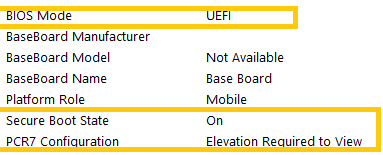

# How to convert an installed x64 Windows 7 system


The following steps are intended for use by an ITPro in a scenario where they need to convert from Legacy MBR+CSM to UEFI+GPT. Usually this process starts with a system that has Windows 7 x64 installed.

For x86 OS systems, see the section in the [Firmware WEG FAQ](frequently-asked-questions.md) about "What is the dependency on 32-bit vs. 64-bit UEFI?".

Installed in BIOS mode to Legacy MBR boot disk with CSM enabled, and you know or have checked with the OEM to ensure that the system has the following:

1.  Ability to enable and disable the CSM

2.  Has UEFI firmware 2.3.1c or later

3.  The security features that you are interested in (Secure boot, Device Guard, and Credential Guard) have all the correct components already configured on the system.

    **Note** Microsoft does not currently have a mechanism to convert Legacy MBR boot disks to GPT disks without first wiping or cleaning an existing file system and creating the new file system on the clean disk.

For example, you will need to use Diskpart.exe to **clean** the existing partition before running the **convert GPT** command on that disk. The **clean** command will wipe the entire disk.

1.  Ensure all data is backed up from the primary boot device, and the user or ITPro has confirmed that primary boot device is Disk 0

2.  Primary boot device has been completely backed up (any data left on disk will be wiped)

3.  Reboot to BIOS (contact the manufacturer for steps to switch BIOS boot mode to UEFI boot mode) aand switch to UEFI+CSM

4.  Boot to the USB flash drive  that contains x64 WinPE

5.  After booting into WinPE, at the command prompt:

    a. Open Diskpart.exe

    b. select disk 0

    c. list par

    d. list VOL <= to identify current drive letters so you know where existing OS is assigned (identify drive letter for OS, used later)

    e. convert GPT

    f. select partition 1

    g. create par EFI size=800 (mg)

    h. format fs=fat32 label=System

    i. assign letter S

    j. create par MSR

    k. list par

    l. exit

6.  Back at the command prompt, type in the following:

    a.  s:

    b.  BCDboot c:\\windows /s s: /f UEFI

        **Note** This is the drive letter identified in step c and d above

    c.  dir /a

    d.  should see s:\\EFI

7.  Reboot and attempt to boot to OS.

## Verify system is booted in UEFI mode

Use one of the following methods to verify system is booted in UEFI mode.

### MSINFO32

On Windows 10 systems:

1. Press \<Windows key\> + \<R\> to open the **Run** dialog.

2. Type Msinfo32 and click **OK**.

The System Summary page will open by default.

Look for the following information:



To run as an administrator, use the following steps:

1. Press \<Windows key\> + \<R\> to open the **Run** dialog.

2. Start typing "System Information".

If **System Information** is highlighted, hold \<CTRL\> + \<SHIFT\> and hit \<ENTER\>, or use your mouse to right-click and select **Run as Administrator**.

You will be prompted by User Access Control (UAC) with the following message: **Do You want this app to make changes to your desktop?**

### BCDEDIT

On Windows 7 and later systems:

1.  Start an elevated command prompt.

2.  Run "BCDedit /enum {current}".

    **Note**: If booted from WinPE, use the "/store" switch in BCDedit.exe.

    - If you have UEFI, the path will show Winload.efi.
    - If you have CSM, the path will show Winload.exe as listed in sample output.

**Sample output**

```console
Windows Boot Loader
-------------------
identifier {current}
device partition=C:
path \WINDOWS\system32\winload.efi
```

### NOTEPAD and SETUPACT.LOG

1.  Start an elevated command prompt.

2.  Run "notepad c:\\windows\\panther\\setupact.log".

3.  Press \<CTRL\> + \<F\> for find (or search).

4.  Search for "Callback\_BootEnvironmentDetect".

    - Results would look something like this:

        ```console
        Callback_BootEnvironmentDetect:FirmwareType 1.

        Callback_BootEnvironmentDetect: Detected boot environment: BIOS
        ```

        Or

        ```console
        Callback_BootEnvironmentDetect:FirmwareType 2.

        Callback_BootEnvironmentDetect: Detected boot environment: UEFI
        ```

You may need to consult with the OEM for configuration details on your specific system.

**Warning** Using diskpart.exe or Setup to clean or wipe the hard disk drive partition information will all destroy data on the disk. Consult the PC manufacturer concerning factory image recovery methods or data backup options prior to making any of these changes.

## Related resources


[Recommended UEFI-Based Disk-Partition Configurations](https://technet.microsoft.com/library/dd744301)

[Win7 Back up your programs, system settings, and files](http://windows.microsoft.com/windows/back-up-programs-system-settings-files#1TC=windows-7)

[Win7 Protect your files and PC with Windows 7 Backup](https://blogs.technet.microsoft.com/filecab/2009/10/23/protect-your-files-and-pc-with-windows-7-backup/)


