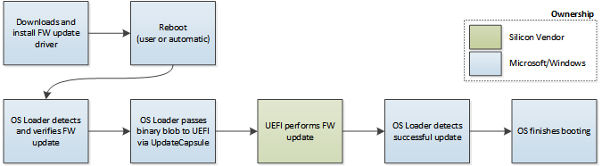

# Installing the update

Firmware update packages can be installed using any tool that installs Windows drivers. The installation process copies the firmware update payload (firmware.bin) to a well-known system directory and creates the registry keys necessary to tell Windows a new update is available. After the installation is finished, a reboot is required in order to trigger the actual firmware update process.

During the next boot, and before ExitBootServices() has been called, the OS Loader checks the well-known registry key locations to determine if new firmware update payload is available. If new update payload is available, the OS Loader verifies the hash of firmware.bin against the security catalog delivered with the driver package. If the signature is valid, the firmware.bin will be handed off to the platform firmware via the UEFI UpdateCapsule() service.

**Important**  At this point, the platform firmware is solely responsible for completing the firmware update.

 

If multiple firmware update packages are installed, the OS Loader calls UpdateCapsule() with the payload of each available update. Each firmware payload will be a separate capsule, each identified by the GUID of the ESRT entry for the targeted firmware update package.

The EFI System Resource Table provides the current firmware version and the status of the last update attempted. The OS Loader uses this information to assess whether the update was successfully applied. The firmware status information will be persisted into the OS such that it is available to a firmware update application running in Windows. Finally, the OS Loader continues the boot process.

## Related topics
[System and device firmware updates via a firmware driver package](system-and-device-firmware-updates-via-a-firmware-driver-package.md)  
[Populating the ESRT table](populating-the-esrt-table.md)  
[Customizing firmware for different geographic regions](customizing-firmware-for-different-geographic-regions.md)  
[Authoring a firmware update package](authoring-a-firmware-update-package.md)  
[Certifying and signing the update package](certifying-and-signing-the-update-package.md)  

