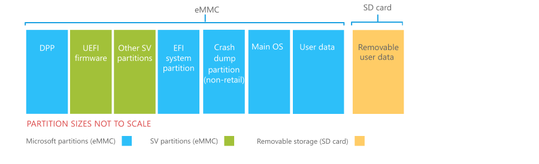

# Windows 10 Mobile partition layout

In Windows 10 Mobile, Microsoft and the silicon vendor (SV) configure the storage partitions and partition sizes. Partitions must be designed so that they are large enough for all current components and to accept updates over the lifetime of the phone. After the partition sizes have been set on a phone, the only way to change the size is by reflashing the device with a clean full flash update, which will wipe all data on the phone.

The storage subsystem for a phone must conform to the requirements specified in [section 2.2: Memory, of the Windows 10 Mobile minimum hardware requirements](https://msdn.microsoft.com/library/windows/hardware/dn915086.aspx#section_2.0_-_minimum_hardware_requirements_for_windows_10_mobile).

<strong>Note:</strong>   OEMs may not add, remove, or modify partitions in the layout designed by Microsoft and the SV. This helps to ensure that all the software and configuration data on the phone can be serviced by phone updates. OEM components typically are built into the main OS partition (for preloaded applications and native services), the data partition (for data such as preloaded maps), or the device provisioning partition (for device-specific read-only configuration data).

 

## Partition list

The following diagram shows the required storage partitions.

## Partition requirements

The following table summarizes the requirements for each partition. All sizes are logical; actual space consumed on storage media may differ. When defining the size of the system partition (which consists of all partitions except the user data partition and the SD card), the silicon vendor must adhere to the free space requirements for each individual partition. This includes, but is not limited to, software assets such as additional languages. This requirement is mandatory and necessary in order to ensure that a phone can be updated over its lifetime.

<table>
<colgroup>
<col width="12%" />
<col width="12%" />
<col width="12%" />
<col width="12%" />
<col width="12%" />
<col width="12%" />
<col width="12%" />
<col width="12%" />
</colgroup>
<thead>
<tr class="header">
<th align="left">Partition</th>
<th align="left">Contents</th>
<th align="left">File system</th>
<th align="left">Mount point</th>
<th align="left">Encrypted</th>
<th align="left">Size</th>
<th align="left">Free space reserved for future updates</th>
<th align="left">Owner</th>
</tr>
</thead>
<tbody>
<tr class="odd">
<td align="left">
DPP
</td>
<td align="left">
Device provisioning data
</td>
<td align="left">
FAT
</td>
<td align="left">
C:\DPP
</td>
<td align="left">
No
</td>
<td align="left">
8 MB
</td>
<td align="left">
N/A
</td>
<td align="left">
Microsoft
</td>
</tr>
<tr class="even">
<td align="left">
SV partitions
</td>
<td align="left">
UEFI firmware and other SV-specific partitions
</td>
<td align="left">
N/A
</td>
<td align="left">
No mount point
</td>
<td align="left">
Maybe
</td>
<td align="left">
Variable
</td>
<td align="left">
N/A
</td>
<td align="left">
SV/OEM
</td>
</tr>
<tr class="odd">
<td align="left">
EFI system partition
</td>
<td align="left">
Boot manager, boot configuration database, UEFI applications
</td>
<td align="left">
FAT
</td>
<td align="left">
C:\ESP
</td>
<td align="left">
No
</td>
<td align="left">
32 MB (minimum)
</td>
<td align="left">
N/A
</td>
<td align="left">
Microsoft
</td>
</tr>
<tr class="even">
<td align="left">
Crash dump partition (exists on non-retail images only)
</td>
<td align="left">
Data from crash dumps
</td>
<td align="left">
NTFS
</td>
<td align="left">
C:\CrashDump
</td>
<td align="left">
Yes
</td>
<td align="left">
Variable - the size of this partition depends on the value of the <strong>SOC</strong> element in the OEMInput file that was used to build the image.
</td>
<td align="left">
N/A
</td>
<td align="left">
Microsoft
</td>
</tr>
<tr class="odd">
<td align="left">
Main OS (boot partition)
</td>
<td align="left">
OS, update OS, system registry hives, OEM preloaded applications
</td>
<td align="left">
NTFS
</td>
<td align="left">
C:&lt;/p&gt;</td>
<td align="left">
Yes
</td>
<td align="left">
Approximately 1.5 GB

</td>
<td align="left">
250 MB

</td>
<td align="left">
Microsoft
</td>
</tr>
<tr class="even">
<td align="left">
Data partition
</td>
<td align="left">
User data, user registry hives, applications, application data, page file.
</td>
<td align="left">
NTFS
</td>
<td align="left">
C:\Data
</td>
<td align="left">
Yes
</td>
<td align="left">
Remainder of eMMC storage not used by other partitions. Approximately 256 MB is used for the page file.
</td>
<td align="left">
N/A
</td>
<td align="left">
Microsoft
</td>
</tr>
<tr class="odd">
<td align="left">
SD card
</td>
<td align="left">
User data (music, pictures, etc.)
</td>
<td align="left">
FAT/exFAT
</td>
<td align="left">
Variable
</td>
<td align="left">
No
</td>
<td align="left">
Variable
</td>
<td align="left">
N/A
</td>
<td align="left">
Microsoft
</td>
</tr>
</tbody>
</table>

 

### Device provisioning partition

The device provisioning partition (DPP) contains provisioning data for a specific device. It is typically calibrated on the factory floor and contains the product validation key as well as configuration information for components such as the radio and GPS. Because it is specific to the device, it is excluded from any image updates or FFU.

This partition shall be 8 MB in size.

<strong>Important:</strong>   The DPP partition must be the first partition in the layout so as to safe guard the provisioning information from being overwritten should the sizes of any other partitions subsequently change.

### Silicon vendor partitions

The SV can define partitions for their own components. One of these partitions is the UEFI (Unified Extensible Firmware Interface) partition, which contains a standard interface to a primitive set of system operations that UEFI applications can use. The modem data also requires an SV partition.

### EFI system partition

The EFI system partition contains the Windows boot manager (BootMgr) and the boot configuration database (BCD). The BootMgr is responsible for loading higher-level operating systems, such as the main OS or update OS. In addition, the EFI system partition contains a number of UEFI applications, such as the FFU application and battery charging application.

This partition shall be a minimum of 32 MB in size.

### Crash dump partition

Non-retail images contain a crash dump partition, which contains the data from crash dumps that occur when the phone restarts unexpectedly.

The size of this partition depends on the value of the **SOC** element in the OEMInput file that was used to build the image.

### Main OS partition

The main OS partition, also known as the boot partition, contains all of the components that make up the operating system image. This includes OEM customizations and preloaded applications.

This size of this partition depends on the amount of space used by OEM customizations and preloaded applications. 

* **Baseline OS**: ~870 MB, although in reality the size of the OS depends on a number of variables, such as the number of languages that are included in the image. On 4 GB phones with a compressed main OS partition, the OS is approximately 20%-25% smaller than the uncompressed OS.
* **Update OS**: ~50 MB
* **OEM preloaded applications**: up to 100 MB for applications that install during the first boot experience, up 5% of the remaining user storage for applications that install after the first boot experience
* **Reserved for future updates**: Variable, depending on the amount of storage on the phone. See the next column for more information.

In general, the number of writable files in this partition should be limited to the minimum possible to allow sufficient space for updates. This partition includes reserved space to allow for growth due to updates:

-   On phones with only 4 GB of storage, this partition has approximately 250 MB of reserved space after the Main OS partition is compressed.

-   On phones with more than 4 GB of storage and an uncompressed Main OS partition, this partition has approximately 250 MB of reserved space.

<strong>Note:</strong>   OEMs can add additional free space for future updates by using the <strong>AdditionalMainOSFreeSectorsRequest</strong> element in the device platform XML file.

### Data partition

This partition in internal storage stores the user data, applications, and application state. The size of the partition automatically adjusts to consume the rest of the space on the eMMC.

<strong>Important:</strong>   The data partition must be the last partition in the layout.

### SD card

The removable user data partition refers to the data stored on the SD card. The SD card is treated as a separate volume that is used to store certain types of user data. The content on the SD card can be removed from the system by the user at any time and therefore cannot contain information critical to the core phone functionality.
 

