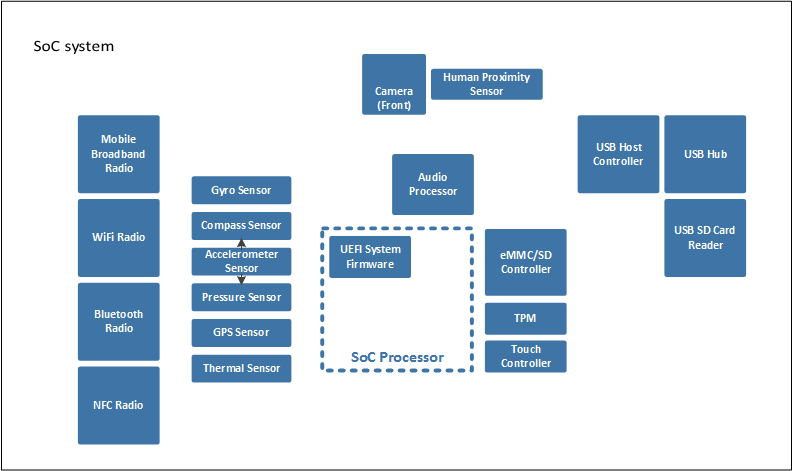
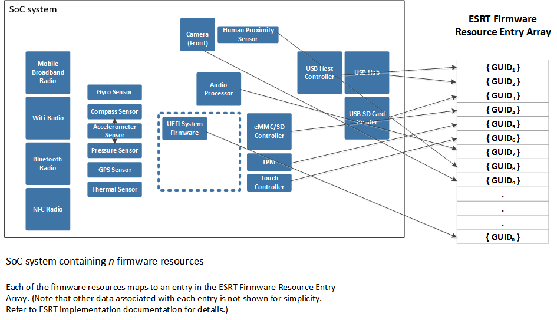

# Populating the ESRT table

The EFI System Resource Table (ESRT) provides a mechanism for identifying integrated device and system firmware resources for the purposes of targeting firmware updates to those resources. Each entry in the ESRT describes a device or system firmware resource that can be targeted by a firmware update driver package. Each firmware resource that can be updated by a firmware update driver package must be described by exactly one entry in the ESRT to enable firmware updates to be deployed and installed. For more details on the layout and implementation of the ESRT, see [ESRT table definition](esrt-table-definition.md).

The following diagram shows a high level block diagram of a typical SoC system.

In this example, each system device containing updatable firmware is represented by a single block. Each block is capable of receiving and installing a targeted, independent firmware update for the device. As such, each block has a unique entry in the ESRT representing that device, as shown in the following diagram.

It is also possible for a device to have its firmware updated as part of a single, monolithic system firmware update driver package. In this case, the device would not have an ESRT entry since it is updated with the system firmware. More generally, a device can only have its firmware update targeted by one entry in the ESRT.

For simplicity, the previous diagram describes the model where each device has its firmware update targeted separately with a unique entry. Each GUID in the table identifies an updatable device or the UEFI system firmware within this SoC system. Each GUID in the table is unique (i.e. no two devices/system firmware share the same GUID value) and the table is unique to a single SoC system. Hardware revisions of a SoC system must define new GUID values for devices/system firmware. This ensures that firmware is targetable to each component in the revised hardware, as subtle differences in device hardware across revisions may require different firmware.

## Related topics
[System and device firmware updates via a firmware driver package](system-and-device-firmware-updates-via-a-firmware-driver-package.md)  
[Customizing firmware for different geographic regions](customizing-firmware-for-different-geographic-regions.md)  
[Authoring a firmware update package](authoring-a-firmware-update-package.md)  
[Certifying and signing the update package](certifying-and-signing-the-update-package.md)  
[Installing the update](installing-the-update.md)  

