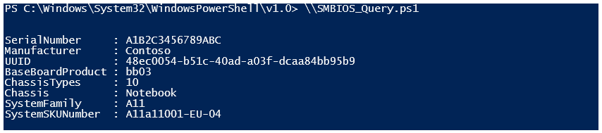

# Sample PowerShell script to query SMBIOS locally


The following list of ChassisTypes is copied from the latest DMTF SMBIOS specification.

```powershell
# Set-ExecutionPolicy or Script Signing documentation needs to be reviewed
# Current script is designed to run on individual machines
#

#
$ChassisTypes =
@{
    1='Other'
    2='Unknown'
    3='Desktop'
    4='Low Profile Desktop'
    5='Pizza Box'
    6='Mini Tower'
    7='Tower'
    8='Portable'
    9='Laptop'
    10='Notebook'
    11='Hand Held'
    12='Docking Station'
    13='All in One'
    14='Sub Notebook'
    15='Space-Saving'
    16='Lunch Box'
    17='Main System Chassis'
    18='Expansion Chassis'
    19='SubChassis'
    20='Bus Expansion Chassis'
    21='Peripheral Chassis'
    22='Storage Chassis'
    23='Rack Mount Chassis'
    24='Sealed-Case PC'
    25='Multi-system chassis'
    26='Compact PCI'
    27='Advanced TCA'
    28='Blade'
    29='Blade Enclosure'
    30='Tablet'
    31='Convertible'
    32='Detachable'
    33='IoT Gateway'
    34='Embedded PC'
    35='Mini PC'
    36='Stick PC'
}

$namespace = "root\CIMV2"

$machines = New-Object System.Collections.ArrayList

# TODO: add code to populate the machine list from user input, etc.
#
$machines. Add("LocalHost") | Out-Null

$list = New-Object System.Collections.ArrayList

foreach ($machine in $machines)
{
    $obj = New-Object -Type PSObject | Select-Object SerialNumber, Manufacturer, UUID, BaseBoardProduct, ChassisTypes, Chassis, SystemFamily, SystemSKUNumber

    $obj.SerialNumber = Get-WmiObject -class Win32_Bios -computername $machine -namespace $namespace | Select-Object -ExpandProperty SerialNumber
    $obj.Manufacturer = Get-WmiObject -class Win32_Bios -computername $machine -namespace $namespace | Select-Object -ExpandProperty Manufacturer
    $obj.UUID = Get-WmiObject Win32_ComputerSystemProduct | Select-Object -ExpandProperty UUID
    $obj.BaseBoardProduct = Get-WmiObject Win32_BaseBoard | Select-Object -ExpandProperty Product
    $obj.ChassisTypes = Get-WmiObject Win32_SystemEnclosure | Select-Object -ExpandProperty ChassisType
    $obj.Chassis = $ChassisTypes[[int]$obj.ChassisTypes]
    $obj.SystemFamily = Get-WmiObject Win32_ComputerSystem | Select-Object -ExpandProperty SystemFamily
    $obj.SystemSKUNumber = Get-WmiObject Win32_ComputerSystem | Select-Object -ExpandProperty SystemSKUNumber

    $list.Add($obj) | Out-Null
}

# TODO: add code to handle output (save to local file, upload to share, etc.)
#
# to use on single line for each object
# $list | Sort-Object Manufacturer, Chassis | Format-Table Manufacturer, ChassisTypes, Chassis, SystemFamily, BaseBoard_Product, SerialNumber, UUID, SystemSKUNumber -Wrap

# Optional: pipe to Excel:
# $list | Export-Csv c:\path\filename.csv -Encoding Unicode -NoTypeInformation
#
# Optional: pipe to UI
# $list | Out-GridView
#
$list
```

Sample output:


