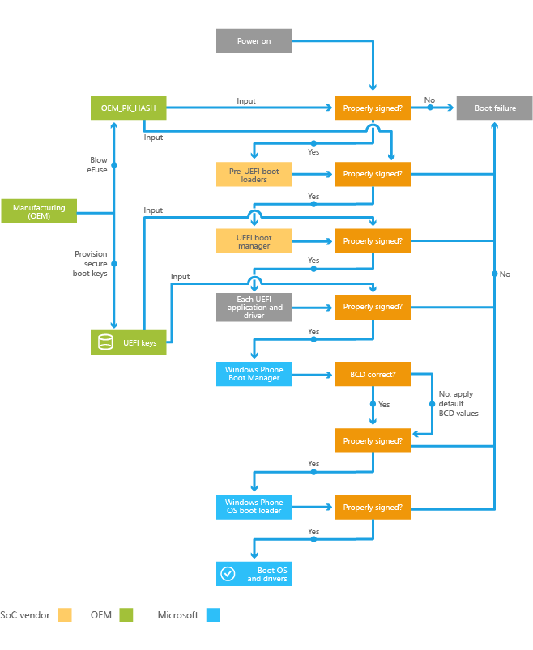

# Secure boot and device encryption overview

This topic provides an overview of secure boot and device encryption functionality, with emphasis on key OEM requirements and considerations.

## Secure boot

Secure boot is a process that validates firmware images on devices before they are allowed to execute. Starting with a root of trust (consisting of the hash of a key that is provisioned in firmware during manufacturing), secure boot cryptographically validates the digital signature of all boot components, from the pre-UEFI boot loaders, to the UEFI environment, and finally to the main OS and all components that run in it (such as drivers and apps). Secure boot helps to ensure that only authorized code can execute before the operating system loads.

The core UEFI environment provided by the SoC vendor implements the UEFI secure boot standard described in section 27 of the UEFI specification. This standard describes a process by which all UEFI drivers and applications are validated against keys provisioned into a UEFI runtime variable before they are executed. For more info about the core UEFI environment implemented by the SoC vendor, see [Boot and UEFI](boot-and-uefi.md) and [UEFI in Windows](uefi-in-windows.md).

### Secure boot process

The diagram below provides an overview of the secure boot process.

The following steps describe this process in more detail:

1.  To enable secure boot, OEMs perform a series of tasks during manufacturing, including provisioning the secure boot keys and blowing various fuses.

2.  Booting the device starts the process of validating the signature of the pre-UEFI boot loaders against the root of trust. If this check succeeds, the UEFI boot manager is loaded.

3.  When the UEFI boot manager loads each UEFI app or driver, it checks that the binary is properly signed. If a check for any component fails, then the component will not be loaded and the boot process will fail.

4.  After the boot manager (a UEFI component provided by Microsoft) is successfully loaded, it checks that certain BCD (boot configuration data) settings are intact. If they are not intact, Windows 10 uses the values that the secure boot policy considers correct and ignores the others.o

5.  The boot manager validates the signature of the boot loader, and loads the boot loader only if the signature is valid.

6.  The boot loader validates the signature of all boot-critical drivers before loading them and the kernel. At this point, it is the responsibility of the kernel to validate the signature of all drivers and apps before loading them.

### OEM requirements and considerations

OEMs should be aware of the following requirements and considerations related to secure boot:

-   You must perform a series of tasks during manufacturing to enable secure boot, including provisioning the secure boot keys and blowing various JTAG fuses.

-   OEMs must use an eMMC part with at least a 512 KB RPMB partition, as called out in the Minimum Hardware Requirements Specification.

-   As part of the secure boot enablement process during manufacturing, the Replay Protected Memory Block (RPMB) on the eMMC part must be provisioned. After this provisioning occurs, the specific eMMC part and the SoC component in the device are bound together; the eMMC part cannot be removed and reused in another device with an OS that makes use of the RPMB.

-   After secure boot is enabled, all drivers and apps on the device must be signed in order for them to be loaded by the operating system. For more information, see [Code signing](https://msdn.microsoft.com/library/windows/hardware/dn756634).

## Device encryption

Windows 10 Mobile supports using BitLocker technology to encrypt all user data stored locally on internal data partitions. This helps to protect the confidentiality of local device data from offline hardware attacks. If a device is lost or stolen, and if the user locks their device with a PIN, device encryption helps make it difficult for an attacker to recover sensitive information from the device.

When device encryption is enabled, the main OS and internal user data store partitions are encrypted. SD cards that are inserted in the phone are not encrypted.

A user can turn on or turn off device encryption on the device using **Settings** =&gt; **System** =&gt; **Device encryption**, but this may put the device out of compliance and trigger a compliance failure, such as email would no longer synchronize with the device. When device encryption is turned on, the user will be asked to create a PIN to secure the device.

### OEM requirements and considerations

You should be aware of the following requirements and considerations related to device encryption:

-   Device encryption is not enabled by default. Device encryption is automatically enabled in the following scenarios:

    -   The user adds an Outlook account to the device, and the Microsoft Exchange server that it connects to is configured to require device encryption.

    -   The user connects the device to a company apps account, and the enterprise device management server for the account pushes down a policy to the device that requires device encryption.

    In either of these scenarios, the device automatically begins encrypting the main OS and internal user data store partitions after the device encryption policy change is configured on the device. The device encryption work is throttled to minimize the impact to end users.

-   There are no OEM enablement tasks specific to device encryption. However, OEMs must follow the instructions for enabling secure boot.

-   After device encryption is enabled on a device, apps that run outside of the main OS (for example, customer care apps in UEFI) cannot write data to the encrypted partitions on the device. Only apps in the main OS or the update OS can write data to the encrypted partitions.

 

 

--------------------
[Send comments about this topic to Microsoft](mailto:wsddocfb@microsoft.com?subject=Documentation%20feedback%20%5Bp_OEMBringUp\p_oembringup%5D:%20Secure%20boot%20and%20device%20encryption%20overview%20%20RELEASE:%20%284/22/2016%29&body=%0A%0APRIVACY%20STATEMENT%0A%0AWe%20use%20your%20feedback%20to%20improve%20the%20documentation.%20We%20don't%20use%20your%20email%20address%20for%20any%20other%20purpose,%20and%20we'll%20remove%20your%20email%20address%20from%20our%20system%20after%20the%20issue%20that%20you're%20reporting%20is%20fixed.%20While%20we're%20working%20to%20fix%20this%20issue,%20we%20might%20send%20you%20an%20email%20message%20to%20ask%20for%20more%20info.%20Later,%20we%20might%20also%20send%20you%20an%20email%20message%20to%20let%20you%20know%20that%20we've%20addressed%20your%20feedback.%0A%0AFor%20more%20info%20about%20Microsoft's%20privacy%20policy,%20see%20http://privacy.microsoft.com/default.aspx. "Send comments about this topic to Microsoft")

