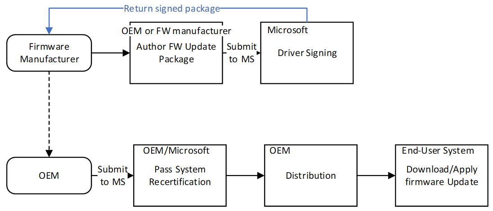

# System and device firmware updates via a firmware driver package

Deploying a firmware update using a firmware driver package follows a relatively simple process that can be divided into three phases:

1.  Author a firmware update package.
2.  Certify and sign the update package.
3.  Install the update.

The following diagram shows this process in greater detail.

This process assumes that the UEFI firmware update payload has already been developed, tested, and signed.

1.  The firmware driver package simply contains the payload for a firmware update and allows the firmware update payload to be distributed in the same manner as all Windows drivers.
2.  After the driver package has been deployed to a system, the firmware update payload is passed to platform firmware via the UEFI UpdateCapsule service.
3.  Upon receipt of the firmware update payload, platform firmware recognizes the payload and applies the update.
4.  The implementation of the platform firmware update code is proprietary, as is the format of the firmware update payload.

A device driver package contains an INF file describing the devices to which the package applies. A firmware driver package is the same. Devices and system firmware resources supporting this update mechanism must uniquely identify themselves to bind to a firmware driver package. The next section describes the identification mechanism.

## In this section

-   [Populating the ESRT table](populating-the-esrt-table.md)
-   [Customizing firmware for different geographic regions](customizing-firmware-for-different-geographic-regions.md)
-   [Authoring a firmware update package](authoring-a-firmware-update-package.md)
-   [Certifying and signing the update package](certifying-and-signing-the-update-package.md)
-   [Installing the update](installing-the-update.md)

 

 

