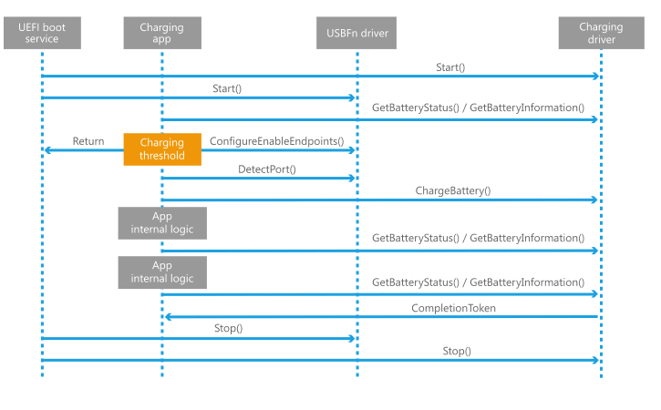

# UEFI battery charging protocol

**Note**  Some information in this section may apply only to Windows 10 Mobile and certain processor architectures.

 

The UEFI battery charging protocol is used by the Microsoft UEFI battery charging application to communicate with the UEFI battery charging driver. The UEFI battery charging driver must implement this protocol if the device uses the Microsoft UEFI battery charging application.

**Important**  If the device uses a custom UEFI battery charging application instead of the Microsoft-provided application, the UEFI battery charging driver must not implement this protocol. The Windows Boot Manager will load the Microsoft UEFI battery charging application if the driver implements this protocol.

 

For more information about the Microsoft UEFI battery charging application, see [Battery charging in the boot environment](battery-charging-in-the-boot-environment.md).

## Protocol Interface

-   [EFI\_BATTERY\_CHARGING\_PROTOCOL](efi-battery-charging-protocol.md)

-   [EFI\_BATTERY\_CHARGING\_PROTOCOL.GetBatteryInformation](efi-battery-charging-protocolgetbatteryinformation.md)

-   [EFI\_BATTERY\_CHARGING\_PROTOCOL.GetBatteryStatus](efi-battery-charging-protocolgetbatterystatus.md)

-   [EFI\_BATTERY\_CHARGING\_PROTOCOL.ChargeBattery](efi-battery-charging-protocolchargebattery.md)

The Windows boot flow requires the battery to be charged to a certain level before it can load the main OS. The UEFI specification version 2.3 lacks a standard battery charging protocol.

### Sequence diagram

 

 

