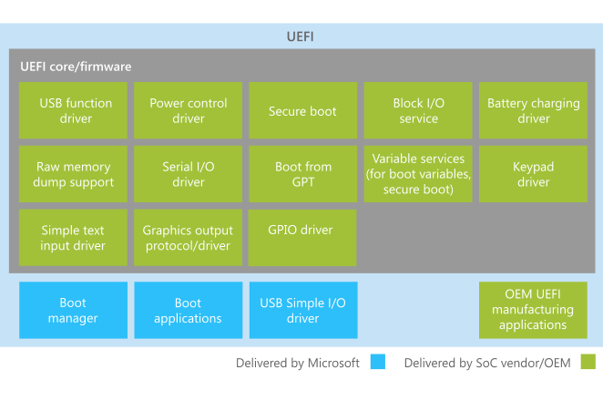

# UEFI in Windows

**Note**  Some information in this section may apply only to Windows 10 Mobile and certain processor architectures.

 

Windows utilizes the Unified Extensible Firmware Interface (UEFI) to support the handoff of system control from the SoC firmware boot loader to the OS. The UEFI environment is a minimal boot OS upon which Windows devices are booted and the OS runs.

UEFI is a general framework for boot loaders based on a standard UEFI specification, which describes a standard environment and set of interfaces for platform firmware that allows operating systems to boot. The UEFI specification is available at [http://uefi.org/specifications](http://go.microsoft.com/fwlink/p/?LinkId=218221). Because of the extremely low-level nature of UEFI, each of its implementations is specific to a particular SoC. For Windows devices, the core UEFI environment and some UEFI drivers are provided by the SoC vendor. Additional UEFI drivers and UEFI applications (such as a flashing application) are provided by Microsoft.

In addition to the implementation details outlined in the UEFI specification, there are an additional set of UEFI requirements for running Windows on SoC platforms. For these requirements, see [Minimum UEFI requirements for Windows on SoC platforms](minimum-uefi-requirements-for-windows-on-soc-platforms.md).

## In this section

<table>
<colgroup>
<col width="50%" />
<col width="50%" />
</colgroup>
<thead>
<tr class="header">
<th>Topic</th>
<th>Description</th>
</tr>
</thead>
<tbody>
<tr class="odd">
<td>
[Minimum UEFI requirements for Windows on SoC platforms](minimum-uefi-requirements-for-windows-on-soc-platforms.md)
</td>
<td>
Unified Extensible Firmware Interface (UEFI) is the required boot firmware for SoC platforms running Windows. This section describes UEFI implementation requirements for running Windows on SoC platforms. Observation and adherence to these requirements will help ensure proper functionality of Windows.
</td>
</tr>
<tr class="even">
<td>
[UEFI protocols for Windows](uefi-protocols-for-windows.md)
</td>
<td>
This section describes UEFI protocols that are defined by Windows. These protocols expand up on the protocols defined by the UEFI specification, and they are used by Windows to accomplish specific functions during the boot process.
</td>
</tr>
<tr class="odd">
<td>
[Windows UEFI firmware update platform](windows-uefi-firmware-update-platform.md)
</td>
<td>
Windows supports a platform for installing system and device firmware updates via driver packages that are processed by using the UEFI UpdateCapsule function. This platform provides a consistent, reliable firmware update experience, and it improves the discoverability of important system firmware updates for end-users.
</td>
</tr>
</tbody>
</table>

 

## UEFI components for Windows

The following diagram shows the main UEFI components for a Windows device

## OEM components in the UEFI environment

OEMs can add UEFI applications that aid in manufacturing and servicing the device. These applications should not be accessible to the end-user. End-user-facing UEFI applications are implemented only by Microsoft and launched by the Windows boot manager.

OEMs that choose to implement UEFI applications should make sure that they have a small a memory footprint as possible and do not impact boot time. For more information about authoring components for the UEFI environment, consult with the SoC vendor.

**Important**   OEMs might also be required to replace certain UEFI drivers provided by the SoC vendor to match their specific hardware. For more information, follow up with the SoC vendor.

 

## Related topics

[UEFI protocols for Windows](uefi-protocols-for-windows.md)

 

 

[Send comments about this topic to Microsoft](mailto:wsddocfb@microsoft.com?subject=Documentation%20feedback%20%5Bp_OEMBringUp\p_oembringup%5D:%20UEFI%20in%20Windows%20%20RELEASE:%20%284/22/2016%29&body=%0A%0APRIVACY%20STATEMENT%0A%0AWe%20use%20your%20feedback%20to%20improve%20the%20documentation.%20We%20don't%20use%20your%20email%20address%20for%20any%20other%20purpose,%20and%20we'll%20remove%20your%20email%20address%20from%20our%20system%20after%20the%20issue%20that%20you're%20reporting%20is%20fixed.%20While%20we're%20working%20to%20fix%20this%20issue,%20we%20might%20send%20you%20an%20email%20message%20to%20ask%20for%20more%20info.%20Later,%20we%20might%20also%20send%20you%20an%20email%20message%20to%20let%20you%20know%20that%20we've%20addressed%20your%20feedback.%0A%0AFor%20more%20info%20about%20Microsoft's%20privacy%20policy,%20see%20http://privacy.microsoft.com/default.aspx. "Send comments about this topic to Microsoft")

