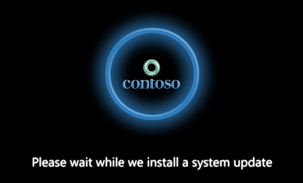

# User experience for UEFI firmware updates

This section describes how to implement a basic user experience during UEFI firmware updates.

During the process of updating firmware, it is important to provide a visual notice to the end user that an update is being processed. Over time users become accustomed to the typical time it takes for their device to boot into Windows. If a firmware update occurs which extends this boot time then there is a need to notify the user that the extended boot time is expected. Otherwise, users may conclude that the device failed to boot or froze during the boot process resulting in the user manually rebooting the system, interrupting the firmware update process.

To avoid such situations the firmware performing an update must manage the user experience by displaying a simple notification that the device is being updated. This will reset the user’s boot time expectations. This user experience must be added to an already existing (and familiar to the user) boot screen. The graphic displayed is likely the OEM or motherboard manufacturer’s logo.

## User experience

During the firmware update process the display must show the user that an update is in progress. The goals for this User Experience (UX) are as follows:

-   Display must be very short and easy to understand.
-   Must have the same look and feel as the Windows OS version on the system.
-   Must convey the following messages:
    -   Do not disturb the system during this process (don’t unplug from power, etc.).
    -   Boot time may take longer than expected.
    -   The update process is still in progress.

The following image demonstrates the expected look and feel for this UX. An OEM image is displayed (in this example the fictitious Contoso logo) as it would be displayed during any other time the system boots. The text “Please wait while we install a system update” indicates that a critical system component update is in progress. Users have learned that this means to let the device do what it must do and to not disturb it as it may take some time.

## Time frame

During the initial boot process the system will need to present the user with the standard boot screen as would be expected from the device. However once the Windows bootloader detects that new firmware capsule files are present it will transition from the normal boot screen to the firmware update boot screen . The transition will include the Windows bootloader displaying localized text on the screen indicating an update is in progress before it makes a call into the UpdateCapsule().

The firmware update UX needs to display from the time UpdateCapsule() is called until the time that all firmware updates have been successfully applied and the system has handed off the boot process to Windows. If additional reboots are needed during this time, then every attempt must be made to continue displaying the firmware update boot screen without interruption. If it is not possible to do so (for example, GPU firmware was updated, or a cold reboot was required) then every attempt must be made to display the firmware update boot screen as soon as possible. To facilitate this requirement, the Windows bootloader will provide the firmware a bitmap copy of the localized text. For more information, see [Boot screen components](boot-screen-components.md).

## Related topics
[Boot screen components](boot-screen-components.md)  

