# CFU virtual HID device firmware update simulation

This topic provides a walkthrough of a simulated firmware update on a virtual HID device.

> [!NOTE]
> CFU is available in Windows 10, version 2004 (Windows 10 May 2020 Update) and later versions.

## Build and install the CFU virtual HID device sample

1. Install Visual Studio 2019 and the Windows Driver Kit (WDK) as outlined at [Download the Windows Driver Kit (WDK)](../download-the-wdk.md).

1. Clone the Microsoft CFU repository into a local repository directory

    `git clone https://github.com/microsoft/CFU.git`

1. In your local CFU repository directory, at a command prompt, run the following git commands to get the Driver Module Framework (DMF) submodule required to build the sample:

    `git submodule init`

    `git submodule update`

1. Build the CfuVirtualHid device solution in Visual Studio

    1. Navigate to the location of the CfuVirtualHid.sln file on your development system. For example:

        `C:\<your_repo_folder>\CFU\Host\CFUFirmwareSimulation\CfuVirtualHid.sln`

    1. Open the CfuVirtualHid.sln file in Visual Studio.

    1. From the **Build** menu, select **Build Solution**. You should see output text indicating that the solution built successfully:

        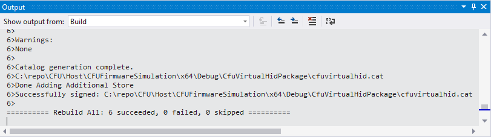

1. Install the CfuVirtualHid device and driver

    1. Navigate to the location of the cfuvirtualhid.inf file on your development system. For example:

        `C:\<your_repo_folder>\CFU\Host\CFUFirmwareSimulation\x64\Debug\CfuVirtualHid`

    1. At an administrative command prompt, run the following command:

        ```console
        devcon.exe install cfuvirtualhid.inf HID\CFU_VIRTUAL_DEVICE
        ```

        You should see output text indicating that the virtual device installed successfully:

        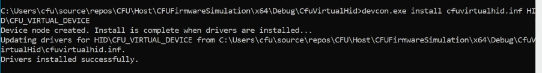

1. From **Control Panel**, open **Device Manager**, select the **View** menu, and select the **Devices by type** menu item.

1. In the devices list, expand the **Firmware** node, and select the **CfuVirtualHid Device** as shown here:

     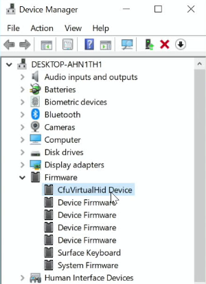

1. Right-click the **CfuVirtualHid Device** to open the context menu, then click on the **Properties** menu item to open the **CfuVirtualHid Device Properties** dialog window.

1. Select the **Details** tab in the **CfuVirtualHid Device Properties** dialog window, then select **Hardware Ids** in the **Property** drop down list.

    You should see the **HID\CFU_VIRTUAL_DEVICE** in the **Value** list box as shown here:

    

1. In the **Device Manager** menu, select the **View** menu, and select the **Devices by connection** menu item.

    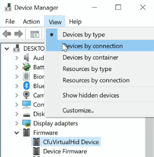

1. Navigate to the **CfuVirtualHid Device** and expand the **CfuVirtualHid Device** node, expand the **Virtual HID Framework (VHF) HID device** node, and select the **HID-compliant device** list item as shown here:

    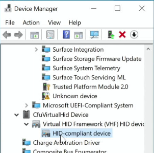

1. Right-click the **HID-compliant device** to open the context menu, then click on the **Properties** menu item to open the **HID-compliant device Properties** dialog window.

1. Select the **Details** tab in the **HID-compliant device Properties** dialog window, then select **Hardware Ids** in the **Property** drop down list.

    You should see **HID\VID_045E&UP:FA00_U:00F5** in the **Value** list box as shown here:

    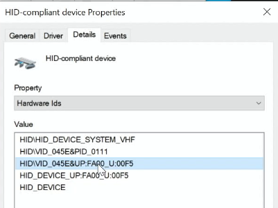

## Install a firmware update for the CFU virtual HID device

This section provides an example of installing a firmware update on the sample [**CfuVirtualHid Device**](https://github.com/microsoft/CFU/tree/master/Host/CFUFirmwareSimulation) device built in Visual Studio 2019 and installed using the [**devcon.exe**](../devtest/devcon.md) command-line tool as described in the section above.

1. Navigate to the location of the .inf file and the firmware offer and payload .bin files for your target device. For example:

    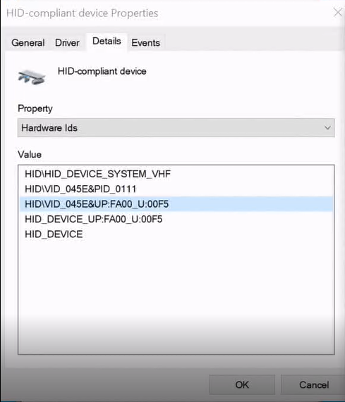

1. In a text editor, open your firmware update INF file. In this example, we'll use the *CfuVirtualHidDeviceFwUpdate.inf* file outlined in the [CFU INF configuration](cfu-inf-configuration.md).

1. In your firmware update INF file, move to the `[Standard.NTamd64]` section and verify the following information exists for the **HID\VID_045E&UP:FA00_U:00F5** device:

    ```inf
    [Standard.NTamd64]
    %CfuVirtualHidDeviceFwUpdate.DeviceDesc%=CfuVirtualHidDeviceFwUpdate, HID\VID_045E&UP:FA00_U:00F5 ; HardwareID for VirtualHidDevice MCU

    [CfuVirtualHidDeviceFwUpdate.NT]
    Include            = HidCfu.inf
    Needs              = HidCfu.NT
    CopyFiles          = CfuVirtualHidDeviceFwUpdate.CopyFiles

    [CfuVirtualHidDeviceFwUpdate.NT.Wdf]
    Include            = HidCfu.inf
    Needs              = HidCfu.NT.Wdf
    ```

1. At an administrative command prompt, run the following command:

    `pnputil /add-driver CfuVirtualHidDeviceFwUpdate.inf /install`

    This command will return the PnP Utility output. For example:

    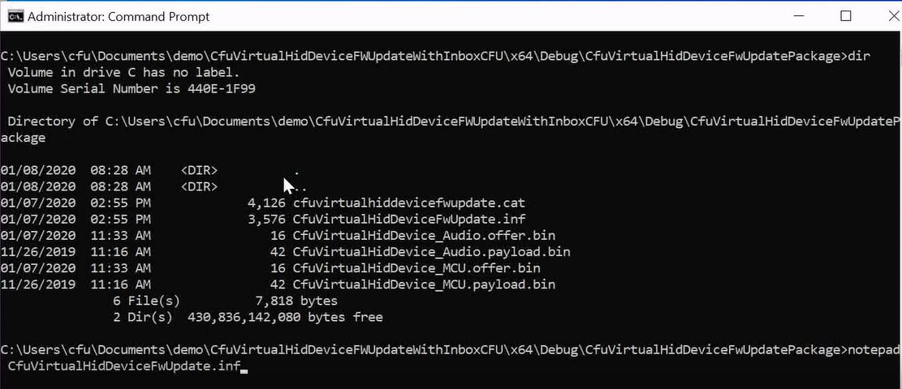

1. In **Device Manager**, navigate to the **CfuVirtualHid Device** node, then expand the node to verify that the **CfuVirtualHidDevice Firmware Update** has been installed, as shown here:

    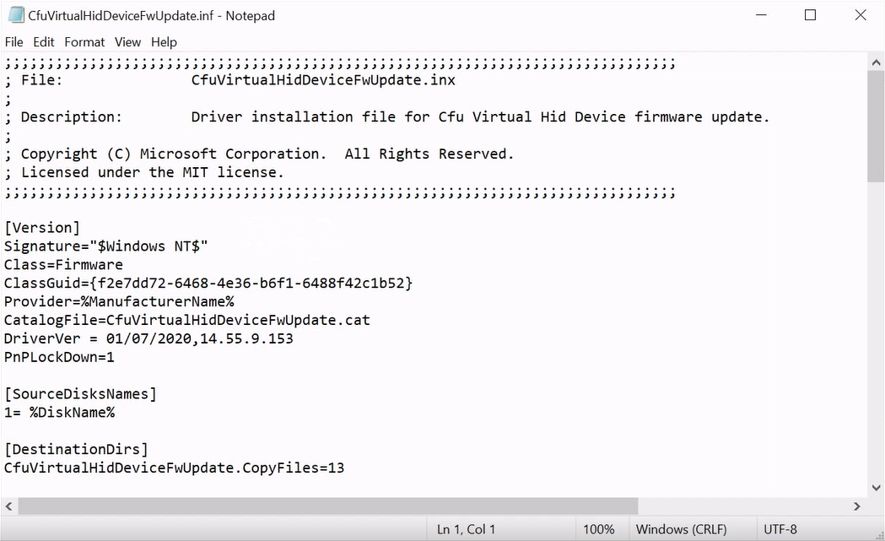

1. Select the the **CfuVirtualHidDevice Firmware Update** node, then open the **CfuVirtualHidDevice Firmware Update Properties** window, as shown here:

    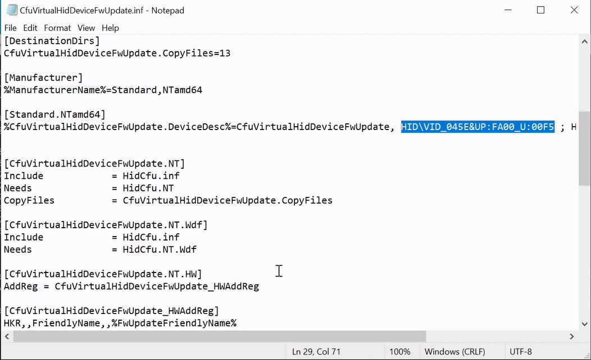

1. In the the **CfuVirtualHidDevice Firmware Update Properties** window, select the **Details** tab, then select **Hardware Ids** in the **Property** drop-down list, as shown here:

    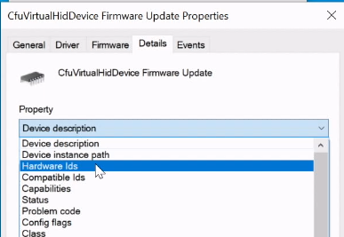

1. Verify that the **HID\VID_045E&UP:FA00_U:00F5** device appears in the **Hardware Ids** **Value** of the **CfuVirtualHidDevice Firmware Update**.

    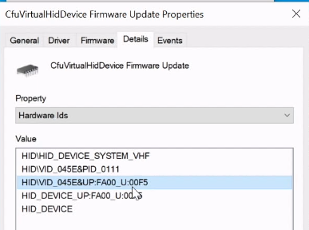

1. Use the **TraceView** application to view log message information for the CFU virtual HID device installation. For example:

    