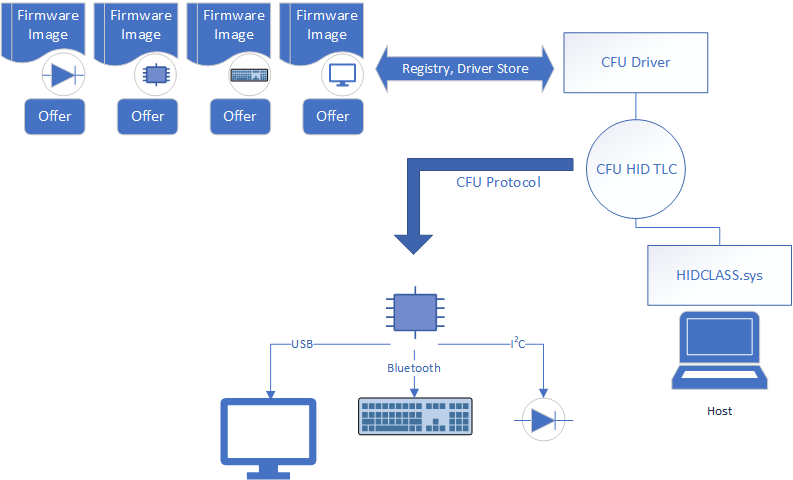

# Component Firmware Update (CFU) INF file configuration

To configure a custom INF file for CFU, follow the guidance in this topic to provide the correct values and settings for your firmware image files and hardware device.

> [!NOTE]
> CFU is available in Windows 10, version 2004 (Windows 10 May 2020 Update) and later versions.

The [Sample CFU INF file](#sample-cfu-inf-file) included below provides a starting point for your device's custom INF file. The sample INF configures the CFU inbox driver (hidcfu.dll) to enable the firmware update scenario for a virtual CFU Hid device. Refer to the [CFU virtual HID device firmware update simulation](cfu-firmware-update-simulation.md) topic for details on the sample virtual device code and walkthrough that simulates updating firmware on a virtual HID device. The sections below reference the included sample INF file to illustrate the configuration concepts discussed in this topic.

Your actual INF file must be customized and configured specifically for your device firmware and hardware.

## Before you begin

The following resources will help you learn about the Component Firmware Update (CFU) protocol.

- [Introducing Component Firmware Update](https://blogs.windows.com/buildingapps/?p=54456)

- [WinHEC 2018 video on Component Firmware Update](https://developer.microsoft.com/windows/hardware/events)

- The [Component Firmware Update (CFU) Protocol Specification](cfu-specification.md) describes a generic HID protocol to update firmware for components present on a PC or accessories. The specification allows for a component to accept firmware without interrupting the device operation during a download.

  - The [CFU firmware update sample](https://github.com/Microsoft/CFU/tree/master/Firmware) contains example firmware source code for implementing the CFU protocol.

  - The [CFU standalone tool](cfu-standalone-tool.md) can be used to test your firmware update on your device during development and before uploading it to Windows Update.

## Overview

To update the firmware image for your device by using the CFU model, you should expect to meet the following requirements:

- Provide a custom INF file for your device. This file provides information to the CFU inbox driver that sends the firmware update to the device. We recommend that you customize the sample CFU INF file provided below in this topic to support your firmware update scenarios.

- Your device must ship with a firmware image that is compliant with the [CFU protocol](cfu-specification.md) so that it can accept an update from the CFU driver.

- Your device must expose itself as a HID device to the operating system (running the CFU inbox driver) and expose a HID Top-Level Collection (TLC). The CFU inbox driver loads on the TLC and sends the firmware update to the device.

This allows you to service your in-market devices through Windows Update. To update the firmware for a component, you deploy the firmware update image through Windows Update. When the CFU inbox driver detects the presence of a component, it performs the necessary actions on the host and transmits the firmware image to the primary component on the device.



## Configure your custom CFU INF file

1. In your custom INF file, insert the hardware IDs of your devices as indicated in this example.
  
    ```inf
    [Standard.NTamd64]
    %CfuVirtualHidDeviceFwUpdate.DeviceDesc%=CfuVirtualHidDeviceFwUpdate, HID\VID_045E&UP:FA00_U:00F5 ; HardwareID for VirtualHidDevice MCU
    ```

    **INF Hardware ID settings**

    In order for the CFU inbox driver to communicate with the firmware, the hardware ID specified in the INF should match with what is specified in the Hid descriptor configuration in the firmware.

    As shown below, the *CfuVirtualHidDeviceFwUpdate.inf* values match the values specified in the virtual firmware simulation driver's Hid descriptor.

    ```inf
    [Standard.NTamd64]
    %CfuVirtualHidDeviceFwUpdate.DeviceDesc%=CfuVirtualHidDeviceFwUpdate, HID\VID_045E&UP:FA00_U:00F5
    ```

    For more information, refer the following code in **g_CfuVirtualHid_HidReportDescriptor** (Hid Report Descriptor) in [*DmfInterface.c*](https://github.com/microsoft/CFU/blob/master/Host/CFUFirmwareSimulation/sys/DmfInterface.c).

    ```cpp
    0x06, CFU_DEVICE_USAGE_PAGE,        // USAGE_PAGE(0xFA00)
    0x09, CFU_DEVICE_USAGE,             // USAGE(0xF5)
    ```

1. In your custom INF file, update the following entries shown here (including the **SourceDisksFiles** and **CopyFiles** sections) to match the files in your firmware update.

    For example, the virtual CFU Hid device sample supports two components (MCU and Audio). The sample section below specifies the offer and payload files for these components.

    ```inf
    ; Specify the location of the firmware offer
    ; and payload file in the registry.
    ; The files are kept in driver store.
    ; When deployed, %13% would be expanded to
    ; the actual path in driver store.
    ;
    ; You can change subkey name under CFU
    ; (for example, "CfuVirtualHidDevice_MCU"),
    ; and specify your own offer
    ; (for example, "CfuVirtualHidDevice_MCU.offer.bin")
    ; and payload (for example, "CfuVirtualHidDevice_MCU.payload.bin")
    ; file name.
    ;
    HKR,A410A898-8132-4246-AC1A-30F1E98BB0A4\CfuVirtualHidDevice_MCU,Offer,   0x00000000, %13%\CfuVirtualHidDevice_MCU.offer.bin
    HKR,A410A898-8132-4246-AC1A-30F1E98BB0A4\CfuVirtualHidDevice_MCU,Payload, 0x00000000, %13%\CfuVirtualHidDevice_MCU.payload.bin
    HKR,A410A898-8132-4246-AC1A-30F1E98BB0A4\CfuVirtualHidDevice_Audio,Offer,   0x00000000, %13%\CfuVirtualHidDevice_Audio.offer.bin
    HKR,A410A898-8132-4246-AC1A-30F1E98BB0A4\CfuVirtualHidDevice_Audio,Payload, 0x00000000, %13%\CfuVirtualHidDevice_Audio.payload.bin

    [SourceDisksFiles]
    CfuVirtualHidDevice_MCU.offer.bin=1
    CfuVirtualHidDevice_MCU.payload.bin=1
    CfuVirtualHidDevice_Audio.offer.bin=1
    CfuVirtualHidDevice_Audio.payload.bin=1

    [CfuVirtualHidDeviceFwUpdate.CopyFiles]
    CfuVirtualHidDevice_MCU.offer.bin
    CfuVirtualHidDevice_MCU.payload.bin
    CfuVirtualHidDevice_Audio.offer.bin
    CfuVirtualHidDevice_Audio.payload.bin
    ```

    See the [Sample CFU INF file](#sample-cfu-inf-file) below for the complete CFU INF sample file.

    > [!NOTE]
    > When the packages are installed, the OS replaces the `%13%` with the full path to the files before creating the registry values. Thus, the driver able to enumerate the registry and identify all the firmware image and offer files.

    > [!NOTE]
    >  In the above example, "A410A898-8132-4246-AC1A-30F1E98BB0A4", "Offer", "Payload" should not be changed as the CFU inbox driver will look for these values at runtime.

1. In your custom INF file, specify your device's capabilities with the registry value capability settings described in the table and sample INF section below.

    The CFU inbox driver provides a way to customize the driver behavior to optimize for certain scenarios. Those settings are controlled through registry settings, described in the CFU registry values table below.

    For example, the CFU inbox driver requires information about the value capability usage details as per the firmware implementation. See the **INF value capability settings** section below for more information and an example on how to do this.

    You may configure each of these registry values per your firmware implementation needs.

    **CFU registry values**

    | Registry Value | Description |
    |--|--|
    | Alignment | Protocol Attribute: What is the bin record alignment required for this configuration?<p>During payload send phase of the protocol, the driver fills in many Hid buffers with the payload and send to firmware one by one.<p>This option control the alignment requirement when packing the payload.<p>By default 8 byte alignment is used. If no alignment is required, configure this as 1. |
    | UseHidSetOutputReport | 0 - Driver will use Write request while sending any output report.<p>1 - Driver will use IOCTL_HID_SET_OUTPUT_REPORT for sending any output report.<p>Default is 0. Set this to 1 if your underlying transport is not USB (for example, HID Over BTH). |
    | OfferInputValueCapabilityUsageRangeMinimum | Value Capability Usage Minimum for Offer Input Report Handling. |
    | OfferOutputValueCapabilityUsageRangeMinimum | Value Capability Usage Minimum for Offer Output Report Handling. |
    | PayloadInputValueCapabilityUsageRangeMinimum | Value Capability Usage Minimum for Payload Input Report Handling. |
    | PayloadOutputValueCapabilityUsageRangeMinimum | Value Capability Usage Minimum for Payload Output Report Handling. |
    | VersionsFeatureValueCapabilityUsageRangeMinimum | Value Capability Usage Minimum for Version Feature Report Handling. |

    **INF value capability settings**

    In order for the CFU inbox driver to communicate with the firmware, the value capability usages specified in the INF should match with those in Hid descriptor configuration in the firmware.

    In this example, the INF values match the values specified in the virtual firmware simulation driver's Hid descriptor.

    ```inf
    [CfuVirtualHidDeviceFwUpdate_HWAddReg]
    ...
    ...
    HKR,,OfferInputValueCapabilityUsageRangeMinimum,0x00010001,0x1A
    HKR,,OfferOutputValueCapabilityUsageRangeMinimum,0x00010001, 0x1E
    HKR,,PayloadInputValueCapabilityUsageRangeMinimum,0x00010001,0x26
    HKR,,PayloadOutputValueCapabilityUsageRangeMinimum,0x00010001,0x31
    HKR,,VersionsFeatureValueCapabilityUsageRangeMinimum,0x00010001, 0x42
    ```

    For more information, refer the following code in **g_CfuVirtualHid_HidReportDescriptor** (Hid Report Descriptor) in [*DmfInterface.c*](https://github.com/microsoft/CFU/blob/master/Host/CFUFirmwareSimulation/sys/DmfInterface.c).

    ```cpp
    0x85, REPORT_ID_PAYLOAD_INPUT,      // REPORT_ID(34)
    0x75, INPUT_REPORT_LENGTH,          // REPORT SIZE(32)
    0x95, 0x04,                         // REPORT COUNT(4)
    0x19, PAYLOAD_INPUT_USAGE_MIN,      // USAGE MIN (0x26)
    0x29, PAYLOAD_INPUT_USAGE_MAX,      // USAGE MAX (0x29)
    0x81, 0x02,                         // INPUT(0x02)

    0x85, REPORT_ID_OFFER_INPUT,        // REPORT_ID(37)
    0x75, INPUT_REPORT_LENGTH,          // REPORT SIZE(32)
    0x95, 0x04,                         // REPORT COUNT(4)
    0x19, OFFER_INPUT_USAGE_MIN,        // USAGE MIN (0x1A)
    0x29, OFFER_INPUT_USAGE_MAX,        // USAGE MAX (0x1D)
    0x81, 0x02,                         // INPUT(0x02)

    0x85, REPORT_ID_PAYLOAD_OUTPUT,     // REPORT_ID(32)
    0x75, 0x08,                         // REPORT SIZE(8)
    0x95, OUTPUT_REPORT_LENGTH,         // REPORT COUNT(60)
    0x09, PAYLOAD_OUTPUT_USAGE,         // USAGE(0x31)
    0x92, 0x02, 0x01,                   // OUTPUT(0x02)

    0x85, REPORT_ID_OFFER_OUTPUT,       // REPORT_ID(37)
    0x75, INPUT_REPORT_LENGTH,          // REPORT SIZE(32)
    0x95, 0x04,                         // REPORT COUNT(4)
    0x19, OFFER_OUTPUT_USAGE_MIN,       // USAGE MIN (0x1E)
    0x29, OFFER_OUTPUT_USAGE_MAX,       // USAGE MAX (0x21)
    0x91, 0x02,                         // OUTPUT(0x02)

    0x85, REPORT_ID_VERSIONS_FEATURE,   // REPORT_ID(32)
    0x75, 0x08,                         // REPORT SIZE(8)
    0x95, FEATURE_REPORT_LENGTH,        // REPORT COUNT(60)
    0x09, VERSIONS_FEATURE_USAGE,       // USAGE(0x42)
    0xB2, 0x02, 0x01,                   // FEATURE(0x02)
    ```

## Deploy the firmware package through Windows Update

Next, deploy the package through Windows Update.

For information about deployment, see [Windows 10 Driver Publishing Workflow (DOCX download)](https://download.microsoft.com/download/B/A/8/BA89DCE0-DB25-4425-9EFF-1037E0BA06F9/windows10_driver_publishing_workflow.docx).

## Firmware update image file format

The firmware update image has two parts: an offer file and a payload file. The offer contains necessary information about the payload to allow the primary component in the device that is receiving the update to decide if the payload is acceptable. The payload is a range of addresses and bytes that the primary component can consume.

### Offer format

The offer file is a 16-byte binary data whose structure must match the format specified in section 5.5.1 of the CFU protocol specification.

### Payload format

The payload file is a binary file which a collection of records that are stored contiguously. Each record is of the following format.

| Offset | Size | Value | Description |
|--|--|--|--|
| Byte 0 | DWORD | Firmware Address | Little Endian (LSB First) Address to write the data. The address is 0-based. Firmware could use this as an offset to determine the address as needed when placing the image in memory. |
| Byte 4 | Byte | Length | Length of payload data. |
| Byte 5-N | Bytes | Data | Byte array of payload data. |

## Firmware update status

During the protocol transaction, the CFU inbox driver writes registry entries to indicate the status.  This table describes the name, format of values and meaning of values that the driver touches during various stages of the protocol.

- \_ID_ in the table represents the Component ID, that is retrieved from the offer file. As described in the specification, the Component ID uniquely identifies each component.

- For information about the Value DWORD, refer to the specification.

| Stage | Location | Reg Value Name | Value (DWORD) |
|--|--|--|--|
| Start; Pre Offer. | {Device Hardware key}\ComponentFirmwareUpdate | "Component*ID*CurrentFwVersion" | Version from device |
|  | {Device Hardware key}\ComponentFirmwareUpdate | "Component*ID*FirmwareUpdateStatus" | FIRMWARE_UPDATE_STATUS_NOT_STARTED |
| Offer; About to send offer. | {Device Hardware key}\ComponentFirmwareUpdate | "Component*ID*OfferFwVersion" | Version that is sent (or about to be send) to the device. |
| Offer Response (Rejected) | {Device Hardware key}\ComponentFirmwareUpdate | "Component*ID*FirmwareUpdateStatusRejectReason" | Reason for rejection returned by device. |
| Offer Response (Device Busy) | {Device Hardware key}\ComponentFirmwareUpdate | "Component*ID*FirmwareUpdateStatus" | FIRMWARE_UPDATE_STATUS_BUSY_PROCESSING_UPDATE |
| Offer Response (Accepted); About to send Payload. | {Device Hardware key}\ComponentFirmwareUpdate | "Component*ID*FirmwareUpdateStatus" | FIRMWARE_UPDATE_STATUS_DOWNLOADING_UPDATE |
| Payload Accepted. | {Device Hardware key}\ComponentFirmwareUpdate | "Component*ID*FirmwareUpdateStatus" | FIRMWARE_UPDATE_STATUS_PENDING_RESET |
| Error at any stage. | {Device Hardware key}\ComponentFirmwareUpdate | "Component*ID*FirmwareUpdateStatus" | FIRMWARE_UPDATE_STATUS_ERROR |

## Sample CFU INF file

```inf
;;;;;;;;;;;;;;;;;;;;;;;;;;;;;;;;;;;;;;;;;;;;;;;;;;;;;;;;;;;;;;;;;;;;;;;;;;;;;;;
;
;  Copyright (c) Microsoft Corporation.  All rights reserved.
;
;      THIS CODE AND INFORMATION IS PROVIDED "AS IS" WITHOUT WARRANTY OF ANY
;      KIND, EITHER EXPRESSED OR IMPLIED, INCLUDING BUT NOT LIMITED TO THE
;      IMPLIED WARRANTIES OF MERCHANTABILITY AND/OR FITNESS FOR A PARTICULAR
;      PURPOSE.
;
; File:
;
:      CfuVirtualHidDeviceFwUpdate.inx
;
; Description:
;
;      Sample INF file for Cfu virtual Hid device firmware update.
;
;;;;;;;;;;;;;;;;;;;;;;;;;;;;;;;;;;;;;;;;;;;;;;;;;;;;;;;;;;;;;;;;;;;;;;;;;;;;;;;

[Version]
Signature="$Windows NT$"
Class=Firmware
ClassGuid={f2e7dd72-6468-4e36-b6f1-6488f42c1b52}
Provider=%ManufacturerName%
CatalogFile=CfuVirtualHidDeviceFwUpdate.cat
DriverVer = 12/16/2019,11.42.16.703
PnPLockDown=1

[SourceDisksNames]
1= %DiskName%

[DestinationDirs]
CfuVirtualHidDeviceFwUpdate.CopyFiles=13

[Manufacturer]
%ManufacturerName%=Standard,NTamd64

[Standard.NTamd64]
%CfuVirtualHidDeviceFwUpdate.DeviceDesc%=CfuVirtualHidDeviceFwUpdate, HID\VID_045E&UP:FA00_U:00F5 ; HardwareID for VirtualHidDevice MCU

[CfuVirtualHidDeviceFwUpdate.NT]
Include            = HidCfu.inf
Needs              = HidCfu.NT
CopyFiles          = CfuVirtualHidDeviceFwUpdate.CopyFiles

[CfuVirtualHidDeviceFwUpdate.NT.Wdf]
Include            = HidCfu.inf
Needs              = HidCfu.NT.Wdf

[CfuVirtualHidDeviceFwUpdate.NT.HW]
AddReg = CfuVirtualHidDeviceFwUpdate_HWAddReg

[CfuVirtualHidDeviceFwUpdate_HWAddReg]
HKR,,FriendlyName,,%FwUpdateFriendlyName%
HKR,,Alignment,0x00010001, 1                       ; (No Alignment)
HKR,,OfferInputValueCapabilityUsageRangeMinimum,0x00010001,0x1A
HKR,,OfferOutputValueCapabilityUsageRangeMinimum,0x00010001, 0x1E
HKR,,PayloadInputValueCapabilityUsageRangeMinimum,0x00010001,0x26
HKR,,PayloadOutputValueCapabilityUsageRangeMinimum,0x00010001,0x31
HKR,,VersionsFeatureValueCapabilityUsageRangeMinimum,0x00010001, 0x42

; Specify the location of the firmware offer and payload file in the registry.
; The files are kept in the driver store.
; When deployed, %13% would be expanded to the actual path
; in driver store.
;
; You can change subkey name under CFU (e.g. "CfuVirtualHidDevice_MCU"), and specify your own offer
; (e.g. "CfuVirtualHidDevice_MCU.offer.bin") and payload (e.g "CfuVirtualHidDevice_MCU.payload.bin") file name.
;
HKR,A410A898-8132-4246-AC1A-30F1E98BB0A4\CfuVirtualHidDevice_MCU,Offer,   0x00000000, %13%\CfuVirtualHidDevice_MCU.offer.bin
HKR,A410A898-8132-4246-AC1A-30F1E98BB0A4\CfuVirtualHidDevice_MCU,Payload, 0x00000000, %13%\CfuVirtualHidDevice_MCU.payload.bin
HKR,A410A898-8132-4246-AC1A-30F1E98BB0A4\CfuVirtualHidDevice_Audio,Offer,   0x00000000, %13%\CfuVirtualHidDevice_Audio.offer.bin
HKR,A410A898-8132-4246-AC1A-30F1E98BB0A4\CfuVirtualHidDevice_Audio,Payload, 0x00000000, %13%\CfuVirtualHidDevice_Audio.payload.bin

[SourceDisksFiles]
CfuVirtualHidDevice_MCU.offer.bin=1
CfuVirtualHidDevice_MCU.payload.bin=1
CfuVirtualHidDevice_Audio.offer.bin=1
CfuVirtualHidDevice_Audio.payload.bin=1

[CfuVirtualHidDeviceFwUpdate.CopyFiles]
CfuVirtualHidDevice_MCU.offer.bin
CfuVirtualHidDevice_MCU.payload.bin
CfuVirtualHidDevice_Audio.offer.bin
CfuVirtualHidDevice_Audio.payload.bin

[CfuVirtualHidDeviceFwUpdate.NT.Services]
Include            = HidCfu.inf
Needs              = HidCfu.NT.Services

; =================== Generic ==================================

[Strings]
ManufacturerName="Surface"
CfuVirtualHidDeviceFwUpdate.DeviceDesc = "CfuVirtualHidDevice Firmware Update"
DiskName = "CfuVirtualHidDevice Firmware Update Installation Disk"
FwUpdateFriendlyName= "CfuVirtualHidDevice Firmware Update"
```

## Troubleshooting

1. Check Windows software trace preprocessor (WPP) logs to see the driver side interaction per component.

1. Check the event logs for any critical errors.

1. Check the bookkeeping registry entries described in firmware update status provided by the driver.

## FAQ

**I have a component A that needs an update, how can I make the CFU driver aware of component A?**

You need to configure the CFU inbox driver INF by using the hardware ID of the TLC created by component A.

**I have two components: component A, and a sub-component B. How should I make the CFU driver aware of component B?**

You don't need to. The driver doesn't need to know about the component hierarchy. It interacts with the primary component.

**How can I make the driver aware about my firmware files (offer, payload) file that I need to send to my component A?**

The firmware file information is set in the INF as registry values.

**I have many firmware files, multiple offer, payload, for main component A and its subcomponents. How should I make the driver aware of which firmware file is meant for which component?**

The firmware file information is set in the INF as registry values.

**I am using the driver for firmware updates.  How do I know an update has succeeded?**

The firmware update status is updated by the driver in the registry as part of bookkeeping.

## Additional resources

Learn about developing Windows drivers by using Windows Driver Foundation (WDF):

- [Developing Drivers with Windows Driver Foundation](../wdf/developing-drivers-with-wdf.md), written by Penny Orwick and Guy Smith

- [Using WDF to Develop a Driver](../wdf/using-the-framework-to-develop-a-driver.md)