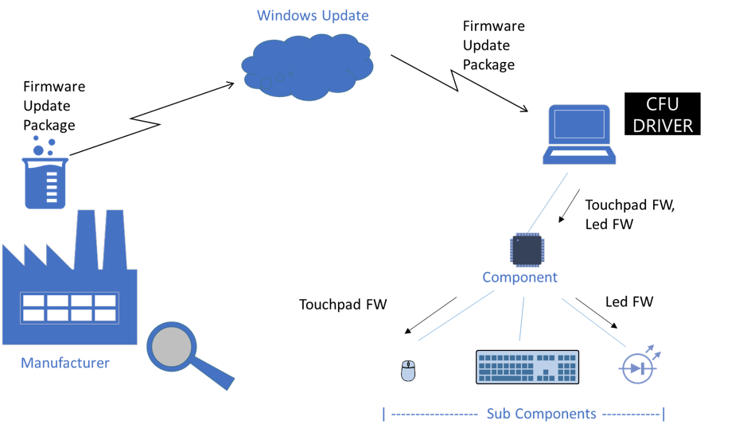
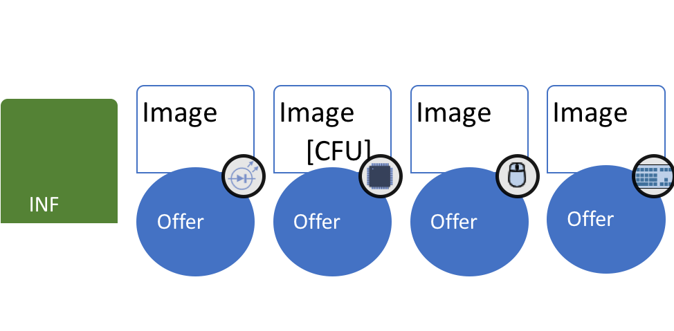
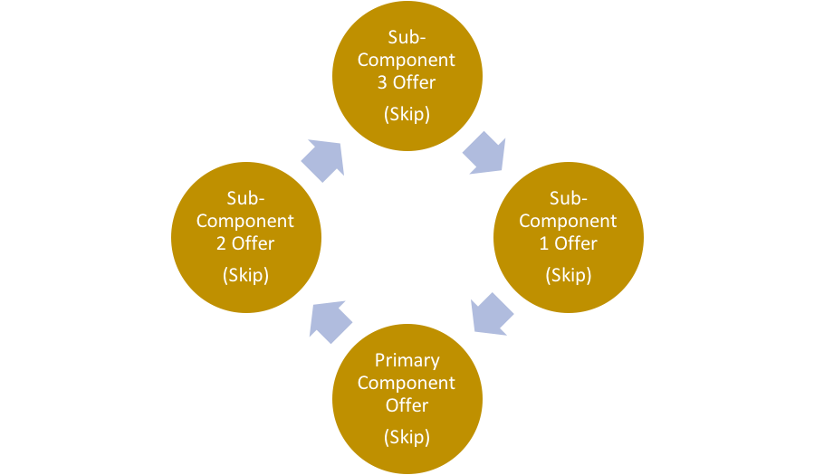
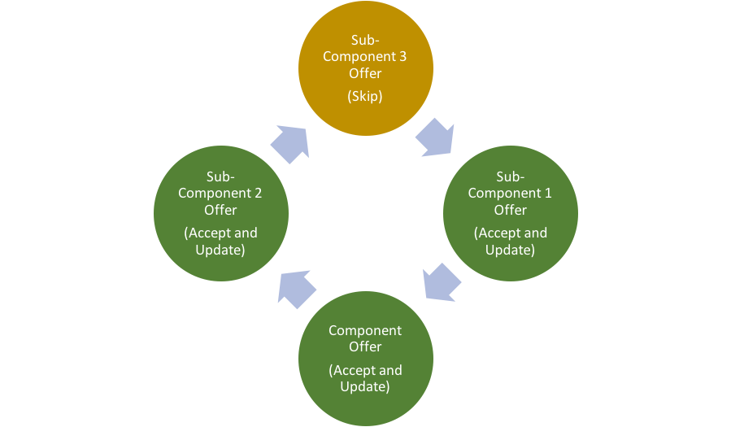
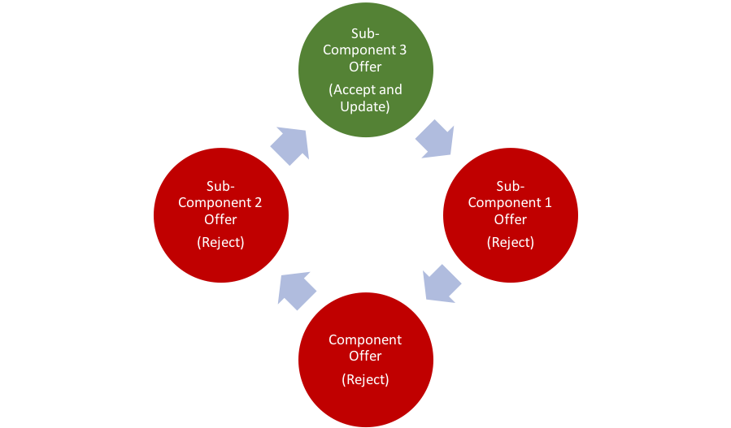
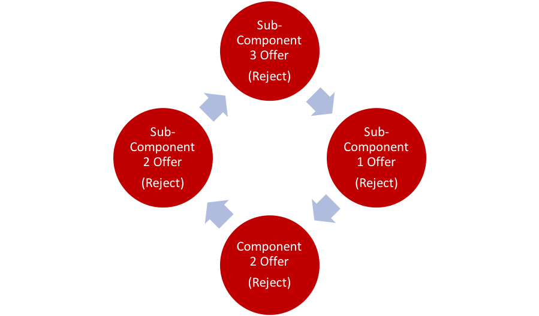
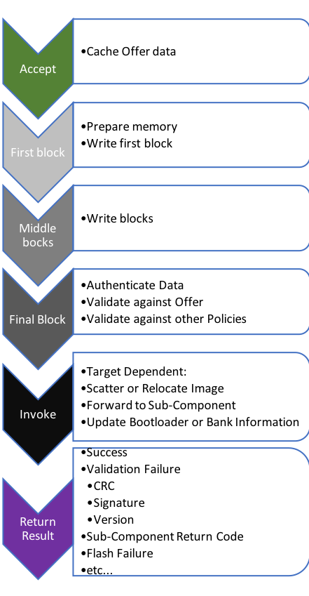

# Component Firmware Update (CPU) overview

The Microsoft Devices Team is excited to announce the release of an open-source model for Component Firmware Update for Windows system developers – **[Component Firmware Update](https://github.com/Microsoft/CFU) (CFU).** With CFU, you can easily deliver firmware updates through Windows Update by using CFU drivers.

**Background**

Computers and peripherals have components running their own software preprogrammed in the factory. However, over time, the factory software (“firmware”) must be updated to support new features or fix issues.

Firmware updates for embedded components have three primary delivery mechanisms:

- Stand-alone tools

- [Windows UEFI UpdateCapsule](https://docs.microsoft.com/windows-hardware/drivers/bringup/windows-uefi-firmware-update-platform) drivers

- Component-specific firmware update drivers

Each of those mechanisms have its own advantages. Stand-alone tools can support component-specific protocols but require the user to find and download the tools and find out if an update is available and applicable. UEFI UpdateCapsule drivers can be pushed through Windows Update but can only update components during boot-time when components may not be available or may not be attached. The most flexible mechanism is the component-specific firmware update driver, which can support component-specific protocols and can run whenever the device is enumerated on the system.

Writing a firmware update driver for each component-specific protocol can become a burden, so we defined the Component Firmware Update (CFU) standard protocol for use in our firmware update drivers and components. The protocol permits us to use a standardized driver and protocol to deliver firmware to any component that supports CFU.

Due to architectural differences, third-party firmware, or other issues, many of our components cannot support CFU. We designed CFU to allow a CFU-compatible component to receive firmware by using the CFU protocol and forward it to other components using their specific protocols. Thus, only one component in a collection of components needs to be CFU-compatible. The CFU driver delivers sub-component firmware to the primary component for forwarding to non-CFU components.

For components with very limited battery power, such as small wireless peripherals, firmware downloads are expensive operations and waste significant battery life if the firmware is ultimately rejected by the peripheral. To avoid this, CFU “offers” a firmware image before it is downloaded, providing specific properties such as version, hardware platform, and so on. If the primary component accepts an offer, it may still reject the firmware after download due to integrity issues that may arise during the transport of the image, or if the received image properties do not match the offered properties.

As part of our open-source effort, we are sharing the CFU protocol, driver sample, firmware sample code, and tool sample. This aims at enabling the system and peripheral developers to leverage this protocol, support their development, easily and automatically push firmware updates to Windows Update for many of their firmware components.

**Goals and Non-Goals**

CFU was developed with the following tenets in mind:

  - Update must occur with little or no user disruption – no “update mode” that requires the user to wait or even be aware that an update is taking place.

  - Update must be delivered through Windows Update drivers.

  - Update must be able to wait to update a device until it becomes available.

  - Drivers must not have to “know” specifics of any update package other than which component device to send it to.

  - Evaluation of the appropriateness of the update lies with the component receiving it, not in the driver.

  - Target must be able to reject firmware before it is downloaded if it is inappropriate.

  - Update must permit third-party versioning schemes to be mapped to a standardized versioning scheme.

CFU permits but does not specify:

  - Authentication policies or methods

  - Encryption policies or methods

  - Rollback policies or methods

  - Recovery of bricked firmware

**System Overview**

In CFU, a *primary* *component* is a device that understands the CFU protocol. This component can receive firmware from a CFU driver for itself or for the *sub-components* to which the component is connected. The CFU driver (*host*) is created by the component or device manufacturer and delivered through Windows Update. The driver is installed and loaded when the device is detected by Windows.

**Primary Components and Sub-Components**

A CFU-compatible system uses a hierarchical concept of a primary component and sub-components.  A primary component is a device that implements the device side of the CFU protocol and can receive updates for itself or its sub-components directly from the CFU driver. A primary component and sub-components can be internal or detachable.  A device may have multiple primary components, with or without sub-components, each with its own CFU driver.

Sub-components are updated by the component after receiving a CFU firmware image that is targeted for the sub-component. The mechanism that the component uses to update its sub-components is implementation specific between the sub-component and the primary component and is beyond the scope of the CFU specification.

**Offers and Payloads**

A CFU driver (host) may contain multiple firmware images for a primary component and sub-components associated with the component.

A package within the host comprises an *offer* and a *payload* or image and other information necessary for the driver to load. The offer contains enough information about the payload to allow the primary component to decide if it is an acceptable payload.  Offer information includes a CFU protocol version, component ID (and sub-component ID if applicable), firmware version, release vs. debug status, and other information. For some devices, downloading and flashing new firmware is expensive for battery life and other reasons. By issuing an offer, the CFU protocol avoids downloading or flashing firmware that would be rejected based on versioning and other platform policies.

The payload of a package is a range of addresses and bytes to be programmed. The bytes are opaque to the host.

**Offer Sequence**

The general firmware update sequence by using CFU is for the host to issue the offer of each package to the primary component. In general, the primary component can accept, reject, or skip the offer.

  - Accept offer—The primary component is ready to accept the firmware that was offered. If an offer is accepted, the payload is immediately delivered to the primary component.

  - Reject offer—The primary component is not interested in the firmware, possibly because it already has a better firmware, or the firmware violates some other internal policy.

  - Skip offer—The primary component may be interested in the firmware, but it is choosing to skip it for now.

If the offer is rejected or skipped, the host continues to cycle through its list of offers.  The driver repeats this cycle until all offers are rejected.

The optional skip response permits the primary component to examine the entire offer list to arrange it for ordering dependencies according to internal policies. After it has prioritized the offers in the list, it can continue to skip and accept the highest priority offer when the host replays the sequence. After an offer has been accepted and installed it is subsequently rejected if offered in a later cycle because the entity is up to date.  The cycle ends when all offers have been rejected. Because updates can change the policies themselves, such as “jail-breaking” during development, all offers are issued every cycle, even those that were previously rejected.

An offer can also be rejected if the primary component has accepted a download but must be restarted. In this case the component can reboot itself, if the user disruption is minimal, or the update can remain pending until the next system reboot. The host restarts the offer cycle after the reboot or component reset.

Consider an example of a device that has four components: one primary component and three sub components. Offers are made in no specific order within a cycle. Here is a representation of a possible host offer cycle:

In an example, in the first round, all offers are skipped to see all the Offers.

After seeing all the offers, the primary component determines that sub-component 1 must be updated before sub-component 3, and that the order of the primary component and sub-component 2 does not matter. The component sets sub-component 3 as lower priority than sub-component 1.

In the next offer cycle, the sub-component 3 offer is skipped again because sub-component 1 has not yet been updated and is higher priority.  Each of the other offers is accepted and updated.

In the next round, the sub-component 3 offer is accepted because the requirement to first update sub-component 2 has been met. All other offers are rejected because they are up to date.

Finally, in the last round, all offers are Rejected because the primary component and all sub-components are up to date.

At this time, the host has done all it can do. It ends the update process and updates its status in **Device Manager** according to the update results.

So, this mechanism permits ordering of updates, even to the same entity.  For example, if a component cannot receive version Y until it has version X due to some breaking change, both versions could be included, and version Y could be skipped until version X has been applied.

**CFU Driver (host) Independence**

It is important to note that the host does not have to make any decisions based on content of the offers or payloads. It simply sends the offers down and sends down the payloads that are accepted. It does not have to have any logic about what it is offering.  This permits it to be reused for diverse components and sub-components by changing only the offers and payloads it contains, and the component that the driver loads on.

The host does know the standard format of the offers to send the offer command. The host needs to understand the standard format of the payloads so that it can break them into addresses and bytes to deliver to the primary component. In the payload, the host does not need to know what data those fields contain.

**Payload Delivery**

After an offer has been accepted, the CFU Driver (the host) proceeds to download the firmware image, or Payload.  The primary component may prepare itself to receive it upon accepting the offer, or it may wait for the download to commence before making any changes.  The primary component may optionally cache the offer to check it against the payload after the payload is delivered but if possible, must evaluate the payload on its own merit, regardless of the offer.

Payload Delivery is accomplished in three phases, essentially, beginning, middle and end.

The Payload, in simplest terms, is a set of addresses and fixed-size arrays of bytes, for example Address 0x0000 0000 and 16 associated bytes, then Address 0x0000 0010 and 16 more bytes.  These are turned into write requests, one per address in the set, with its associated bytes.

The first write request is flagged so that the Component can do any preparations that it did not do when the Offer was first accepted, such as erase memory.  After the first write request, the Driver sends more Address + Data write commands until the final write.  The final write is flagged such that the Component knows that the download is complete and that it should validate the download and invoke or forward the new firmware.

The CFU Protocol specification defines several other result codes to assist in troubleshooting failures. See the complete specification for details. There is also room for implementers to add other codes for their own specific purposes, such as requesting immediate resets.

**Payload Validation and Authentication**

One of the most important aspects of firmware update is the validation of incoming firmware.  The first line of defense is to use a reliable transport mechanism with built-in robustness, such as USB or Bluetooth. These transports have built-in CRCs and retry mechanisms so that data is delivered reliably and in order.  Interfaces such as I2C™, SPI and UART do not have those mechanisms built-in and such robustness must be provided by higher layers.  At Microsoft, we prefer to use USB or Bluetooth Human Interface Device Class (HID) protocols for CFU, with a Vendor-Specific report structure, but any bidirectional command-response based mechanism can be used.

At a minimum, the primary component should verify bytes after each write to ensure that the data is properly stored before accepting the next set of bytes. Also, a CRC or hash should be calculated on the download in its entirety to be verified after the download is complete, to ensure that the data was not modified in transit. The delivery of a reference CRC or hash to be validated is beyond the scope of the protocol but is typically contained within the download image itself and verified by the primary component or sub-component that receives it before issuing a Result Code.

For enhanced protection, a cryptographic signature mechanism is recommended to provide end-to-end protection against accidental modification or intentional attack at any stage in the update delivery, from creation at the manufacturer to invocation by the component. If the download is required be confidential, an encryption mechanism can also be employed. Decryption and key management is also beyond of scope of the CFU protocol specification.

After the image has been authenticated, its properties should be validated against the offer and any other internal rules that the manufacturer requires. CFU does not specify the rules to be applied — these are up to the implementer. It is important to do this check *after* the update has been authenticated so that any self-declared characteristics can be considered trustworthy.

While it is possible (and recommended) for each sub-Component to validate its own images, one advantage of CFU is that the primary component can accept offers and validate the sub-component image on behalf of the sub-component by using a standardized validation algorithm devised by the manufacturer. The manufacturer can then design the primary component to apply the firmware by using less-secure means such as ARM-SWD, JTAG or other hardware-based methods.

**Payload Invocation**

One of the advantages of the CFU Protocol is that it is run at the application level in the primary component. It is not necessary to place the component in any special mode that disrupts its normal operation. As long as the component can receive and store the incoming payload without significant disruption, it can continue to do other tasks. The only potential disruption comes when the new firmware must be invoked.

There are two recommended means to avoid that disruption, although others are possible.  Both involve having enough storage to maintain the current running application while receiving at least one additional image. For the primary component, this means that it requires at least twice the normal application space, one space for the running primary component application, and one space for the incoming firmware package. For sub-components whose images are smaller than the primary component image, the primary component can use the extra space to store the sub-component image in its entirety.  If the sub-component image is larger than the primary component firmware, then separate packages are necessary, and must all be downloaded successfully for the sub-component update to complete.

The first invocation method uses a small bootloader image to select one of multiple images to run when the device is reset, typically at boot time, connection or power-up. The image selection algorithm is implementation specific, but typically is based on an algorithm involving the version of code, and an indication of successful validation of that image either at boot or when it was received. This is the most generic approach.

A second invocation method is to physically swap the memory of the desired image into the active address space upon reset. This capability is available in some microcontrollers and can also be accomplished with logic controls on external memory address bits.  This method has a disadvantage in that it requires specialized hardware but has the advantage that all images are statically linked to the same address space, and the mechanism does not require any bootloader.

**CFU Protocol Limitations**

There are a few caveats around CFU.

  - CFU cannot update a “bricked” component that can no longer run the protocol, yet new firmware has the potential to brick the component if not thoroughly validated and tested.

*Care must be taken when adopting any update mechanism to always test the update mechanism prior to every release.*

At Microsoft, we always build a “v.next” version so that we can validate that CFU has not been broken and can validate and invoke any subsequent update properly. Unbricking the component is beyond the of scope for the CFU protocol because the device cannot run the CFU protocol.

Implementers can use other methods to prevent bricking a device, such as having a third “fallback” fail-safe firmware image that is capable of CFU but that may not provide some features, or by implementing CFU as a function of the bootloader that is called by the application. If the application fails, the bootloader can be forced to take over and either fall back or provide a ‘bare-bones’ CFU interface until it is successfully updated.

  - CFU does not provide security. Security features can easily be overlaid on top of CFU by adding features to the validation algorithms used by the component and adding necessary data structures to the downloaded images such as Public Key Digital Signatures and appropriate key management.

  - CFU requires extra memory to store the incoming images because the protocol runs as part current firmware on the primary component. This will add cost to a system for the benefit of non-disruptive updates to the system.

Updating sub-component images that are larger than the component’s available storage requires dividing the sub-component image into a set of smaller update packages called *segments* and applying each segment separately.

The CFU protocol does not prohibit pausing the download to while portions of the image are forwarded. Thus, it may be possible to stream a large image through the primary component without segmentation. Such “streamed” segmentation is beyond the scope of the CFU specification. Care must be taken that the image can be properly validated after such a download is complete, such as maintenance of a running CRC or hash, as it is not fully resident in the primary component at the end of the download.

CFU presumes that the primary component has a set of validation rules to use. If those rules are to be changed, the component must first be successfully updated by using the old rules before new rules can be applied.

There is example source code for the Host CFU drivers and Firmware along with documentation on GitHub.  [**Component Firmware Update.**](https://github.com/Microsoft/CFU)
