# Component Firmware Update (CFU) protocol specification

This specification describes a generic HID protocol to update firmware for components present on a PC or accessories. The specification allows for a component to accept firmware without interrupting the device operation during a download. The specification supports configurations where the component accepting the firmware might have sub-components, which require separate firmware images. The specification allows component in-charge to decide whether to accept the firmware. It also acts as an optimization because the firmware image is only sent to the component if it is able or ready to accept it.

> [!NOTE]
> CFU is available in Windows 10, version 2004 (Windows 10 May 2020 Update) and later versions.

## Contents

- [1 Introduction](#1-introduction)
  - [1.1 Glossary](#11-glossary)
  - [1.2 Scope](#12-scope)
    - [1.2.1 Goals](#121-goals)
    - [1.2.2 Non-Goals](#122-non-goals)
- [2 Supported Hardware Architecture](#2-supported-hardware-architecture)
- [3 Protocol Prerequisites](#3-protocol-prerequisites)
- [4 CFU Protocol Overview](#4-cfu-protocol-overview)
  - [4.1 Firmware Update Programming Command Sequence](#41-firmware-update-programming-command-sequence)
    - [4.1.1 State: Host Initialized Notification](#411-state-host-initialized-notification)
    - [4.1.2 State: OFFER_INFO_START_OFFER_LIST Notification](#412-state-offer_info_start_offer_list-notification)
    - [4.1.3 State: Send FIRMWARE_UPDATE_OFFER Command](#413-state-send-firmware_update_offer-command)
    - [4.1.4 State: Send Firmware](#414-state-send-firmware)
    - [4.1.5 Decision State: Are there more offers](#415-decision-state-are-there-more-offers)
    - [4.1.6 State: OFFER_INFO_END_OFFER_LIST Notification](#416-state-offer_info_end_offer_list-notification)
    - [4.1.7 Decision State: Replay Offer list](#417-decision-state-replay-offer-list)
    - [4.1.8 State: Device is Busy](#418-state-device-is-busy)
- [5 CFU Protocol Packet Format](#5-cfu-protocol-packet-format)
  - [5.1 GET_FIRMWARE_VERSION](#51-get_firmware_version)
    - [5.1.1 Command](#511-command)
    - [5.1.2 Response](#512-response)
      - [5.1.2.1 Header](#5121-header)
      - [5.1.2.2 Component Version and Properties](#5122-component-version-and-properties)
    - [5.1.3 Mapping to HID](#513-mapping-to-hid)
  - [5.2 FIRMWARE_UPDATE_OFFER](#52-firmware_update_offer)
    - [5.2.1 Command](#521-command)
      - [5.2.1.1 Component Information](#5211-component-information)
      - [5.2.1.2 Firmware Version](#5212-firmware-version)
      - [5.2.1.3 Vendor Specific](#5213-vendor-specific)
      - [5.2.1.4 Misc. and Protocol version](#5214-misc-and-protocol-version)
    - [5.2.2 Response](#522-response)
      - [5.2.2.1 Token](#5221-token)
      - [5.2.2.2 Reserved (B7 - B4)](#5222-reserved-b7---b4)
      - [5.2.2.3 Reject Reason (RR)](#5223-reject-reason-rr)
      - [5.2.2.4 Status](#5224-status)
    - [5.2.3 Mapping to HID Protocol](#523-mapping-to-hid-protocol)
  - [5.3 FIRMWARE_UPDATE_OFFER - Information](#53-firmware_update_offer---information)
    - [5.3.1 Command](#531-command)
      - [5.3.1.1 Component](#5311-component)
      - [5.3.1.2 Reserved B7 - B4](#5312-reserved-b7---b4)
      - [5.3.1.3 Reserved B11 - B8](#5313-reserved-b11---b8)
      - [5.3.1.4 Reserved B15 - B12](#5314-reserved-b15---b12)
    - [5.3.2 Response](#532-response)
      - [5.3.2.1 Token](#5321-token)
      - [5.3.2.2 Reserved B7 - B4](#5322-reserved-b7---b4)
      - [5.3.2.3 Reject Reason (RR)](#5323-reject-reason-rr)
      - [5.3.2.4 Status](#5324-status)
  - [5.4 FIRMWARE_UPDATE_OFFER - Extended](#54-firmware_update_offer---extended)
    - [5.4.1 Command](#541-command)
      - [5.4.1.1 Component](#5411-component)
      - [5.4.1.2 Reserved B7 - B4](#5412-reserved-b7---b4)
      - [5.4.1.3 Reserved B11 - B8](#5413-reserved-b11---b8)
      - [5.4.1.4 Reserved B15 - B12](#5414-reserved-b15---b12)
    - [5.4.2 Response](#542-response)
      - [5.4.2.1 Token](#5421-token)
      - [5.4.2.2 Reserved B7 - B4](#5422-reserved-b7---b4)
      - [5.4.2.3 Reject Reason](#5423-reject-reason)
      - [5.4.2.4 Status](#5424-status)
  - [5.5 FIRMWARE_UPDATE_CONTENT](#55-firmware_update_content)
    - [5.5.1 Command](#551-command)
      - [5.5.1.1 Header (B7 - B0)](#5511-header-b7---b0)
      - [5.5.1.2 Data](#5512-data)
    - [5.5.2 Response](#552-response)
      - [5.5.2.1 Sequence Number](#5521-sequence-number)
      - [5.5.2.2 Status](#5522-status)
      - [5.5.2.3 Reserved B8 - B11](#5523-reserved-b8---b11)
      - [5.5.2.4 Reserved B12 - B15](#5524-reserved-b12---b15)
- [6 Appendix 1: Example Firmware Update Programming Command Sequence](#6-appendix-1-example-firmware-update-programming-command-sequence)
  - [6.1 Example 1](#61-example-1)
  - [6.2 Example 2](#62-example-2)

## Tables

[Table 5.1-1 GET_FIRMWARE_VERSION Response Layout](#table-51-1-get_firmware_version-response-layout)

[Table 5.1-2 GET_FIRMWARE_VERSION Response - Header Layout](#table-51-2-get_firmware_version-response----header-layout)

[Table 5.1-3 GET_FIRMWARE_VERSION Response - Header Bits](#table-51-3-get_firmware_version-response---header-bits)

[Table 5.1-4 GET_FIRMWARE_VERSION Response - Component Version and Properties Layout](#table-51-4-get_firmware_version-response---component-version-and-properties-layout)

[Table 5.1-5 GET_FIRMWARE_VERSION Response - Component Version and Properties Bites](#table-51-5-get_firmware_version-response---component-version-and-properties-bites)

[Table 5.2-1 FIRMWARE_UPDATE_OFFER Command Layout](#table-52-1-firmware_update_offer-command-layout)

[Table 5.2-2 FIRMWARE_UPDATE_OFFER Command - Component Information Layout](#table-52-2-firmware_update_offer-command---component-information-layout)

[Table 5.2-3 FIRMWARE_UPDATE_OFFER Command - Component Information Bits](#table-52-3-firmware_update_offer-command---component-information-bits)

[Table 5.2-4 FIRMWARE_UPDATE_OFFER Command - Firmware Version Layout](#table-52-4-firmware_update_offer-command---firmware-version-layout)

[Table 5.2-5 FIRMWARE_UPDATE_OFFER Command - Firmware Version Bits](#table-52-5-firmware_update_offer-command---firmware-version-bits)

[Table 5.2-6 FIRMWARE_UPDATE_OFFER Command - Vendor Specific Layout](#table-52-6-firmware_update_offer-command---vendor-specific-layout)

[Table 5.2-7 FIRMWARE_UPDATE_OFFER Command - Misc. and Protocol version](#table-52-7-firmware_update_offer-command---misc-and-protocol-version)

[Table 5.2-8 FIRMWARE_UPDATE_OFFER Response Token Layout](#table-52-8-firmware_update_offer-response-token-layout)

[Table 5.2-9 FIRMWARE_UPDATE_OFFER Response - Token Layout](#table-52-9-firmware_update_offer-response---token-layout)

[Table 5.2-10 FIRMWARE_UPDATE_OFFER Response - Token Bits](#table-52-10-firmware_update_offer-response---token-bits)

[Table 5.2-11 FIRMWARE_UPDATE_OFFER Response - Reject Reason Layout](#table-52-11-firmware_update_offer-response---reject-reason-layout)

[Table 5.2-12 FIRMWARE\_UPDATE\_OFFER Response - Reject Reason Bits](#table-52-12-firmware_update_offer-response---reject-reason-bits)

[Table 5.2-13 FIRMWARE\_UPDATE\_OFFER Response RR Code Values](#table-52-13-firmware_update_offer-response-rr-code-values)

[Table 5.2-14 FIRMWARE_UPDATE_OFFER Response Status Layout](#table-52-14-firmware_update_offer-response-status-layout)

[Table 5.2-15 FIRMWARE_UPDATE_OFFER Response - Status Bits](#table-52-15-firmware_update_offer-response---status-bits)

[Table 5.2-16 FIRMWARE_UPDATE_OFFER Response Status Values](#table-52-16-firmware_update_offer-response-status-values)

[Table 5.3-1 FIRMWARE_UPDATE_OFFER - Information Command Layout](#table-53-1-firmware_update_offer---information-command-layout)

[Table 5.3-2 FIRMWARE_UPDATE_OFFER - Information Command - Component Layout](#table-53-2-firmware_update_offer---information-command---component-layout)

[Table 5.3-3 FIRMWARE_UPDATE_OFFER - Information Command - Component Bits](#table-53-3-firmware_update_offer---information-command---component-bits)

[Table 5.3-4 FIRMWARE_UPDATE_OFFER - Information Command - Information Code Values](#table-53-4-firmware_update_offer---information-command---information-code-values)

[Table 5.3-5 FIRMWARE_UPDATE_OFFER - Information Response Layout](#table-53-5-firmware_update_offer---information-response-layout)

[Table 5.3-6 FIRMWARE_UPDATE_OFFER- Information Packet Response Token Layout](#table-53-6-firmware_update_offer--information-packet-response-token-layout)

[Table 5.3-7 FIRMWARE_UPDATE_OFFER - Information Response - Token Bits](#table-53-7-firmware_update_offer---information-response---token-bits)

[Table 5.3-8 FIRMWARE_UPDATE_OFFER - Information Response - RR Code Layout](#table-53-8-firmware_update_offer---information-response---rr-code-layout)

[Table 5.3-9 FIRMWARE_UPDATE_OFFER- Offer Information Response - RR Code Bits](#table-53-9-firmware_update_offer--offer-information-response---rr-code-bits)

[Table 5.3-10 FIRMWARE_UPDATE_OFFER- Information Response - RR Code Values](#table-53-10-firmware_update_offer--information-response---rr-code-values)

[Table 5.3-11 FIRMWARE_UPDATE_OFFER - Offer Information Response Status Layout](#table-53-11-firmware_update_offer---offer-information-response-status-layout)

[Table 5.3-12 FIRMWARE_UPDATE_OFFER - Offer Information - Response Status Bits](#table-53-12-firmware_update_offer---offer-information---response-status-bits)

[Table 5.4-1 FIRMWARE_UPDATE_OFFER - Extended Command Layout](#table-54-1-firmware_update_offer---extended-command-layout)

[Table 5.4-2 FIRMWARE_UPDATE_OFFER - Extended Command Packet - Command - Component Layout](#table-54-2-firmware_update_offer---extended-command-packet---command---component-layout)

[Table 5.4-3 FIRMWARE_UPDATE_OFFER - Extended Command - Component Bits](#table-54-3-firmware_update_offer---extended-command---component-bits)

[Table 5.4-4 FIRMWARE_UPDATE_OFFER - Extended Command - Command Code Values](#table-54-4-firmware_update_offer---extended-command---command-code-values)

[Table 5.4-5 FIRMWARE_UPDATE_OFFER - Extended Command Packet Response Layout](#table-54-5-firmware_update_offer---extended-command-packet-response-layout)

[Table 5.4-6 FIRMWARE_UPDATE_OFFER- Offer Command Packet Response - Token Layout](#table-54-6-firmware_update_offer--offer-command-packet-response---token-layout)

[Table 5.4-7 FIRMWARE_UPDATE_OFFER - Offer Command Response - Token Bits](#table-54-7-firmware_update_offer---offer-command-response---token-bits)

[Table 5.4-8 FIRMWARE_UPDATE_OFFER - Offer Information Packet Response RR Layout](#table-54-8-firmware_update_offer---offer-information-packet-response-rr-layout)

[Table 5.4-9 FIRMWARE_UPDATE_OFFER- Offer Command Response - RR Code](#table-54-9-firmware_update_offer--offer-command-response---rr-code)

[Table 5.4-10 FIRMWARE_UPDATE_OFFER- Offer Command Packet - RR Code Values](#table-54-10-firmware_update_offer--offer-command-packet---rr-code-values)

[Table 5.4-11 FIRMWARE_UPDATE_OFFER - Offer Command Packet Response Status Layout](#table-54-11-firmware_update_offer---offer-command-packet-response-status-layout)

[Table 5.4-12 FIRMWARE_UPDATE_OFFER- Offer Command Packet Response RR Code](#table-54-12-firmware_update_offer--offer-command-packet-response-rr-code)

[Table 5.5-1 FIRMWARE_UPDATE_CONTENT Command Layout](#table-55-1-firmware_update_content-command-layout)

[Table 5.5-2 FIRMWARE_UPDATE_CONTENT Command Header Layout](#table-55-2-firmware_update_content-command-header-layout)

[Table 5.5-3 FIRMWARE_UPDATE_CONTENT Header Bits](#table-55-3-firmware_update_content-header-bits)

[Table 5.5-4 FIRMWARE_UPDATE_OFFER- Offer Command Packet - Flag Values](#table-55-4-firmware_update_offer--offer-command-packet---flag-values)

[Table 5.5-5 FIRMWARE_UPDATE_CONTENT Command Data Layout](#table-55-5-firmware_update_content-command-data-layout)

[Table 5.5-6 FIRMWARE_UPDATE_CONTENT Command Data Bits](#table-55-6-firmware_update_content-command-data-bits)

[Table 5.5-7 FIRMWARE_UPDATE_CONTENT Command Response Layout](#table-55-7-firmware_update_content-command-response-layout)

[Table 5.5-8 FIRMWARE_UPDATE_CONTENT Response - Sequence Number](#table-55-8-firmware_update_content-response---sequence-number)

[Table 5.5-9 FIRMWARE_UPDATE_CONTENT - Command - Response Bits](#table-55-9-firmware_update_content---command---response-bits)

[Table 5.5-10 FIRMWARE_UPDATE_CONTENT Response Status Layout](#table-55-10-firmware_update_content-response-status-layout)

[Table 5.5-11 FIRMWARE_UPDATE_OFFER - Response - Status Bits](#table-55-11-firmware_update_offer---response---status-bits)

[Table 5.5-12 FIRMWARE_UPDATE_OFFER- Response - Status Code Values](#table-55-12-firmware_update_offer--response---status-code-values)

## 1 Introduction

Today's PCs and accessories have internal components that perform complex operations. To ensure a quality product, there is a need to frequently update the behavior of these devices in later stages of development or after they have shipped to the customers. The update might fix identified functional or security issues, or a need to add new features. A large portion of the complex logic is in the firmware running on the device, which is updatable.

This specification describes a generic HID protocol to update the firmware for components present on a PC or its accessories. HID implementation is beyond the scope of the specification.

Some of the features of the protocol are:

- The protocol is based on HID— ubiquitous and has Windows in-box support over various interconnect buses such as USB and I2C. Therefore, the same software (driver) solution can be leveraged to update the firmware for all components.

  > [!NOTE]
  > Because the specification is packet-based, it is simple to adapt it to non-HID scenarios.

- The specification allows for a component to accept firmware without interrupting the device operation during the download. It allows a better experience for users because they do not have to wait for the firmware update process to complete before they can resume other tasks. The new firmware can be invoked in a single atomic operation at a time that has minimal impact upon the user.

- The specification supports configurations where the component accepting the firmware might have sub-components, which require separate firmware images.

  > [!NOTE]
  > The process of a component handing over the firmware to the sub-component is outside the scope of this specification.

- The specification supports the concept of an *offer* and relies on the component in-charge to decide whether to accept the firmware. The decision to accept new firmware is not trivial. There might be dependencies between the firmware type and/or version and the underlying type/version of hardware to which the new firmware applies. An offer also acts as an optimization mechanism because the firmware image is sent to the component only if it is able /ready to accept it.

## 1.1 Glossary

| Term | Description |
|--|--|
| Component ID | In a device with multiple components, a component ID uniquely identifies each component. |
| CRC | Cyclic Redundancy Check  A non-cryptographic hashing algorithm used to produce a digest or fingerprint of a block of data. The CRC is used as a check to provide assurance that the data block has not changed since the CRC was computed. The CRC is not infallible but provides confidence that the data was received correctly. |
| Device | A collection of components (one primary component and zero or more sub-components). The device is visible to the operating system as a single unit. The host interacts with the device, which is typically the primary component.  A computer may have multiple devices in it. With respect to this specification, the communications to 2 different devices are totally independent. |
| Driver | A driver that is written by using the Windows Driver Foundation (WDF) framework. |
| Firmware | The code that is running on the physical hardware. Firmware is updatable and usually resides in programmable memory associated with the hardware. |
| Hardware | A physical piece of silicon on the computer. |
| Primary Component | A piece of hardware on a computer and the firmware for it. In the context of this specification, a component is the entity that needs and accepts the firmware update. |
| Segment | A firmware image for a component may be segmented into smaller segments. Each segment is a small firmware image. |
| Segment ID | If a firmware of a component is segmented into smaller segments, segment ID is the unique identifier for the segment. |
| Signature | A cryptographic means to determine if the firmware image has been altered by unauthorized means. Signatures are optional but recommended and beyond the scope of this specification. |
| Sub-component | Depending on the hardware architecture, not all components may be visible to the operating system, because they may be connected downstream of a component that is visible to the system. These components are referred to as sub-components in this specification. |
| TLC | HID Top Level Collection. |
| Token | An identifier for a host session. A host creates a token and sends it in commands, and the device returns it in the response. Tokens may be used to serialize certain transactions or to identify that a session has been lost and another started. |

## 1.2 Scope

### 1.2.1 Goals

- A bus-agnostic solution is required to avoid a new protocol for every type of bus. HID is ubiquitous and addresses that requirement.

- The ability to support firmware update for a multi-component device, where one component acts as the primary component and others are sub-components connected to the primary component. Each component requires its own firmware with non-trivial dependencies amongst each other.

- A common driver model for downloading the firmware image to the component. The component then has sub-component specific algorithms for forwarding to the sub-components. The sub-components may also perform validity checks on their firmware and pass the results back to the primary component.

- The ability to support firmware update while device operation is in progress.

- The ability to update/rollback the firmware in production devices through authorized tools, and update in-market devices through Windows Update.

- The flexibility to support in-development firmware/in-market firmware.

- The ability to segment a large firmware image into smaller segments to make it easier for the component to accept the firmware image. 

### 1.2.2 Non-Goals

- Define the internal format of the firmware image: For the host, the firmware image is a set of address and payload entries.

- Sign/encrypt/validate the accepted firmware: This specification does not describe how to sign and encrypt the firmware images. It is required that the expected current firmware running on the component validates the firmware being downloaded.

- Define a mechanism about how the component interacts with the sub-components: The host interacts with the device as single unit, typically the primary component. The component must act as a bridge for communication related to the sub-component firmware.

## 2 Supported Hardware Architecture

To support a flexible hardware design, the protocol supports a multi-component device where each component requires its own firmware image. In the design, one component is the primary component and the dependent sub-components are connected to that primary component. Each component is uniquely described by a component ID.  

The multi-component device is visible to the operating system as single unit. The host only interacts with the device, typically the primary component using this CFU protocol. The communication between the component and its-subcomponents is beyond the scope of this specification.  

On a PC, there might be many different devices (where a device may have one or more components in there). In the context of this protocol, the communication to each device is independent. Each device has a corresponding instance of the host.  

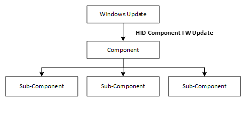

## 3 Protocol Prerequisites

This section lists the perquisites and best practices that must be implemented to leverage this protocol:

- Atomic image usage

  A firmware image for a component is not used until the entire firmware image has been successfully downloaded. In case the firmware is split into multiple segments, the image must not be used until the final segment is received from the sender. Integrity checks must be are performed on the final image. It is recommended that the transport, being used to deliver the firmware image, has error-correction and retry mechanisms in place to avoid a repeat download in case of transport errors.  

- Firmware update must not interrupt device operation

  The device accepting the firmware image must be able to operate during the update. The device must have extra memory to store and validate the incoming firmware, while its current firmware is not overwritten.  

- Authentication and integrity

  The implementor decides that factors that constitute an authentic firmware image. It is recommended that the component's current firmware must at least validate the CRC of the incoming firmware image. The current firmware should also employ digital signature, or, other error detection algorithms. If the validation fails, the firmware rejects the update. Failure Recovery

  If the firmware image is downloaded and unsuccessful, the device must not invoke the new firmware and continue to operate with the existing firmware.  The host can retry the update. The frequency of retry is implementation specific.

- Confidentiality

  Optional. A firmware segment may be encrypted. The encryption and decryption techniques are beyond the scope of this specification. This specification treats the firmware payload as a stream of data, regardless of whether it is encrypted.

- Rollback protection

  Rollback policies are enforced by the primary component and are implementation specific.  The current firmware on the component validates incoming firmware images against internal policies such as the version number must be newer, or release type cannot be switched from release to debug, and so on. The protocol permits messaging to indicate that an update is accepted even if it is violating rollback policies.

## 4 CFU Protocol Overview

The CFU protocol is a set of commands and responses that are required to send the new firmware image(s) from the host to the device for which the firmware is intended.

At a high level the protocol iterates through all the firmware images to send to the device. For each firmware image, the host *offers* to send the file to the device. Only if the device accepts the offer, the host sends the file.

To support cases where a device update order has dependencies, the device may not accept certain offers in the first pass, therefore the protocol allows the host to resend all the firmware offers to the device until all dependencies are resolved.

### 4.1 Firmware Update Programming Command Sequence

Here is the CFU command sequence for updating firmware image.

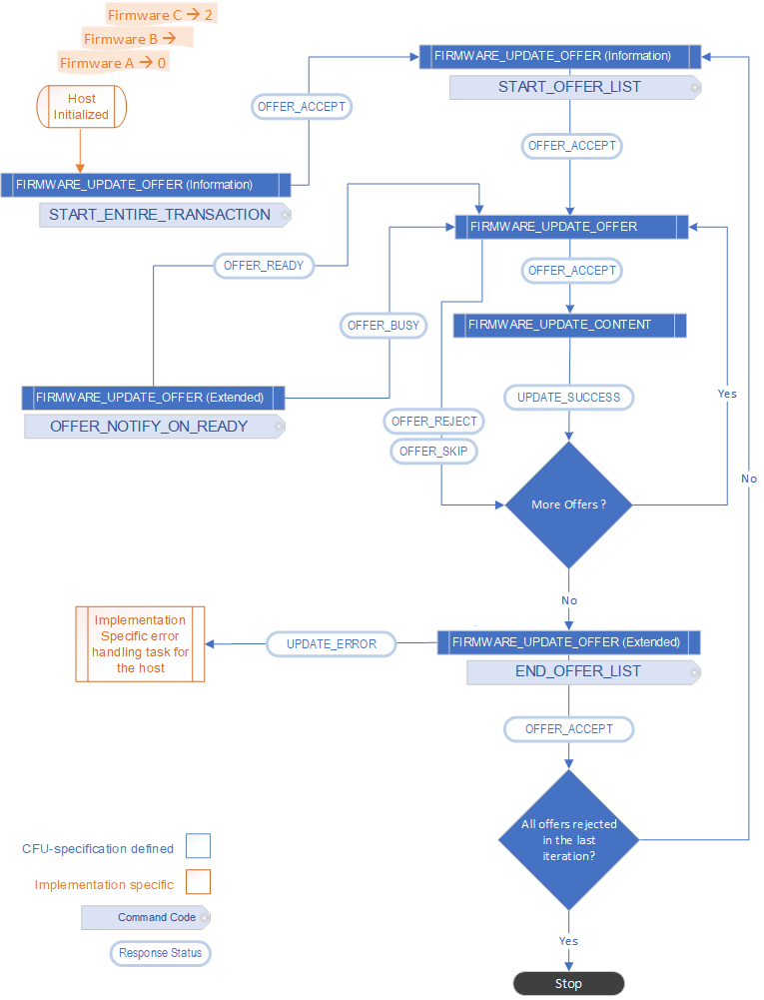

#### 4.1.1 State: Host Initialized Notification

After the host initializes itself and has identified a set of offers it needs to send to the device, the host issues an OFFER\_INFO\_START\_ENTIRE\_TRANSACTION command to indicate to the component that the host is now initialized. The purpose of this command is to notify the current device firmware that a new instance of the host is available. This notification is useful when a prior instance of the host gets terminated unexpectedly. The device must complete this command with success.

#### 4.1.2 State: OFFER\_INFO\_START\_OFFER\_LIST Notification

In this state, host issues the OFFER\_INFO\_START\_OFFER\_LIST command to indicate that it is ready to send the offer(s) to the current device firmware. The primary component of the device must complete this command with success.

This command is useful because the host may send all offers to the device more than once.

#### 4.1.3 State: Send FIRMWARE\_UPDATE\_OFFER command

The host sends an offer to the primary component (or its sub-component) to check if the component would like to accept/reject the firmware. The offer contains all the necessary metadata about the firmware image, so that the current firmware on the component can decide whether to accept, pend, skip or reject the offer.

The offer may be for the primary component or the sub-component. If the component can accept the offer, it prepares itself to receive the firmware. This may involve preparing a memory bank to receive the incoming firmware image. The component may not accept the offer, e.g., the component may already have a newer (or same) firmware version that the host intends to send. For more reasons, see the examples described in Appendix 1: Example Firmware Update Programming Command Sequence.

Even if an offer is accepted, the primary component may still reject the firmware image after the download for failure of integrity and/or rollback checks against the actual image received. The component must check each firmware image property independent of any information in the offer.

The host issues the FIRMWARE\_UPDATE\_OFFER command to notify the primary component about the firmware image the host intends to send.

If the component accepts the offer, it with FIRMWARE\_UPDATE\_OFFER\_ACCEPT status thereby accepting the offer.

If the device firmware is busy and the primary component is not able to accept this or the next offer currently, it sends a busy response with FIRMWARE\_UPDATE\_OFFER\_BUSY status.

If the current firmware is interested in the offer, however cannot accept the offer (e.g. due to a dependency on a missing update for sub-component) it responds with a FIRMWARE\_UPDATE\_OFFER\_SKIP indicating that it is interested in this firmware however is unable to accept it. The host then proceeds to the next offer and must re-offer this firmware later.

If the current firmware is not interested in the offer (e.g. it is an older version), then it responds with a FIRMWARE\_UPDATE\_OFFER\_REJECT status providing the appropriate reject reason. This status does not indicate that host cannot resend this offer in the future. The host typically sends each offer every time it initializes or resends the list of offers to the device (see State: OFFER\_INFO\_START\_OFFER\_LIST Notification).

#### 4.1.4 State: Send Firmware

In this state the host starts sending the firmware image to the primary component, for which the component has previously accepted the offer.

Because the contents of the firmware image are likely to go over the payload limits of a single command, the host breaks the firmware images into packets. The host sends each packet sequentially in a separate FIRMWARE\_UPDATE CONTENT command. The primary component must generate a response packet for each command.

Each FIRMWARE\_UPDATE CONTENT command describes an offset address that includes a partial firmware payload. The component uses the offset to determine the address where the partial firmware payload must be stored. The device writes the contents to an appropriate location and acknowledges the command by sending a response.

For the first packet the host sends, it sets the FIRMWARE\_UPDATE\_FLAG\_FIRST\_BLOCK flag, indicating to the device that this is the first packet of the firmware image. If the device has already not prepared itself to receive the firmware, it may do so at this time.

For the last packet, the host sends, it sets the FIRMWARE\_UPDATE\_FLAG\_LAST\_BLOCK flag.

After the current firmware on the device has written the partial firmware payload included in this command, it *must* perform validation and authentication checks on the incoming firmware image before sending a response. This minimally includes:

- A CRC check to verify the integrity of the entire firmware image.

- If the CRC check succeeds, optional verification of a signature of the incoming image.

- After the optional signature check, a version check to ensure that the new firmware version is the same or newer than the existing firmware.

In case the incoming firmware image was divided into smaller segments, it is up to the current firmware to determine whether it is the last segment of the firmware image, and subsequently include all segments as part of the validation.

If the preceding checks pass, the current firmware can set up the device to swap to the new image at the next reset and reports success to the host. Typically, the component does not initiate a self-reset. This is to prevent disruptions in any software, firmware, hardware entities with which the component is interacting. However, that is not a requirement and may vary depending on the implementation.

If the verification steps fail, the firmware must not set up a swap on the next reset and must indicate a failure response to the host.

#### 4.1.5 Decision State: Are there more offers

In this state, the host determines if there are more offers to send to the device.

#### 4.1.6 State: OFFER\_INFO\_END\_OFFER\_LIST Notification

This state is reached when the host has sent all the offers to the primary component in the current device firmware. The host sends the OFFER\_INFO\_END\_OFFER\_LIST command to indicate that it has sent all the offers to the component.

The device must complete this command with success.

#### 4.1.7 Decision State: Replay Offer list

The host determines if it needs to resend all the offers. That case might occur if previously the primary component had skipped some offers and accepted some offers. The host must replay the offer list again.

There may be other implementation specific logic that may result in a decision to replay the offer list.

#### 4.1.8 State: Device is Busy

This state implies that a device returned a busy response to an offer.

The host sends an OFFER\_NOTIFY\_ON\_READY command, to which the device does not response with acceptance until the device is free.

## 5 CFU Protocol Packet Format

The CFU protocol is implemented as set of commands and responses. The protocol is sequential in nature. For each command that the host sends to a component, the component is expected to respond (unless explicitly stated otherwise in this specification). The host does not send the next command, until a valid response is received for the previous command it sent.  

In case the component does not respond within a period, or sends an invalid response, the host may restart the process from the beginning. This protocol does not define a specific timeout value.  

There are commands to get the version information of current firmware on the component; to send the offer and to send the firmware image.

However, the host does not need to withhold an offer based on the response received from the primary component about the queried version information. The information is made discoverable for logging or other purposes.

### 5.1 GET\_FIRMWARE\_VERSION

Gets the current firmware version(s) of the primary component (and its sub-components). The command does not have any arguments.

#### 5.1.1 Command

This command is sent by the host to query the version(s) of current firmware(s) on the primary component (and its sub-components). The host may use it to confirm whether the firmware was successfully updated. On receiving this command, the primary component responds with the firmware version for itself and all the sub-components.

#### 5.1.2 Response

The component responds with the firmware version of the primary component and the sub-components. The response size is 60 bytes allowing version information for up to seven components (one primary and up to six sub-components).

###### Table 5.1-1 GET_FIRMWARE_VERSION Response Layout

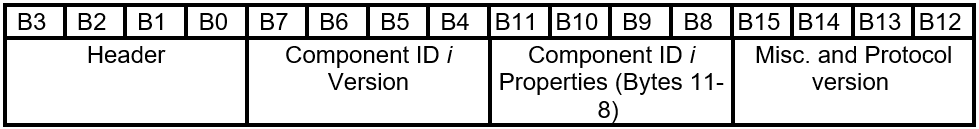

##### 5.1.2.1 Header

###### Table 5.1-2 GET_FIRMWARE_VERSION Response -  Header Layout

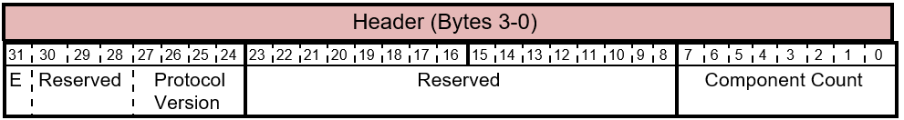

The header for the response provides the following information.

###### Table 5.1-3 GET_FIRMWARE_VERSION Response - Header Bits

| Bit Offset | Field | Size | Description |
|--|--|--|--|
| 0 | Component Count | 8 | The number of downloadable components managed through this mechanism for this Component. The Component Count determines the maximum table size. Currently up to 7 components are supported to ensure that the response can fit within the allowed 60 bytes. |
| 8 | Rsvd | 16 | Reserved fields. Sender must set these to 0. Receiver must ignore this value. |
| 24 | Protocol Version | 4 | The firmware update revision bits represent the FW Update Protocol revision is currently being used in the transport. For the interface defined herein, the FW Update Revision must be 0010b. |
| 28 | Rsvd | 3 | Reserved fields. Sender must set these to 0. Receiver must ignore this value. |
| 31 | E | 1 | The extension flag is a future protocol hook for enabling additional components to be reported. |

##### 5.1.2.2 Component Version and Properties

For each component, two DWORDs are used to describe the properties of the component up to 7 components. If the component count in the header is less than 7, the unused DWORDS at the end of the response must be set to 0.

###### Table 5.1-4 GET_FIRMWARE_VERSION Response - Component Version and Properties Layout

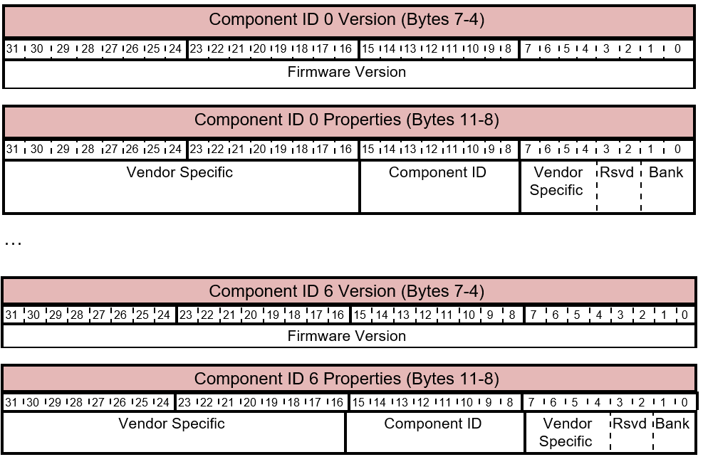

Each component specific information is described in two DWORDs as follows:

###### Table 5.1-5 GET_FIRMWARE_VERSION Response - Component Version and Properties Bites

| Bit Offset | Field | Size | Description |
|--|--|--|--|
| 0 | Firmware Version | 32 | Returns the version of the current firmware for that component. This specification does not mandate any specific format for the firmware version. See section Firmware Version for guidelines. |
| 32 | Bank | 2 | Optional. Depending on the architecture, the component hardware may have multiple banks in which the firmware may be stored. Depending on implementation, the sender may specify the bank in which the firmware currently exists. This field is Conditional Mandatory - support is optional, however must not be used for any other purpose. |
| 34 | Reserved | 2 | Reserved fields. Sender must set these to 0. Receiver must ignore this value. |
| 36 | Vendor Specific | 4 | Vendor specific field that may be used in an implementation specific manner.  A vendor could use these bits to encode information such as:  - Type of the firmware: Pre-release/self-host/production; debug/retail  - Development phase  - Product ID, to prevent components from receiving firmware for other products using the same update protocol. |
| 40 | Component ID | 8 | A unique identifier for the component. |
| 48 | Vendor Specific | 16 | Vendor specific field that may be used in an implementation specific manner. |

#### 5.1.3 Mapping to HID

This is implemented as a **HID Get Feature** request with a response size of 60 bytes, in addition to the Report ID. The feature report length accommodates the entire GET\_FIRMWARE\_VERSION response. There is no data associated with the Get Feature request from the host.

### 5.2 FIRMWARE\_UPDATE\_OFFER

Determines whether the primary component accepts or rejects a firmware.

#### 5.2.1 Command

The host sends this command to the component to determine whether it accepts or rejects a firmware. The host must send an offer and the component must accept the offer before the host can send the firmware.

The FIRMWARE\_UPDATE\_OFFER Command packet is defined as follows.

###### Table 5.2-1 FIRMWARE_UPDATE_OFFER Command Layout

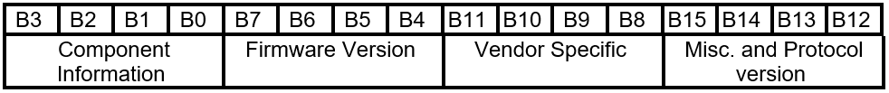

##### 5.2.1.1 Component Information

###### Table 5.2-2 FIRMWARE_UPDATE_OFFER Command - Component Information Layout

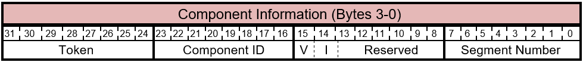

The bits of the Component Information byte are described in this table.

###### Table 5.2-3 FIRMWARE_UPDATE_OFFER Command - Component Information Bits

| Bit Offset | Field | Size | Description |
|--|--|--|--|
| 0 | Segment Number | 8 | This field is used in case the firmware for a component is segmented into smaller segments. If used, this value indicates the segment that is contained in the subsequent payload packet. For example - if the firmware image for the component is very large and the primary component can only take smaller parts of the image at a time, this field may be used to indicate that this offer is for the *i*-th segment of the complete image. A separate offer may be sent to the primary component that contains the *i*+1th segment of the image and so on. |
| 8 | Reserved | 6 | Reserved fields. Sender must set these to 0. Receiver must ignore this value. |
| 14 | V | 1 | Force Ignore Version (V)  - This flag is intended for pre-release or debug firmware image. It indicates to the component to not reject the firmware based on the firmware version.  - This flag is intended for the development phase. It can be used to intentionally rollback to a prior firmware version.  - This flag should be ignored by production firmware. |
| 15 | I | 1 | Force Immediate Reset (I)  - This bit value is used to indicate to the component to immediately reset itself after the firmware download is complete and verified to immediately invoke it.  - This flag is intended for the development phase. |
| 16 | Component ID | 8 | This byte is used for multi- component scenarios. This field may be used to identify the sub-component for which the offer is intended. If not used the value should be 0. The possible values of component IDs are as follows:  1 - 0xDF: Valid  0xE0 - 0xFD: Reserved. Do not use.  0xFF: The offer is a special offer information packet. See FIRMWARE_UPDATE_OFFER Information for details.  0xFE : The offer is a special offer command packet. See FIRMWARE_UPDATE_OFFER Extended section for details. |
| 24 | Token | 8 | The host inserts a unique token in the offer packet to component. This token must be returned by the component in the offer response.<  This is useful if there is a need for the component to distinguish between the different hosts/types of hosts.  Exact values to be used are implementation specific. For example, one value may be used for a driver and another for the application. This allows the current device firmware to account for potential multiple senders of CFU commands. One possible implementation may be to accept the first CFU command and reject all other commands with different tokens until the first CFU transactions are complete. |

##### 5.2.1.2 Firmware Version

These four bytes represent the 32-bit version of the firmware. The format for the firmware version is not mandated by this specification. The following is recommended.

###### Table 5.2-4 FIRMWARE_UPDATE_OFFER Command - Firmware Version Layout

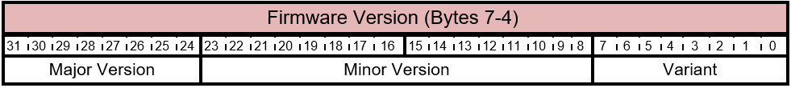

The format for the firmware version is not mandated by this specification, however following is a recommended guideline.

###### Table 5.2-5 FIRMWARE_UPDATE_OFFER Command - Firmware Version Bits

| Bit Offset | Field | Size | Description |
|--|--|--|--|
| 0 | Variant | 8 | This field may be described to distinguish between a pre-release firmware and production firmware. It may indicate the type of signature used to sign the firmware. |
| 8 | Minor Version | 16 | This field value should be updated for every build of the firmware.  This field value should be updated for every build of the firmware. |
| 24 | Major Version | 8 | This field is the major version of the firmware image. This field should be updated when shipping a new product line, major new updates to the firmware, and so on. |

##### 5.2.1.3 Vendor Specific

These four bytes may be used to encode any custom information in the offer that is specific to vendor implementation.

##### 5.2.1.4 Misc. and Protocol version

These four bytes may be used to encode any custom information in the offer that is specific to vendor implementation.

###### Table 5.2-6 FIRMWARE_UPDATE_OFFER Command - Vendor Specific Layout

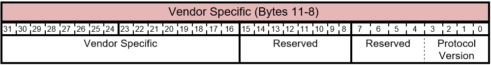

The bits of the Vendor Specific byte are described in this table.

###### Table 5.2-7 FIRMWARE_UPDATE_OFFER Command - Misc. and Protocol version

| Bit Offset | Field | Size | Description |
|--|--|--|--|
| 0 | Protocol Version | 4 | This field must be set to 0010b indicating that the host/offer corresponds to the version 2 of the CFU protocol. |
| 4 | Reserved | 4 | Reserved. Do not use. |
| 8 | Reserved | 8 | Reserved. Do not use. |
| 16 | Vendor Specific | 16 | This field may be used to encode any custom information in the offer that is specific to vendor implementation. |

#### 5.2.2 Response

The FIRMWARE\_UPDATE\_OFFER Response packet is defined as follows.

###### Table 5.2-8 FIRMWARE_UPDATE_OFFER Response Token Layout

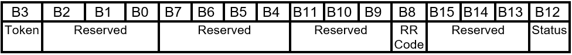

##### 5.2.2.1 Token

###### Table 5.2-9 FIRMWARE_UPDATE_OFFER Response - Token Layout

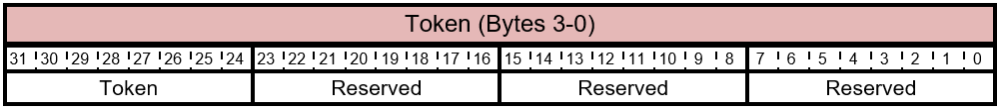

The bits of the Token byte are described in this table.

###### Table 5.2-10 FIRMWARE_UPDATE_OFFER Response - Token Bits

| Bit Offset | Field | Size | Description |
|--|--|--|--|
| 0 | Reserved | 8 | Reserved. Do not use. |
| 8 | Reserved | 8 | Reserved. Do not use. |
| 16 | Reserved | 8 | Reserved. Do not use. |
| 24 | Token | 8 | Token to identify the host. |

##### 5.2.2.2 Reserved (B7 - B4)

Reserved. Do not use.

##### 5.2.2.3 Reject Reason (RR)

###### Table 5.2-11 FIRMWARE_UPDATE_OFFER Response - Reject Reason Layout

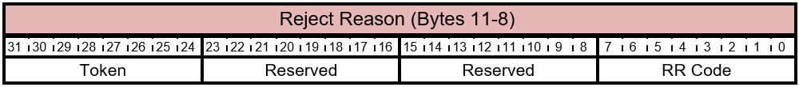

###### Table 5.2-12 FIRMWARE\_UPDATE\_OFFER Response - Reject Reason Bits

The bits of the Reject Reason byte are described in this table.

| Bit Offset | Field | Size | Description |
|--|--|--|--|
| 0 | RR Code | 8 | The Reject Reason Code that indicates the reason provided by the component for rejecting the offer. This value depends on the Status field. For a Status to RR Code mapping see Table 5.2-13. |
| 8 | Reserved | 24 | Reserved. Do not use. |

###### Table 5.2-13 FIRMWARE\_UPDATE\_OFFER Response RR Code Values

The possible values for the RR Code byte are described in this table.

| RR Code | Name | Description |
|--|--|--|
| 0x00 | FIRMWARE\_OFFER\_REJECT\_OLD\_FW | The offer was rejected because the version of the offered firmware is older or same as the current firmware. |
| 0x01 | FIRMWARE\_OFFER\_REJECT\_INV\_COMPONENT | The offer was rejected because the offered firmware is not applicable to the product's platform. This can be due to a non-supported component ID or offered image is not compatible with the system hardware. |
| 0x02 | FIRMWARE\_UPDATE\_OFFER SWAP\_PENDING | The component firmware has been updated however a swap to the new firmware is pending. No further Firmware Update processing can occur until the swap has completed, typically through a reset. |
| 0x03 - 0x08 | (Reserved) | Reserved. Do not use. |
| 0x09 - 0xDF | (Reserved) | Reserved. Do not use. |
| 0xE0 - 0xFF | (Vendor Specific) | These values are used by the designers of the protocol and the meaning is vendor specific. |

##### 5.2.2.4 Status

###### Table 5.2-14 FIRMWARE_UPDATE_OFFER Response Status Layout

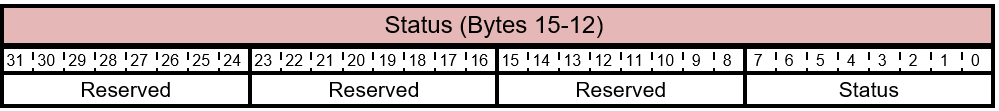

The bits of the Status byte are described in this table.

###### Table 5.2-15 FIRMWARE_UPDATE_OFFER Response - Status Bits

| Bit Offset | Field | Size | Description |
|--|--|--|--|
| 0 | Status | 8 | This value indicates the component's decision to accept, pend, skip, or reject the offer. The component provides the reason the in the RR Code field value. For a Status to RR Code mapping see Table 5.2-16. |
| 8 | Reserved | 24 | Reserved. Do not use. |

The possible values for the Status byte are described in this table.

###### Table 5.2-16 FIRMWARE_UPDATE_OFFER Response Status Values

| Status | Name | Description |
|--|--|--|
| 0x00 | FIRMWARE_UPDATE_OFFER_SKIP | The component has decided to skip the offer. The host must offer it again later. |
| 0x01 | FIRMWARE_UPDATE_OFFER_ACCEPT | The component has decided to accept the offer. |
| 0x02 | FIRMWARE_UPDATE_OFFER_REJECT | The component has decided to reject the offer. |
| 0x03 | FIRMWARE_UPDATE_OFFER_BUSY | The device is busy, and the host must wait till the device is ready. |
| 0x04 | FIRMWARE_UPDATE_OFFER_COMMAND | Used when Component ID in the Component Information bytes (see 5.1.2.1.1 Component Information) is set to 0xFE.  For Command Code set to OFFER_NOTIFY_ON_READY request, indicates the accessory is ready to accept additional offers. |
| 0xFF | FIRMWARE_UPDATE_CMD_NOT_SUPPORTED | The offer request is not recognized. |

#### 5.2.3 Mapping to HID Protocol

The message is issued to the component through the **HID Output Report** mechanism, by using the dedicated HID Utility Report ID for Firmware Update. The HID Utility TLC to use described in the Appendix.

### 5.3 FIRMWARE\_UPDATE\_OFFER - Information

If the Component ID in the Component Information bytes (see Component Information) is set to 0xFF, then bits (15 bytes) are redefined to indicate Offer Information Only, from the Host to the component. This mechanism allows for extensibility and a way for the Host to provide specific information to the device such as Start Offer List, End Offer List, Start Entire Transaction. Offer Information packets are always immediately Accepted by the component.

#### 5.3.1 Command

The FIRMWARE\_UPDATE\_OFFER -Information Command packet is defined as follows:

###### Table 5.3-1 FIRMWARE_UPDATE_OFFER - Information Command Layout

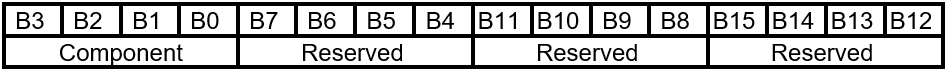

##### 5.3.1.1 Component

###### Table 5.3-2 FIRMWARE_UPDATE_OFFER - Information Command - Component Layout

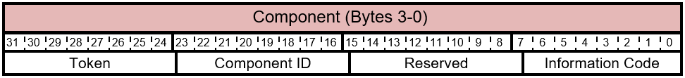

The bits of the Component byte are described in this table.

###### Table 5.3-3 FIRMWARE_UPDATE_OFFER - Information Command - Component Bits

| Bit Offset | Field | Size | Description |
|--|--|--|--|
| 0 | Information Code | 8 | This value indicates the type of information. This value is not a bitmask and can only be one of the possible values described in Table 5.3-4. |
| 8 | Reserved. | 8 | Reserved. Do not use. |
| 16 | Component ID | 8 | Set to 0xFF. |
| 24 | Token |  | The host inserts a unique token in the offer packet to component. This token must be returned by the component in the offer response. |

###### Table 5.3-4 FIRMWARE_UPDATE_OFFER - Information Command - Information Code Values

| Status | Name | Description |
|--|--|--|
| 0x00 | OFFER\_INFO\_START\_ENTIRE\_TRANSACTION | Indicates that the host is new, or has been reloaded, and the entire offer processing is (re)starting. |
| 0x01 | OFFER\_INFO\_START\_OFFER\_LIST | Indicates the beginning of the Offer list from the host in case the Accessory has download rules associated with ensuring one subcomponent is updated prior to another subcomponent in the system. |
| 0x02 | OFFER\_INFO\_END\_OFFER\_LIST | Indicates the end of the Offer list from the host. |

##### 5.3.1.2 Reserved B7 - B4

Reserved. Do not use.

##### 5.3.1.3 Reserved B11 - B8

Reserved. Do not use.

##### 5.3.1.4 Reserved B15 - B12

Reserved. Do not use.

#### 5.3.2 Response

The FIRMWARE\_UPDATE\_OFFER - Offer Information Response packet reply is defined as follows.

###### Table 5.3-5 FIRMWARE_UPDATE_OFFER - Information Response Layout

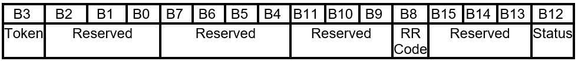

##### 5.3.2.1 Token

###### Table 5.3-6 FIRMWARE_UPDATE_OFFER- Information Packet Response Token Layout

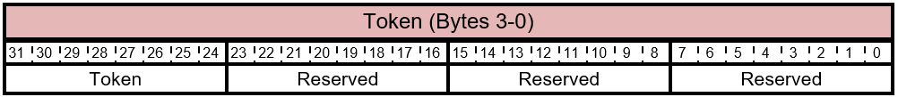

The bits of the Token byte are described in this table.

###### Table 5.3-7 FIRMWARE_UPDATE_OFFER - Information Response - Token Bits

| Bit Offset | Field | Size | Description |
|--|--|--|--|
| 0 | Reserved | 8 | Reserved. Do not use. |
| 8 | Reserved | 8 | Reserved. Do not use. |
| 16 | Reserved | 8 | Reserved. Do not use. |
| 24 | Token | 8 | Token to identify the host |

##### 5.3.2.2 Reserved B7 - B4

Reserved. Do not use.

##### 5.3.2.3 Reject Reason (RR)

###### Table 5.3-8 FIRMWARE_UPDATE_OFFER - Information Response - RR Code Layout

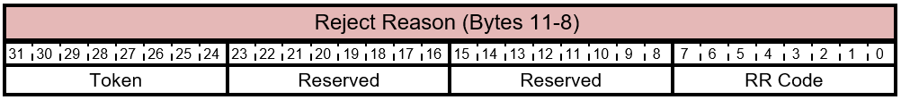

The bits of the Reject Reason byte are described in this table.

###### Table 5.3-9 FIRMWARE_UPDATE_OFFER- Offer Information Response - RR Code Bits

| Bit Offset | Field | Size | Description |
|--|--|--|--|
| 0 | RR Code | 8 | The Reject Reason Code that indicates the reason provided by the component for rejecting the offer. The possible values are described in Table 5.3‑10. This value depends on the Status field. |
| 8 | Reserved | 24 | Reserved. Do not use. |

The possible values for the RR Code byte are described in this table.

###### Table 5.3-10 FIRMWARE_UPDATE_OFFER- Information Response - RR Code Values

| RR Code | Name | Description |
|--|--|--|
| 0x00 | FIRMWARE\_OFFER\_REJECT\_OLD\_FW | The offer was rejected because the version of the offered firmware is older or same as the current firmware. |
| 0x01 | FIRMWARE\_OFFER\_REJECT\_INV\_COMPONENT | The offer was rejected because the offered firmware is not applicable to the product's platform. This can be due to a non-supported component ID or offered image is not compatible with the system hardware. |
| 0x02 | FIRMWARE\_UPDATE\_OFFER SWAP\_PENDING | The component firmware has been updated however a swap to the new firmware is pending. No further Firmware Update processing can occur until the swap has completed, typically through a reset. |
| 0x03 - 0x08 | (Reserved) | Reserved. Do not use. |
| 0x09 - 0xDF | (Reserved) | Reserved. Do not use. |
| 0xE0 — 0xFF | (Vendor Specific) | These values are used by the designers of the protocol and the meaning is vendor specific. |

##### 5.3.2.4 Status

###### Table 5.3-11 FIRMWARE_UPDATE_OFFER - Offer Information Response Status Layout

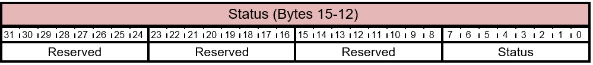

The bits of the Status byte are described in this table.

###### Table 5.3-12 FIRMWARE_UPDATE_OFFER - Offer Information - Response Status Bits

| Bit Offset | Field | Size | Description |
|--|--|--|--|
| 0 | Status | 8 | This field must be set to FIRMWARE\_UPDATE\_OFFER\_ACCEPT. This indicates that the component has decided to accept the offer. |
| 8 | Reserved. | 24 | Reserved. Do not use. |

### 5.4 FIRMWARE\_UPDATE\_OFFER - Extended

If the Component ID in the Component Information bytes is set to 0xFE, then bits (15 bytes) are redefined to indicate Offer Command from the host to the device firmware. This mechanism allows for extensibility and a way for the host to provide specific information to the device. Offer Command packets are returned when the component is ready to respond Accepted.

#### 5.4.1 Command

If the Component ID in the Component Information bytes is set to 0xFE, the four DWORDs are redefined as follows:

###### Table 5.4-1 FIRMWARE_UPDATE_OFFER - Extended Command Layout

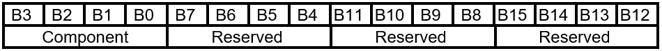

##### 5.4.1.1 Component

###### Table 5.4-2 FIRMWARE_UPDATE_OFFER - Extended Command Packet - Command - Component Layout

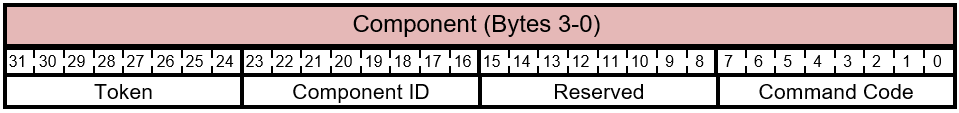

The bits of the Component byte are described in this table.

###### Table 5.4-3 FIRMWARE_UPDATE_OFFER - Extended Command - Component Bits

| Bit Offset | Field | Size | Description |
|--|--|--|--|
| 0 | Command Code | 8 | This value indicates the type of command. This value is not a bitmask and can only be one of the possible values described in Table 5.4-4. |
| 8 | Reserved. | 8 | Reserved. Do not use. |
| 16 | Component ID | 8 | Set to 0xFE. |
| 24 | Token |  | The host inserts a unique token in the offer packet to component. This token must be returned by the component in the offer response. |

###### Table 5.4-4 FIRMWARE_UPDATE_OFFER - Extended Command - Command Code Values

| Status | Name | Description |
|--|--|--|
| 0x01 | OFFER\_NOTIFY\_ON\_READY | Sent by the host if the offer was previously been rejected by the component. |
| 0x02 - 0xFF | Reserved | Reserved |

##### 5.4.1.2 Reserved B7 - B4

Reserved. Do not use.

##### 5.4.1.3 Reserved B11 - B8

Reserved. Do not use.

##### 5.4.1.4 Reserved B15 - B12

Reserved. Do not use.

#### 5.4.2 Response

The FIRMWARE\_UPDATE\_OFFER - Offer Command response from the device may not be received immediately. Response is defined as follows.

###### Table 5.4-5 FIRMWARE_UPDATE_OFFER - Extended Command Packet Response Layout

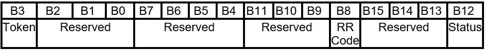

##### 5.4.2.1 Token

###### Table 5.4-6 FIRMWARE_UPDATE_OFFER- Offer Command Packet Response - Token Layout

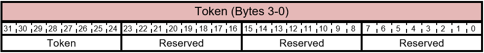

The bits of the Token byte are described in this table.

###### Table 5.4-7 FIRMWARE_UPDATE_OFFER - Offer Command Response - Token Bits

| Bit Offset | Field | Size | Description |
|--|--|--|--|
| 0 | Reserved | 8 | Reserved. Do not use. |
| 8 | Reserved | 8 | Reserved. Do not use. |
| 16 | Reserved | 8 | Reserved. Do not use. |
| 24 | Token | 8 | Token to identify the host. |

##### 5.4.2.2 Reserved B7 - B4

Reserved. Do not use.

##### 5.4.2.3 Reject Reason

###### Table 5.4-8 FIRMWARE_UPDATE_OFFER - Offer Information Packet Response RR Layout

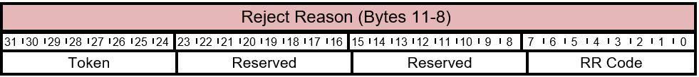

The bits of the Reject Reason byte are described in this table.

###### Table 5.4-9 FIRMWARE_UPDATE_OFFER- Offer Command Response - RR Code

| Bit Offset | Field | Size | Description |
|--|--|--|--|
| 0 | RR Code | 8 | This value depends on the Status field. For possible RR Code values, see Table 5.4-10. |
| 8 | Reserved | 24 | Reserved. Do not use. |

The possible values for the RR Code byte are described in this table.

###### Table 5.4-10 FIRMWARE_UPDATE_OFFER- Offer Command Packet - RR Code Values

| RR Code | Name | Description |
|--|--|--|
| 0x00 | FIRMWARE\_OFFER\_REJECT\_OLD\_FW | The offer was rejected because the version of the offered firmware is older or same as the current firmware. |
| 0x01 | FIRMWARE\_OFFER\_REJECT\_INV\_COMPONENT | The offer was rejected because the offered firmware is not applicable to the product's platform. This can be due to a non-supported component ID or offered image is not compatible with the system hardware. |
| 0x02 | FIRMWARE\_UPDATE\_OFFER SWAP\_PENDING | The component firmware has been updated however a swap to the new firmware is pending. No further Firmware Update processing can occur until the swap has completed, typically through a reset. |
| 0x03 - 0x08 | (Reserved) | Reserved. Do not use. |
| 0x09 - 0xDF | (Reserved) | Reserved. Do not use. |
| 0xE0 — 0xFF | (Vendor Specific) | These values are used by the designers of the protocol and the meaning is vendor specific. |

##### 5.4.2.4 Status

###### Table 5.4-11 FIRMWARE_UPDATE_OFFER - Offer Command Packet Response Status Layout

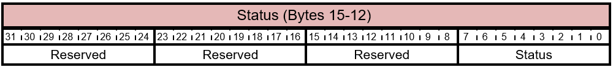

The bits of the Status byte are described in this table.

###### Table 5.4-12 FIRMWARE_UPDATE_OFFER- Offer Command Packet Response RR Code

| Bit Offset | Field | Size | Description |
|--|--|--|--|
| 0 | Status | 8 | This field must be set to FIRMWARE\_UPDATE\_OFFER\_ACCEPT. This indicates that the component has decided to accept the offer. |
| 8 | Reserved. | 24 | Reserved. Do not use. |

### 5.5 FIRMWARE\_UPDATE\_CONTENT

The host sends this command to the device firmware to provide the firmware content (i.e. the firmware image). The entire image file is not expected to fit in a single command. The host must break the image into smaller blocks and each command sends one block of the image at a time.

With each command the host indicates additional information—whether it is the first block, last block, and so on, of the firmware. The primary component of the device firmware accepts each block of the incoming firmware image, stores it into its memory, and must respond to each command individually.

When the primary component receives the last block, the component validates the entire firmware image (CRC check, signature validation). Based on the results of those checks returns an appropriate response (failure or success) for the last block.

#### 5.5.1 Command

###### Table 5.5-1 FIRMWARE_UPDATE_CONTENT Command Layout

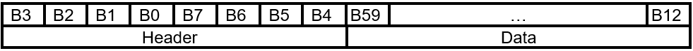

##### 5.5.1.1 Header (B7 - B0)

###### Table 5.5-2 FIRMWARE_UPDATE_CONTENT Command Header Layout

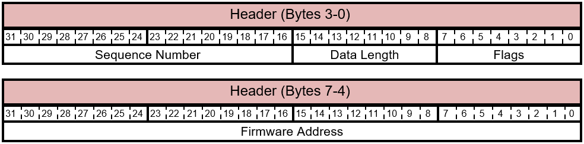

The bits of the FIRMWARE\_UPDATE\_CONTENT Header are described in this table.

###### Table 5.5-3 FIRMWARE_UPDATE_CONTENT Header Bits

| Bit Offset | Field | Size | Description |
|--|--|--|--|
| 0 | Flags | 8 | This field provides extra information about the command. This value is a mask of flags to use for the data transfers. The possible values are described in Table 5.5-4. |
| 8 | Data Length | 8 | The length of applicable Data field indicating the number of bytes to be written.  Given the size of this command, the maximum allowed value for the length is 52 bytes. |
| 16 | Sequence Number | 16 | This value is created by the host and is unique for each content packet issued. The component must return the sequence number in its response to this request. |
| 32 | Firmware Address | 32 | Little Endian (LSB First) Address to write the data. The address is 0-based. The firmware uses this as an offset to determine the address as needed when placing the image in memory. |

The possible values for the Flags byte are described in this table.

###### Table 5.5-4 FIRMWARE_UPDATE_OFFER- Offer Command Packet - Flag Values

| Flag | Name | Description |
|--|--|--|
| 0x80 | FIRMWARE_UPDATE_FLAG_FIRST_BLOCK | This flag indicates that this is the first block of the firmware image. |
| 0x40 | FIRMWARE_UPDATE_FLAG_LAST_BLOCK | This flag indicates that this is the last block of the firmware image and that the image is ready to be validated.  It is important that the current firmware on the component performs validation on the entire downloaded firmware image after writing this block to non-volatile memory. |

##### 5.5.1.2 Data

###### Table 5.5-5 FIRMWARE_UPDATE_CONTENT Command Data Layout

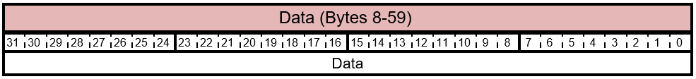

The bits of the FIRMWARE\_UPDATE\_CONTENT Data are described in this table.

###### Table 5.5-6 FIRMWARE_UPDATE_CONTENT Command Data Bits

| Bit Offset | Field | Size | Description |
|--|--|--|--|
| 64 | Data | Max 52. | The byte array to write. The host typically sends blocks of 4 bytes based on product architecture. Any unused bytes in the end must be 0 padded. |

#### 5.5.2 Response

###### Table 5.5-7 FIRMWARE_UPDATE_CONTENT Command Response Layout

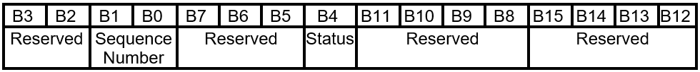

##### 5.5.2.1 Sequence Number

###### Table 5.5-8 FIRMWARE_UPDATE_CONTENT Response - Sequence Number

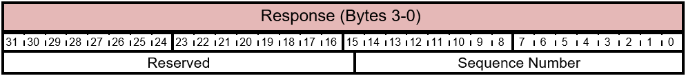

The bits of the FIRMWARE\_UPDATE\_CONTENT Response (3-0) are described in this table.

###### Table 5.5-9 FIRMWARE_UPDATE_CONTENT - Command - Response Bits

| Bit Offset | Field | Size | Description |
|--|--|--|--|
| 0 | Sequence Number | 16 | This field is the sequence number that was sent by the host in the request. |
| 16 | Reserved | 16 | Reserved. Do not use. |

##### 5.5.2.2 Status

###### Table 5.5-10 FIRMWARE_UPDATE_CONTENT Response Status Layout

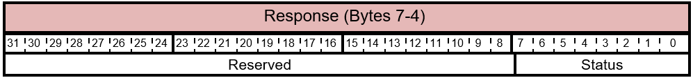

The bits of the FIRMWARE\_UPDATE\_CONTENT Response (7-4) are described in this table.

###### Table 5.5-11 FIRMWARE_UPDATE_OFFER - Response - Status Bits

| Bit Offset | Field | Size | Description |
|--|--|--|--|
| 0 | Status | 8 | This value indicates the status code returned by the device component. This is not a bitwise and can be one of the values described in Table 5.5-12. |
| 8 | Reserved | 24 | Reserved. Do not use. |

The possible values for the Status byte are described in this table.

###### Table 5.5-12 FIRMWARE_UPDATE_OFFER- Response - Status Code Values

| Flag | Name | Description |
|--|--|--|
| 0x00 | FIRMWARE_UPDATE_SUCCESS | The request completed successfully. |
| 0x01 | FIRMWARE_UPDATE_ERROR_PREPARE | The component was not prepared to receive the firmware contents.  If used, this code is typically used in a response to the first block. For example, erase error on flash. |
| 0x02 | FIRMWARE_UPDATE_ERROR_WRITE | The request could not write the bytes. |
| 0x03 | FIRMWARE_UPDATE_ERROR_COMPLETE | The request could not set up the swap in response to FIRMWARE_UPDATE_FLAG_LAST_BLOCK. |
| 0x04 | FIRMWARE_UPDATE_ERROR_VERIFY | The verification of the DWORD failed, in response to FIRMWARE_UPDATE_FLAG_VERIFY. |
| 0x05 | FIRMWARE_UPDATE_ERROR_CRC | CRC of the firmware image failed in response to FIRMWARE_UPDATE_FLAG_LAST_BLOCK. |
| 0x06 | FIRMWARE_UPDATE_ERROR_SIGNATURE | Firmware signature verification failed in response to FIRMWARE_UPDATE_FLAG_LAST_BLOCK. |
| 0x07 | FIRMWARE_UPDATE_ERROR_VERSION | Firmware version verification failed in response to FIRMWARE_UPDATE_FLAG_LAST_BLOCK. |
| 0x08 | FIRMWARE_UPDATE_SWAP_PENDING | The firmware has already been updated and a swap is pending. No further Firmware Update commands can be accepted until the accessory has been reset. |
| 0x09 | FIRMWARE_UPDATE_ERROR_INVALID_ADDR | Firmware has detected an invalid destination address within the message data content. |
| 0x0A | FIRMWARE_UPDATE_ERROR_NO_OFFER | The FIRMWARE_UPDATE_OFFER Command was received without first receiving a valid and accepted firmware update offer. |
| 0x0B | FIRMWARE_UPDATE_ERROR_INVALID | General error for the FIRMWARE_UPDATE_OFFER Command, such as an invalid applicable Data Length. |

##### 5.5.2.3 Reserved B8 - B11

Reserved. Do not use.

##### 5.5.2.4 Reserved B12 - B15

Reserved. Do not use.

## 6 Appendix 1: Example Firmware Update Programming Command Sequence

### 6.1 Example 1

Consider the following device firmware:

- Primary Component - Component ID 1 - Current firmware version 7.0.1

- Sub-component - Component ID 2 - Current firmware version 12.4.54

- Sub-component - Component ID 3 - Current firmware version 4.4.2

- Sub-component - Component ID 4 - Current firmware version 23.32.9

The host has these three firmware images:  

- Component ID 1 - Firmware version 7.1.3

- Component ID 2 - Firmware version 12.4.54

- Component ID 3 - Firmware version 4.5.0

The sequence will be:

1. Host offers: Component ID 1 - Firmware version 7.1.3

1. Primary component accepts the offer

1. Host sends the firmware image

1. Primary component accepts firmware, validates it

1. Host offers: Component ID 2 - Firmware version 12.4.54

1. Primary component rejects the offer

1. Host offers: Component ID 3 - Firmware version 4.5.0

1. Primary component accepts the offer

1. Host sends the firmware image

1. Primary component accepts firmware, validates it

Because all offers were not rejected, the host replays all the offers:

1. Host offers: Component ID 1 - Firmware version 7.1.3

1. Component rejects

1. Host offers: Component ID 2 - Firmware version 12.4.54

1. Component rejects

1. Host offers: Component ID 3 - Firmware version 4.5.0

1. Component rejects

### 6.2 Example 2

Consider the following device firmware:

- Primary Component - Component ID 1 - Current firmware version 7.0.1

- Sub-component - Component ID 2 - Current firmware version 12.4.54

- Sub-component - Component ID 3 - Current firmware version 7.4.2

- Sub-component - Component ID 4 - Current firmware version 23.32.9

The host has these three firmware images:  

- Component ID 1 - Firmware version 8.0.0

- Component ID 2 - Firmware version 12.4.54

- Component ID 3 - Firmware version 9.0.0

In addition, the implementation requires that the firmware version of the sub-components must not be less than the firmware version running on the primary component. The host is not aware of that requirement and it is up-to the primary component to ensure this rule.

The sequence will be:

1. Host offers: Component ID 1 - Firmware version 8.0.0

1. Primary component rejects (because component ID 3 is not yet updated)

1. Host offers: Component ID 2 - Firmware version 12.4.54

1. Primary component rejects

1. Host offers: Component ID 3 - Firmware version 9.0.0

1. Primary component accepts offer

1. Host sends the firmware image

1. Primary component accepts firmware, validates it

Because all offers were not rejected, the host replays all the offers

1. Host offers: Component ID 1 - Firmware version 8.0.0

1. Primary component accepts offer

1. Host sends the firmware image

1. Primary component accepts firmware, validates it

1. Host offers: Component ID 2 - Firmware version 12.4.54

1. Primary component rejects

1. Host offers: Component ID 3 - Firmware version 9.0.0

1. Primary component rejects
