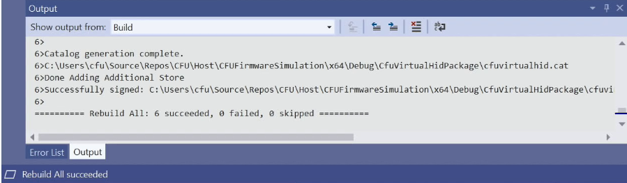
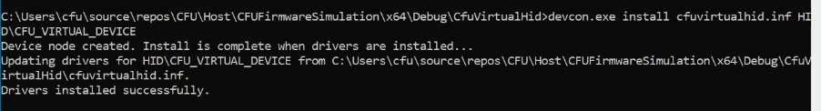
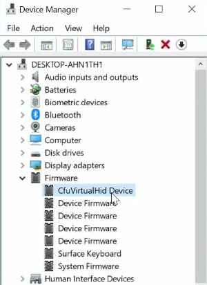
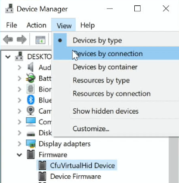
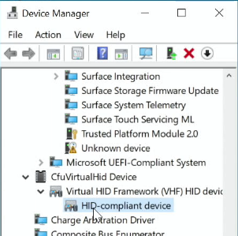
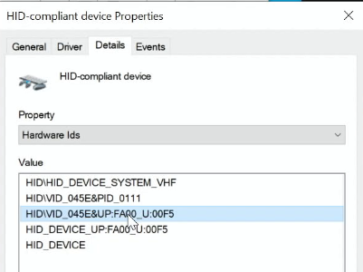
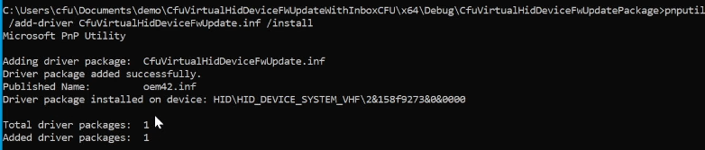
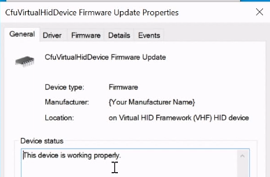

# CFU virtual HID device firmware update

This topic provides a walkthrough of updating firmware for the Component Firmware Update (CFU) virtual HID device sample.

## Build and install the CFU virtual HID device sample

1. Install Visual Studio 2019 and the Windows Driver Kit (WDK) as outlined at [Download the Windows Driver Kit (WDK)](https://docs.microsoft.com/windows-hardware/drivers/download-the-wdk).

1. Clone the Microsoft CFU repository into a local repository directory

    `git clone https://github.com/microsoft/CFU.git`

1. In your local CFU repository directory, at a command prompt, run the following git commands to get the Driver Module Framework (DMF) submodule required to build the sample:

    `git submodule init`

    `git submodule update`

1. Build the CfuVirtualHid device solution in Visual Studio

    1. Navigate to the location of the CfuVirtualHid.sln file on your development system. For example:

        `C:\<your_repo_folder>\CFU\Host\CFUFirmwareSimulation\CfuVirtualHid.sln`

    1. Open the CfuVirtualHid.sln file in Visual Studio.

    1. From the **Build** menu, select **Build Solution**. You should see output text indicating that the solution built successfully:

        

1. Install the CfuVirtualHid device and driver

    1. Navigate to the location of the cfuvirtualhid.inf file on your development system. For example:

        `C:\<your_repo_folder>\CFU\Host\CFUFirmwareSimulation\x64\Debug\CfuVirtualHid`

    1. At an administrative command prompt, run the following command:

        ```console
        devcon.exe install cfuvirtualhid.inf HID\CFU_VIRTUAL_DEVICE
        ```

        You should see output text indicating that the virtual device installed successfully:

        

1. From **Control Panel**, open **Device Manager**, select the **View** menu, and select the **Devices by type** menu item.

1. In the devices list, expand the **Firmware** node, and select the **CfuVirtualHid Device** as shown here:

     

1. Right-click the **CfuVirtualHid Device** to open the context menu, then click on the **Properties** menu item to open the **CfuVirtualHid Device Properties** dialog window.

1. Select the **Details** tab in the **CfuVirtualHid Device Properties** dialog window, then select **Hardware Ids** in the **Property** drop down list.

    You should see the **HID\CFU_VIRTUAL_DEVICE** in the **Value** list box as shown here:

    

1. In the **Device Manager** menu, select the **View** menu, and select the **Devices by connection** menu item.

    

1. Navigate to the **CfuVirtualHid Device** and expand the **CfuVirtualHid Device** node, expand the **Virtual HID Framework (VHF) HID device** node, and select the **HID-compliant device** list item as shown here:

    

1. Right-click the **HID-compliant device** to open the context menu, then click on the **Properties** menu item to open the **HID-compliant device Properties** dialog window.

1. Select the **Details** tab in the **HID-compliant device Properties** dialog window, then select **Hardware Ids** in the **Property** drop down list.

    You should see **HID\VID_045E&UP:FA00_U:00F5** in the **Value** list box as shown here:

    

## Install a firmware update for the CFU virtual HID device

Step 1


Step 2



Step 3


Step 4



## See also

TBD
