# Storage firmware update (SFU)

## Storage firmware update (SFU) overview

Modern servicing ensures the following:

- Customers can trust that their devices are secure and are kept up to date without lost productivity.

- All devices can update their firmware, drivers, operating system, and apps through Windows Update (WU).

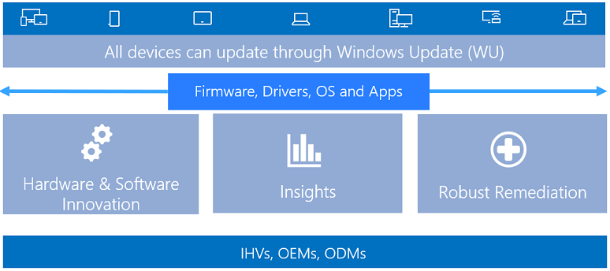

For Storage Firmware Update (SFU), this is implemented with the inbox **storfwupdate** driver.

## Existing storage firmware update (SFU) issues

There are several issues with existing storage firmware update methods:

- Current storage device updates do not utilize Windows Update (WU) for driver distribution or telemetry

- Storage device vendors must provide a utility for storage firmware updates

- Updates are shipped as Win32 or EFI apps which cannot run on S-mode devices

- Existing documentation on [working with NVMe devices](https://docs.microsoft.com/windows/win32/fileio/working-with-nvme-devices#dont-update-firmware-through-the-pass-through-mechanism) recommends using storage IOCTLs:

  - [IOCTL_STORAGE_FIRMWARE_GET_INFO](https://docs.microsoft.com/windows/win32/api/winioctl/ni-winioctl-ioctl_storage_firmware_get_info)

  - [IOCTL_STORAGE_FIRMWARE_DOWNLOAD](https://docs.microsoft.com/windows-hardware/drivers/ddi/content/ntddstor/ni-ntddstor-ioctl_storage_firmware_download)

  - [IOCTL_STORAGE_FIRMWARE_ACTIVATE](https://docs.microsoft.com/windows-hardware/drivers/ddi/content/ntddstor/ni-ntddstor-ioctl_storage_firmware_activate)

## NVMe driver firmware update compatibility requirements

### Device.Storage.ControllerDrive.NVMe.BasicFunction

The device must have at least one upgradeable firmware slot.

#### 5.7 Firmware commit

- Activation of a firmware image should be done without requiring a power cycle of the device.

- The activation process is expected to be achieved via a host-initiated reset, as described in section 8.1 of spec version 1.2a.

- Windows will utilize commit actions 001b or 010b when issuing a firmware commit command.

- Expected completion values for successful activation without a power cycle are 00h (generic success), 10h, or 11h.

- If 0Bh is returned as completion status, Windows will inform the user to perform a power cycle of the device. This is highly discouraged, as it prevents updating of firmware at OS runtime and causes significant workload disruption.

#### 5.8 Firmware image download

The device must not fail I/O during the download phase and shall continue serving I/O.

#### Related reference

[Windows Hardware Compatibility Requirements - 20H1 (Final Draft)](https://partner.cmicrosoft.com/dashboard/collaborate/packages/7840)

## Storage firmware update solution overview

The following procedures show you how to update NVMe disk firmware.

### 1. View the current NVMe disk Hardware ID

To view the current NVMe disk hardware ID:

1. From the Windows 10 Start menu, open **Control Panel**, then open **Device Manager**.

1. In Device Manager, select **Disk drives**, then expand the node and select the disk drive you want to update.

    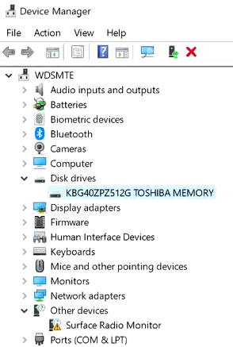

1. Once you have selected the drive you are updating, in the **Device Manager** **View** menu, select **Devices by connection**.

    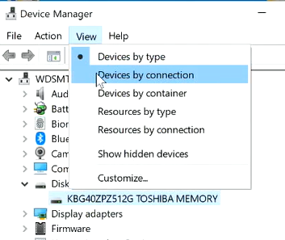

1. Right-click on the selected drive and click **Properties**.

    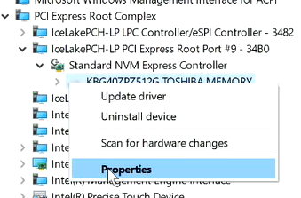

1. In the **Properties** dialog window, select the **Details** tab, then select **Hardware Ids** from the **Property** drop down list view the Hardware ID for the drive.

    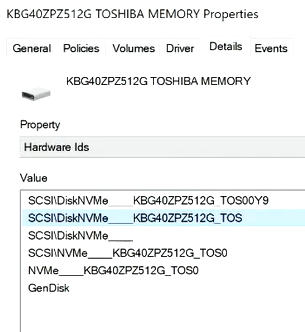

### 2. View current NVMe disk firmware version

To view the current NVMe disk firmware version:

1. Open a Powershell window as an administrator.

1. Type `Get-PhysicalDisk | Get-StorageFirmwareInformation` to view the current NVMe disk firmware version.

    

### 3. View and install the extension INF

1. Move to the directory on your system that contains the driver extension package INF file. For example, type `cd .\signed-DiskExtnPackage\`.

1. Type the `dir` command to display the contents of the directory.

    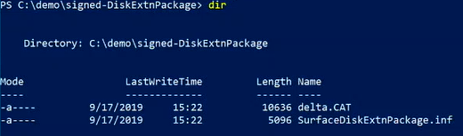

1. Open the extension INF file with the Notepad app. For example, type `notepad .\SurfaceDiskExtnPackage.inf`.

1. Verify that the extension INF file contains the information for the drives you are updating. See the [OEM Disk Extension INF file](#oem-disk-extension-inf-sample) in this topic for an example extension INF.

1. Install the extension INF with the Microsoft PnP utility. For example, type `pnputil /add-driver .\SurfaceDiskExtnPackage.inf /install`. You will see information similar to the following command output:

    

### 4. View the new software component (SWC) node

To view the new SWC node and hardware ID:

1. From the Windows 10 Start menu, open **Control Panel**, then open **Device Manager**.

1. In Device Manager, select **Disk drives**, then expand the node and select the disk drive you have updated.

    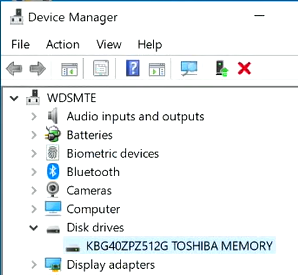

1. Once you have selected the drive you have updated, in the **Device Manager** **View** menu, select **Devices by connection**.

    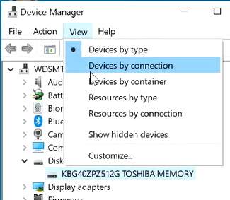

1. Click on the selected drive node, then click to expand. You will see a child **Generic software component** under the drive node.

    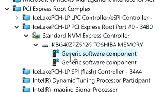

1. Right-click on the **Generic software component** and click **Properties**.

    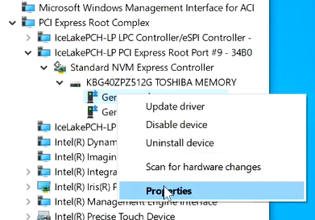

1. In the **Properties** dialog window, select the **Details** tab, then select **Hardware Ids** from the **Property** drop down list view the Hardware ID for the **Generic software component** on the drive node.

    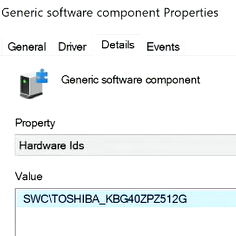

### 5. View and install the NVMe disk firmware update

1. Open a Powershell window as an administrator.

1. Move to the directory on your system that contains the NVMe disk firmware update INF file. For example, type `cd .\signed-toshiba-firmware\`.

1. Type the `dir` command to display the contents of the directory.

    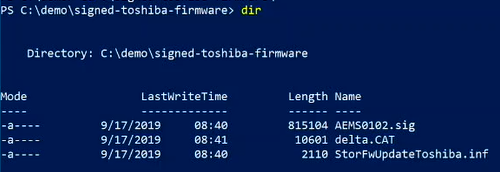

1. Open the disk firmware update INF file with the Notepad app. For example, type `notepad .\StorFwUpdateToshiba.inf`.

1. Verify that the disk firmware update INF contains the information for the drives you are updating. See the [Disk Firmware INF file](#disk-firmware-inf-sample) in this topic for an example disk firmware update INF.

1. At the Powershell prompt, type `Get-PhysicalDisk | Get-StorageFirmwareInformation` to view the current NVMe disk firmware version.

    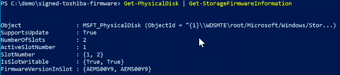

1. Install the disk firmware update INF with the Microsoft PnP utility. For example, type `pnputil /add-driver .\StorFwUpdateToshiba.inf /install`. You will see information similar to the following command output:

    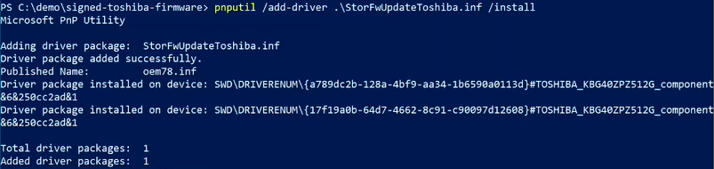

1. Type `Get-PhysicalDisk | Get-StorageFirmwareInformation` to view the updated NVMe disk firmware information in the **ActiveSlotNumber** and **FirmwareVersionInSlot** fields of the command output.

    

### 6. View the updated NVMe disk firmware version in Device Manager

To view the updated NVMe disk firmware version in Device Manager:

1. From the Windows 10 Start menu, open **Control Panel**, then open **Device Manager**.

1. In Device Manager, select **Disk drives**, then expand the node and select the NVMe disk you updated.

1. Once you have selected the drive you updated, in the **Device Manager** **View** menu, select **Devices by connection**.

1. Right-click on the selected drive and click **Properties**.

1. In the **Properties** dialog window, select the **Details** tab, then select **Hardware Ids** from the **Property** drop down list view the Hardware ID for the drive. You should see the updated NVMe disk in the **Values** list.

    

## Storage firmware update solution details

The following diagram shows the Storage firmware update solution:

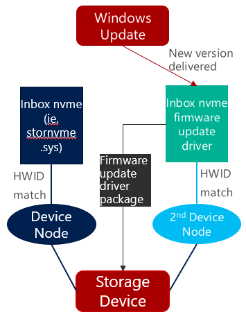

The solution details are as follows:

- Provide inbox support for storage firmware update. See [Storage firmware update (StorFwUpdate) driver](#storage-firmware-update-storfwupdate-driver) in this topic for implementation details.

- Create a second DeviceNode for firmware update. See [Use an extension INF to create a second DeviceNode](#use-an-extension-inf-to-create-a-second-devicenode) in this topic for implementation details.

- The IHV/OEM storage firmware update package (INF and firmware binary) targets the second DeviceNode and only contains a firmware payload. See [Storage firmware update INF](#storage-firmware-update-inf) in this topic for implementation details.

For more information, see [Adding firmware update logic to a Microsoft-supplied driver](https://docs.microsoft.com/windows-hardware/drivers/install/updating-device-firmware-using-windows-update#adding-firmware-update-logic-to-a-microsoft-supplied-driver).

## Driver publishing workflow (proposed)

The driver publishing workflow is as follows:

1. Create and submit Extension INF (AddComponent)

    - Specify a unique extension GUID
  
1. Distribute the extension through Windows Update (WU)

    - From Windows Update (WU):
        - Requires reboot for new node creation
        - Must be CHID targeted

    - Business justification must contain `ExtendsInboxDriver=<storenvme.inf>`

    - Include in the manufacturing process (recommended)

1. Create and submit the storage firmware update package

    - Storage IHV resells with `require CHIDs`

    - OEM/IHV targets storage firmware the update to specific devices

## Storage firmware update (StorFwUpdate) driver

- Utilizes the [User Mode Driver Framework version 2 (UMDF2)](https://docs.microsoft.com/windows-hardware/drivers/wdf/getting-started-with-umdf-version-2)

- Loads as a WDF user mode reflector (StorFwUpdate.dll)

    ```INF
    [StorFwUpdate.NT.Services]
    AddService=WUDFRd,0x000001fa,WUDFRD_ServiceInstall

    [StorFwUpdate.NT.Wdf]
    UmdfService=StorFwUpdate,StorFwUpdate_Install
    UmdfServiceOrder=StorFwUpdate

    [StorFwUpdate_Install]
    UmdfLibraryVersion=$UMDFVERSION$
    ServiceBinary=%13%\StorFwUpdate.dll

    [WUDFRD_ServiceInstall]
    DisplayName = %WudfRdDisplayName%
    ServiceType  = 1
    StartType    = 3
    ErrorControl = 1
    ServiceBinary = %12%\WUDFRd.sys

    [DestinationDirs]
    StorFwUpdate.CopyFiles=13 ; copy to Driverstore

    [StorFwUpdate.CopyFiles]
    StorFwUpdate.dll
    ```

- Available in Windows Insider Preview Build Build 18971 and later

- Supports NVMe drives

  - See Device.Storage.ControllerDrive.NVMe in sections 5.7 and 5.8 of the NVMe driver firmware update compatibility requirements in [Windows Hardware Compatibility Requirements - 20H1 (Final Draft)](https://partner.cmicrosoft.com/dashboard/collaborate/packages/7840).

- No RAID support

## Use an extension INF to create a second DeviceNode

- Use an extension INF to create a software component node (\SWC\\*) for target NVMe disk. For example:

    ```INF
    [Version]
    Signature="$Windows NT$"
    Class = Extension
    ClassGuid = {e2f84ce7-8efa-411c-aa69-97454ca4cb57}

    [Standard.NTamd64]
    %DiskExtnPackage.DeviceDesc%=DiskGDGTNG-87A, SCSI\DiskNVMe____DiskGDGTNG-87A
    %DiskExtnPackage.DeviceDesc%=StorageIHV1_KUS02020, SCSI\DiskNVMe____StorageIHV1_KUS02020
    %DiskExtnPackage.DeviceDesc%=StorageIHV2_KBG40ZPZ512G, SCSI\DiskNVMe____KBG40ZPZ512G_TOS0015
    %DiskExtnPackage.DeviceDesc%=StorageIHV2_KBG40ZPZ512G, SCSI\DiskNVMe____KBG40ZPZ512G_TOS00Y9

    [StorageIHV1_KUS02020.NT]
    [StorageIHV1_KUS02020.NT.Components]
    AddComponent = StorageIHV1_KUS02020_component,,StorageIHV1_KUS02020_ComponentInstall

    [StorageIHV1_KUS02020_ComponentInstall]
    ComponentIds=SWC\StorageIHV2_KBG40ZPZ512G
    ...
    ```

- Must utilize CHID to limit distribution

## Storage firmware update INF

- Create  a storage firmware INF to target the SWC\\* created in the extension INF above. For example:

    ```INF
    [Version]
    Signature="$Windows NT$"
    Class=Firmware
    ClassGuid={f2e7dd72-6468-4e36-b6f1-6488f42c1b52}

    [Standard.NTamd64]
    %StorFwUpdateOem.DeviceDesc%=StorFwUpdateOem, SWC\StorageIHV2_KBG40ZPZ512G
    ```

- Include references to the inbox driver **Include** and **Needs** directives. For more information, see [INF DDInstall](https://docs.microsoft.com/windows-hardware/drivers/install/inf-ddinstall-section):

    ```INF
    [StorFwUpdateOem.NT.Services]
    Include            = StorFwUpdate.inf
    Needs              = StorFwUpdate.NT.Services
    ```

- Storage firmware payload example:

    ```INF
    [StorFwUpdateOem.NT.HW]
    AddReg = StorFwUpdateOem_HWAddReg

    [StorFwUpdateOem_HWAddReg]
    HKR,,FriendlyName,,%FwUpdateFriendlyName%

    ; Specify the location of the firmware offer and payload file in the registry.
    ; The files are kept in driver store. When deployed, %13% would be expanded to the actual path
    ; in driver store.
    ;
    HKR,0D9EB3D6-6F14-4E8A-811B-F3B19F7ED98A\0,FirmwareImageVersion, 0x00000000, "AEMS0102"
    HKR,0D9EB3D6-6F14-4E8A-811B-F3B19F7ED98A\0,FirmwareFileName, 0x00000000, %13%\AEMS0102.sig

    [SourceDisksFiles]
    AEMS0102.sig=1

    [StorFwUpdateOem.CopyFiles]
    AEMS0102.sig
    ```

- Must utilize CHID to limit distribution

## Disk extension INF sample

The following in an example extension INF file:

```INF
;/*++
;
;Copyright (c) Microsoft Corporation.  All rights reserved.
;
;Module Name:
;    OEMDiskExtnPackage.inx
;
;Abstract:
;    INF file for installing the OEMDiskExtnPackage. This will create a SWC\ DevNode
;    which will serve as the target HWID for the Disk storage firmware package
;--*/

[Version]
Signature="$Windows NT$"
Class = Extension
ClassGuid = {e2f84ce7-8efa-411c-aa69-97454ca4cb57}
Provider=%ManufacturerName%
ExtensionId = {A789DC2B-128A-4BF9-AA34-1B6590A0113D}
CatalogFile=delta.cat
DriverVer = 08/26/2019,1.0.0.0

[SourceDisksNames]
1 = %DiskName%

[Manufacturer]
%ManufacturerName%=Standard,NTamd64

[Standard.NTamd64]
%OEMDiskExtnPackage.DeviceDesc%=StorageIHV1-87B, SCSI\DiskNVMe____StorageIHV1-87B
%OEMDiskExtnPackage.DeviceDesc%=StorageIHV1-87A, SCSI\DiskNVMe____StorageIHV1-87A
%OEMDiskExtnPackage.DeviceDesc%=StorageIHV2_KUS02020, SCSI\DiskNVMe____StorageIHV2_KUS02020
%OEMDiskExtnPackage.DeviceDesc%=StorageIHV3_KBG40ZPZ512G, SCSI\DiskNVMe____KBG40ZPZ512G_TOS00Y9
%OEMDiskExtnPackage.DeviceDesc%=StorageIHV3_KBG40ZPZ512G, SCSI\DiskNVMe____KBG40ZPZ512G_TOS0015

[StorageIHV1-87B.NT]
[StorageIHV1-87B.NT.Components]
AddComponent = StorageIHV1-87B_component,,StorageIHV1-87B_ComponentInstall

[StorageIHV1-87B_ComponentInstall]
ComponentIds=StorageIHV1-87B

[StorageIHV1-87A.NT]
[StorageIHV1-87A.NT.Components]
AddComponent = StorageIHV1-87A_component,,StorageIHV1-87A_ComponentInstall

[StorageIHV1-87A_ComponentInstall]
ComponentIds=StorageIHV1-87A

[StorageIHV2_KUS02020.NT]
[StorageIHV2_KUS02020.NT.Components]
AddComponent = StorageIHV2_KUS02020_component,,StorageIHV2_KUS02020_ComponentInstall

[StorageIHV2_KUS02020_ComponentInstall]
ComponentIds=StorageIHV2_KUS02020

[StorageIHV3_KBG40ZPZ512G.NT]
[StorageIHV3_KBG40ZPZ512G.NT.Components]
AddComponent = StorageIHV3_KBG40ZPZ512G_component,,StorageIHV3_KBG40ZPZ512G_ComponentInstall

[StorageIHV3_KBG40ZPZ512G_ComponentInstall]
ComponentIds=StorageIHV3_KBG40ZPZ512G

;*****************************************
; Strings section
;*****************************************

[Strings]
ManufacturerName = "OEM"
DiskName = "OEM Disk Extn package Installation Disk"
OEMDiskExtnPackage.DeviceDesc = "Disk Extn Package"
OEMDiskExtnPackage.SVCDESC = "Disk Extn Package"

;Non-Localizable
REG_EXPAND_SZ          = 0x00020000
REG_DWORD              = 0x00010001
REG_MULTI_SZ           = 0x00010000
REG_BINARY             = 0x00000001
REG_SZ                 = 0x00000000

SERVICE_KERNEL_DRIVER  = 0x1
SERVICE_ERROR_IGNORE   = 0x0
SERVICE_ERROR_NORMAL   = 0x1
SERVICE_ERROR_SEVERE   = 0x2
SERVICE_ERROR_CRITICAL = 0x3
```

## Disk firmware INF sample

The following in an example disk firmware INF file:

```INF
;;;;;;;;;;;;;;;;;;;;;;;;;;;;;;;;;;;;;;;;;;;;;;;;;;;;;;;;;;;;;;;;;;;;;;;;;;;;;;;
; File:               StorageIHV3-Firmware-Update.inx
;
; Description:        Driver installation file for firmware update.
;
; Copyright (C) Microsoft Corporation.  All Rights Reserved.
; Licensed under the MIT license.
;;;;;;;;;;;;;;;;;;;;;;;;;;;;;;;;;;;;;;;;;;;;;;;;;;;;;;;;;;;;;;;;;;;;;;;;;;;;;;;

[Version]
Signature="$Windows NT$"
Class=Firmware
ClassGuid={f2e7dd72-6468-4e36-b6f1-6488f42c1b52}
Provider=%ManufacturerName%
CatalogFile=delta.cat
DriverVer = 08/26/2019,11.37.9.948
PnPLockDown=1

[SourceDisksNames]
1= %DiskName%

[DestinationDirs]
StorFwUpdateOem.CopyFiles=13

[Manufacturer]
%ManufacturerName%=Standard,NTamd64

[Standard.NTamd64]
%StorFwUpdateOem.DeviceDesc%=StorFwUpdateOem, SWC\StorageIHV3_KBG40ZPZ512G

[StorFwUpdateOem.NT]
Include            = StorFwUpdate.inf
Needs              = StorFwUpdate.NT
CopyFiles          = StorFwUpdateOem.CopyFiles

[StorFwUpdateOem.NT.Wdf]
Include            = StorFwUpdate.inf
Needs              = StorFwUpdate.NT.Wdf

[StorFwUpdateOem.NT.HW]
AddReg = StorFwUpdateOem_HWAddReg

[StorFwUpdateOem_HWAddReg]
HKR,,FriendlyName,,%FwUpdateFriendlyName%

; Specify the location of the firmware offer and payload file in the registry.
; The files are kept in driver store. When deployed, %13% would be expanded to the actual path
; in driver store.
;
HKR,0D9EB3D6-6F14-4E8A-811B-F3B19F7ED98A\0,FirmwareImageVersion, 0x00000000, "AEMS0102"
HKR,0D9EB3D6-6F14-4E8A-811B-F3B19F7ED98A\0,FirmwareFileName, 0x00000000, %13%\AEMS0102.sig

[SourceDisksFiles]
AEMS0102.sig=1

[StorFwUpdateOem.CopyFiles]
AEMS0102.sig

[StorFwUpdateOem.NT.Services]
Include            = StorFwUpdate.inf
Needs              = StorFwUpdate.NT.Services

; =================== Generic ==================================

[Strings]
ManufacturerName="{Your Manufacturer Name}"
StorFwUpdateOem.DeviceDesc = "Storage Firmware Update (StorageIHV3) 1"
DiskName = "Storage Firmware Update Installation Disk"
FwUpdateFriendlyName= "StorageIHV3 Firmware Update"
```
