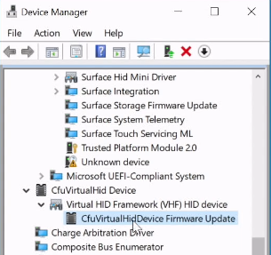

# Update firmware using the Component Firmware Update (CFU) virtual device sample

This topic provides a walkthrough of using the Component Firmware Update (CFU) virtual device sample on GitHub to update firmware.

## Contents

TBD

## Install a virtual CFU device

TBD

## Install a CFU virtual device firmware update

TBD

TBD

TBD

TBD

## See also

TBD
