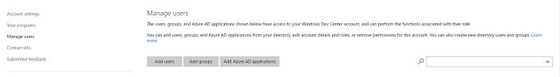
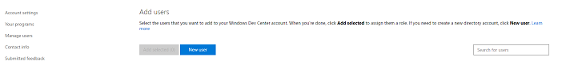
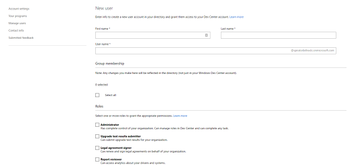
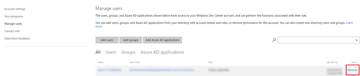

# Adding or Removing Users

The Hardware Dashboard uses Azure Active Directory for user management. This means that you will need to use your developer portal Global Admin account credentials to add or remove users. If you have lost or are unsure of your Global Admin credentials, please contact support. Note that the developer portal Global Admin account credentials are not the same as the Azure AD Global Admin account credentials.

The Global Admin is the account that was used to register for the Hardware program. If your account was migrated from Sysdev, your Global Admin was notified via e-mail. If you have lost or are unsure of your Global Admin credentials, please contact support.

To get started, navigate to your [account settings](https://go.microsoft.com/fwlink/?linkid=833506) page and log-in with as Global Admin. On the left, select **Manage users**.

## Adding Users

To add a user, select **Add users**

This will load all the users who are associated with your Azure Active Directory tenant. You can add existing users to Dev Center by selecting the checkbox next to their name. To associate a new user with your tenant, select **New User**.

On the **New user** screen, provide the details for your new user. You will need their first and last names, as well as a custom user name that they will use to login. You can also add them to any groups you’ve already created in your directory. Finally, you can grant them any roles they need for the Hardware Program.

When all details are complete, select **Save** to finalize your new user. This will add the user to your account with the selected permission, and generate a one-time use password for them.

**Note**  Make sure you print or save this page for the new user. You will not be able to recover this password after you leave this page.

 

## Removing Users

Removing a user is easy. On the **manage users** page, you will see a list of all users who currently have access to your Dev Center account. To remove one, select **Remove** at the far right.

 

 

