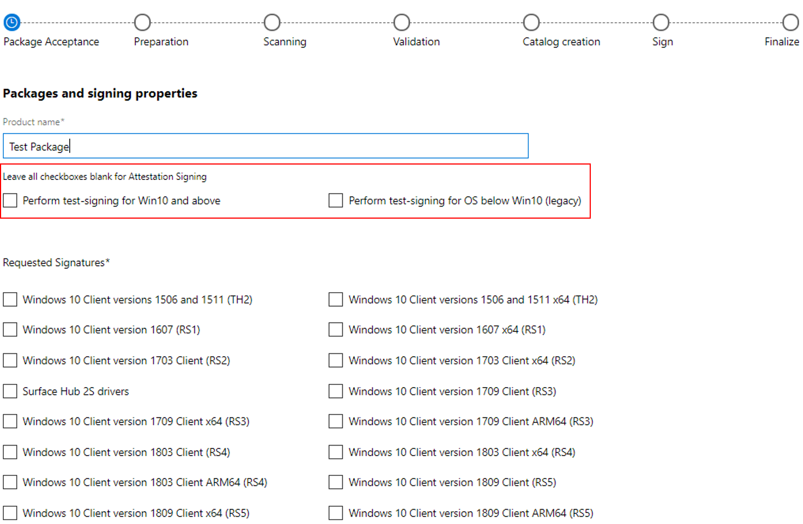

# Attestation signing a kernel driver for public release

This topic describes how to sign a driver using attestation signing.

> [!Note]
> Attestation signing has the following properties.
>
> - Attestation signing supports Windows 10 Desktop kernel mode and user mode drivers. Although user mode drivers do not need to be signed by Microsoft for Windows 10, the same attestation process can be used for both user and kernel mode drivers.
> - Attestation signing will not return the proper PE Level for **ELAM** or **Windows Hello** PE binaries.  These must be tested and submitted as .hlkx packages to receive the additional signature attributes.
> - Attestation signing requires the use of an EV Certificate to submit the driver to the Partner Center (Hardware Dev Center Dashboard).
> - An attestation signed driver works on Windows 10. It does not work on earlier versions of Windows, such as Windows 8.1 and Windows 7, and is not supported for Windows Server 2016 and later.
> - Attestation signing requires driver folder names to contain no special characters, no UNC file share paths, and to be less than 40 characters long.
> - When a driver receives attestation signing, it is not Windows Certified. An attestation signature from Microsoft indicates that the driver can be trusted by Windows, but because the driver has not been tested in HLK Studio, there are no assurances made around compatibility, functionality, etc.
> - To get your driver Windows Certified, you submit an .hlkx package generated by HLK Studio to the Partner Center.
> - To get your driver attestation signed, you submit a CAB file.

## Attestation signing a kernel mode driver

To attestation sign a kernel mode driver complete the following steps:

1. Acquire an EV Code Signing Certificate (This is a requirement for step 2.)
2. Register your company for the Partner Center
3. Download and install the Windows Driver Kit
4. Create a CAB files submission
5. Sign the CAB file submission with your EV Cert
6. Submit the EV signed Cab file using the Partner Center
7. Validate that the driver was properly signed
8. Test your driver on Windows 10 for Desktop

## Acquire an EV code signing certificate

Before you can submit binaries to the dashboard for signing, you need to acquire an extended validation (EV) code signing certificate to secure your digital information. EV certificates are the accepted standard for establishing ownership of the code you submit.

Follow the steps in [Get a code signing certificate](get-a-code-signing-certificate.md) to set up your EV certificate.

## Allowable PE signatures and binaries

The following PE levels and binaries can be processed through Attestation:

- **PeTrust**
- **DrmLevel**
- **HAL**
- .exe
- .cab
- .dll
- .ocx
- .msi
- .xpi
- .xap

## Register your company for Partner Center Services

To sign your drivers through the Partner Center you first need to register your organization and get a code signing certificate.

Follow the process described in [Register for the hardware program](register-for-the-hardware-program.md) to set up the account you will use for the hardware dashboard.

## Download and install the Windows Driver Kit

You will need to download and install the Windows Driver Kit (WDK) to gain access to tools used to sign your driver binary files.

Follow the process described in [Download kits and tools for Windows 10](/windows-hardware/get-started/adk-install) to download and install the WDK.

## Create a CAB Files Submission

To create a CAB file that can be submitted to the dashboard, complete the following steps:

1. Gather the binaries that you will submit to be signed in a single directory. In this example, we will use C:\\Echo. The steps described here will reference the [echo driver sample](https://github.com/Microsoft/Windows-driver-samples/tree/master/general/echo/kmdf/driver/AutoSync) available from GitHub.

Typical CAB file submissions contain the following:

- The driver itself, for example Echo.sys
- The driver INF file that is used by the dashboard to facilitate the signing process.
- The symbol file that is used for debugging information. For example, Echo.pdb.
- Catalog .CAT files are required and used for company verfication only. Microsoft regenerates catalog files and replaces any catalog files that were submitted.

  > [!NOTE]
  > Each driver folder in your CAB file must support the same set of architectures. For example, they must support x86, x64, or they all must support both x86 and x64.
  >
  > Do not use UNC file share paths when referencing your driver locations (\\\server\share).  You must use a mapped drive letter for the CAB to be valid.

2. Use MakeCab.exe to process the DDF file and create a cab file.

Open a Command Prompt window as Administrator. Then enter the following command to view the MakeCab options:

MakeCab /?

```cpp
C:\Echo> MakeCab /?
Cabinet Maker - Lossless Data Compression Tool

MAKECAB [/V[n]] [/D var=value ...] [/L dir] source [destination]
MAKECAB [/V[n]] [/D var=value ...] /F directive_file [...]

  source         File to compress.
  destination    File name to give compressed file.  If omitted, the
                 last character of the source file name is replaced
                 with an underscore (_) and used as the destination.
  /F directives  A file with MakeCAB directives (may be repeated). Refer to
                 Microsoft Cabinet SDK for information on directive_file.
  /D var=value   Defines variable with specified value.
  /L dir         Location to place destination (default is current directory).
  /V[n]          Verbosity level (1..3).
```

3. Prepare a cab file DDF input file. For our Echo driver it might look something like this.

```cpp
;*** Echo.ddf example
;
.OPTION EXPLICIT     ; Generate errors
.Set CabinetFileCountThreshold=0
.Set FolderFileCountThreshold=0
.Set FolderSizeThreshold=0
.Set MaxCabinetSize=0
.Set MaxDiskFileCount=0
.Set MaxDiskSize=0
.Set CompressionType=MSZIP
.Set Cabinet=on
.Set Compress=on
;Specify file name for new cab file
.Set CabinetNameTemplate=Echo.cab
; Specify the subdirectory for the files.  
; Your cab file should not have files at the root level,
; and each driver package must be in a separate subfolder.
.Set DestinationDir=Echo
;Specify files to be included in cab file
C:\Echo\Echo.Inf
C:\Echo\Echo.Sys
```

4. Call the makecab utility and provide the ddf file as input using the /f option.

```cpp
C:\Echo> MakeCab /f "C:\Echo\Echo.ddf
```

The output of makecab should display the number of files in the created cabinet, in our example 2.

```cpp
C:\Echo> MakeCab /f Echo.ddf
Cabinet Maker - Lossless Data Compression Tool

17,682 bytes in 2 files
Total files:              2
Bytes before:        17,682
Bytes after:          7,374
After/Before:            41.70% compression
Time:                     0.20 seconds ( 0 hr  0 min  0.20 sec)
Throughput:              86.77 Kb/second
```

5. Locate the cab file in the Disk1 subdirectory. You can select the cab file in File Explorer to verify that it contains the expected files.

## Sign the submission CAB file with your EV certificate

1. Use the process recommended by the EV cert provider to sign the cab file with your EV cert. For example, to sign your .CAB with a SHA256 Certificate/Digest Algorithm/Timestamp  

```cpp
C:\Echo> SignTool sign /ac "C:\MyEVCert.cer" /s MY /n "Company Name" /fd sha256 /tr http://sha256timestamp.ws.symantec.com/sha256/timestamp /td sha256 /v "C:\Echo\Disk1\Echo.cab"
```

> [!IMPORTANT]
> Remember to use industry best practices to manage the security of the EV code signing process.

## Submit the EV signed Cab file using the Partner Center

1. Submit the EV signed CAB file using the Partner Center. See [Driver Signing Properties](../develop/driver-signing-properties.md) for more information.

   - As part of the Attestation submission process, do not check any of the Test Signing boxes highlighted below.  Leave those unchecked.

   - The following screen shot shows the options for submitting the echo driver for signing.
    

2. When the signing process is complete, download your signed driver from the hardware dashboard.

## Validate that the driver was properly signed

Complete the following steps to ensure that the driver was properly signed.

1. After you have downloaded the submission file, extract the driver file.

2. Open a Command Prompt window as Administrator. Then enter the following command to verify that the driver was signed as expected.

```cpp
C:\Echo> SignTool verify Echo.Sys
```

3.To list additional information and have signtool verify all signatures in a file with multiple signatures, type the following.

```cpp
C:\Echo> SignTool verify /pa /ph /v /d Echo.Sys
```

4. To confirm the EKUs of the driver complete the following steps.
a. Open Windows Explorer and locate the binary file. Select and hold (or right-click) the file and select **Properties**.
b. On the **Digital Signatures** tab, select the listed item in the Signature list.
c. Select the **Details** button, and then select **View Certificate**.
d. On the **Details** tab, select the **Enhanced Key Usage** field.
When the driver is resigned by the dashboard the following process is used.

- Appends a Microsoft SHA2 embedded signature.
- If the driver binaries are embedded signed by the customer with their own certificates, those signatures will not be overwritten.
- Creates and signs a new catalog file with a SHA2 Microsoft certificate. This catalog replaces any existing catalog provided by the customer.

## Test your driver on Windows 10

Use the following instructions to install the sample driver.

1. Open Device Manager, select and hold (or right-click) on the computer icon and select "Add legacy Hardware". Follow the prompts to complete the install of the driver.

2. Alternatively, open a Command Prompt window as Administrator and use devcon to install the driver. Navigate to your driver package folder, and enter the following command.

```cpp
C:\Echo> devcon install echo.inf root\ECHO
```

3. Confirm that the driver install process does not display the "Windows can't verify the publisher of this driver software." Windows security dialog box.

## Create a submission with multiple drivers

To submit multiple drivers at the same time create a sub directory for each driver as shown below.


Prepare a CAB file DDF input file that references the subdirectories. It might look something like this:

```cpp
;*** Submission.ddf multiple driver example
;
.OPTION EXPLICIT     ; Generate errors
.Set CabinetFileCountThreshold=0
.Set FolderFileCountThreshold=0
.Set FolderSizeThreshold=0
.Set MaxCabinetSize=0
.Set MaxDiskFileCount=0
.Set MaxDiskSize=0
.Set CompressionType=MSZIP
.Set Cabinet=on
.Set Compress=on
;Specify file name for new cab file
.Set CabinetNameTemplate=Echo.cab
;Specify files to be included in cab file
; First Driver
.Set DestinationDir=DriverPackage1
C:\DriverFiles\DriverPackage1\Driver1.sys
C:\DriverFiles\DriverPackage1\Driver1.inf
; Second driver
.Set DestinationDir=DriverPackage2
C:\DriverFiles\DriverPackage2\Driver2.sys
C:\DriverFiles\DriverPackage2\Driver2.inf
```

You can follow these steps to sign, submit and test the other driver files you wish to submit.
