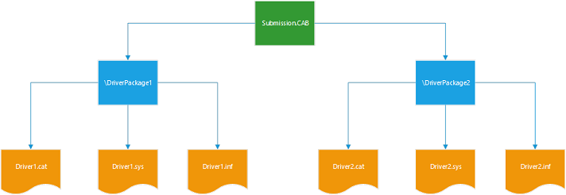

# Attestation signing a kernel driver for public release


This topic describes how to sign a driver using attestation signing.

**Important**  You must still use [Hardware Dev Center (Sysdev)](dashboard-services.md) to sign a driver using attestation signing until driver signing is available through the new Windows Hardware Dev Center dashboard.

 

**Note**  Attestation signing has the following properties.
-   Attestation signing supports Windows 10 Desktop kernel mode and user mode drivers. Although user mode drivers do not need to be signed by Microsoft for Windows 10, the same attestation process can be used for both user and kernel mode drivers.
-   Attestation signing requires the use of an EV Certificate to submit the driver to the Hardware Dev Center (Sysdev) dashboard.
-   An attestation signed driver will only work for Windows 10 Desktop. It will not work for other versions of Windows, such as Windows Server 2016,Windows 8.1, or Windows 7.

 

## <span id="Attestation_Signing_a_Kernel_Mode_Driver"></span><span id="attestation_signing_a_kernel_mode_driver"></span><span id="ATTESTATION_SIGNING_A_KERNEL_MODE_DRIVER"></span>Attestation Signing a Kernel Mode Driver


To attestation sign a kernel mode driver complete the following steps:

1.  Acquire an EV Code Signing Certificate
2.  Register your company for the Hardware Dev Center (Sysdev)
3.  Download and install the Windows Driver Kit
4.  Create a CAB files submission
5.  Sign the CAB file submission with your EV Cert
6.  Submit the EV signed Cab file using the Hardware Dev Center (Sysdev) dashboard
7.  Validate that the driver was properly signed
8.  Test your driver on Windows 10 for Desktop

## <span id="Acquire_an__EV_Code_Signing_Certificate"></span><span id="acquire_an__ev_code_signing_certificate"></span><span id="ACQUIRE_AN__EV_CODE_SIGNING_CERTIFICATE"></span>Acquire an EV Code Signing Certificate


Before you can submit binaries files using the dashboard to be signed, you need to acquire an extended validation (EV) code signing certificate to secure your digital information. This certificate is the accepted standard for establishing your company's ownership of the code you submit. It allows you to digitally sign PE binaries, such as .exe, .cab, .dll, .ocx, .msi, .xpi and .xap files.

Follow the process described in [Get a code signing certificate](https://msdn.microsoft.com/library/windows/hardware/hh801887.aspx) to acquire the needed EV code signing certificate.

## <span id="Register_your_company_for_Hardware_Dev_Center__Sysdev__Dashboard_Services"></span><span id="register_your_company_for_hardware_dev_center__sysdev__dashboard_services"></span><span id="REGISTER_YOUR_COMPANY_FOR_HARDWARE_DEV_CENTER__SYSDEV__DASHBOARD_SERVICES"></span>Register your company for Hardware Dev Center (Sysdev) Dashboard Services


You can sign your drivers using the legacy (Sysdev) dashboard. To access the Sysdev dashboard, you'll need to register your company and get a code signing certificate.

Follow the process described in [Before You Sign In](https://msdn.microsoft.com/library/windows/hardware/br230782) to set up the account you will need on the dashboard.

## <span id="_Download_and_install_the_Windows_Driver_Kit"></span><span id="_download_and_install_the_windows_driver_kit"></span><span id="_DOWNLOAD_AND_INSTALL_THE_WINDOWS_DRIVER_KIT"></span> Download and install the Windows Driver Kit


You will need to download and install the Windows Driver Kit (WDK) to gain access to tools that are used to sign binary files.

Follow the process described in [Download kits and tools for Windows 10](https://msdn.microsoft.com/windows/hardware/dn913721.aspx) to download and install the WDK.

## <span id="Create_a_CAB_Files_Submission"></span><span id="create_a_cab_files_submission"></span><span id="CREATE_A_CAB_FILES_SUBMISSION"></span>Create a CAB Files Submission


To create a CAB files submission for the dashboard, complete the following steps.

1. Gather the binaries that you will submit to be signed in a single directory. In this example, we will use C:\\Echo. The steps described here, will reference the echo driver available in GitHub at this location

<https://github.com/Microsoft/Windows-driver-samples/tree/master/general/echo/kmdf/driver/AutoSync>

Typical cab file submissions contain the following.

-   The driver itself, for example Echo.sys
-   The driver INF file that is used by the dashboard to facilitate the signing process.
-   Catalog .CAT files are not required. Microsoft regenerates catalog files and replaces any catalog files that were submitted.

2. Use MakeCab.exe to process the DDF file and create a cab file.

Open a Command Prompt window as Administrator. Then enter the following command to view the MakeCab options:

MakeCab /?

```
C:\Echo> MakeCab /?
Cabinet Maker - Lossless Data Compression Tool

MAKECAB [/V[n]] [/D var=value ...] [/L dir] source [destination]
MAKECAB [/V[n]] [/D var=value ...] /F directive_file [...]

  source         File to compress.
  destination    File name to give compressed file.  If omitted, the
                 last character of the source file name is replaced
                 with an underscore (_) and used as the destination.
  /F directives  A file with MakeCAB directives (may be repeated). Refer to
                 Microsoft Cabinet SDK for information on directive_file.
  /D var=value   Defines variable with specified value.
  /L dir         Location to place destination (default is current directory).
  /V[n]          Verbosity level (1..3).
```

3. Prepare a cab file DDF input file. For our Echo driver it might look something like this.

```
;*** Echo.ddf example
;
.OPTION EXPLICIT     ; Generate errors 
.Set CabinetFileCountThreshold=0
.Set FolderFileCountThreshold=0
.Set FolderSizeThreshold=0
.Set MaxCabinetSize=0
.Set MaxDiskFileCount=0
.Set MaxDiskSize=0
.Set CompressionType=MSZIP
.Set Cabinet=on
.Set Compress=on
;Specify file name for new cab file
.Set CabinetNameTemplate=Echo.cab
; Specify the subdirectory for the files.  
; Your cab file should not have files at the root level, 
; and each driver package must be in a separate subfolder.
.Set DestinationDir=Echo
;Specify files to be included in cab file
C:\Echo\Echo.Inf
C:\Echo\Echo.Sys
```

**Note**  All driver folders in your cab must support the same set of architectures, for example, all drivers must be x86 or all drivers must be x64, or all drivers must support both x86 and x64.

 

4. Call the makecab utility and provide the ddf file as input using the /f option.

```
C:\Echo> MakeCab /f "C:\Echo\Echo.ddf
```

The output of makecab should display the number of files in the created cabinet, in our example 2.

```
C:\Echo> MakeCab /f Echo.ddf
Cabinet Maker - Lossless Data Compression Tool

17,682 bytes in 2 files
Total files:              2
Bytes before:        17,682
Bytes after:          7,374
After/Before:            41.70% compression
Time:                     0.20 seconds ( 0 hr  0 min  0.20 sec)
Throughput:              86.77 Kb/second
```

5. Locate the cab file in the Disk1 subdirectory. You can click the cab file in File Explorer to verify that it contains the expected files.

## <span id="Sign_the_Submission_Cab_File__with_your_EV_Cert"></span><span id="sign_the_submission_cab_file__with_your_ev_cert"></span><span id="SIGN_THE_SUBMISSION_CAB_FILE__WITH_YOUR_EV_CERT"></span>Sign the Submission Cab File with your EV Cert


1. Use the process recommended by the EV cert provider to sign the cab file with your EV cert. For example, you might use the signtool and if you are using Verisign, you might specify their timestamp server.

```
C:\Echo> SignTool sign /v /ac "C:\MyEVCert.cer" /s MY /n "Company Name" /t http://timestamp.verisign.com/scripts/timstamp.dll "C:\Echo\Disk1\Echo.cab"
```

**Note**  Use industry best practices to manage the security of the EV cert signing process.

 

## <span id="Submit_the_EV_signed_Cab_file_using_the__Hardware_Dev_Center__Sysdev__dashboard"></span><span id="submit_the_ev_signed_cab_file_using_the__hardware_dev_center__sysdev__dashboard"></span><span id="SUBMIT_THE_EV_SIGNED_CAB_FILE_USING_THE__HARDWARE_DEV_CENTER__SYSDEV__DASHBOARD"></span>Submit the EV signed Cab file using the Hardware Dev Center (Sysdev) dashboard


1. Submit the EV signed Cab file using the Hardware Dev Center (Sysdev) dashboard For more information see [Driver Signing Properties](https://msdn.microsoft.com/windows/hardware/drivers/develop/driver-signing-properties) and [File Signing Services](file-signing-services.md).

As part of the submission process you will indicate what architectures all of the drivers in the submission support. Three options are available using the check boxes.

-   x86
-   x64
-   x86 and x64

All driver folders in your cab must support the same set of architectures, for example, all drivers must be x86 or all drivers must be x64 or support both x86 and x64. If you have drivers that support different combinations of architectures, create separate submissions.

You will also indicate if you are submitting universal drivers. For more information see, [Getting Started with Universal Windows drivers](https://msdn.microsoft.com/windows/hardware/drivers/develop/getting-started-with-universal-drivers).

The following screen shot shows the options for submitting the echo driver for signing.


2. When the signing process is complete, download your signed driver from the Sysdev dashboard.
## <span id="Validate_that_the_driver_was_properly_signed"></span><span id="validate_that_the_driver_was_properly_signed"></span><span id="VALIDATE_THAT_THE_DRIVER_WAS_PROPERLY_SIGNED"></span>Validate that the driver was properly signed


Complete the following steps to validate that the driver was properly signed.

1. After you have downloaded the submission file, extract the driver file.

2. Open a Command Prompt window as Administrator. Then enter the following command to verify that the driver was signed as expected.

```
C:\Echo> SignTool verify Echo.Sys
```

3.To list additional information and have signtool verify all signatures in a file with multiple signatures, type the following.

```
C:\Echo> SignTool verify /pa /ph /v /d Echo.Sys
```

4. To confirm the EKUs of the driver complete the following steps.
a. Open Windows Explorer and locate the binary file. Right-click the file and select **Properties**.
b. On the **Digital Signatures** tab, select the listed item in the Signature list.
c. Select the **Details** button, and then select **View Certificate**.
d. On the **Details** tab, select the **Enhanced Key Usage** field.
When the driver is resigned by the dashboard the following process is used.

-   Appends a Microsoft SHA2 embedded signature.
-   If the driver binaries are embedded signed by the customer with their own certificates, those signatures will not be overwritten.
-   Creates and signs a new catalog file with a SHA2 Microsoft certificate. This catalog replaces any existing catalog provided by the customer.

## <span id="Test_your_driver_on_Windows_10_for_Desktop"></span><span id="test_your_driver_on_windows_10_for_desktop"></span><span id="TEST_YOUR_DRIVER_ON_WINDOWS_10_FOR_DESKTOP"></span>Test your driver on Windows 10 for Desktop


Use the following instructions to install the sample driver.

1. Open Device Manager, right click on the computer icon and select "Add legacy Hardware". Follow the prompts to complete the install of the driver.

2. Alternatively, open a Command Prompt window as Administrator and use devcon to install the driver. Navigate to your driver package folder, and enter the following command.

```
C:\Echo> devcon install echo.inf root\ECHO
```

3. Confirm that the driver install process does not display the "Windows can't verify the publisher of this driver software." Windows security dialog box.

## <span id="Create_a_Multiple_Driver_Submission"></span><span id="create_a_multiple_driver_submission"></span><span id="CREATE_A_MULTIPLE_DRIVER_SUBMISSION"></span>Create a Multiple Driver Submission


To submit multiple drivers at the same time create a sub directory for each driver as shown below.



Prepare a cab file DDF input file that references the subdirectories. It might look something like this.

```
;*** Submission.ddf multiple driver example
;
.OPTION EXPLICIT     ; Generate errors 
.Set CabinetFileCountThreshold=0
.Set FolderFileCountThreshold=0
.Set FolderSizeThreshold=0
.Set MaxCabinetSize=0
.Set MaxDiskFileCount=0
.Set MaxDiskSize=0
.Set CompressionType=MSZIP
.Set Cabinet=on
.Set Compress=on
;Specify file name for new cab file
.Set CabinetNameTemplate=Echo.cab
;Specify files to be included in cab file
; First Driver
.Set DestinationDir=DriverPackage1
C:\DriverFiles\DriverPackage1\Driver1.sys
C:\DriverFiles\DriverPackage1\Driver1.inf
; Second driver
.Set DestinationDir=DriverPackage2
C:\DriverFiles\DriverPackage2\Driver2.sys
C:\DriverFiles\DriverPackage2\Driver2.inf
```

Follow the steps previously described to sign, submit and test the driver files.

 

 

[Send comments about this topic to Microsoft](mailto:wsddocfb@microsoft.com?subject=Documentation%20feedback%20%5Bhw_dashboard\hw_dashboard%5D:%20Attestation%20signing%20a%20kernel%20driver%20for%20public%20release%20%20RELEASE:%20%281/3/2017%29&body=%0A%0APRIVACY%20STATEMENT%0A%0AWe%20use%20your%20feedback%20to%20improve%20the%20documentation.%20We%20don't%20use%20your%20email%20address%20for%20any%20other%20purpose,%20and%20we'll%20remove%20your%20email%20address%20from%20our%20system%20after%20the%20issue%20that%20you're%20reporting%20is%20fixed.%20While%20we're%20working%20to%20fix%20this%20issue,%20we%20might%20send%20you%20an%20email%20message%20to%20ask%20for%20more%20info.%20Later,%20we%20might%20also%20send%20you%20an%20email%20message%20to%20let%20you%20know%20that%20we've%20addressed%20your%20feedback.%0A%0AFor%20more%20info%20about%20Microsoft's%20privacy%20policy,%20see%20http://privacy.microsoft.com/default.aspx. "Send comments about this topic to Microsoft")


