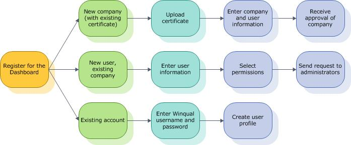

# Before You Sign In

To use the Hardware Dev Center dashboard, you must first register both you and your company on the dashboard. The dashboard replaces the Windows Quality Online Services website also known as Winqual.

## Registering on the dashboard

When you register on the dashboard, there are three possible paths that you can take, depending on whether you are registering a new company for the first time, adding a user to an existing company, or migrating an existing Winqual account.

**To add a new company**

1.  See [Establish a new company](https://msdn.microsoft.com/library/windows/hardware/br230795.aspx).

2.  See [Get a code signing certificate](https://msdn.microsoft.com/library/windows/hardware/hh801887.aspx).

**To sign in as a new user for an existing company**

1.  On the Hardware Dev Center dashboard, sign in with the Microsoft account you want to associate with an existing registered company.

2.  If you don't have, or don't want to use, an existing Microsoft account, on the Sign-in page, click **Sign up** to create a new email account to associate with your company.

3.  On the **Establish a Dashboard Account** page, in the **Request a User Account** section, find your company in the drop-down list and then click **Next**.

4.  Request the permissions you need from your Company administrator and Click **Next**.

    Your Company administrator will get an email notifying them of your request to be added. After it is approved, you can use the Sysdev site features that you were approved for.

## Related topics

[Create and Manage Your Profile](https://msdn.microsoft.com/library/windows/hardware/br230768.aspx)

[Manage Legal Agreements](https://msdn.microsoft.com/library/windows/hardware/br230801.aspx)

 

 

[Send comments about this topic to Microsoft](mailto:wsddocfb@microsoft.com?subject=Documentation%20feedback%20%5Bhw_dashboard\hw_dashboard%5D:%20Before%20You%20Sign%20In%20%20RELEASE:%20%281/3/2017%29&body=%0A%0APRIVACY%20STATEMENT%0A%0AWe%20use%20your%20feedback%20to%20improve%20the%20documentation.%20We%20don't%20use%20your%20email%20address%20for%20any%20other%20purpose,%20and%20we'll%20remove%20your%20email%20address%20from%20our%20system%20after%20the%20issue%20that%20you're%20reporting%20is%20fixed.%20While%20we're%20working%20to%20fix%20this%20issue,%20we%20might%20send%20you%20an%20email%20message%20to%20ask%20for%20more%20info.%20Later,%20we%20might%20also%20send%20you%20an%20email%20message%20to%20let%20you%20know%20that%20we've%20addressed%20your%20feedback.%0A%0AFor%20more%20info%20about%20Microsoft's%20privacy%20policy,%20see%20http://privacy.microsoft.com/default.aspx. "Send comments about this topic to Microsoft")

