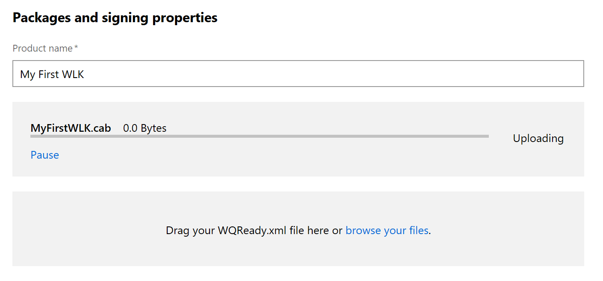

# Create a new WLK device certification submission

To prepare your Windows Server 2008 (and below) hardware for certification, you must create and submit a **WQReady.xml** file. Submitting this file allows the dashboard to test your device and return a report on its performance. The report includes a detailed list of how the device compares to Windows standards.

# Creating a WQReady.xml file

1.  Download the [Windows Logo Kit (WLK)](http://go.microsoft.com/fwlink/p/?LinkId=219237). Be sure to test your driver or drivers with the appropriate certification kit on each operating system that you want certification for.

2.  Open the Winqual Submission Tool (WST) and click **Add**.

3.  Browse to the **.cpk** file (WLK test results) and click **Load**.

4.  If the device isn't inbox, enter the **Driver Package**, **Driver Locales**, and **Symbols (optional)**.

5.  Close the **Add DTM Results** dialog box.

6.  You can edit the new entry by selecting it and clicking **Edit**.

7.  After you add all of the entries, create the **.cab** submission package by clicking **Create Package**.

8.  If the tool finds an error, the packaging stops and the entry with the errors is highlighted in red. To view the error, click **View Errors**. Fix errors by clicking **Edit** and updating the driver or the test result. All errors must be fixed before the package can be created.

9.  The tool generates the **WQReady.xml** file, which is used for submission.

    **Note**  
    **WQReady.xml** is the default file name, but you can rename it.

     

## Submitting your file

1.  Sign in to the Windows Hardware Dev Center dashboard, and then select **Submit new hardware**. This loads the submission creation wizard.

2.  In the **Packages and signing properties** section, choose a name for your driver submission. This name can be used to search for and organize your driver submissions.

3. Either drag and drop, or browse to the **.cab** file that you created using the Winqual Submission Tool that you want to submit. The file will begin to upload.

3. Now drag and drop or browse to the **WQReady.xml** file you want to submit. This will complete your upload

4. Continue from step 6 in [Create a new hardware submission](create-a-new-hardware-submission.md) to finish your submission.
