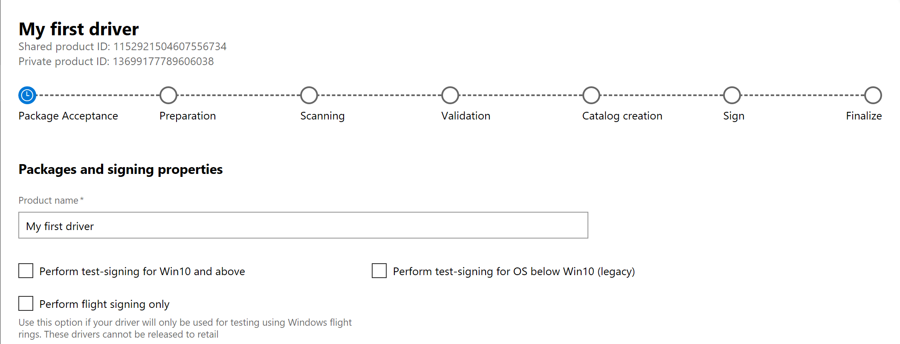
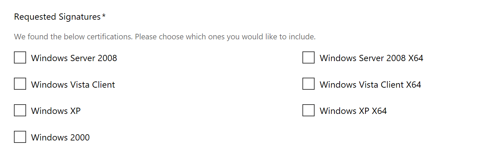
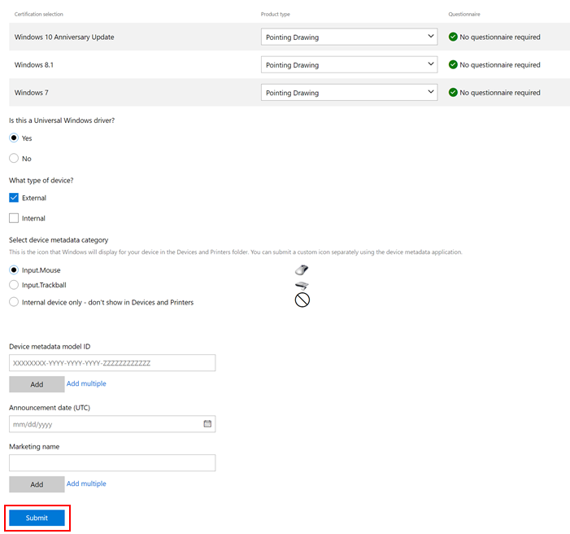

# Create a new hardware submission

To prepare your hardware for the Windows Hardware Compatibility Program for Windows 10 (or the separate certification program for previous operating systems), you must create and submit an **.hlkx** file (for Windows 10) or **.hckx** file (for previous operating systems). This file is created using the Windows HLK Studio (or Windows HCK Studio, for previous operating systems) and contains all of the test results, drivers, and symbols for your product. Submitting this file allows the dashboard to review your test results, evaluate any drivers tested, and return Microsoft digitally signed catalog files.

## To create a submission file

For information about creating and digitally signing an **.hlkx** file, see the [Windows HLK Getting Started Guide](https://docs.microsoft.com/windows-hardware/test/hlk/getstarted/windows-hlk-getting-started).

For information about creating and digitally signing an **.hckx** file, see the [Windows HCK Getting Started Guide](http://go.microsoft.com/fwlink/p/?LinkId=248436).

## To submit a file

1. Sign in to the Windows Hardware Dev Center dashboard, and then select **Submit new hardware**. This loads the submission creation wizard.

2. In the **Packages and signing properties** section, choose a name for your driver submission. This name can be used to search for and organize your driver submissions. Note: If you share your driver with another company, they will see this name.

3. Either drag and drop, or browse to the **.hlkx/.hckx** file that you want to submit. The file will begin to upload.
   

4. If you wish to test a driver prior to release, you can select the checkbox labled "Perform test-signing for Win10 and above" OR "Perform test-signing for OS below Win10 (legacy)". Test-signed drivers are similar to drivers signed for public release, but do not require HLK testing. They are also not distributed through Windows Update, but can be downloaded from the hardware submission site. They can be installed on test machines only. For more information about test-signing driver packages, see [WHQL Test Signature Program](https://docs.microsoft.com/windows-hardware/drivers/install/whql-test-signature-program) and [How to test-sign a driver package](https://docs.microsoft.com/windows-hardware/drivers/install/how-to-test-sign-a-driver-package).

5. If you wish to flight sign a driver prior to release, you can select the checkbox labled "Perform flight signing only". Flight signed drivers are signed with Microsoft Developer Test certificate used and trusted by all “Insider” builds. Retail systems do NOT have this certificate. Drivers that are Flight signed can only be installed on *Windows 10 Insider Builds*. This means it will not be offered or installable on RETAIL builds of Windows 10. Flight signed drivers work with “Secure Boot” enabled. Flight signing is only applicable to Windows 10 RS2 and above and will not work on lower versions of Windows. _this feature is currently being rolled out gradually and might not yet be visible to everyone. If you do not yet see it, please wait and you will see it in a few more weeks._

6. Select Request Signatures as applicable. This option allows you to specify which operating system signatures (including allowable downlevel operating systems) should be included with your driver. Available certifications vary depending on your driver submission package, so there may not be any certifications listed. **Note** If you are signing a driver package for a single architecture, only include logs for the intended architecture. For example, to sign for x64 only, submit only the x64 logs.

   

7. In the **Certification** section, complete the following information:

   <table>
   <colgroup>
   <col width="50%" />
   <col width="50%" />
   </colgroup>
   <thead>
   <tr class="header">
   <th>Field</th>
   <th>Description</th>
   </tr>
   </thead>
   <tbody>
   <tr class="even">
   <td>
Device type
</td>
   <td>
Indicate if your device is:

   <ul>
   <li>
An internal component, if your device is part of a system and connects inside the PC.
</li>
   <li>
An external component, if your device is an external device (peripheral) that connects to a PC.
</li>
   <li>
Both, if your device can be connected internally (inside a PC) and externally (peripheral).
</li>
   </ul></td>
   </tr>
   <tr class="odd">
   <td>
Device metadata category
</td>
   <td>
Select an icon for your device from a list of default icons based on your device category. This determines which icon appears in Devices and Printers. If your device should not appear, select &quot;Internal device&quot;.

   
For information about delivering a rich experience with Windows Device Stage, see <a href="https://msdn.microsoft.com/library/windows/hardware/br230800.aspx" data-raw-source="[Device Metadata](https://msdn.microsoft.com/library/windows/hardware/br230800.aspx)">Device Metadata</a>.
</td>
   </tr>
   <tr class="even">
   <td>
Device metadata model ID
</td>
   <td>
These GUIDs are used to validate your Device Metadata submissions to the legacy Sysdev dashboard. If provided, they must match the model IDs in your device metadata package.
</td>
   </tr>
   <tr class="odd">
   <td>
Announcement date
</td>
   <td>
Enter the date when you want your product included on the Windows Server Catalog, the Windows Certified Product List, and the Universal Driver List.
</td>
   </tr>
   <tr class="even">
   <td>
Marketing names
</td>
   <td>
Enter the marketing name(s) for your submission. Marketing names allow you to provide aliases for your product. You can provide as many names as you want.
</td>
   </tr>
   </tbody>
   </table>

   

8. Select **Submit**.

9. The **Distribution** section is used to publish your driver to Windows Update. For information about how to use the **Distribution** section, see [Manage driver distribution with shipping labels](manage-driver-distribution-by-submission.md).

10. You can monitor the progress of your submission with the progress tracker at the top of the page. Once all steps show a green check, the submission is complete and your organization will receive a notification in the dashboard header.

    

11. Review the results. If your submission failed, make any necessary changes and resubmit.

## Related topics

   *  [Managing hardware submissions in the Windows Hardware Dev Center dashboard](manage-your-hardware-submissions.md)
   *  [Get drivers signed by Microsoft for multiple Windows versions](get-drivers-signed-by-microsoft-for-multiple-windows-versions.md)
   *  [Driver flighting](driver-flighting.md)
