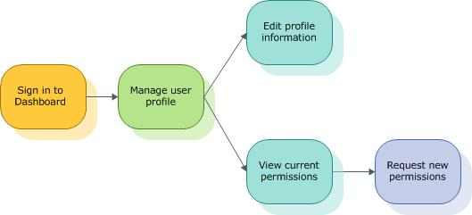

# Create and Manage Your Profile

The Administration page on the Dashboard displays different information for general registered users and company administrators. For more information about the administrators’ experience, see [Manage users and permissions](https://msdn.microsoft.com/library/windows/hardware/br230781.aspx).

## Creating and managing your account

When you first register yourself on the Dashboard, you create an account profile that includes your name, contact information, and your corporate billing group. You also request specific permissions from your administrator.

On the Administration page, the My Account tile offers two options for the general registered user.

**To manage your personal information**

1.  In the **My Account** tile, click **Update your personal information**.

2.  On the **My Account** page, on the **Personal information** tab, update your name, email address, phone number, fax number, or billing group, and then click **Update**.

**To view and update your permissions**

1.  In the **My Account** tile, click **Request permissions from your admin**.

2.  On the **My Account** page, on the **Permissions** tab, review your current permissions. Then, in the **Send a request to your administrator** text box, list the permissions you want to add or remove.

Your administrator must review and grant your request before your permissions are changed.

## Related topics

[Before You Sign In](https://msdn.microsoft.com/library/windows/hardware/br230782.aspx)

[Manage Legal Agreements](https://msdn.microsoft.com/library/windows/hardware/br230801.aspx)

 

 

[Send comments about this topic to Microsoft](mailto:wsddocfb@microsoft.com?subject=Documentation%20feedback%20%5Bhw_dashboard\hw_dashboard%5D:%20Create%20and%20Manage%20Your%20Profile%20%20RELEASE:%20%281/3/2017%29&body=%0A%0APRIVACY%20STATEMENT%0A%0AWe%20use%20your%20feedback%20to%20improve%20the%20documentation.%20We%20don't%20use%20your%20email%20address%20for%20any%20other%20purpose,%20and%20we'll%20remove%20your%20email%20address%20from%20our%20system%20after%20the%20issue%20that%20you're%20reporting%20is%20fixed.%20While%20we're%20working%20to%20fix%20this%20issue,%20we%20might%20send%20you%20an%20email%20message%20to%20ask%20for%20more%20info.%20Later,%20we%20might%20also%20send%20you%20an%20email%20message%20to%20let%20you%20know%20that%20we've%20addressed%20your%20feedback.%0A%0AFor%20more%20info%20about%20Microsoft's%20privacy%20policy,%20see%20http://privacy.microsoft.com/default.aspx. "Send comments about this topic to Microsoft")

