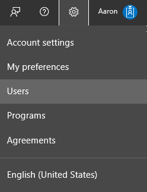
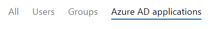
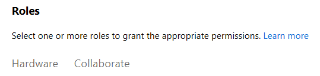
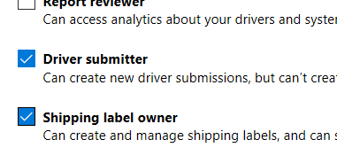

# Hardware dashboard API

Use the *Microsoft Hardware APIs* to programmatically query and create submissions for hardware products within your organization's Windows Dev Center account. These APIs are useful if your account manages many products, and you want to automate and optimize the submission process for these assets. These APIs use Azure Active Directory (Azure AD) to authenticate the calls from your app or service.
The following steps describe the end-to-end process of using the Microsoft Hardware API:

1. These APIs can only be used by developer accounts that belong to the [Windows Hardware Dev Center program](https://msdn.microsoft.com/windows/hardware/drivers/dashboard/get-started-with-the-hardware-dashboard).

2. Make sure that you have completed the prerequisites below.

3. Before you call a method in the Microsoft Hardware API, obtain an Azure AD access token, as illustrated below. After you obtain a token, you have 60 minutes to use this token in calls to the Microsoft Store submission API before the token expires. After the token expires, you can generate a new token.

4. Call the Microsoft Hardware API.

## Complete the prerequisites for using the Microsoft Hardware API

Before you start writing code to call the Microsoft Hardware API, make sure that you have completed the following prerequisites.

* You (or your organization) must have an Azure AD directory and you must have [Global administrator](http://go.microsoft.com/fwlink/?LinkId=746654)  permission for the directory. If you already use Office 365 or other business services from Microsoft, you already have Azure AD directory. Otherwise, you can [create a new Azure AD in Dev Center](https://docs.microsoft.com/windows/uwp/publish/associate-azure-ad-with-dev-center#create-a-brand-new-azure-ad-to-associate-with-your-dev-center-account) for no additional charge.

* You must [associate an Azure AD application with your Windows Dev Center account](https://docs.microsoft.com/windows/uwp/monetize/create-and-manage-submissions-using-windows-store-services#associate-an-azure-ad-application-with-your-windows-dev-center-account) and obtain your tenant ID, client ID, and key. You need these values to obtain an Azure AD access token, which you will use in calls to the Microsoft Hardware API.

## Associate an Azure AD application with your Windows Dev Center account

Before you can use the Microsoft Hardware API, you must associate an Azure AD application with your Dev Center account, retrieve the tenant ID and client ID for the application and generate a key. The Azure AD application represents the app or service from which you want to call the Microsoft Hardware API. You need the tenant ID, client ID and key to obtain an Azure AD access token that you pass to the API.

1. In Dev Center, go to your **Account** settings, click **Manage** users, and [associate your organization's Dev Center account with your organization's Azure AD directory](https://docs.microsoft.com/windows/uwp/publish/associate-azure-ad-with-dev-center).
2. On the **Manage users** page, click **Add Azure AD** applications, add the Azure AD application that represents the app or service that you will use to access submissions for your Dev Center account, and assign it the **Manager** role. If this application already exists in your Azure AD directory, you can select it on the **Add Azure AD applications** page to add it to your Dev Center account. Otherwise, you can create a new Azure AD application on the **Add Azure AD applications** page. For more information, see [Add Azure AD applications to your Dev Center account](https://docs.microsoft.com/windows/uwp/publish/add-users-groups-and-azure-ad-applications#azure-ad-applications).

3. Return to the **Manage users** page, click the name of your Azure AD application to go to the application settings, and copy down the **Tenant ID** and **Client ID** values.

4. Click **Add new** key. On the following screen, copy down the **Key** value. You won't be able to access this info again after you leave this page. For more information, see [Manage keys for an Azure AD application](https://docs.microsoft.com/windows/uwp/publish/add-users-groups-and-azure-ad-applications#manage-keys).

5. Finally, ensure that the AD application has the required roles to manage and publish driver submissions. First, in the Hardware Dev Center, in the **Settings** panel, click **Users**.

    

    On the Users page, click **Azure AD applications**.

    

    Click the name of the Azure AD application you associated. This loads the Azure AD application details page. On this page, under **Roles**, click **Hardware**.

    

    Ensure that **Driver Submitter** and **Shipping Label owner** are selected:

    

## Obtain an Azure AD access token

Before you call any of the methods in the Microsoft Hardware API, you must first obtain an Azure AD access token that you pass to the **Authorization** header of each method in the API. After you obtain an access token, you have 60 minutes to use it before it expires. After the token expires, you can refresh the token, so you can continue to use it in further calls to the API. To obtain the access token, follow the instructions in [Service to Service Calls Using Client Credentials](https://azure.microsoft.com/documentation/articles/active-directory-protocols-oauth-service-to-service/) to send an HTTP POST to the `https://login.microsoftonline.com/<tenant_id>/oauth2/token` endpoint. Here is a sample request.

```cpp
POST https://login.microsoftonline.com/<tenant_id>/oauth2/token HTTP/1.1
Host: login.microsoftonline.com
Content-Type: application/x-www-form-urlencoded; charset=utf-8

grant_type=client_credentials
&client_id=<your_client_id>
&client_secret=<your_client_secret>
&resource=https://manage.devcenter.microsoft.com
```

For the *tenant_id* value in the POST URI and the *client_id* and *client_secret* parameters, specify the tenant ID, client ID and the key for your application that you retrieved from Dev Center in the previous section. For the *resource* parameter, you must specify `https://manage.devcenter.microsoft.com`.

After your access token expires, you can refresh it by following the instructions in [Refreshing the access tokens](https://azure.microsoft.com/documentation/articles/active-directory-protocols-oauth-code/#refreshing-the-access-tokens).

## Use the Microsoft Hardware API

After you have an Azure AD access token, you can call methods in the Microsoft Hardware API. The API includes many methods that are grouped into scenarios. To create or update submissions, you typically call multiple methods in the Microsoft Hardware API in a specific order. For information about each scenario and the syntax of each method, see the articles in the following table.

| Scenario | Description |
|:--|:--|
| Drivers | Get, create and update drivers registered to your Dev Center Account. For more information about these methods, see the following articles:<ul><li>[Get product data](get-product-data.md)</li><li>[Manage product submissions](manage-product-submissions.md)</li><li>[Get shipping label data](get-shipping-labels.md)</li><li>[Manage shipping labels](manage-shipping-labels.md)</li></ul>|

## Code examples

The following sample provides detailed code that demonstrate how to use the Microsoft Hardware API:

* [C# sample](http://download.microsoft.com/download/C/F/4/CF404E53-87A0-4204-BA13-A64B09A237C1/HardwareApiCSharpSample.zip)

[Hardware dashboard API samples (GitHub)](https://aka.ms/hpc_async_api_samples)

## Additional help

If you have questions about the Microsoft Store submission API or need assistance managing your submissions with this API, visit the [support page](https://developer.microsoft.com/dashboard/account/help?returnUri=https://developer.microsoft.com/dashboard/hardware) and request help.
