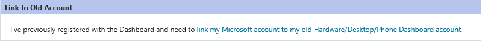
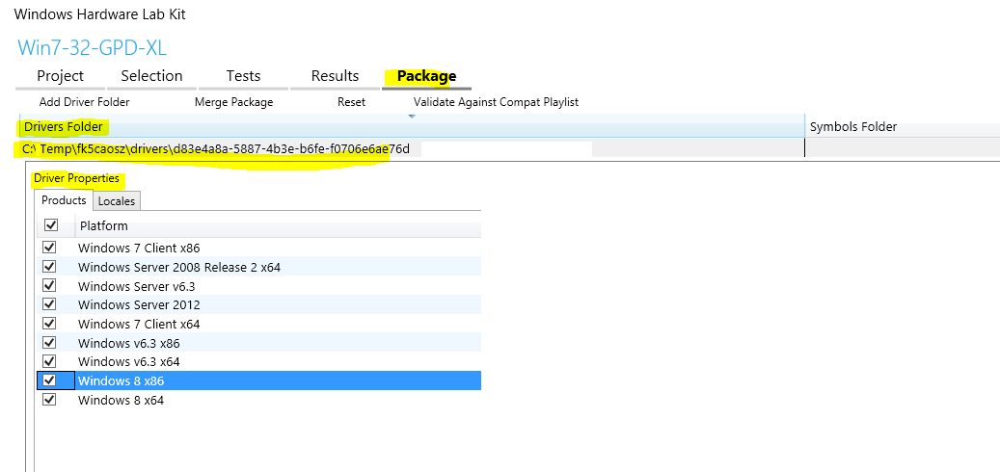

# Dashboard FAQ

This article provides answers to frequently asked questions sent in to the alias, [Sysdev@Microsoft.com](http://go.microsoft.com/fwlink/p/?LinkID=624170), about the Dashboard or Windows Hardware Certification program.

## Dashboard sign in problems

### Your account is pending for administrator approval

Check whether you are trying to sign in by using an old Winqual account:

-   If you are, click **link my Microsoft account to my old Hardware/Desktop/Phone Dashboard account**.

    

    **Note**  Only one Microsoft account (formerly known as Windows Live ID) can be used for each Dashboard user account.

     

-   If you are not, contact your Dashboard company administrator for new account approval. If you do not know your Dashboard company administrator, email [Sysdev@Microsoft.com](http://go.microsoft.com/fwlink/p/?LinkID=624170).

### Forgot password

-   If you are using an old Winqual account, email [Sysdev@Microsoft.com](http://go.microsoft.com/fwlink/p/?LinkID=624170) to reset your password.
-   If you are using a Microsoft account, click **Can't access your account?** to receive a new password or to create a new account.

    

### Can I associate multiple certificates with a Dashboard?

One organization can associate multiple certificates with its Dashboard account. As long as the submission is signed with any one of those certificates, it will be allowed.

This includes both EV and Standard – there is no restriction on the number of certificates bound to your company.

## Signing agreements

### What agreements need to be signed?

<table>
<colgroup>
<col width="50%" />
<col width="50%" />
</colgroup>
<tbody>
<tr class="odd">
<td>Hardware certification</td>
<td>
Windows Certification Program Testing Agreement v1.0

Windows Logo License Agreement for Hardware 2017
</td>
</tr>
<tr class="even">
<td>Software certification</td>
<td>
Windows Certification Program Testing Agreement v1.0

Windows Logo License Agreement For Software v1.9
</td>
</tr>
<tr class="odd">
<td>File driver signing</td>
<td>
Windows Compatibility Program and Driver Quality Attestment Testing Agreement

Windows Certification Program Testing Agreement v1.0
</td>
</tr>
</tbody>
</table>

 

### How do I sign legal agreements?

All agreements must be signed online and will be counter signed automatically. To sign legal agreements, follow these steps:

1.  In the Dashboard, click **Administration &gt; Legal Agreements**.
2.  Click the legal agreement that you want to sign.
3.  Scroll down to the signature block, type or paste the name and date, and click **Submit**.

If the signature block is not visible, make sure that you have permission to **Sign Master Legal Agreements**. You might need to request additional permissions from your company’s administrator.

### How do I grant additional roles to users in my company?

To enable additional permissions:

1.  In the Dashboard, click **Administration &gt; Your Profile &gt; Permissions** tab.
2.  Select **Sign Master Legal Agreements**. If you cannot select this option, contact your account administrator.
3.  Sign out and sign in again for the change to take effect.

### How can I sign the contingency agreement created for my company?

To sign the contingency agreements follow these steps:

1.  In the Dashboard, click **Administration &gt; Legal Agreements**.
2.  Choose **Signable** as status in Result Filters and **All** in Tasks. Click **Update.**
3.  The list of agreements that are signable appears. Choose the certificate; the keyword **!Custom** will appear next to title of the agreement.
4.  Click the agreement and scroll down to the signature block, type or paste the name and date, and click **Submit.**

**Note**  Signing permissions are required in order to sign the agreements.

 

## Managing submissions

### How can I check the status of a software submission?

Dashboard does not send a status report for software submission. On the submission page, check **Status &gt; Signed**. If the submission is signed, it is considered Approved and certification is complete.

**Signing Date** indicates **Not yet signed** by default, which is by design. This is not considered for submission status.

### What is the hardware certification submission processing time?

All hardware submissions to Dashboard have a 5-business day service level agreement (SLA), but you can generally expect 1-2 business days for completion. If you need help with your submission, you can contact [Sysdev@Microsoft.com](http://go.microsoft.com/fwlink/p/?LinkID=624170) with your business justification.

### How do I get my product listed on Windows Compatible Products List?

Check that the announcement date that has been set. If it is not, set the date for either the current date or your preferred date. The product will be listed the day after the date you set.

### Why do I see a difference in downloaded signed files?

In an effort to make Windows 10 more secure without affecting performance, all binaries now receive embedded signatures. This applies to all the submissions submitted for certification, not only submissions based on Windows 10.

### How to get a single cat file if drivers are uniform for all operating systems

Make sure your final package has a single driver folder on the **Package** tab and the driver’s properties include all the operating systems you have tested.

### Unable to add new marketing names to the approved submission

Please check the announcement date that has been set. If the announcement date set has passed, you will be not able to add a new name. You need to contact [Sysdev@Microsoft.com](http://go.microsoft.com/fwlink/p/?LinkID=624170).

## Troubleshooting errors

### Driver signing submission fails with error “There are files at the root of the cabinet” or “\#No .inf files found in driver directory/directories: XYZ”

The failure is because the structure of the .cab file is incorrect. The .cab structure was created with driver files in the root folder of the .cab file instead of having them in a subfolder (driver). Please review the instructions for how to create a proper .cab file for the driver signing submission here:

[Driver Signing](https://msdn.microsoft.com/library/windows/hardware/dn962252.aspx)

**Note**  Currently, there is a bug when symbol files are included in the driver package and the submission will fail.

 

### Submission Upload Error

-   It looks like your package is corrupt or missing important information. Ensure you are using the latest version of the kit, regenerate your package, and try again. If you continue to experience the issue, contact [Sysdev@Microsoft.com](http://go.microsoft.com/fwlink/p/?LinkID=624170).
-   File is using Zip64(4gb+file Size)

    Repackage to solve the issue.

    -   Rename the current .hckx/hlkx file to .zip.
    -   Extract to a folder.
    -   Open the folder.
    -   Select all items, then right-click and select **Send to Compressed zip folder**.
    -   Rename the new .zip folder as .hckx/.hlkx.
    -   Upload the new .hckx/.hlkx file.

### DUA package error shows Failed to open package error “Not compatible with a version (3.2.0.0) with this instance package manager”

Use [HLK studio](https://msdn.microsoft.com/library/windows/hardware/dn939927) to open the downloaded DUA shell package and to create DUA submission.

### How to get a waiver for Software Certification failures

You need to submit the Windows App Certification Kit report to the Dashboard so that the waiver can be reviewed.

Unfortunately, there can be no waiver review without a completed submission. The ‘known’ waiver scenarios would trigger a specific Windows App Certification Kit UI for the partner to provide the details (all those steps and UI are also described in the [Certification white paper](http://go.microsoft.com/fwlink/p/?LinkId=624385)).

If this is a not a ‘known’ (that is, supported) waiver scenario, the report can still submitted to Dashboard. Even if the report is failing, it will be reviewed and we will reach out to you for additional information as needed.

## Support contact info

Unfortunately, Dashboard cannot help investigate Test failures. Contact Customer Service and Support (CSS) for more help:

-   [HCK/HLK](http://go.microsoft.com/fwlink/p/?LinkId=624386)
-   [WDK](http://go.microsoft.com/fwlink/p/?LinkID=624387)
-   [App Store support](http://go.microsoft.com/fwlink/p/?LinkId=624388)

 

 

[Send comments about this topic to Microsoft](mailto:wsddocfb@microsoft.com?subject=Documentation%20feedback%20%5Bhw_dashboard\hw_dashboard%5D:%20Dashboard%20FAQ%20%20RELEASE:%20%281/3/2017%29&body=%0A%0APRIVACY%20STATEMENT%0A%0AWe%20use%20your%20feedback%20to%20improve%20the%20documentation.%20We%20don't%20use%20your%20email%20address%20for%20any%20other%20purpose,%20and%20we'll%20remove%20your%20email%20address%20from%20our%20system%20after%20the%20issue%20that%20you're%20reporting%20is%20fixed.%20While%20we're%20working%20to%20fix%20this%20issue,%20we%20might%20send%20you%20an%20email%20message%20to%20ask%20for%20more%20info.%20Later,%20we%20might%20also%20send%20you%20an%20email%20message%20to%20let%20you%20know%20that%20we've%20addressed%20your%20feedback.%0A%0AFor%20more%20info%20about%20Microsoft's%20privacy%20policy,%20see%20http://privacy.microsoft.com/default.aspx. "Send comments about this topic to Microsoft")

