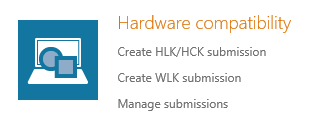
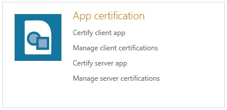
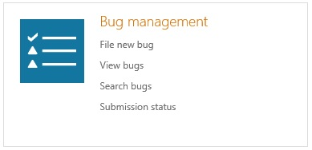
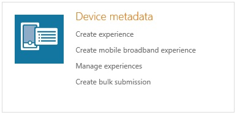
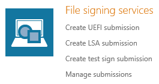
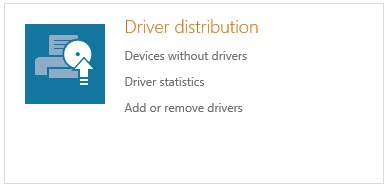
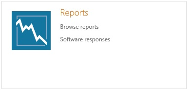
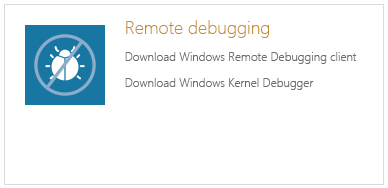
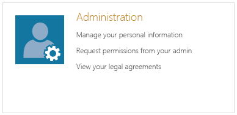

# Legacy Dashboard

You can [certify your devices and apps for hardware certification](http://go.microsoft.com/fwlink/?LinkId=324025) using the Hardware Dev Center Dashboard. You can also use the Dashboard to manage submissions, track the performance of your device or app, and much more. To access the Dashboard, you’ll need [to register your company and get a code signing certificate](http://go.microsoft.com/fwlink/?LinkId=394273).

<table>
<colgroup>
<col width="50%" />
<col width="50%" />
</colgroup>
<tbody>
<tr class="odd">
<td></td>
<td>
Create new hardware submission packages, and manage existing ones.
</td>
</tr>
<tr class="even">
<td></td>
<td>
Submit new client and server desktop apps for certification and manage ones that you’ve already submitted.
</td>
</tr>
<tr class="odd">
<td></td>
<td>
File Windows-related bugs to us for evaluation. And, track bugs we’ve filed on your products during the Windows cycle.
</td>
</tr>
<tr class="even">
<td></td>
<td>
Include device metadata in your hardware package to specify things about your device, like graphics and Windows Store device apps. To change or add device metadata, use the Device Metadata page.
</td>
</tr>
<tr class="odd">
<td></td>
<td>
Create UEFI, LSA, pre-production, driver signing submissions, use our API for file signing submissions, and manage existing submissions.
</td>
</tr>
<tr class="even">
<td></td>
<td>
Include your drivers in your hardware submission package. To update or replace a driver after submission, use the Driver distribution page.
</td>
</tr>
<tr class="odd">
<td></td>
<td>
See how your published products are performing and tell users about fixes through the reports on the Reports page.
</td>
</tr>
<tr class="even">
<td></td>
<td>
Download the Remote Debugging Service. Use the Kernel Debugger to troubleshoot issues remotely with us and other companies.
</td>
</tr>
<tr class="odd">
<td></td>
<td>
Manage user profiles and permissions, review and manage legal agreements, and manage your certificates and service credentials on the Administration page.
</td>
</tr>
</tbody>
</table>

 

 

 

[Send comments about this topic to Microsoft](mailto:wsddocfb@microsoft.com?subject=Documentation%20feedback%20%5Bhw_dashboard\hw_dashboard%5D:%20Legacy%20Dashboard%20%20RELEASE:%20%281/3/2017%29&body=%0A%0APRIVACY%20STATEMENT%0A%0AWe%20use%20your%20feedback%20to%20improve%20the%20documentation.%20We%20don't%20use%20your%20email%20address%20for%20any%20other%20purpose,%20and%20we'll%20remove%20your%20email%20address%20from%20our%20system%20after%20the%20issue%20that%20you're%20reporting%20is%20fixed.%20While%20we're%20working%20to%20fix%20this%20issue,%20we%20might%20send%20you%20an%20email%20message%20to%20ask%20for%20more%20info.%20Later,%20we%20might%20also%20send%20you%20an%20email%20message%20to%20let%20you%20know%20that%20we've%20addressed%20your%20feedback.%0A%0AFor%20more%20info%20about%20Microsoft's%20privacy%20policy,%20see%20http://privacy.microsoft.com/default.aspx. "Send comments about this topic to Microsoft")

