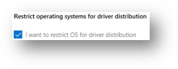
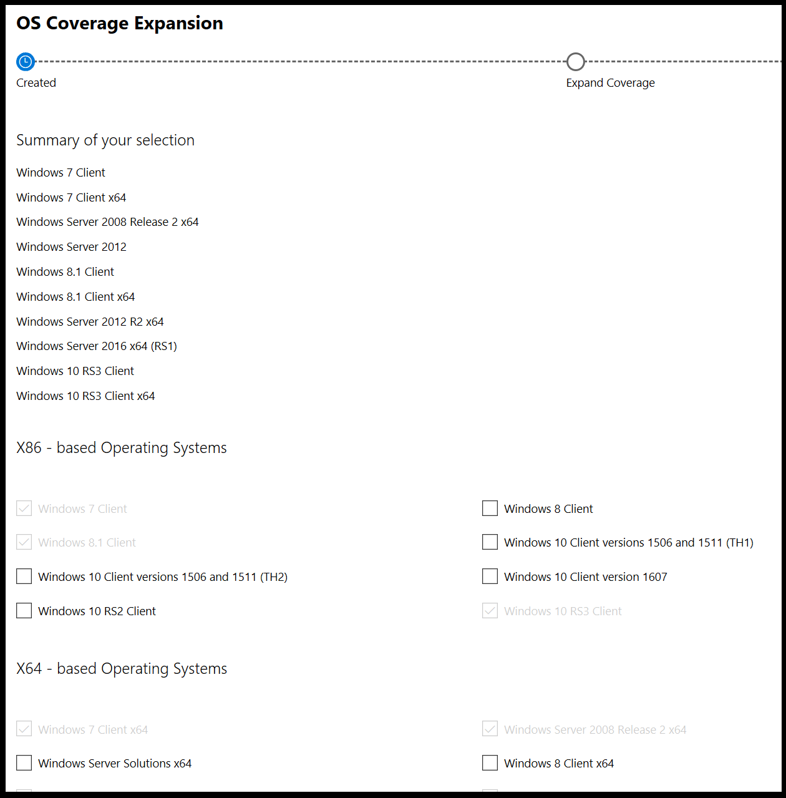
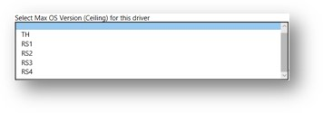

# Limiting driver distribution by Windows versions

IHVs, OEMs, and ODMs often need to change teh distribution of a driver on Windows UPdate to a specific range of Windows versions. For example, a driver might

* have known problems in a specified range of versions

* need to be deployed to fix issues in past versions of Windows while a current driver is distributed to current versions

* extend its distribution to earlier, current or newer Windows versions

These distribution ranges are defined by a “floor” and “ceiling”. A floor describes the earliest Windows version the driver will be distributed to, and a ceiling marks the latest. By adding a floor, you can expand your driver’s distribution. By adding a ceiling, you can restrict it. Floors and ceilings are specified in [shipping labels](https://docs.microsoft.com/windows-hardware/drivers/dashboard/manage-driver-distribution-by-submission) within the Hardware Dev Center Dashboard for the following driver submission formats:

* .HLKX
* .HCKX
* .CAB

> [!NOTE]
> Only Administrators, Shipping Label Owners, and Shipping Label Promoters can set floors and ceilings for driver submissions.

## Floor and ceiling types

Floors and ceilings are applied to newer or earlier or current version of Windows OS.
There are two types of floors and ceilings supported by the HDC Dashboard:

| Floor/ceiling type | Description |
| -- | -- |
| OS release-based | TBD |
| Build number-based | TBD |

## Setting floors and ceilings for your driver distribution

1. Create a shipping label and enter your details for the label’s name, publisher and targeting. For more information, see [Publish a driver to Windows Update](https://docs.microsoft.com/en-us/windows-hardware/drivers/dashboard/publish-a-driver-to-windows-update).

2. In **Select PNPs**, select Hardware ID and operating system combinations you wish to publish to. Note that a floor can be set for each Hardware ID, but a ceiling is applied to all IDs within the same shipping label. Additionally, the oldest operating system you select will automatically be selected as the floor for your label. 

### Adding a floor

1. You can add a floor for your driver’s distribution by clicking **Please expand operating systems for driver’s distribution here**, below the label’s targeting information. OS based driver expansion (Floor) can be done in the same screen as shown.  Below is the section of the page showing the same OS based driver expansion.
    

    Clicking the link will present a list of operating systems that you can extend driver coverage to.

    

    Clicking the link will present a list of operating systems that you can extend driver coverage to.

2.	After selecting the operating systems, you wish to expand coverage to, click Submit

### Adding a ceiling

1.	Below the CHID information, you can add a ceiling by selecting **Please specify a ceiling OS**, and selecting an operating system.

    

2. Select **Publish**

> [!NOTE]
> Note fhe following when adding a ceiling
> * The ceiling option is only enabled for Windows 10 versions in the PNP list
> * The ceiling you select should be higher than the PNP selections you made.

## FAQ

*When would I need to specify a floor or ceiling for a version of Windows that has been released?*

**To prevent a pre-existing driver from being distributed to future versions of Windows. For example, while developing a replacement driver targeting an unreleased version of Windows.**

*When would I need to specify a floor and/or ceiling for a co-engineering driver? (coming soon)*

**You may need to specify a version of Windows that is currently in development as a floor If your driver contains a dependency contained in it.**

*How can I target a Windows version that is older than my driver’s certification?*

**You can specify an earlier version of Windows as a floor; enabling the driver to target both that version and later of Windows.**
