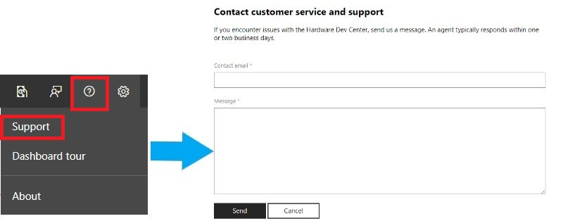

# Driver flighting

Driver flighting in the Windows Hardware Dev Center dashboard enables you to distribute your driver within defined Windows Insider rings, while providing automatic monitoring and evaluation. A report of your driver's performance will be generated after the completion of a flight, enabling you to evaluate its critical functionality and update scenarios. Upon a successful flight and approval from Microsoft, the driver will be distributed publicly through Windows Update. 

The following video provides an overview for the driver flighting program in more detail: 
<iframe src="https://channel9.msdn.com/Events/WinHEC/WinHEC-Online/Start-Your-Driver-Flighting-The-benefit-of-Driver-Promotion/player" width="960" height="540" allowFullScreen frameBorder="0"></iframe>

## Signing up for driver flighting

To sign up for driver flighting, submit a support ticket to the Windows Hardware Dev Center Dashboard. Support for the Hardware Dev Center is accessed in the upper-right corner of the browser window, as shown below:

> [!NOTE]
> When signing up for driver flighting, make sure you are inside the Hardware Dev Center Dashboard. Clicking the support button from another area of the Dev Center will connect you with a non-dashboard support group.

Within the ticket, specify the following:
* The estimated number of existing devices that will be targeted by the driver
* The estimated volume of promotion requests you will make per month
* Your seller and/or publisher ID

After receiving your support ticket, it may take up to five business days for you to receive a response.

Once your account has been approved, your organization's administrators will be able to configure users for flighting by going to the **Settings** page and selecting **Manage Users**. Make sure the appropriate users have at least one of the following roles selected:

* Shipping label owner
* Shipping label promoter

## How to promote a driver for driver flighting

After being submitted to the Windows Hardware Dev Center Dashboard, you can promote your drivers for flighting with the following steps:

1. Once your driver has been submitted and is in the **validation** stage of processing, create a new shipping label and fill out the **details** and **properties** sections. See [Publish a driver to Windows Update](https://docs.microsoft.com/windows-hardware/drivers/dashboard/publish-a-driver-to-windows-update) for more information.

2. Select one or more driver promotion option to promote your driver for flighting, as described below:

|                            Promotion Option                             |                                                               Description                                                                |
|-------------------------------------------------------------------------|------------------------------------------------------------------------------------------------------------------------------------------|
|   Automatically deliver and install the driver during Windows Upgrade   | Marks the driver for delivery via Dynamic Update, enabling it to be delivered to applicable machines during an operating system upgrade. |
| Automatically deliver and install the driver on all applicable systems. |                Marks the driver as a Critical Update (CU), enabling it to be automatically installed via Windows Update.                 |

3. Complete the additional details required for promotion for flighting:
    1. The email address of the Microsoft sponsor you are working with for the promotion
    2. The business justification for promoting the publication request
    3. The process used to validate the quality of the driver
    4. The OEMs (if any) that are affected by the driver publication

4. Select the appropriate statements that apply to your driver. These answers will improve the speed of the evaluation process:
    

    > [!IMPORTANT] 
    > Please note the following:
    > * It is recommended to avoid requiring a reboot after driver installation. 
    > * Drivers that deploy UI and/or software during installation are not Windows 10 in S mode compliant, and cannot be flighted to this operating system.
    > * A co-engineering driver is a driver being developed for an unreleased version of Windows. co-engineering drivers: 
    >    * will only be distributed to applicable devices in the Microsoft insider program during the flighting process.
    >    * Will not be distributed to devices that are not a part of the Microsoft insider program after a successful flight.
    >    * will be terminated for flighting after 60 days. A flight bug report will be provided after the flighting process is complete. 

5. Complete the shipping label process as usual.

After promoting your driver for shipping, Microsoft will evaluate your driver for approval, and provide a driver flighting report when the evaluation is complete – typically within two weeks from the time of shipping label publication. Please note that if a previously created shipping label is reused, its publication date will not be updated.

## Why was my driver rejected?

A driver can be rejected for several reasons. Most commonly, rejection is caused by improper driver targeting. These include:
* Targeting previous versions of Windows while also targeting Windows 10.
* The device class being targeted may have specific CHID targeting requirements that you failed to properly follow.  Some device classes require CHID like Firmware and other classes forbid the use of CHID like Display.  Be sure you have entered your information correctly.
* Using hardware IDs that unintentionally targets other OEMs.

## Related topics

* [Create a new hardware submission](create-a-new-hardware-submission.md)
* [Managing hardware submissions in the Windows Hardware Dev Center dashboard](manage-your-hardware-submissions.md)
* [Get drivers signed by Microsoft for multiple Windows versions](get-drivers-signed-by-microsoft-for-multiple-windows-versions.md)
