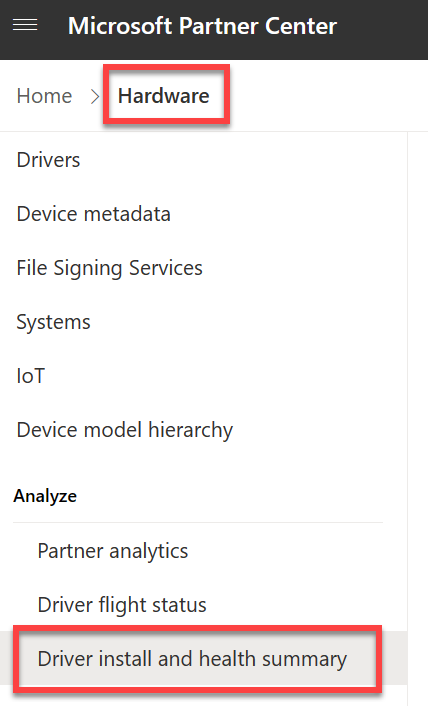

# Driver Install and Health Summary Report

When a Windows device attempts to install a new driver, diagnostic telemetry is reported back to Microsoft to help improve the health of the Windows ecosystem. This is true for all drivers regardless of distribution method.

## Location of the Report

Access to this aggregated summary is available inside a customer's Partner Center account under the Hardware module.

Figure 1: Screenshot of the Partner Center navigation showing the Driver Summary Install Report

## How to Read the Report

The report contains the following summaries aggregated from ProductID, Submission ID, & Driver Version over the last 30 days:
- Successful Installs: Total number or success events
- Unsuccessful Installs: Total number of      unsuccessful events
- BSOD Hits: Total number of Blue Screen Of Death (BSOD) hits, where the machine cannot recover without crashing.
- LKD Hits: Total number of Live Kernel Dump (LKD) hits, where the machine can recover without crashing.

> [!NOTE]
> Since this report is limited to activities reported in the last 30 days, the ratio of successful/unsuccessful installs relative to BSOD or LKD Hits may be disproportionately low. This is due to the majority of install activities happening within the first 30 days of a driver's release, where BSOD & LKD hits can continue to occur as long as a driver is in market.