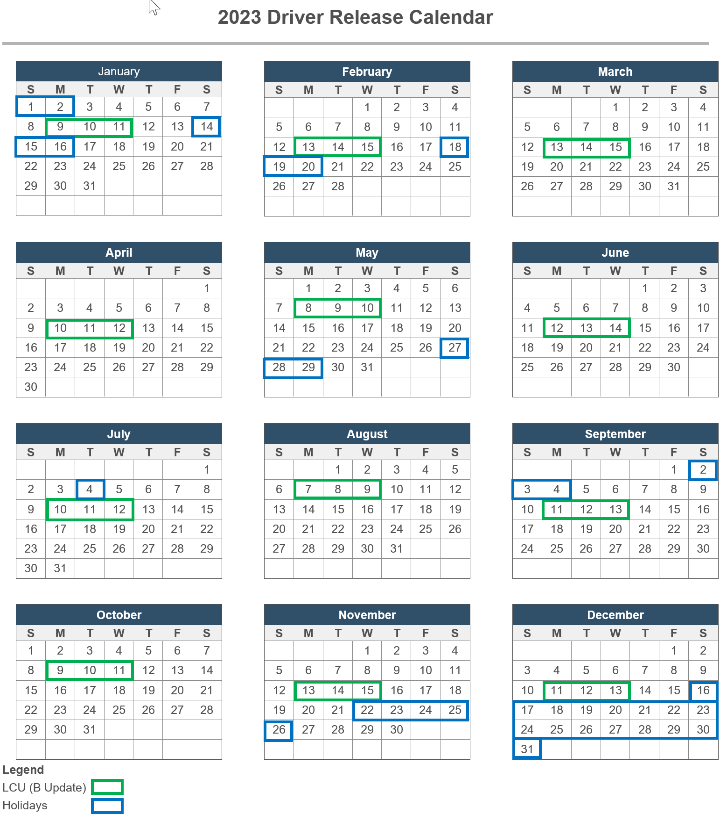
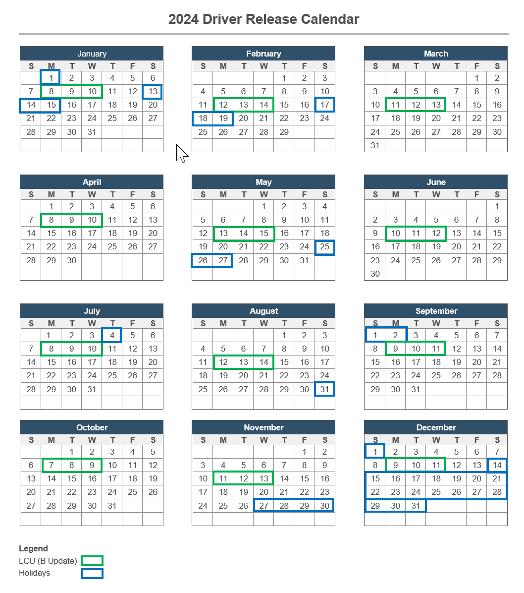

# Driver Shiproom Release Cadence Windows

Last Updated: December 8, 2023

This page provides information on the operation schedule for driver shiproom. In order to provide the best experience for Windows users, there are certain times where aspects of publication operations are suspended.

We have a shared goal of keeping devices up to date while providing users a high-quality experience.  Recently when a driver update is released alongside OS updates, it has resulted in a poor experience and significantly impacted end-users. Occasionally, we have had other driver release incidents which occur outside of normal business hours (Redmond time) which impact our ability to intervene and prevent additional devices from receiving "poor" drivers. Additionally, we have received many requests to have a predictable driver release cadence from many partners.

Windows as a Service has a well-established OS update release cadence.
    **Latest Cumulative Update (LCU)**: Monthly Quality and Security updates released during the second week.  This is also known as the “B” release and is offered to all eligible Windows 10 devices through Windows Update (WU) scans.
    **Feature Updates**: Provide the latest feature experiences and quality fixes.

To ensure we release quality drivers, reduce the risk of releasing drivers at the same time as OS changes and provide ecosystem partners a predictable driver release cadence; we are making the following changes for releasing drivers marked as needing "Microsoft Approval". Today, this includes:

* Flighted drivers:  Drivers (Shipping Label) marked as **Automatic** = Critical Update (CU) or Dynamic Update (DU) or both 
* Optional driver classes which always go through Shiproom approval

**Predictable driver release windows**: During OS update release timeframes, we will defer releasing drivers needing “Microsoft Approval” to WU and will resume automatic publishing after the deferral window.

1. **Monthly Quality Update “B” release**: Driver needing “Microsoft Approval” will not be released one day before and for one day after monthly security “B” release. 

|Monday|2nd Tuesday of each month|Wednesday| 
|----|----|----|
|1 day before|“B” monthly security release day|1 day after|

2. **Feature update offer via Windows Update**: Driver needing “Microsoft Approval” will not be released two days before and for two days after start of feature OS update rollout.

|Before | Day Of | After |
|----|----|----|
|2 days before | Feature OS Rollout | 2 days after |

> A. If there are known issues for feature update and driver compatibility, partners can request feature update offer block mitigation while a compatible driver update is being validated and posted to WU.

3. **Certain US Holidays**: Drivers needing “Microsoft Approval” will not be released on certain US Holidays and long weekends

|US Holidays | 2024 | 2023 |
|----|----|----|
|New Year's Day | Monday Jan 01 |Monday Jan 02 |  
|Martin Luther King Day | Monday Jan 17 | Monday Jan 16 |
|Presidents Day | Monday Feb 19 |Monday Feb 20 | 
|Memorial Day | Monday May 27 | Monday May 29 | 
|Fourth of July | Tuesday Jul 04 |Monday Jul 04 | 
|Labor Day | Monday Sep 02 | Monday Sep 04 | 
|Thanksgiving Day | Thursday Nov 28 | Thursday Nov 23 | 
|Day after Thanksgiving | Friday Nov 29| Friday Nov 24 |
|Christmas Eve | Tuesday Dec 24 | Sunday Dec 24 | 
|Christmas Day | Wednesday Dec 25 | Monday Dec 25 | 
|Day after Christmas | Thursday Dec 26 | Tuesday Dec 26 |

4. **US Winter Holiday timeframe release moratorium**: During the US Winter Holiday season, for approximately two weeks driver shiproom will not be releasing ANY drivers, for calendar year 2023 this is December 16, 2023 through January 1, 2024 and for CY2024 this will be December 14, 2024 through January 1, 2025. 

See the [2022 driver deferral periods](#calendar) calendars for additional dates. 

> [!NOTE]
> Because a predictable driver release cadence results in a better user experience, we encourage ecosystem partners to plan for driver flighting and publication releases.

## Appendix

### FAQ:

1. What does this deferral mean for newly submitted drivers or drivers currently In-Flight?

* This deferral is for the actual “Release” of a driver needing “Microsoft Approval” (marked as Automatic or Dynamic Update) to WU.  Newly submitted drivers and drivers currently In-Flight will proceed as they normally do.  

2. What is the latest deferral calendar?

** These calendars are subject to changes based on OS release timelines.

