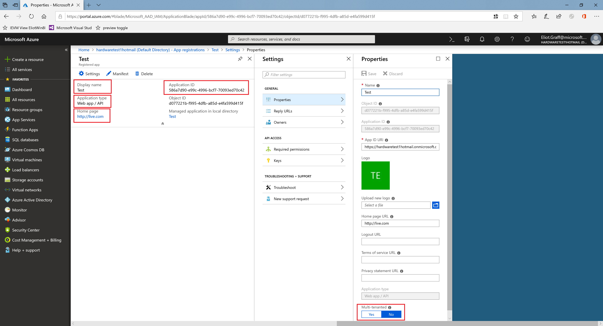
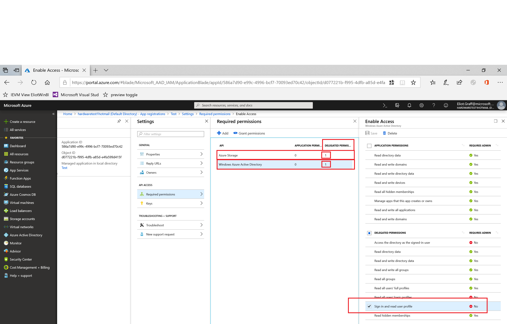

# Enable secure data sharing

In order to use the APIs to download driver submission failure data in a secure manner, you must send the following information regarding your Azure AD app used to access the reporting APIs to Microsoft Store Partner Operations, [partnerops@microsoft.com](mailto:partnerops@microsoft.com).

|Azure AD app info|Format|
|----|----|
|ApplicationId|*\<YourAppGuid>*|
|DisplayName|*\<YourAppName>*|
|Home page URL|*\<URL>*|
|Application type|**Web App** (assuming it’s web app)|
|Multi-Tenanted|**Yes** (if this is not multi tenanted, can you make it multi-tenanted)|

* Please make sure the app has the following permissions:

  * Windows AAD - **SignIn** and **Read user Profile**

  * Azure Storage - **Access Azure Storage**

You can find this information in the dashboard view of your Azure AD app, in the Registered App pane, the Properties pane, and the panes for Required permissions and Enable Access. The following screenshots show where the data is found.

For help and answers to questions about secure data sharing, mail Microsoft Store Partner Operations at [partnerops@microsoft.com](mailto:partnerops@microsoft.com).
