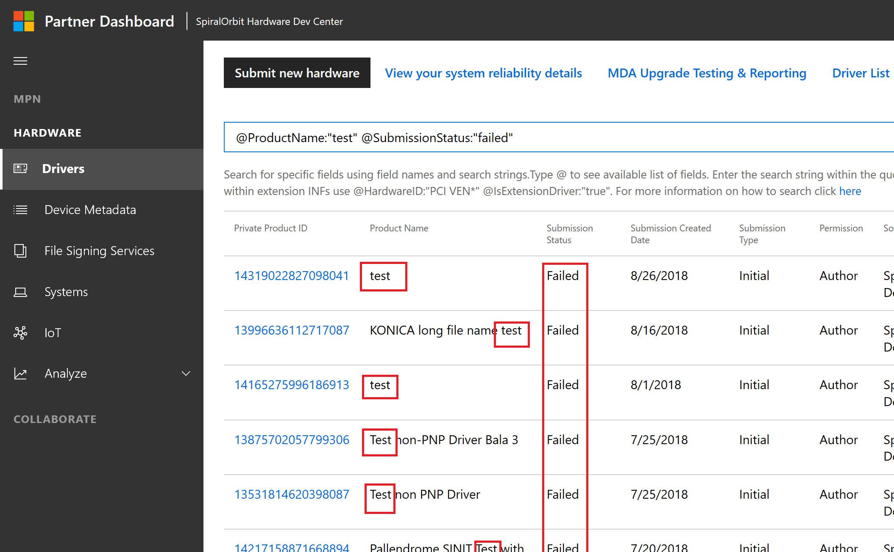

# Find a hardware submission

All hardware submissions that have been submitted by your organization are displayed on the **Drivers** page of the hardware dashboard. To find a specific hardware submission, you can search using either:

- plain text search

- driver attributes for a keyword search

## Plain-text search

You can enter any search phrase in the text box. The dashboard returns entries with a word matching the phrase in any of these fields:

- product ID (private & shared)

- submission ID

- product name

- submission name

- hardware ID

- INF name

- operating System code

For example, the search phrase **mydriver** returns submissions with the product name *mydriver 1*, *new mydriver*, and *old mydriver 2*, but it will not return a result for *mydriver1* or *mydriver_new*.

You can use the wildcard operator (\*) as a suffix in the search phrase to find an occurrence of the phrase anywhere in the searchable text fields. Building on the previous example, the search phrase **mydriver*** returns submissions with the product names *mydriver 1*, *new mydriver* and *old mydriver 2*, as well as *mydriver1* and *mydriver_new*.

## Keyword Search

You can search for drivers by driver attributes using the keyword search. When you type an at sign (**\@**) in the search box, the dashboard displays a list of the usable attributes. 

As you enter text after the ampersand, the list narrows to match the criteria. When you click one of the prepopulated values, it appears in the input dialogue in the form **(@*ParameterName*: "")**. Do not modify the parameter name or the format, other than to enter a string between the quotation marks (**""**). Search phrases can be simple phrases or suffixed with the wildcard character (when using a text search parameter). For example, to search for drivers  by operating system codes you could use either:

**@OperatingSystemCode:"Windows 10 RS4 Client x64"** 

or

**@OperatingSystemCode:"Windows 10 RS4\*"**

You can also search by using multiple attributes. Multiple attributes behave as if they are in an AND operator combination. For example, if you search for both product name and submission status (**@ProductName:"test" @SubmissionStatus:"failed"**) the dashboard returns only those records that match **both** product name and submission status.

You can use the following driver attributes for keyword searches:

|Parameter|Type|Possible values|
|----|----|----|
|ProductID |Numeric|17 digit private product ID|
|SharedProductID |Numeric|19 digit shared product ID|
|ProductName |Text|
|CertificationType |Text|Attestation, HCK, HLK, WLK|
|Permission |Text|Author, Publisher|
|SubmissionID |Numeric|19 digit Submission ID|
|SubmissionName |Text|
|SubmissionType |Text|Initial, Derived|
|SubmissionStatus |Text|Complete, Failed, NotSet, Processing, Ready|
|IsExtensionDriver |Boolean|False, True|
|IsUniversalDriver |Boolean|False, True|
|IsDeclarativeDriver |Boolean|False, True|
|INFName |Text|
|HardwareID |Text|
|OperatingSystemCode |Text|[list of OS codes](https://docs.microsoft.com/windows-hardware/drivers/dashboard/get-product-data#list-of-operating-system-codes)|

## Search results

Search results displayed on the dashboard list the driver submissions that match the search phrase.

> [!NOTE]
> The hardware dashboard creates entities only after the package acceptance is complete. Driver submissions therefore will not appear in search results until after the package acceptance is complete.

In the results, click the **Private Product ID** to navigate to that driver's overview page. There, you can view information about the driver's submission; updating the submission through the [DUA process](https://docs.microsoft.com/windows-hardware/test/hlk/user/create-a-driver-only-update-package); and viewing, creating, and editing shipping labels or download signed files.

### Important Points

1. You can use a given parameter only once in a keyword search. For example, searching for (**@ProductName:"test*" @ProductName:"system"**) causes an error.

2. You cannot use the wildcard operator by itself or as a prefix, as in **("\*test")**. Doing so causes an error.

3. You cannot use the wildcard operator with a numeric or Boolean field. Doing so causes an error.

4. Currently, you cannot search by using the parameters **Submission Created Date** or **Source**. They are not available at this time.

5. By default, search results are sorted by descending order of **Submission Created Date**. You can click any of the column title fields to change the sorting.

6. To search for product names or hardware ID, use the full search string. If you need to use a wildcard operator for these fields, avoid special characters (characters that are not letters or numbers).