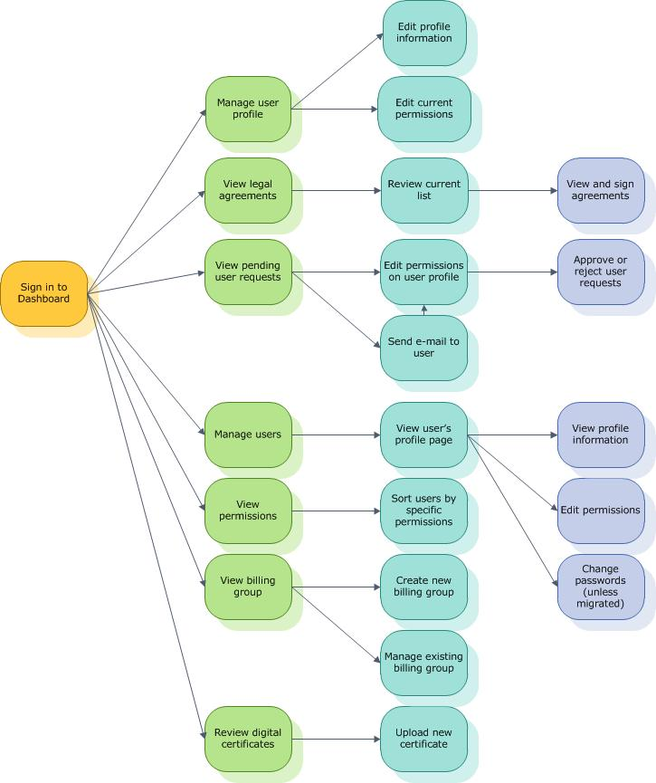

# For Administrators

When you sign in to the Dashboard as an administrator, you can see more options than the general user.

## Tasks available to an administrator

In addition to being able to access your personal account, you can also manage accounts that belong to your organization.

-   [Establish a new company](https://msdn.microsoft.com/library/windows/hardware/br230795.aspx)

-   [Get a code signing certificate](https://msdn.microsoft.com/library/windows/hardware/hh801887.aspx)

-   [Manage users and permissions](https://msdn.microsoft.com/library/windows/hardware/br230781.aspx)

-   [Manage your divisions](https://msdn.microsoft.com/library/windows/hardware/br230764.aspx)

-   [Manage your service account credentials](https://msdn.microsoft.com/library/windows/hardware/dn800655.aspx)

-   [Update a code signing certificate](https://msdn.microsoft.com/library/windows/hardware/br230783.aspx)

Here’s a diagram that shows more details.

## Related topics

[Get Started](https://msdn.microsoft.com/library/windows/hardware/br230779.aspx)

 

 

[Send comments about this topic to Microsoft](mailto:wsddocfb@microsoft.com?subject=Documentation%20feedback%20%5Bhw_dashboard\hw_dashboard%5D:%20For%20Administrators%20%20RELEASE:%20%281/3/2017%29&body=%0A%0APRIVACY%20STATEMENT%0A%0AWe%20use%20your%20feedback%20to%20improve%20the%20documentation.%20We%20don't%20use%20your%20email%20address%20for%20any%20other%20purpose,%20and%20we'll%20remove%20your%20email%20address%20from%20our%20system%20after%20the%20issue%20that%20you're%20reporting%20is%20fixed.%20While%20we're%20working%20to%20fix%20this%20issue,%20we%20might%20send%20you%20an%20email%20message%20to%20ask%20for%20more%20info.%20Later,%20we%20might%20also%20send%20you%20an%20email%20message%20to%20let%20you%20know%20that%20we've%20addressed%20your%20feedback.%0A%0AFor%20more%20info%20about%20Microsoft's%20privacy%20policy,%20see%20http://privacy.microsoft.com/default.aspx. "Send comments about this topic to Microsoft")

