# Get drivers signed by Microsoft for multiple Windows versions

## How to submit to the dashboard

This topic explains how to make a submission to the dashboard, such as a driver, and have it apply to multiple versions of Windows. This topic also covers how to retrieve the submission after Microsoft signs it, and how to validate the Microsoft signature.

There are two ways to make a dashboard submission apply to Windows 10 and earlier versions of Windows:

1. Use the Hardware Lab Kit (HLK) to test your submission against Windows 10 and use the Hardware Certification Kit (HCK) to test against earlier versions of Windows. Then create a dashboard submission that includes all the [merged HLK test results](/windows-hardware/test/hlk/user/merge-packages). During the submission process, you can opt-in to get a free signature for Windows Vista and Windows XP, as shown later in this topic. To opt-in for Windows Server 2008, provide a submission ID from a [Windows Hardware Lab Kit (HLK)](/windows-hardware/test/hlk/index/) submission. This is the only way to make a submission apply to all Windows versions.
2. As an alternative to HLK and HCK testing, you can submit your driver to the dashboard for [attestation signing](attestation-signing-a-kernel-driver-for-public-release.md) so that it also works on Windows 10. This is more complicated, but still a valid option. For more information about how to attestation sign a driver, see [Attestation signing a kernel driver for public release](attestation-signing-a-kernel-driver-for-public-release.md).

This topic will provide some background info about the dashboard for context, then walk through the process for using the HLK/HCK.

In the dashboard, there are two options related to signing submissions – either way, you can get a Microsoft-signed driver. The Hardware compatibility option means you’ve gone the extra distance and met [Windows Hardware Compatibility Program](/windows-hardware/design/compatibility/index) requirements. This gives you reputation with Microsoft SmartScreen, visibility on the Certified Products List, and other business benefits.

For background, there are two code signing operations to consider:

- One is a code signing operation that identifies an organization to the dashboard. This is a signature on the package you plan to submit, and it’s a requirement that the dashboard imposes on partners so that the dashboard to prevent malicious people outside your organization from making submissions using your credentials – which could harm your reputation!
- The other is where Microsoft actually signs the individual files within your submission, such as your driver.

You must have an EV certificate bound to your company to access submission features in the dashboard.

To confirm the certificate that is used to identify your organization within the Partner Center, see [Update a code signing certificate](./update-a-code-signing-certificate.md).

After you sign in to Partner Center and you are ready to sign your submission, you can use either a standard code signing cert or an EV code signing cert. This is true for all operating system versions, not just Windows 10.

This is a [recent change in policy](https://techcommunity.microsoft.com/t5/Windows-Hardware-Certification/bg-p/WindowsHardwareCertification). If you have an EV cert bound to the account for your organization, you’re good to go – that is, you can continue to use a standard SHA-2 certificate when you submit your package.

## How to submit HLK test results

Here's how to submit HLK test results to the dashboard. There are separate tabs where you can see what tests were run and the test results. For dashboard purposes, the most interesting part of an HLK project is the **Package** tab:

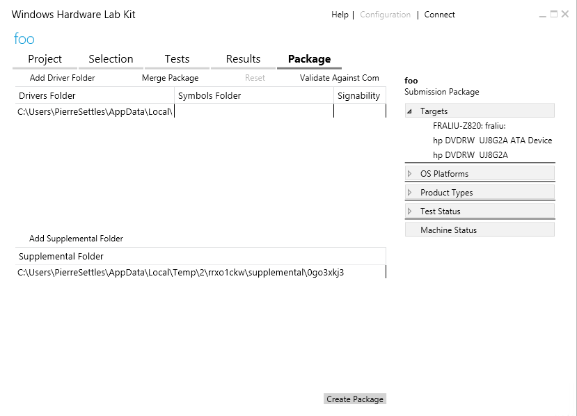

Select the file path for the project to open it. In this case, the submission is one driver.

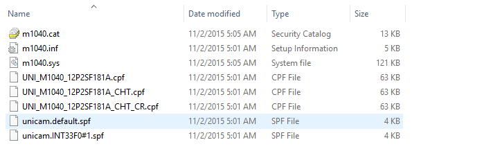

Let’s say you want to create a submission package from scratch. In the HLK, select **Add Driver Folder**.

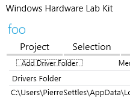

Now is you first chance to make declarations about the OS versions that are supported for your submission. In this case, the submission has been tested for Windows 10 x64 and earlier versions of Windows.

You also need to make declarations for locales. For example, depending on the design and architecture of your driver, you may choose to display different strings in different locales. In that case, you might actually have different compiled binaries for different locales. So for one device, you might have a hundred different drivers; one for each locale.

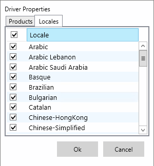

To add symbols, select and hold (or right-click) the driver folder.

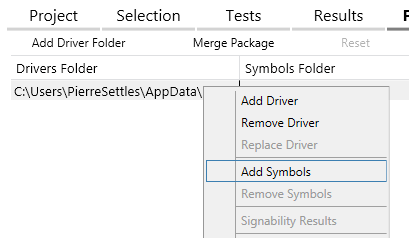

Select **Add Supplemental Folder** to submit other files that are important to the submission but are not actually part of the submission itself. You can add any content you want to the package. This is a way for you to get other items to the Dashboard that are important for the submission, such as a readme file for a driver submission.

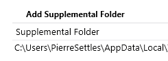

When you are ready, select **Create Package**.

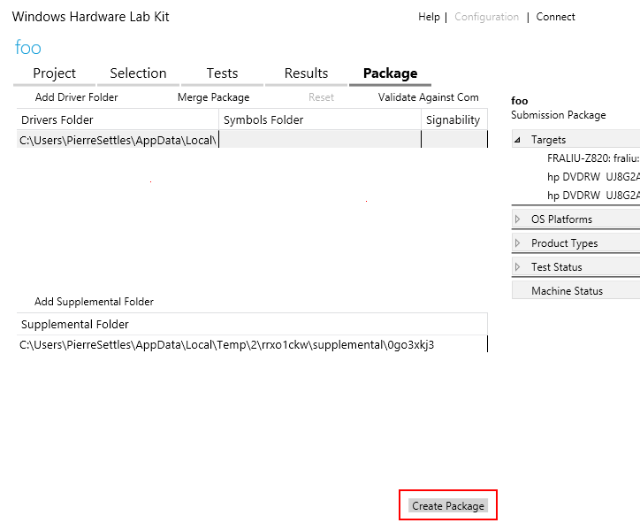

The next step is to specify a certificate that you will you use to sign the package – this is the first of the two code signing operations that were covered at the start of this topic. You can select **Use a certificate file** to specify a certificate that is stored on something like a USB drive, or select **Use the certificate store** to specify a certificate that has been imported into the certificate store of the local computer.

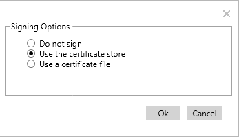

After you select **OK**, you name the package and it gets created and signed (assuming you have a certificate installed on the computer you are using for the submission), and you’ll get back a friendly success message.

And the package has a green check under **Signability**:

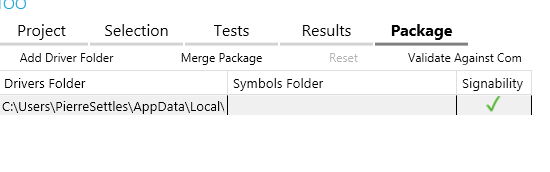

The next steps occur in the Partner Center dashboard. Sign in and follow the instructions in [Create a new hardware submission](create-a-new-hardware-submission.md) to upload your HLK package.

## How to retrieve a submission after Microsoft signs it

For an HLK or HCK submission that you submitted to the Partner Center:

- [Find the hardware submission](manage-your-hardware-submissions.md) that contains the drivers that you want to download signed files for. Select the ID to open the driver details. On that page, expand the package tab for the package containing the driver you want to download and select “Download signed files”.

For a WLK submission, system submission, or attestation signed driver that you submitted to Hardware Dev Center (Sysdev):

- Select **Hardware Compatibility** &gt; **Manage submissions** &gt; and on the **Summary and Tasks** tab, if the status is **Approved**, the submission is ready to be retrieved. Under **Download** in the lower right corner of the screen, select **Signed driver package**. Microsoft will stream an in-memory zip file that includes the signed submission.

Inside the submission folder will be the package files. These files are signed by Microsoft. The partner does not have to sign the returned payload. Microsoft always returns a .cat file with an approved submission. If a partner includes its own .cat file. Microsoft discards it and returns its own signed .cat file.

In the past, Microsoft only signed the .cat file. Starting with Windows 10, Microsoft now signs all of the portable executables in the returned payload. For example, the .dll file is also signed by Microsoft:

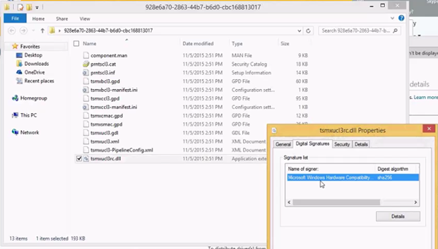

## How to validate the Microsoft signature

There are a couple cases where you may want to validate the Microsoft signature for a submission.

1. You aren’t sure if a driver has been signed by Microsoft or not, and you want to check.
2. You have two drivers, and you need to determine which one was signed by attestation and which one was signed after submission of HLK/HCK results to the dashboard.

You can validate the Microsoft signature by checking the Enhanced Key Usages (EKUs) of the certificate that Microsoft signs the submission with. To check the EKU, select and hold (or right-click) the .cat file and select **Properties**. Select the **Digital Signatures** tab, select the name of the certificate, and then select **Details**.

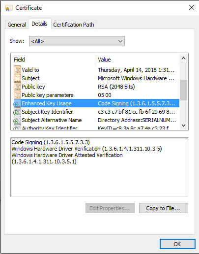

On the certificate **Details** tab, select **Enhanced Key Usage**. There you will see the EKUs and corresponding OID values for the certificate. In this case, the **Windows Hardware Driver Verification OID** ends with a 5, which means the driver has not been signed by attestation:

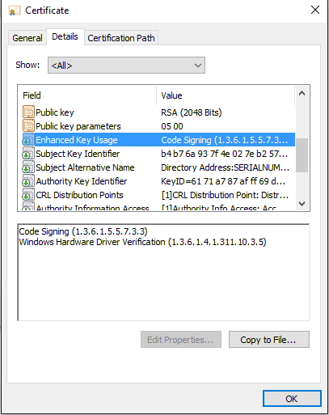

If the driver had been signed by attestation, then the OID would end with a 1:

## Related topics

- [Create a new hardware submission](create-a-new-hardware-submission.md)

- [Managing hardware submissions in the Partner Center](manage-your-hardware-submissions.md)

- [Driver flighting](driver-flighting.md)
