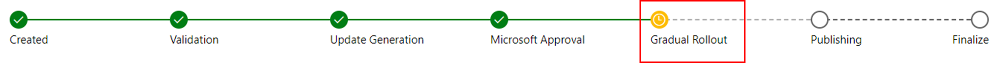
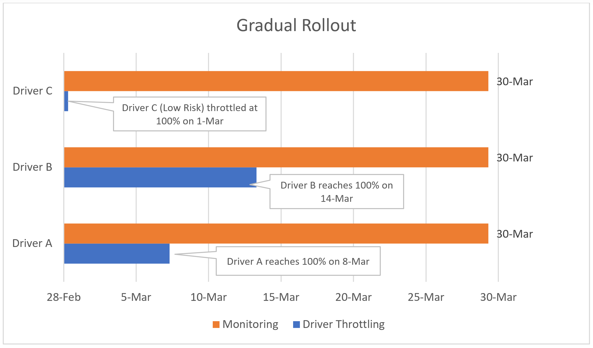
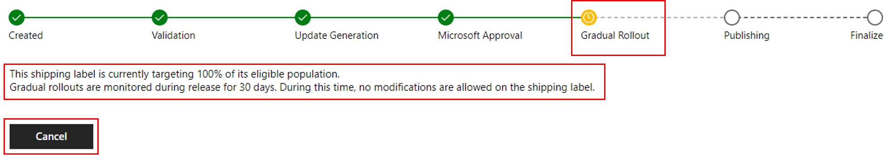

# Gradual rollout

The goal of gradual rollout is to ensure the Windows ecosystem has the best driver available for each system by monitoring telemetry to ensure your customers are having the best possible experience. Should a driver appear unhealthy during gradual rollout phase, Microsoft may choose to **pause** the driver distribution for investigation and/or seek appropriate remediation, including a Microsoft-initiated driver cancellation (_expiration_).

>[!NOTE]
> - Drivers in gradual rollout are visible only to systems running Windows 10 version 1709 and later.

## Main concepts of gradual rollout

There are two distinct aspect of the Gradual Rollout process that partners should understand.  These are:

- The 30-day **monitoring** period
  - The 30-day monitoring period begins on the very first day that the driver is throttled and ends roughly 30 days later. This monitoring period does not affect your drivers WU status.
- The **driver throttling** period
  - Microsoft completes a risk assessment for each eligible driver and assigns a release throttle curve for that driver. A driver's risk is assessed against several factors including but not limited to flighting coverage and retail population.
  - There are a few typical driver release throttle curves:
    - immediately throttled to 100% of the retail Windows population 
    - throttle through 1% to 100% of the retail Window population 
    - throttle with an initial set of its eligible population that are highly active, and warrant even adoption of each targeting cluster governed by hardware ID (HWID) and computer hardware ID (CHID) combination, before progressing to 1% to 100% percentage of the retail Windows population
  - When the throttled percentage is at 100% it is completely live on WU to all systems running **Windows 10 version 1709 and later**. Microsoft will continue to **monitor** the release for rest of the 30 day period.

Note that during this entire process, the status for your shipping label remains as **gradual rollout**. This is normal, and your driver is available on Windows Update.

 

 As you can see in the following chart, it may not take 30 days to reach a driver throttling percentage of 100%. But it will take *about* 30 days from start to finish for your driver's **Status** to progress past the Gradual Rollout phase.

 

## Partner Dev Center changes

As you can see in the earlier images, **Gradual Rollout** now appears as a new Shipping Label phase on the progress bar. The dashboard displays the driver's **Throttled Percentage** in the description text below the progress bar along with a **Cancel** button.

 

While your driver is in the **Microsoft Approval** or **Gradual Rollout** phases, your Shipping Label is locked for any edits or modifications. You can, however, **Cancel** a Shipping Label at that time. The **Cancel** button ends an entire shipping label (expiration). Note that the **Cancel** button is only functional when your driver is in the **Microsoft Approval** or **Gradual Rollout** phases.

## Systems included in the throttled percentages

When a driver is being throttled, for the target audience baseline, Microsoft uses the **Entire Windows 10 version 1709 and greater retail population**.  Devices with Windows 10 Windows 1703 and earlier will receive the driver after throttle is complete and the Shipping Label reaches the **Finalize** step.

## Driver Throttling Assessments

### Rules that define which release throttle curve a driver gets assigned with ###

The throttle curve is tightly related to its risk assessment. A driver's risk is assessed against several factors including but not limited to flighting coverage and retail population.

Optional drivers typically are throttled to 100% immediately, but subject to up to 30-day monitoring. 

Drivers published behind Test Reg Key are throttled to 100% immediately and exempted from the 30-day monitoring. 

### Rules that define when a rollout should automatically pause

Microsoft will pause the gradual rollout process if your driver fails to meet the Microsoft quality checks.  Microsoft also uses these same quality checks when deciding to progress the driver to the next throttle level.  

Paused drivers show a throttle percentage of **0%**.

Microsoft will continue the rollout process after a pause when an investigation is completed by either the feature team or the OEM.

>[!NOTE]
>Driver Shiproom administrators reserve the right to pause the rollout due to other telemetry signals as well.

### Rules that define when **ReleaseStatus** should be set to **Complete**

At the end of the 30-day monitoring period your Shipping Label will be released for edits. Your Shipping Label status on the Partner Dev Center dashboard will progress to **Finalize**.

## FAQ

### When will the 30-day monitoring period start and what should we expect?

All throttled drivers, whether they start at 1% or 100% will be monitored for at least 30 days. A driver's monitoring period begins as soon as it's released to the retail population in any throttled state.

During this 30-day rollout and monitoring phase, the Shipping Label is locked for any edits. You may cancel the Shipping Label by selecting the **Cancel** button on your Shipping Label.

This 30-day period may increase if Microsoft needs to **pause** the driver for investigations.

### Is my driver available on WU during gradual rollout?

Drivers are available on WU, but only for systems running Windows 10 version 1709 and later.

Systems running Windows 10 version 1703 and earlier versions will not be able to get the driver until the Shipping Label reaches **Finalize**.

For **Automatic/Critical** drivers, you can use Device Manager to manually trigger a driver update no matter what throttled percentage your driver is at. This is for systems running Windows 10 version 1709 and later. This policy enables testers, support staff, and various OEM Audit Tools to get the driver before it is in the **Finalize** stage. However, if an **Optional**-only driver is paused, it will not be available through Device Manager.

When your driver reaches 100%, that driver is live on WU for all eligible systems running Windows 10 version 1709 and later, even if the monitoring phase has not finished.

### How will Microsoft notify an owner if a driver is paused or cancelled?

Notification of a paused or cancelled driver is through the shipping label, only.

### How can we expedite this process if we have a critical business need?

Before you submit an expedite request, review your Shipping Label and check the UI text message to see if the throttled percentage it is at 100%. If it is at 100%, then the driver is live on WU for all systems running Windows 10 version 1709 and later.

Next, verify and test if you can receive the driver from Device Manager.

Only submit an expedited request if you have a business-critical need or if you are trying to target machines running Windows 10 version 1703 or earlier.

To submit a [support request](https://developer.microsoft.com/windows/hardware/support) to expedite, include your business justification. On the Windows hardware engineering support page, be sure that you sign in using your Hardware Dev Center/Partner Center login credentials so that we can properly link your request to the correct partner account:

1. **First**, sign into your hardware dev center account, and then
2. Go to [https://developer.microsoft.com/windows/support](https://developer.microsoft.com/windows/support).
3. Select **Contact us**, **Dashboard issue**, and then **Hardware submissions & signing (all OS version)** from the dropdown menu.