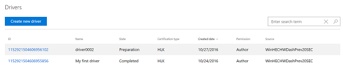

# Hardware submissions

The Windows Hardware Compatibility Program (for Windows 10) and the Windows Hardware Certification Program (for Windows 8/8.1 and older operating systems) enable you to design, create, and test your hardware and drivers before you submit the final version through the Windows Hardware Dev Center dashboard. For more information, see the [Windows hardware certification](http://go.microsoft.com/fwlink/p/?LinkId=224782) page. By certifying your hardware device, system, and drivers for Windows, you gain the support of Microsoft marketing resources in the form of compatibility and reliability listings, logo artwork, and promotional partnerships.

To develop your device, download the [Windows Driver Kit (WDK)](https://docs.microsoft.com/windows-hardware/drivers/download-the-wdk).

To test your device, download the [Windows Hardware Lab Kit (Windows HLK)](https://docs.microsoft.com/windows-hardware/test/hlk/windows-hardware-lab-kit) for Windows 10. For previous operating systems, download the [Windows Hardware Certification Kit (Windows HCK)](https://docs.microsoft.com/windows-hardware/test/hlk/windows-hardware-lab-kit) or [Windows Logo Kit (WLK)](http://go.microsoft.com/fwlink/p/?LinkId=219237).

After you develop and test your product, you can submit the results with a hardware submission.

> [!NOTE]
> We strongly encourage you to include public driver symbols as part your HLK package. Including symbols will improve the data returned in your [driver reliability report](driver-failure-reporting.md) and are never shared externally.  See [Public Symbols and Private Symbols](../devtest/public-symbols-and-private-symbols.md) to learn how to create public symbols.  See [Step 8: Create a submission package](https://docs.microsoft.com/windows-hardware/test/hlk/getstarted/step-8-create-a-submission-package) to learn how to include symbols with your package. Note that any .pdb files in your submission will be removed before being published. 

 

-   To submit an HLK or HCK package, see [Create a new hardware submission](create-a-new-hardware-submission.md).

<!-- -->

-   To submit a WLK package, you must continue to use the Sysdev dashboard. see [Create a new hardware logo submission](https://msdn.microsoft.com/library/windows/hardware/br230808.aspx) for more information.

## Drivers summary page

The Drivers summary page contains a list of all hardware certification submissions that you have created or are shared with you. You can create a new hardware submission by selecting the **Create new driver** button.

The hardware certification submission list displays the following information about each submission:

<table>
<colgroup>
<col width="50%" />
<col width="50%" />
</colgroup>
<thead>
<tr class="header">
<th>Column</th>
<th>Description</th>
</tr>
</thead>
<tbody>
<tr class="odd">
<td>
<strong>ID</strong>
</td>
<td>
The ID of the driver.
</td>
</tr>
<tr class="even">
<td>
<strong>Name</strong>
</td>
<td>
The name specified in <strong>Driver name</strong> during the submission creation process.
</td>
</tr>
<tr class="odd">
<td>
<strong>State</strong>
</td>
<td>
The current state of the submission. Possible values are:

<ul>
<li>Package acceptance: Your submission package has passed initial screening for proper formatting and contents.</li>
<li>Preparation: We’re preparing your package for further review and signing.</li>
<li>Validation: We’re validating your package for policy compliance and technical correctness.</li>
<li>Manual review: We weren’t able to automatically validate the contents of your package, so someone at Microsoft is taking a closer look.</li>
<li>Catalog creation: We’re creating the security catalog for your driver.</li>
<li>Sign: We’re applying Microsoft’s signature to your security catalog and binaries.</li>
<li>Finalize: We’re finishing up and your driver will be ready soon.</li>
<li>Completed: Your submission is complete.</li>
</ul></td>
</tr>
<tr class="even">
<td>
<strong>Certification type</strong>
</td>
<td>
The certification type for your submission. This can be either HLK or HCK.
</td>
</tr>
<tr class="odd">
<td>
<strong>Created date</strong>
</td>
<td>
The date the driver was added to your account, either by you or by someone sharing the driver with you.
</td>
</tr>
<tr class="even">
<td>
<strong>Permission</strong>
</td>
<td>
Your permission for the submission. Possible values are:

<ul>
<li>Author: Author of the driver. You can complete all tasks and share the driver with partners.</li>
<li>Publisher: The driver is shared with you. You can download the driver, create Windows Update shipping labels, and create DUA packages. You can&#39;t share the driver with additional companies.</li>
<li>Read-only: The driver was submitted to Windows Update on your behalf. You can see the driver details, download the driver, and view the shipping label that was submitted on your behalf. You can&#39;t create shipping labels or create DUA packages.</li>
</ul></td>
</tr>
<tr class="odd">
<td>
<strong>Source</strong>
</td>
<td>
The author (shown as the organization name) of the submission.
</td>
</tr>
</tbody>
</table>

 

The search box allows you to search for a specific submission or set of submissions. You can search for exact or partial matches for the values in the **ID**, **Name**, **State**, and **Certification type** columns.

## Hardware submission page

A hardware submission page contains information about a specific hardware submission, including status, packages, certification info, and shipping labels. For information about how to create a hardware submission, see [Create a new hardware submission](create-a-new-hardware-submission.md).

The left side of the page contains a list of the 10 most recently viewed submissions.

You can monitor the progress of your submission with the progress tracker at the top of the page. Once all steps show a green check, the submission is complete and your company will receive a notification.

### Packages and signing properties

This section allows you to manage your packages.

Select **Upload new** to upload a new package.

Select **Download DUA shell** to download the DUA shell package. For information about how to update a submission using DUA, see [Manage hardware submissions](manage-your-hardware-submissions.md).

The uploaded package list displays your uploaded packages for this submission. Select the caret to expand a package. This shows you the submission ID and allows you to select **Download package** to download the package.

**Additional certifications** displays any chosen additional certifications.

### Certification

This section displays certification information. Select **See more info** to expand this section. You can review the certification information you provided, which includes the following:

<table>
<colgroup>
<col width="50%" />
<col width="50%" />
</colgroup>
<thead>
<tr class="header">
<th>Field</th>
<th>Description</th>
</tr>
</thead>
<tbody>
<tr class="odd">
<td>
Is this a Universal Windows driver?
</td>
<td>
Indicates whether or not your driver meets the Universal Windows Platform requirements. For more information, see <a href="https://docs.microsoft.com/windows-hardware/drivers/develop/getting-started-with-universal-drivers" data-raw-source="[Getting Started with Universal Windows drivers](https://docs.microsoft.com/windows-hardware/drivers/develop/getting-started-with-universal-drivers)">Getting Started with Universal Windows drivers</a>.
</td>
</tr>
<tr class="even">
<td>
What type of device?
</td>
<td>
Indicates that your device is:

<ul>
<li>
An internal component, if your device is part of a system and connects inside the PC.
</li>
<li>
An external component, if your device is an external device (peripheral) that connects to a PC.
</li>
<li>
Both, if your device can be connected internally (inside a PC) and externally (peripheral).
</li>
</ul></td>
</tr>
<tr class="odd">
<td>
Select metadata category
</td>
<td>
The device metadata category you selected.

If needed, you can generate a Sysdev reference ID that allows you to link up Dev Center hardware submissions with Sysdev Device Metadata submissions.
</td>
</tr>
<tr class="even">
<td>
Announcement date
</td>
<td>
The date when you want your product included on the Windows Server Catalog, the Windows Certified Product List, and the Universal Driver List.
</td>
</tr>
<tr class="odd">
<td>
Marketing names
</td>
<td>
Your marketing name(s). Marketing names allow you to provide aliases for your product. You can provide as many names as you want.
</td>
</tr>
</tbody>
</table>

Submissions are automatically assigned Declaritive and Universal attributes based off the entire submission contents.  If you want a submission to be marked as `Declaritive=True` and/or `Universal=True`, all files and INFs within the submission must be compliant with the appropriate attribute(s).  For example, a merged HLK package can contain two driver sets for different OS certifiations. If one set is Declaritive and another set is not, the entire submission would be marked as `Declarative=False`. Each set should be seperated into two submissions to ensure they are marked appropriately. 

If you want to add or update your announcement date, use the **Announcement date (UTC)** field and select **Submit**.

You can also add or remove marketing names. To add a name, enter it in the **Marketing name** text box and select **Add**. To remove a name, select the red X button next to the marketing name you want to remove. You can also add multiple names at once by selecting **Add multiple names**. When you are finished, select **Submit**.

### Distribution

This section displays shipping label information for this submission. For information about how to use shipping labels, see the [Manage driver distribution with shipping labels](manage-driver-distribution-by-submission.md) section.

Select **New shipping label** to create a new shipping label.

Select **Publish all pending** to publish all shipping labels that are not yet published.

The shipping label list displays the shipping labels for this submission. This list includes shipping labels you created, and partner shipping labels for your shared driver. Select the shipping label name to see details for that shipping label. The shipping label list displays the following information about each label:

<table>
<colgroup>
<col width="50%" />
<col width="50%" />
</colgroup>
<thead>
<tr class="header">
<th>Field</th>
<th>Description</th>
</tr>
</thead>
<tbody>
<tr class="odd">
<td>
Name
</td>
<td>
The shipping label name. Select this name to see details for the shipping label.
</td>
</tr>
<tr class="even">
<td>
Creator
</td>
<td>
The <strong>Publisher display name</strong> of the shipping label creator. This allows you to easily keep track of which business partners sent you drivers.
</td>
</tr>
<tr class="odd">
<td>
Destination
</td>
<td>
For a Windows Update shipping label, the destination is &quot;Windows Update&quot;.

For a shared driver, the destination is the <strong>Publisher display name</strong> of the company you selected for <strong>Who is publishing?</strong> when you created the shipping label. This allows you to easily see all companies that you have shared your driver with.
</td>
</tr>
<tr class="even">
<td>
Created date
</td>
<td>
The creation date of the shipping label.
</td>
</tr>
<tr class="odd">
<td>
Release date
</td>
<td>
The release date of the shipping label.
</td>
</tr>
<tr class="even">
<td>
User created
</td>
<td>
If the shipping label was created by your company, you will see the details of the user who created the shipping label. This allows you to follow up if you have any questions about the creation. This field is not applicable if another company created the label.
</td>
</tr>
<tr class="odd">
<td>
User changed
</td>
<td>
If the shipping label was created by your company, you will see the details of the user who last modified the shipping label. This allows you to follow up if you have any questions about the changes. This field is not applicable if another company created the label.
</td>
</tr>
</tbody>
</table>

 

The status graphic displays the publish status for each shipping label. A green check means the label has been published. A yellow circle means the label is not published yet.

## In this section

- [Create a new hardware submission](create-a-new-hardware-submission.md)

- [Manage hardware submissions](manage-your-hardware-submissions.md)

 

 

